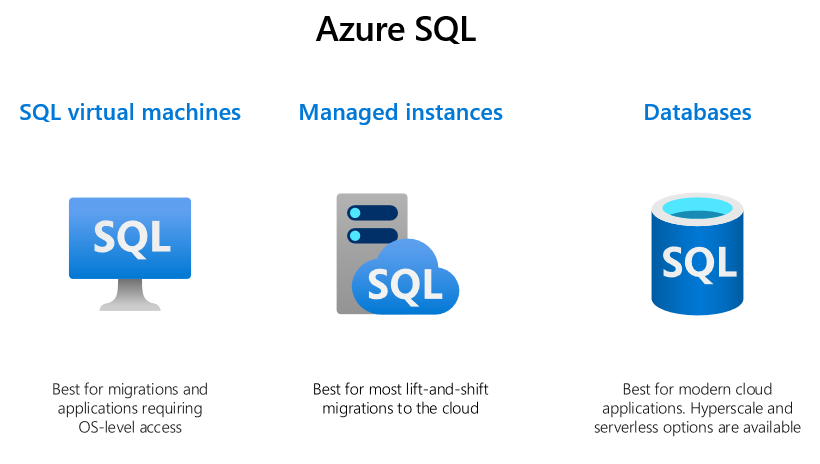
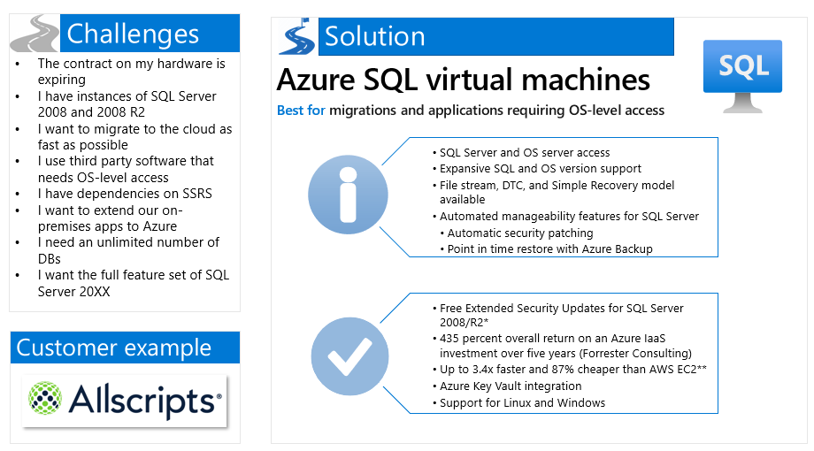
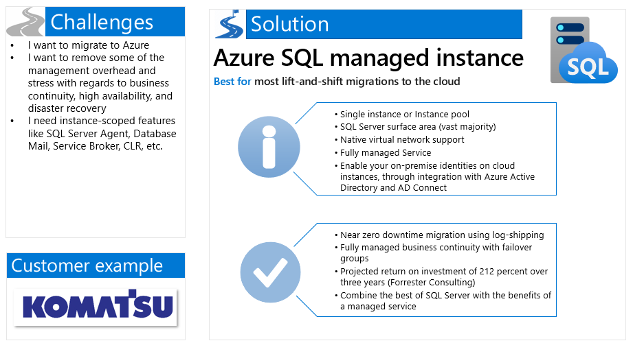
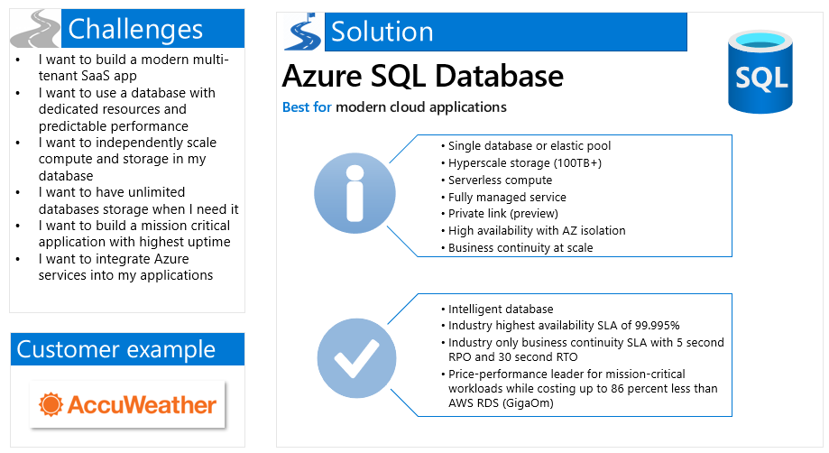
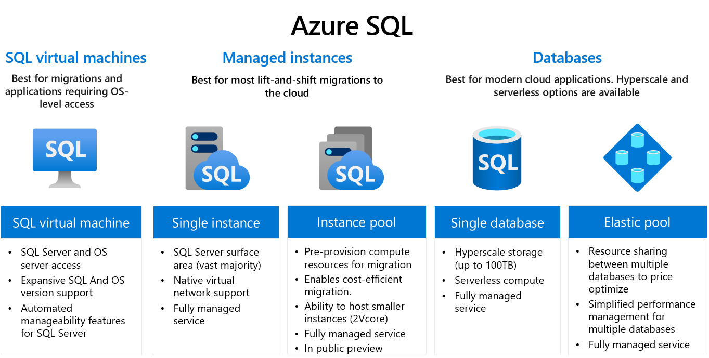

# The Azure SQL Workshop

#### <i>A Microsoft workshop from the SQL team</i>

 <h2>01 - Introduction to Azure SQL</h2>

In this module, you'll start with a brief history of why and how we built Azure SQL, then you’ll then learn about the various deployment options and service tiers, including what to use when. This includes Azure SQL Database and Azure SQL managed instance. Understanding what Platform as a Service (PaaS) encompasses and how it compares to the SQL Server “box” will help level-set what you get (and don’t get) when you move to the cloud. We’ll cover deployment, configuration, and other getting started related tasks for Azure SQL (hands-on). 

In each module you'll get more references, which you should follow up on to learn more. Also watch for links within the text - click on each one to explore that topic.

(<a href="https://github.com/microsoft/sqlworkshops/blob/master/AzureSQLWorkshop/azuresqlworkshop/00-Prerequisites.md" target="_blank">Make sure you check out the <b>Prerequisites</b> page before you start</a>. You'll need all of the items loaded there before you can proceed with the workshop.)

In this module, you'll cover these topics:  
[1.1](#1.1): History   
[1.2](#1.2): Azure SQL Overview   
[1.3](#1.3): Purchasing models, service tiers, and hardware choices

<h2><a name="1.1">1.1 History</h2></a>

Before you learn about Azure SQL and where it's going, let's briefly consider where it started. In 2008, at the [Microsoft Professional Developers Conference](https://www.youtube.com/watch?v=otuf3goxLsg), Microsoft's Chief Software Architect (at the time) [Ray Ozzie announced](https://news.microsoft.com/2008/10/27/microsoft-unveils-windows-azure-at-professional-developers-conference/#IP8XlBTCMpvORgaV.97) the new cloud computing operating system, Windows Azure (or "Project Red Dog"), which was later changed to Microsoft Azure. One of the five key components of the Azure Services Platform launch was "Microsoft SQL Services." From the beginning, SQL has been a big part of Azure. SQL Azure (then renamed to Azure SQL Database and now expanded to Azure SQL) was created to provide a cloud-hosted version of SQL Server.  

[An explanation](https://social.technet.microsoft.com/wiki/contents/articles/1308.select-an-edition-of-sql-server-for-application-development/revision/7.aspx) of when you would want to use the early Azure SQL Database (2010) is as follows: [Azure SQL Database] is a cloud database offering that Microsoft provides as part of the Azure cloud computing platform. Unlike other editions of SQL Server, you do not need to provision hardware for, install or patch [Azure SQL Database]; Microsoft maintains the platform for you. You also do not need to architect a database installation for scalability, high availability or disaster recovery as these features are provided automatically by the service. Any application that uses [Azure SQL Database] must have Internet access in order to connect to the database.  

This explanation still remains valid today, though the capabilities around security, performance, availability, and scale have been enhanced greatly. There are now multiple deployment options with the flexibility to scale to your needs, and there have been over seven million deployments of some form of Azure SQL.  

Since 2008, SQL Server has changed a lot and Azure SQL has changed a lot. It's no surprise then that the role of the SQL Server professional has also changed a lot. The goal of this course is to help SQL Server professionals translate their existing skills to become not only better SQL Server professionals, but also Azure SQL professionals.  

 

<h2><a name="1.2">1.2 Azure SQL Deployment Options</h2></a>

Within the umbrella of the "Azure SQL" term, there are many deployment options and choices to be made in order to tailor to various customers' needs. While there are a lot of options, this is not meant to confuse or complicate things, but rather to give customers the flexibility to get and pay for exactly what they need. This topic will cover some of the challenges and scenarios that lead to choosing various Azure SQL deployment options, as well as some of the technical specifications for each of those options. The deployment options discussed in this topic include Azure SQL virtual machines, Azure SQL managed instances, Azure SQL Databases, and Azure SQL "pools" (Azure SQL Instance Pools and Azure SQL Elastic Pools).  

  

At the highest level, when you're considering your options, the first question you may ask is, "What level of scope do I want?" As you move from virtual machines to managed instances to databases, your management scope decreases. With virtual machines, you not only get access to but are also responsible for the OS and the SQL Server. With managed instance, the OS is abstracted from you and now you have access to only the SQL Server. And the highest abstraction is SQL database where you just get a database, and you don't have access to instance-level features or the OS.  

## Azure SQL virtual machine
  
*[Extended Security Updates](https://www.microsoft.com/en-us/cloud-platform/extended-security-updates) worth 75% of license every year for the next three years after End of Service (July 9, 2019). Applicable to Azure Marketplace images, customers using customer SQL Server 2008/R2 custom images can download the Extended Security Updates for free and manually apply.  
**[GigaOm Performance Study](https://gigaom.com/report/sql-transaction-processing-price-performance-testing/)

An Azure SQL virtual machine is simply a version of SQL Server that you specify running in an Azure VM. It's just SQL Server, so all of your SQL Server skills should directly transfer, though we can help automate backups and security patches. Azure SQL virtual machines are referred to as [Infrastructure as a Service (IaaS)](https://azure.microsoft.com/en-us/overview/what-is-iaas/). You are responsible for updating and patching the OS and SQL Server (apart from critical SQL security patches), but you have access to the full capabilities of SQL Server.   

The customer example for Azure SQL virtual machines is [Allscripts](https://customers.microsoft.com/en-us/story/allscripts-partner-professional-services-azure). Allscripts is a leading healthcare software manufacturer, serving physician practices, hospitals, health plans, and Big Pharma. To transform its applications frequently and host them securely and reliably, Allscripts wanted to move to Azure quickly. In just three weeks, the company lifted and shifted dozens of acquired applications running on ~1,000 virtual machines to Azure with [Azure Site Recovery](https://azure.microsoft.com/en-us/services/site-recovery/).  

This isn't the focus of this workshop, but if you're considering Azure SQL VMs, you'll want to review the [guidance on images to choose from](https://docs.microsoft.com/en-us/azure/virtual-machines/windows/sql/virtual-machines-windows-sql-server-iaas-overview), the [quick checklist](https://docs.microsoft.com/en-us/azure/virtual-machines/windows/sql/virtual-machines-windows-sql-performance) to obtain optimal performance of Azure SQL VMs, and the guidance for [storage configuration](https://docs.microsoft.com/en-us/azure/virtual-machines/windows/sql/virtual-machines-windows-sql-server-storage-configuration).  

> Note: if you installed SQL Server on an Azure VM yourself (as opposed to leveraging a [pre-installed Azure Marketplace image](https://azuremarketplace.microsoft.com/en-us/marketplace/apps?search=sql%20server&page=1&filters=virtual-machine-images%3Bmicrosoft)), [Resource Provider](http://www.aka.ms/sqlvm_rp_documentation) can bring the functionality of Azure Marketplace images to SQL Server instances self-installed on Azure VMs.  

> Note: If you're specifically looking at SQL Server on RHEL Azure VMs, there's a full operations guide available [here](https://azure.microsoft.com/en-us/resources/sql-server-on-rhel-azure-vms-operations-guide/
).  

## IaaS vs PaaS

Azure SQL virtual machines are considered IaaS. The other deployment options in the Azure SQL umbrella (Azure SQL managed instance and Azure SQL Database) are [Platform as a Service (PaaS)](https://azure.microsoft.com/en-us/overview/what-is-paas/) deployments. These PaaS Azure SQL deployment options use fully managed Database Engine that automates most of the database management functions such as upgrading, patching, backups, and monitoring. Throughout this course, you'll learn much more about the benefits and capabilities that the PaaS deployment options enable and how to optimally configure, manage, and troubleshoot them, but some highlights are listed below:  

* [Business continuity](https://docs.microsoft.com/en-us/azure/sql-database/sql-database-business-continuity) enables your business to continue operating in the face of disruption, particularly to its computing infrastructure.
* [High availability](https://docs.microsoft.com/en-us/azure/sql-database/sql-database-high-availability) of Azure SQL Database guarantees your databases are up and running 99.99% of the time, no need to worry about maintenance/downtimes.
* [Automated backups](https://docs.microsoft.com/en-us/azure/sql-database/sql-database-automated-backups) are created and use Azure read-access geo-redundant storage (RA-GRS) to provide geo-redundancy.
* [Long term backup retention](https://docs.microsoft.com/en-us/azure/sql-database/sql-database-long-term-retention) enables you to store specific full databases for up to 10 years.
* [Geo-replication](https://docs.microsoft.com/en-us/azure/sql-database/sql-database-active-geo-replication) by creating readable replicas of your database in the same or different data center (region).
* [Scale](https://docs.microsoft.com/en-us/azure/sql-database/sql-database-scale-resources) by easily adding more resources (CPU, memory, storage) without long provisioning.
* Network Security
    * [Azure SQL Database (single database and elastic pool)](https://docs.microsoft.com/en-us/azure/sql-database/sql-database-security-overview#network-security) provides firewalls to prevent network access to the database server until access is explicitly granted based on IP address or Azure Virtual Network traffic origin.
    * [Azure SQL Managed Instance](https://docs.microsoft.com/en-us/azure/sql-database/sql-database-managed-instance-connectivity-architecture) has an extra layer of security in providing native virtual network implementation and connectivity to your on-premises environment using [Azure ExpressRoute](https://docs.microsoft.com/en-us/azure/expressroute/) or [VPN Gateway](https://docs.microsoft.com/en-us/azure/vpn-gateway/vpn-gateway-about-vpngateways).
* [Advanced security](https://docs.microsoft.com/en-us/azure/sql-database/sql-database-security-index) detects threats and vulnerabilities in your databases and enables you to secure your data.
* [Automatic tuning](https://docs.microsoft.com/en-us/azure/sql-database/sql-database-automatic-tuning) analyzes your workload and provides you the recommendations that can optimize performance of your applications by adding indexes, removing unused indexes, and automatically fixing the query plan issues.
* [Built-in monitoring](https://docs.microsoft.com/en-us/azure/log-analytics/log-analytics-azure-sql) capabilities enable you to get the insights into performance of your databases and workload, and troubleshoot the performance issues.
* [Built-in intelligence](https://docs.microsoft.com/en-us/azure/sql-database/sql-database-intelligent-insights) automatically identifies the potential issues in your workload and provides you the recommendations that can [help you to fix the problems](https://azure.microsoft.com/en-us/blog/ai-helped-troubleshoot-an-intermittent-sql-database-performance-issue-in-one-day/). 

## Azure SQL managed instance

  

[Azure SQL managed instance](https://docs.microsoft.com/en-us/azure/sql-database/sql-database-managed-instance) is a PaaS deployment option of Azure SQL that basically gives you an evergreen instance of SQL Server. Most of the features available in the SQL Server box products are available in Azure SQL managed instance (Azure SQL MI). This option is ideal for customers who want to leverage instance-scoped features (features that are tied to an instance of SQL Server as opposed to features that are tied to a database in an instance of SQL Server) like SQL Server Agent, Service Broker, Common Language Runtime (CLR), etc. and want to move to Azure without rearchitecting their applications. While Azure SQL MI allows customers to access the instance-scoped features, customers do not have to worry about (nor do they have access to) the OS or the infrastructure underneath.     

A good customer example comes from [Komatsu](https://customers.microsoft.com/en-us/story/komatsu-australia-manufacturing-azure). Komatsu is a manufacturing company that produces and sells heavy equipment for construction. They had multiple mainframe applications for different types of data, which they wanted to consolidate to get a holistic view. Additionally, they wanted a way reduce overhead. Because Komatsu uses a large surface area of SQL Server features, they chose to move to **Azure SQL Managed Instance**. They were able to move about 1.5 terabytes of data smoothly, and [start enjoying benefits like automatic patching and version updates, automated backups, high availability, and reduced management overhead](https://docs.microsoft.com/en-us/azure/sql-database/sql-database-technical-overview). After migrating, they reported ~49% cost reduction and ~25-30% performance gains.  

## Azure SQL Database

  

Azure SQL Database is a PaaS deployment option of Azure SQL that abstracts both the OS and the SQL Server instance away from the users. Azure SQL Database has the industry's highest availability [SLA](https://azure.microsoft.com/en-us/support/legal/sla/sql-database/v1_4/), along with other intelligent capabilities related to monitoring and performance, due in part to the fact that Microsoft is managing the instance. This deployment option allows you to just 'get a database' and start developing applications. Azure SQL Database (Azure SQL DB) is also the only deployment option that currently supports scenarios related to needing unlimited database storage ([Hyperscale](https://docs.microsoft.com/en-us/azure/sql-database/sql-database-service-tier-hyperscale)) and autoscaling for unpredictable workloads ([serverless](https://docs.microsoft.com/en-us/azure/sql-database/sql-database-serverless)).  

[AccuWeather](https://customers.microsoft.com/en-us/story/accuweather-partner-professional-services-azure) is a great example of using Azure SQL Database. AccuWeather has been analyzing and predicting the weather for more than 55 years. They wanted access to the rich and rapidly advanced platform of Azure that includes big data, machine learning, and AI capabilities. They want to focus on building new models and applications, not managing databases. They selected **Azure SQL Database** to use with other services, like [Azure Data Factory](https://docs.microsoft.com/en-us/azure/data-factory/) and [Azure Machine Learning Services](https://docs.microsoft.com/en-us/azure/machine-learning/service/), to quickly and easily deploy new internal applications to make sales and customer predictions.  

## Azure SQL "pools"

You've now learned about the three main deployment options within Azure SQL: virtual machines, managed instances, and databases. For the PaaS deployment options (Azure SQL MI and Azure SQL DB), there are additional options for if you have multiple instances or databases, and these options are referred to as "pools". Using pools can help at a high level because they allow you to share resources between multiple instances/databases and cost optimize.  

[Azure SQL Instance Pools](https://docs.microsoft.com/en-us/azure/sql-database/sql-database-instance-pools) (currently in public preview) allow you to host multiple Azure SQL MIs and share resources. You can pre-provision the compute resources which can reduce the overall deployment time and thus make migrations easier. You can also host smaller Azure SQL MIs in an Instance Pool than in just a single Azure SQL MI (more on this in future sections).

[Azure SQL Database Elastic Pools](https://docs.microsoft.com/en-us/azure/sql-database/sql-database-elastic-pool) (Generally Available) allow you to host many databases that may be multi-tenanted. This is ideal for a [Software as a Service (SaaS)](https://azure.microsoft.com/en-us/overview/what-is-saas/) application or provider, because you can manage and monitor performance in a simplified way for many databases.  

A good example for where a customer leveraged Azure SQL Database Elastic Pools is [Paychex](https://customers.microsoft.com/en-us/story/paychex-azure-sql-database-us). Paychex is a human capital management firm that serves more than 650,000 businesses across the US and Europe. They needed a way to separately manage the time and pay management for each of their customers, and cut costs. They opted for [**Azure SQL Database Elastic Pools**](https://docs.microsoft.com/en-us/azure/sql-database/sql-database-elastic-pool), which allowed them to simplify the management and enable resource sharing between separate databases to lower costs.  

## Azure SQL Deployment Options - Summary

In this section, you've learned about Azure SQL and the deployment options that are available to you. A brief visual that summarizes the deployment options is below. In the next section, we'll go through deploying and configuring Azure SQL and how it compares to deploying and configuring the box SQL Server.  

If you want to dive deeper into the deployment options and how to choose, check out the following resources:  
* [Blog announcement for Azure SQL](https://techcommunity.microsoft.com/t5/Azure-SQL-Database/Unified-Azure-SQL-experience/ba-p/815368) which explains and walks through Azure SQL and some of the resulting views and experiences available in the Azure portal.
* [Microsoft Customer Stories](https://customers.microsoft.com/en-us/home?sq=&ff=&p=0) for many more stories similar to the ones above. You can use this to explore various use cases, industries, and solutions.  
* [Choose the right deployment option in Azure SQL](https://docs.microsoft.com/en-us/azure/sql-database/sql-database-paas-vs-sql-server-iaas) is a page in the documentation regularly updated to help provide insight into making the decisions between the Azure SQL options.
* [Choosing your database migration path to Azure](https://azure.microsoft.com/mediahandler/files/resourcefiles/choosing-your-database-migration-path-to-azure/Choosing_your_database_migration_path_to_Azure.pdf) is a white paper that talks about tools for discovering, assessing, planning and migrating SQL databases to Azure. This workshop will refer to it several times, and it's a highly recommended read. Chapter 5 deeply discusses choosing the right deployment option.  
* [Feature comparison between SQL database, SQL managed instance, and SQL Server](https://docs.microsoft.com/en-us/azure/sql-database/sql-database-features) 

<h2><a name="1.3">1.3 Purchasing models, service tiers, and hardware choices</h2></a>  

Once you have an idea of what deployment option is best for your requirements, determining the purchasing model, service tier, and hardware, is the next thing to determine. In this section, you'll get an overview of the options and what to use when.  

**Purchasing model**  

You have two options for the purchasing model, [virtual core (vCore)-based](https://docs.microsoft.com/en-us/azure/sql-database/sql-database-service-tiers-vcore) (recommended) or [Database transaction unit (DTU)-based](https://docs.microsoft.com/en-us/azure/sql-database/sql-database-service-tiers-dtu
). The DTU model is not available in Azure SQL MI.     

> The vCore-based model is recommended because it allows you to independently choose compute and storage resources, while the DTU-based model is a bundled measure of compute, storage and I/O resources, which means you have less control over paying only for what you need. This model also allows you to use [Azure Hybrid Benefit for SQL Server](https://azure.microsoft.com/pricing/hybrid-benefit/) to gain cost savings. In the [vCore model](https://docs.microsoft.com/en-us/azure/sql-database/sql-database-service-tiers-vcore), you pay for:  
> 
> * Compute resources (the service tier + the number of vCores and the amount of memory + the generation of hardware).
> * The type and amount of data and log storage.
> * Backup storage ([read-access, geo-redundant storage (RA-GRS)](https://docs.microsoft.com/en-us/azure/storage/common/storage-designing-ha-apps-with-ragrs)).  

For the purposes of this workshop, we'll focus on the vCore purchasing model (recommended). You can optionally review the DTU model by [comparing vCores and DTUs in-depth here](https://docs.microsoft.com/en-us/azure/sql-database/sql-database-purchase-models
).  

**Service tier**  

The next decision is choosing the service tier for performance and availability. We recommend you start with the General Purpose, and adjust as needed. There are three tiers available in the vCore model:  
* **[General purpose](https://docs.microsoft.com/en-us/azure/sql-database/sql-database-service-tier-general-purpose)**: Most business workloads. Offers budget-oriented, balanced, and scalable compute and storage options.
* **[Business critical](https://docs.microsoft.com/en-us/azure/sql-database/sql-database-service-tier-business-critical)**: Business applications with low-latency response requirements. Offers highest resilience to failures by using several isolated replicas. This is the only tier that can leverage [in-memory OLTP](https://docs.microsoft.com/en-us/azure/sql-database/sql-database-in-memory) to improve performance.
* **[Hyperscale](https://docs.microsoft.com/en-us/azure/sql-database/sql-database-service-tier-hyperscale)**: Most business workloads with highly scalable storage (100TB+) and read-scale requirements. From a performance and cost perspective, it falls between General purpose and Business critical. *Currently only available for single databases, not managed instances or pools*.  

If you choose **General Purpose within Azure SQL DB** and the **vCore-based model**, you have an additional decision to make regarding the compute that you pay for:
* **Provisioned compute** is meant for more regular usage patterns with higher average compute utilization over time, or multiple databases using elastic pools. 
* **Serverless compute** is meant for intermittent, unpredictable usage with lower average compute utilization over time. Serverless has auto-pause and resume capabilities (with a time delay you set), meaning when your database is paused, you only pay for storage.  

For a deeper explanation between provisioned and serverless compute (including scenarios), you can refer to the detailed [comparison in the documentation](https://docs.microsoft.com/en-us/azure/sql-database/sql-database-serverless#comparison-with-provisioned-compute-tier).  For a deeper explanation between the three service tiers (including scenarios), you can refer to the [service-tier characteristics](https://docs.microsoft.com/en-us/azure/sql-database/sql-database-service-tiers-vcore#service-tier-characteristics) in the documentation.  

**Hardware**

The vCore model lets you choose the generation of hardware:  
* **Gen4**: Up to 24 logical CPUs based on Intel E5-2673 v3 (Haswell) 2.4-GHz processors, vCore = 1 physical core, 7 GB per core, attached SSD
* **Gen5**: Up to 80 logical CPUs based on Intel E5-2673 v4 (Broadwell) 2.3-GHz processors, vCore = 1 hyper-thread, 5.1 GB per core, fast NVMe SSD  

Basically, Gen4 hardware offers substantially more memory per vCore. However, Gen5 hardware allows you to scale up compute resources much higher. [New Gen4 databases are no longer supported in certain regions](https://azure.microsoft.com/en-us/updates/gen-4-hardware-on-azure-sql-database-approaching-end-of-life-in-2020/), where Gen5 is available in most regions worldwide. As technology advances, you can expect that the hardware will change as well. For example, Fsv2-series (compute optimized) and M-series (memory optimized) hardware options recently became available in public preview for Azure SQL DB. You can review the latest hardware generations and availability [here](https://docs.microsoft.com/en-us/azure/sql-database/sql-database-service-tiers-vcore#hardware-generations).

> Note: If you choose General Purpose within Azure SQL DB and want to use the serverless compute tier, Gen5 hardware is the only option and it currently can scale up to 16 vCores.  

  

<b>For Further Study</b>

<ul>
    <li><a href="https://docs.microsoft.com/en-us/azure/sql-database/sql-database-paas-vs-sql-server-iaas" target="_blank">Choose the right deployment option in Azure SQL</a></li>
    <li><a href="https://docs.microsoft.com/en-us/azure/sql-database/sql-database-purchase-models" target="_blank">Purchasing models</a></li>
    <li><a href="https://docs.microsoft.com/en-us/azure/sql-database/sql-database-service-tiers-general-purpose-business-critical" target="_blank">Service tiers</a></li>
    <li><a href="https://docs.microsoft.com/en-us/azure/sql-database/sql-database-service-tiers-vcore?tabs=azure-portal" target="_blank">vCore Model</a></li>
</ul>

<b >Next Steps</b>

Next, Continue to <a href="https://github.com/microsoft/sqlworkshops/blob/master/AzureSQLWorkshop/azuresqlworkshop/02-DeployAndConfigure.md" target="_blank"><i> 02 - Deploy and Configure</i></a>.