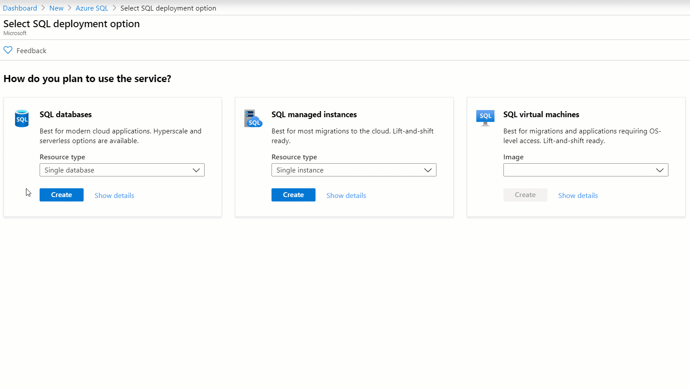
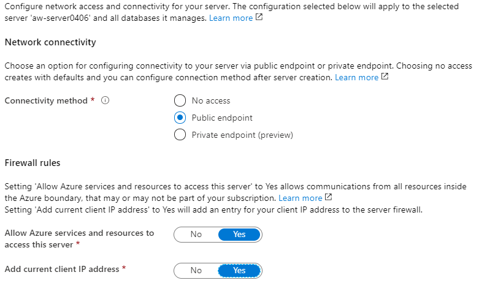
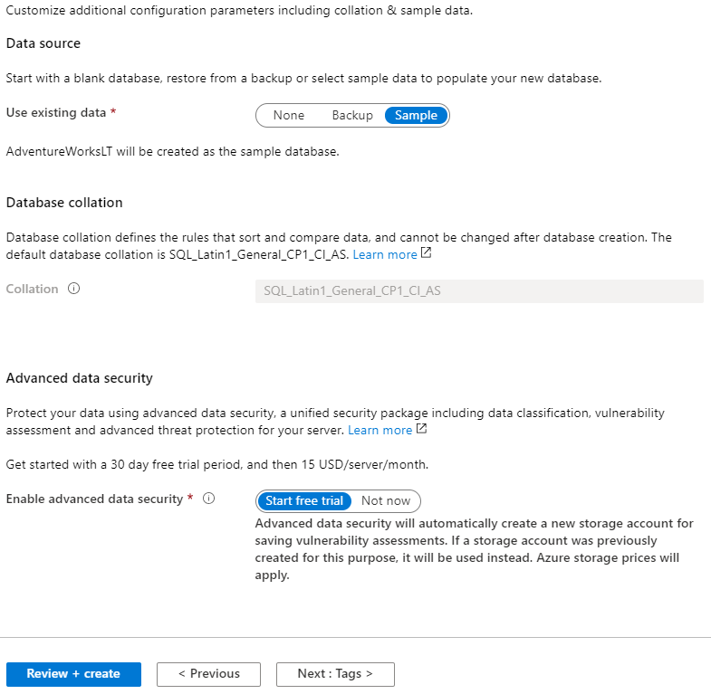
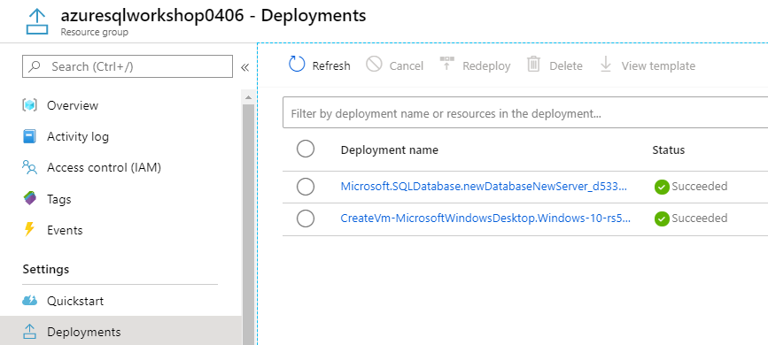
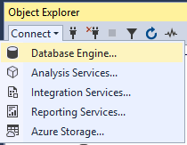
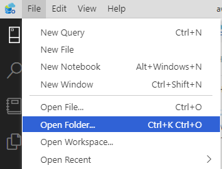

# Module 1 Activity - Introduction to Azure SQL

#### <i>The Azure SQL Workshop</i>

 <h2>Overview</h2>

> You must complete the prerequisites before completing these activities. You can also choose to audit the materials if you cannot complete the prerequisites. If you were provided an environment to use for the workshop, then you **do not need** to complete the prerequisites.    

In this module's activities, you will deploy and configure Azure SQL, specifically Azure SQL Database. In addition to the Azure portal, you'll leverage SSMS, Azure Data Studio (including SQL and PowerShell Notebooks), and the Azure CLI.   

Throughout the activities, it's important to also read the accompanying text to the steps, but know that you can always come back to this page to review what you did at a later time (after the workshop).  

There are X activities in this module:  
* TODO1 WITH LINK
* TODO2 WITH LINK
* TODO3 WITH LINK

<b>Activity 1: Deploy Azure SQL Database using the Azure portal</b>

In this activity, you'll deploy Azure SQL Database using the Azure portal. Throughout this exercise, you'll also get to explore the various options that are available to you. 

**Step 1 - Deployment options**  

Navigate to https://portal.azure.com/ and log in with your account, if you are not already. In the top search bar, type **Azure SQL** and review what appears:  

* **Services**: this allows you to see your existing resources grouped by what type of service they are
* **Resources**: this allows you to select specific resources
* **Marketplace**: this allows you to deploy new resources
* **Documentation**: this searches docs.microsoft.com 
* **Resource groups**: this allows you to select a resource group  

Next, select **Azure SQL** under "Marketplace." This will bring you to the Azure SQL create experience. Take a few seconds to click around and explore.    

Next, select **Single database** and click **Create**.  

**Step 2 - Database name**  

Select the subscription and resource group you created in the prerequisites (or were provided to use), then enter a database name **AdventureWorksID** where ID is the unique identifier you used in the prerequisites, or the unique ID at the end of the resource group you were provided (e.g. TODO).  

**Step 3 - Server**  

When you create an Azure SQL MI, supplying the server name is the same as in SQL Server. However, for databases and elastic pools, an Azure SQL Database server is required. This is a *logical* construct that acts as a central administrative point for multiple single or pooled databases, logins, firewall rules, auditing rules, threat detection policies, and failover groups (more on these topics later). But having this logical server does not expose any instance-level access or features. More on SQL Database servers [here](https://docs.microsoft.com/en-us/azure/sql-database/sql-database-servers).  

Select **Create new** next to "Server" and provide the following information:  
* *Server name*: **aw-serverID** where ID is the same identifier you used for the database and resource group.  
* *Server admin login*: **cloudadmin**. This is the equilavent to the system admin in SQL Server. This account connects using SQL authentication (username and password) and only one of these accounts can exist.    
* *Password*: A complex password that meets the requirements.
* *Location*: Use the same location as your resource group.  

  

Then, select **OK**.

**Step 4 - Opt-in for elastic pools**

In Azure SQL DB, you then decide if you want this database to be a part of an Elastic Pool (new or existing). In Azure SQL MI, [creating an instance pool (public preview) currently requires a different flow](https://docs.microsoft.com/en-us/azure/sql-database/sql-database-instance-pools-how-to#create-an-instance-pool) than the Azure SQL create experience in the Azure portal.

**Step 5 - Purchasing model**  

Next to "Compute + storage" select **Configure Database**.  The top bar, by default shows the different service tiers available in the vCore purchasing model. You have two options for the purchasing model, [virtual core (vCore)-based](https://docs.microsoft.com/en-us/azure/sql-database/sql-database-service-tiers-vcore) (recommended) or [Database transaction unit (DTU)-based](https://docs.microsoft.com/en-us/azure/sql-database/sql-database-service-tiers-dtu
). The DTU model is not available in Azure SQL MI.     

> The vCore-based model is recommended because it allows you to independently choose compute and storage resources, while the DTU-based model is a bundled measure of compute, storage and I/O resources, which means you have less control over paying only for what you need. This model also allows you to use [Azure Hybrid Benefit for SQL Server](https://azure.microsoft.com/pricing/hybrid-benefit/) to gain cost savings. In the [vCore model](https://docs.microsoft.com/en-us/azure/sql-database/sql-database-service-tiers-vcore), you pay for:  
> 
> * Compute resources (the service tier + the number of vCores and the amount of memory + the generation of hardware).
> * The type and amount of data and log storage.
> * Backup storage ([read-access, geo-redundant storage (RA-GRS)](https://docs.microsoft.com/en-us/azure/storage/common/storage-designing-ha-apps-with-ragrs)).  

For the purposes of this workshop, we'll focus on the vCore purchasing model (recommended), so there is no action in this step. You can optionally review the DTU model by selecting **Looking for basic, standard, premium?** and by [comparing vCores and DTUs in-depth here](https://docs.microsoft.com/en-us/azure/sql-database/sql-database-purchase-models
).  

**Step 6 - Service tier**  

The next decision is choosing the service tier for performance and availability. We recommend you start with the General Purpose, and adjust as needed. There are three tiers available in the vCore model:  
* **[General purpose](https://docs.microsoft.com/en-us/azure/sql-database/sql-database-service-tier-general-purpose)**: Most business workloads. Offers budget-oriented, balanced, and scalable compute and storage options.
* **[Business critical](https://docs.microsoft.com/en-us/azure/sql-database/sql-database-service-tier-business-critical)**: Business applications with low-latency response requirements. Offers highest resilience to failures by using several isolated replicas. This is the only tier that can leverage [in-memory OLTP](https://docs.microsoft.com/en-us/azure/sql-database/sql-database-in-memory) to improve performance.
* **[Hyperscale](https://docs.microsoft.com/en-us/azure/sql-database/sql-database-service-tier-hyperscale)**: Most business workloads with highly scalable storage (100TB+) and read-scale requirements. From a performance and cost perspective, it falls between General purpose and Business critical. *Currently only available for single databases, not managed instances or pools*.  

If you choose **General Purpose within Azure SQL DB** and the **vCore-based model**, you have an additional decision to make regarding the compute that you pay for:
* **Provisioned compute** is meant for more regular usage patterns with higher average compute utilization over time, or multiple databases using elastic pools. 
* **Serverless compute** is meant for intermittent, unpredictable usage with lower average compute utilization over time. Serverless has auto-pause and resume capabilities (with a time delay you set), meaning when your database is paused, you only pay for storage.  

For a deeper explanation between provisioned and serverless compute (including scenarios), you can refer to the detailed [comparison in the documentation](https://docs.microsoft.com/en-us/azure/sql-database/sql-database-serverless#comparison-with-provisioned-compute-tier).  For a deeper explanation between the three service tiers (including scenarios), you can refer to the [service-tier characteristics](https://docs.microsoft.com/en-us/azure/sql-database/sql-database-service-tiers-vcore#service-tier-characteristics) in the documentation.  

**Step 7 - Hardware**

The vCore model lets you choose the generation of hardware:  
* **Gen4**: Up to 24 logical CPUs based on Intel E5-2673 v3 (Haswell) 2.4-GHz processors, vCore = 1 physical core, 7 GB per core, attached SSD
* **Gen5**: Up to 80 logical CPUs based on Intel E5-2673 v4 (Broadwell) 2.3-GHz processors, vCore = 1 hyper-thread, 5.1 GB per core, fast NVMe SSD  

Basically, Gen4 hardware offers substantially more memory per vCore. However, Gen5 hardware allows you to scale up compute resources much higher. [New Gen4 databases are no longer supported in certain regions](https://azure.microsoft.com/en-us/updates/gen-4-hardware-on-azure-sql-database-approaching-end-of-life-in-2020/), where Gen5 is available in most regions worldwide. As technology advances, you can expect that the hardware will change as well. For example, Fsv2-series (compute optimized) and M-series (memory optmized) hardware options recently became available in public preview for Azure SQL DB. You can reivew the latest hardware generations and availability [here](https://docs.microsoft.com/en-us/azure/sql-database/sql-database-service-tiers-vcore#hardware-generations).

> Note: If you choose General Purpose within Azure SQL DB and want to use the serverless compute tier, Gen5 hardware is the only option and it currently can scale up to 16 vCores.  

For the workshop, you can leave the default hardware selection of **Gen5** but you can select **Change configuration** to view the other options available (may vary by region).  

**Step 8 - Sizing**

One of the final steps is to determine how many vCores and the Data max size. For the workshop, you can select **2 vCores** and **32 GB Data max size**.  

Generally, if you're migrating, you should use a similar size as to what you use on-premises. You can also leverage tools, like the [Data Migration Assistant SKU Recommender](https://docs.microsoft.com/en-us/sql/dma/dma-sku-recommend-sql-db?view=sql-server-ver15) to estimate the vCore and Data max size based on your current workload.  

You might also be wondering what "9.6 GB LOG SPACE ALLOCATED" in the bottom right corner means. TODO

Before you select **Apply**, confirm your selections look similar to those below:  

The "Basics" pane should now look similar to the image below:  

  

**Step 9 - Networking**  

Select **Next : Networking**.  

Choices for networking for Azure SQL DB and Azure SQL MI are different. When you deploy an Azure SQL Database, currently the default is "No access".  

You can then choose to select Public endpoint or Private endpoint (preview). In this workshop we'll use the public endpoint and set the "Allow Azure services and resources to access this server" blade to yes, meaning that other Azure services (e.g. Azure Data Factory or an Azure VM) can access the database if you configure it. You can also select "Add current client IP address" if you want to be able to connect from the IP address you use to deploy Azure SQL Database, which you do. Make sure your settings match below:    

  

With Azure SQL MI, you deploy it inside an Azure virtual network and a subnet that is dedicated to managed instances. This enables you to have a completely secure, private IP address. Azure SQL MI provides the ability to connect an on-prem network to a managed instance, connect a managed instance to a linked server or other on-prem data store, and connect a managed instance to other resources. You can additionally enable a public endpoint so you can connect to managed instance from the Internet without VPN. This access is disabled by default.  

The principle of private endpoints through virtual network isolation is making it's way to Azure SQL DB in something called 'private link' (currently in public preview), and you can learn more [here](https://docs.microsoft.com/en-us/azure/private-link/private-link-overview).

More information on connectivity for Azure SQL DB can be found [here](https://docs.microsoft.com/en-us/azure/sql-database/sql-database-connectivity-architecture) and for Azure SQL MI [here](https://docs.microsoft.com/en-us/azure/sql-database/sql-database-managed-instance-connectivity-architecture). There will also be more on this topic in upcoming sections/modules.  

For now, select **Next : Additional settings**

**Step 10 - Data source**

In Azure SQL DB, upon deployment you have the option to select the AdventureWorksLT database as the sample in the Azure portal. In Azure SQL MI, however, you deploy the instance first, and then databases inside of it, so there is not an option to have the sample database upon deployment (similar to in SQL Server).  

For the workshop, select **Sample**.  

**Step 11 - Database collations**

Since we're using the AdventureWorksLT sample, the **database collation is already set**. For a review of collations and how they apply in Azure SQL, continue reading, otherwise **you can skip to Step 12**.

Collations in SQL Server and Azure SQL tell the Database Engine how to treat certain characters and languages. A collation provides the sorting rules, case, and accent sensitivity properties for your data. When you're creating a new Azure SQL DB or MI, it's important to first take into account the locale requirements of the data you're working with, because the collation set will affect the characteristics of many operations in the database. In the SQL Server box product, the default collation is typically determined by the OS locale. In Azure SQL MI, you can set the server collation upon creation of the instance, and it cannot be changed later. The server collation sets the default for all of the databases in that instance of Azure SQL MI, but you can modify the collations on a database and column level. In Azure SQL DB, you can not set the server collation, it is set at the default (and most common) collation of `SQL_Latin1_General_CP1_CI_AS`, but you can set the database collation. If we break that into chunks:  
* `SQL` means it is a SQL Server collation (as opposed to a Windows or Binary collation)  
* `Latin1_General` specifies the alphabet/language to use when sorting
* `CP1` references the code page used by the collation
* `CI` means it will be case insensitive, where `CS` is case sensitive
* `AS` meand it will be accent sensitive, where `AI` is accent insensitive     

There are other options available related to widths, UTF-8, etc., and more details about what you can and can't do with Azure SQL [here](https://docs.microsoft.com/en-us/sql/relational-databases/collations/collation-and-unicode-support?view=sql-server-ver15).

**Step 12 - Opt-in for Advanced Data Security**

When you deploy Azure SQL DB in the portal, you are prompted if you'd like to enable [Advanced Data Security (ADS)](https://docs.microsoft.com/en-us/azure/sql-database/sql-database-advanced-data-security) on a free trial. Select **Start free trial**. After the free trial, it is billed according to the [Azure Security Center Standard Tier pricing](https://azure.microsoft.com/en-us/pricing/details/security-center/). If you choose to enable it, you get functionality related to data discovery and classification, identifying/mitigating potential database vulnerabilities, and threat detection. You'll learn more about these capabilities in the next module (<a href="https://github.com/microsoft/sqlworkshops/blob/master/AzureSQLWorkshop/azuresqlworkshop/02-Security.md" target="_blank"><i>02 - Security</i></a>). In Azure SQL MI, you can enable it on the instance after deployment.  

Your "Additional settings" pane should now look similar to the image below.

**Step 13 - Tags**

Select **Next : Tags**. 

Tags can be used to logically organize Azure resources across a subscription. For example, you can apply the name "Environment" and the value "Development" to this SQL database and Database server, but you might use the value "Production" for production resources. This can helpful for organizing resources for billing or management. You can read more [here](https://docs.microsoft.com/en-us/azure/azure-resource-manager/management/tag-resources).

  

**Step 14 - Review and create**

Finally, select **Next : Review + create**. Here you can review your deployment selections and the [Azure marketplace terms](https://go.microsoft.com/fwlink/?linkid=2045624).  

> You also have the option to "Download a template for automation." We won't get in to that here, but if you're interested, you can [learn more](https://docs.microsoft.com/en-us/azure/azure-resource-manager/).  

Finally, select **Create** to deploy the service.  

Soon after selecting Create, you will be redirected to a page that looks like this (below), and where you can monitor the status of your deployment.

And some time later ... 

And finally...

If, for whatever reason, you get lost from this page and the deployment has not completed, you can navigate to your resource group, and select **Deployments**. This will give you the various deployments, their statuses, and more information.  

Once your resource has deployment, review the "Overview" pane for the SQL database in the Azure portal and confirm that the Status is "Online."  

<b>Activity 2: Initial connect and comparison</b>

**Step 1 - Connect to SQL Server 2019**
Now that everything looks to be up and running in the Azure portal, let's switch to a familiar tool, SQL Server Management Studio (SSMS). Open SSMS and connect, using Windows Authentication, to the local instance of SQL Server 2019 that's running on your Azure VM (if you don't have this, please revisit the prerequisites).  

  

If you completed the prerequisites, expanding the databases and system databases folders should result in a view similar to the following.  

   

**Step 2 - Connect to Azure SQL Database**  

Next, let's connect to your Azure SQL Database logical server and compare. First, select **Connect > Database Engine**.  

  

For server name, input the name of your Azure SQL Database logical server. You may need to refer to the Azure portal to get this, e.g. *aw-server0406.database.windows.net*.  

Change the authentication to **SQL Server Authentication**, and input the corresponding admin Login and Password.  

Check the **Remember password** box and select **Connect**.

   

Expanding the databases and system databases should result in a view similar to the following.  

   

Spend a few minutes clicking around and exploring the differences, at first glance, between the Azure SQL Database logical server and Azure SQL Database. You won't deploy an Azure SQL Managed Instance as part of this workshop, but the image below shows how Azure SQL Managed Instance would appear in SSMS.

**TODO SCREENSHOT OF SSMS WITH ADVENTUREWORKS**  

<b>Activity 3: Verify deployment queries</b>

Now that you've seen how Azure SQL appears in SSMS, let's explore a tool that may be new to you called Azure Data Studio (ADS). ADS is a source-open tool that provides a lightweight editor and other tools (including Notebooks which you'll see soon) for interacting with Azure Data Services (including SQL Server on-prem, Azure SQL, Azure Database for PostgreSQL, and more). Let's take a brief tour to get acquainted.  

**Step 1 - Open Azure Data Studio and Connect**  

Open Azure Data Studio (ADS). When opening for the first time, you'll first be prompted to make a connection.  

  

Note that you can connect to your local instance of SQL Server 2019 here. Let's do that first. You can also supply a Server group and Name, if you want to group different connections together. For example, when you connect to SQL Server 2019, you might place it in a new Server group called **SQL Server 2019**. Fill in your information and connect to SQL Server 2019 by selecting **Connect**.  

  

You'll then go to a page that contains the "Server Dashboard". Select the **Connections** button (red square in below image) to view your Server groups and connections.     

  

Your results should be similar to what you saw in SSMS. Select the **New connection** button in the "Servers" bar.  

  

Now, connect to your Azure SQL Database logical server, just as you did in SSMS, but putting it in a new Server group called "Azure SQL Database", and selecting **Connect**.   

  

In your "Connections" tab, under "Servers," you should now see both connections, and you should be able to expand the folders similar to SSMS.  

   

**Step 2 - Set up easy file access with ADS**  

Now that your connected, you might want an easy way to access scripts and Jupyter notebooks. A Jupyter notebook (often referred to just as "Notebooks") is a way of integrating runnable code with text. If you aren't familiar with Jupyter notebooks, you will be soon, and you can check out more details later in the [documentation](https://docs.microsoft.com/en-us/sql/big-data-cluster/notebooks-guidance?view=sql-server-ver15).  

First, in ADS, select **File > Open Folder**.  

  

Next, navigate to where the repository of all the workshop resources are. If you followed the prerequisites, the path should be similar to `C:\Users\<vm-username>\sqlworkshops\AzureSQLWorkshop`. Once you're there, select **Select Folder**.  

  

Next, select the **Explorer** icon from the left taskbar to navigate through the files in the workshop.  

  

Throughout the workshop, you'll be instructed at various points to open a notebook (file ending in `.ipynb`) or a script (file ending in `.sql`), and you can access those through here directly.   

**Step 3 - Verify deployment queries**  

Once you've deployed an instance of SQL (be in Azure SQL or SQL Server), there are typically some queries you would run to verify your deployment. In Azure SQL, some of these queries vary from SQL Server. In this step, you'll see what and how things change from SQL Server, and what is new.   

For this step, you'll use the notebook **VerifyDeployment.ipynb** which is under `azuresqlworkshop\01-IntroToAzureSQL\VerifyDeployment.ipynb`. Navigate to that file to complete this step, and then return here.  

<b>Activity 4: Azure CLI</b>

TODO

<b >Next Steps</b>

Next, Continue to <a href="https://github.com/microsoft/sqlworkshops/blob/master/azuresqlworkshop/azuresqlworkshop/01-IntroToAzureSQL.md" target="_blank"><i> 01 - Introduction to Azure SQL</i></a>.
