# Module 2 - Deploy and Configure

#### <i>The Azure SQL Workshop</i>

 <h2>Overview</h2>

> You must complete the [prerequisites](../azuresqlworkshop/00-Prerequisites.md) before completing these activities. You can also choose to audit the materials if you cannot complete the prerequisites. If you were provided an environment to use for the workshop, then you **do not need** to complete the prerequisites.

In this module's activities, you will deploy and configure Azure SQL, specifically Azure SQL Database. In addition to the Azure portal, you'll leverage SSMS, Azure Data Studio (including SQL and PowerShell Notebooks), and the Azure CLI.

The in-class version of this workshop involves a short presentation, which you can review [here](../slides/AzureSQLWorkshop.pptx).

Throughout the activities, it's important to also read the accompanying text to the steps, but know that you can always come back to this page to review what you did at a later time (after the workshop).  

In this module, you'll cover these topics:  
[2.1](#2.1): Pre-deployment planning
[2.2](#2.2): Deploy and verify  
&nbsp;&nbsp;&nbsp;&nbsp;&nbsp;&nbsp;[Activity 1](#1): Deploy Azure SQL Database using the Azure portal   
&nbsp;&nbsp;&nbsp;&nbsp;&nbsp;&nbsp;[Activity 2](#2): Initial connect and comparison  
&nbsp;&nbsp;&nbsp;&nbsp;&nbsp;&nbsp;[Activity 3](#3): Verify deployment queries   
[2.3](#2.3): Configure  
&nbsp;&nbsp;&nbsp;&nbsp;&nbsp;&nbsp;(Bonus) [Activity 4](#4): Configure with Azure CLI  
[2.4](#2.4): Load data  
&nbsp;&nbsp;&nbsp;&nbsp;&nbsp;&nbsp;(Bonus) [Activity 5](#5): Load data  

<h2><a name="2.1">2.1 Pre-deployment planning</h2></a>

Before you start deploying things in Azure, it's important to understand what your requirements are and how they map to offerings in Azure SQL. Using what you learned in Module 1, it's time to make a plan. You need to determine the following:  
* Deployment method: GUI or unattended?
* Deployment option: VM, DB, Elastic Pool, MI, or Instance Pool?
* Purchasing model: DTU or vCore?
* Service tier (SLO): General purpose, business critical, or hyperscale?
* Hardware: Gen4, Gen5, or something new?
* Sizing: number of vCores and data max size?  
> The Data Migration Assistant tool (DMA) has a [SKU Recommender](https://docs.microsoft.com/en-us/sql/dma/dma-sku-recommend-sql-db?view=sql-server-ver15) that can help you determine the number of vCores and size if you are migrating.  

 

<h2><a name="2.2">2.2 Deploy and Verify</h2></a>

Once you've completed your pre-deployment planning, it's time to deploy and verify that deployment. In this stage, you'll deploy Azure SQL (using the Azure portal or command-line), determine network configuration and how to connect, and run some queries that verify your deployment configuration.  

 

<a name="1"><b>Activity 1</a>: Deploy Azure SQL Database using the Azure portal</b>

In this activity, you'll deploy Azure SQL Database deployment using the Azure portal. Throughout this exercise, you'll also get to explore the various options that are available to you.

**Step 1 - Deployment options**  

> Note: If you are not already connected to your Azure VM, do that now. For instructions on how to do that, see [here](https://docs.microsoft.com/en-us/azure/virtual-machines/windows/connect-logon). All of the exercises for the remainder of the workshop should be completed in your VM. If you want to make viewing the instructions easier, you might consider opening these instructions in a browser in you VM.

Navigate to https://portal.azure.com/ and log in with your account, if you are not already. In the top search bar, type **Azure SQL** and review what appears:

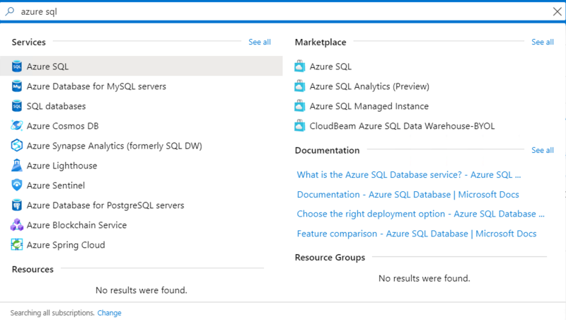  

There are a lot of different items and categories here, but basically this is giving you filters for what you want to search on. Let's break them down:
* **Services**: if you select Services, then you're able to see the existing resources (i.e. already deployed) that you have all together. For example, if you clicked Azure SQL, you would see all of your SQL VMs, Databases, Logical servers, Managed Instances, and pools.
* **Resources**: this searches based on existing resource names. For example, if you searched for "adventureworks" any resources with "adventureworks" in the name would return here.
* **Marketplace**: this allows you to deploy new resources from the marketplace. 
* **Documentation**: this searches docs.microsoft.com for relevant documentation
* **Resource groups**: this allows you to search based on resource group name.

Next, select **Azure SQL** under **Marketplace**. This will bring you to the Azure SQL create experience. Take a few moments to click around and explore.

Next, select **Single database** and click **Create**.

>**NOTE**: There are various methods to deploy a single Azure SQL Database. Our [Quickstart](https://docs.microsoft.com/en-us/azure/sql-database/sql-database-single-database-get-started) shows options for the portal, Powershell, and Azure CLI.

**Step 2 - Database name**  

Select the subscription and resource group you created in the prerequisites (or were provided), then enter a database name **AdventureWorksID** where ID is the unique identifier you used in the prerequisites for your resource group, or the unique ID at the end of the Azure login you were provided (e.g. for `odl_user_160186@....com` the ID you will use for the entirety of the workshop is `160186`).  

**Step 3 - Server**  

When you create an Azure SQL Managed Instance, supplying the server name is the same as in SQL Server. However, for databases and elastic pools, an Azure SQL Database server is required. This is a *logical* server that acts as a central administrative point for single or pooled database and includes logins, firewall rules, auditing rules, threat detection policies, and failover groups (more on these topics later). This logical server does not expose any instance-level access or features as with Azure SQL Managed Instance. For Azure SQL Database servers, the server name must be unique across all of Azure. You can read more on SQL Database servers [here](https://docs.microsoft.com/en-us/azure/sql-database/sql-database-servers).  

Select **Create new** next to **Server** and provide the following information:  
* *Server name*: **aw-serverID** where ID is the same identifier you used for the database and resource group.  
* *Server admin login*: **cloudadmin**. This is the equivalent to a member of the sysadmin role in SQL Server. This account connects using SQL authentication (username and password) and only one of these accounts can exist. You can read more about Administrator accounts for Azure SQL Database [here](https://docs.microsoft.com/en-us/azure/sql-database/sql-database-manage-logins#unrestricted-administrative-accounts).
* *Password*: A complex password that meets [strong password requirements](https://docs.microsoft.com/en-us/sql/relational-databases/security/strong-passwords). **TIP**: As you type in your password you are given hints as to the requirements. You are also asked to confirm your password.
* *Location*: Use the same location as your resource group.  

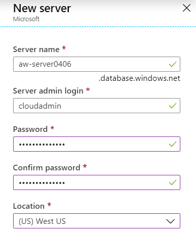  

> Note: If there are other checkboxes here, accept the defaults.

Then, select **OK**.

**Step 4 - Opt-in for elastic pools**

In Azure SQL DB, you then decide if you want this database to be a part of an Elastic Pool (new or existing). In Azure SQL Managed Instance, [creating an instance pool (public preview) currently requires a different flow](https://docs.microsoft.com/en-us/azure/sql-database/sql-database-instance-pools-how-to#create-an-instance-pool) than the Azure SQL create experience in the Azure portal. For this activity, select **No**.  

**Step 5 - Purchasing model**  
>For more details on purchasing models and comparisons, refer to [Module 1](../azuresqlworkshop/01-IntroToAzureSQL.md).  

Next to **Compute + storage** select **Configure Database**.  The top bar, by default shows the different service tiers available in the vCore purchasing model.

For the purposes of this workshop, we'll focus on the vCore purchasing model (recommended), so there is no action in this step. You can optionally review the DTU model by selecting **Looking for basic, standard, premium?** and by [comparing vCores and DTUs in-depth here](https://docs.microsoft.com/en-us/azure/sql-database/sql-database-purchase-models
).  

**Step 6 - Service tier**  
>For more details on service tiers and comparisons, refer to [Module 1](../azuresqlworkshop/01-IntroToAzureSQL.md).  

The next decision is choosing the service tier for performance and availability. Generally, we recommend you start with the General Purpose and adjust as needed. For the purposes of this workshop, be sure to select **General Purpose** here (should be the default).  

**Step 7 - Hardware**
>For more details on available hardware and comparisons, refer to [Module 1](../azuresqlworkshop/01-IntroToAzureSQL.md).  

For the workshop, you can leave the default hardware selection of **Gen5**, but you can select **Change configuration** to view the other options available (may vary by region).  

**Step 8 - Sizing**

One of the final steps is to determine how many vCores and the Data max size. For the workshop, select **2 vCores** and **32 GB Data max size**.  

Generally, if you're migrating, you should use a similar size as to what you use on-premises. You can also leverage tools, like the [Data Migration Assistant SKU Recommender](https://docs.microsoft.com/en-us/sql/dma/dma-sku-recommend-sql-db?view=sql-server-ver15) to estimate the vCore and Data max size based on your current workload.  

The Data max size is not necessarily the database size of your data today. It is the maximum amount of data space that can be allocated for your database. For more information about the difference between data space used, data space allocated, and data max size, refer to this [explanation in the documentation](https://docs.microsoft.com/en-us/azure/sql-database/sql-database-file-space-management#understanding-types-of-storage-space-for-a-database). This will also help you understand the log space allocated, which scales with your data max size.  

Before you select **Apply**, confirm your selections look similar to those below (your resource group, Database name, and Server will be specific to your choices):  

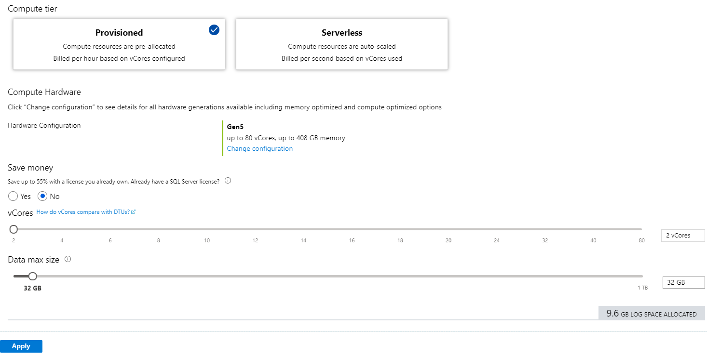

The **Basics** pane should now look similar to the image below:  

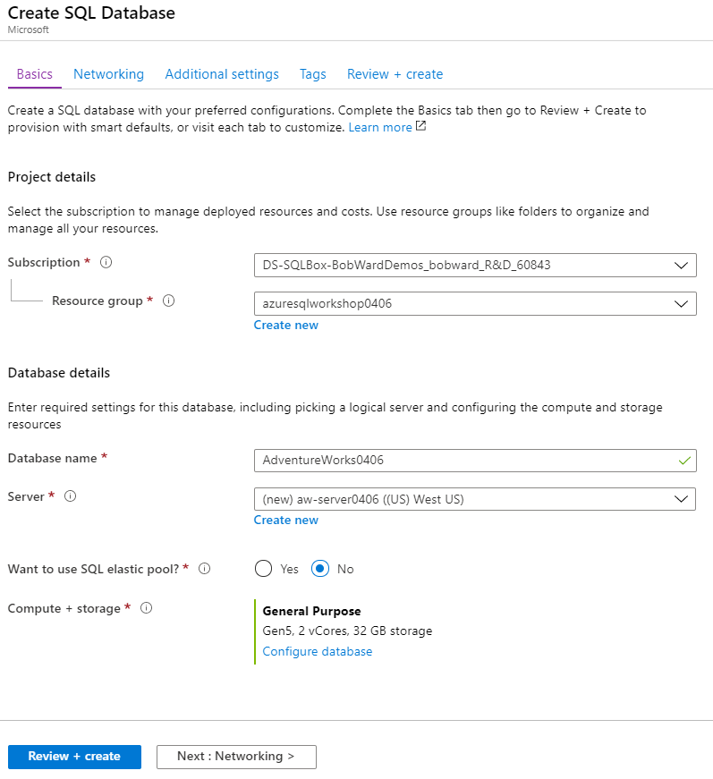

**Step 9 - Networking**

Select **Next : Networking**.  

Choices for networking for Azure SQL Database and Azure SQL Managed Instance are different. When you deploy an Azure SQL Database, currently the default is **No access**.  

You can then choose to select Public endpoint or Private endpoint (preview). In this workshop we'll use the public endpoint and set the **Allow Azure services and resources to access this server** option to yes, meaning that other Azure services (e.g. Azure Data Factory or an Azure Virtual Machine) can access the database if you configure it. You can also select **Add current client IP address** if you want to be able to connect from the IP address from the client computer you used to deploy Azure SQL Database, which you do. Make sure your settings match below:

With Azure SQL Managed Instance, you deploy it inside an Azure virtual network and a subnet that is dedicated to managed instances. This enables you to have a completely secure, private IP address. Azure SQL Managed Instance provides the ability to connect an on-prem network to a managed instance, connect a managed instance to a linked server or other on-prem data store, and connect a managed instance to other resources. You can additionally enable a public endpoint so you can connect to managed instance from the Internet without a Virtual Private Network (VPN). This access is disabled by default.  

The principle of private endpoints through virtual network isolation is available for Azure SQL Database through a  **private link** (currently in public preview), and you can learn more [here](https://docs.microsoft.com/en-us/azure/private-link/private-link-overview).

More information on connectivity for Azure SQL Database can be found [here](https://docs.microsoft.com/en-us/azure/sql-database/sql-database-connectivity-architecture) and for Azure SQL Managed Instance [here](https://docs.microsoft.com/en-us/azure/sql-database/sql-database-managed-instance-connectivity-architecture). There will also be more on this topic in upcoming sections/modules.  

For now, select **Next : Additional settings**.

**Step 10 - Data source**

In Azure SQL Database, upon deployment you have the option to select the AdventureWorksLT database as the sample in the Azure portal. In Azure SQL Managed Instance, however, you deploy the instance first, and then databases inside of it, so there is not an option to have the sample database upon deployment (similar to SQL Server). You can learn more about the AdventureWorks sample databases on [GitHub](https://github.com/Microsoft/sql-server-samples/releases/tag/adventureworks).

You can also deploy a blank database or create a database based the restore of a backup from a geo-replicated backup. You can learn more on this option from the [documentation](https://docs.microsoft.com/en-us/azure/sql-database/sql-database-recovery-using-backups#geo-restore).

For this workshop, select **Sample**.  

**Step 11 - Database collations**

Since we're using the AdventureWorksLT sample, the **database collation is already set**. For a review of collations and how they apply in Azure SQL, continue reading, otherwise **you can skip to Step 12**.

Collations in SQL Server and Azure SQL tell the Database Engine how to treat certain characters and languages. A collation provides the sorting rules, case, and accent sensitivity properties for your data. When you're creating a new Azure SQL Database or Managed Instance, it's important to first take into account the locale requirements of the data you're working with, because the collation set will affect the characteristics of many operations in the database. In the SQL Server box product, the default collation is typically determined by the OS locale. In Azure SQL Managed Instance, you can set the server collation upon creation of the instance, and it cannot be changed later. The server collation sets the default for all of the databases in that instance of Azure SQL Managed Instance, but you can modify the collations on a database and column level. In Azure SQL Database, you cannot set the server collation, it is set at the default (and most common) collation of `SQL_Latin1_General_CP1_CI_AS`, but you can set the database collation. If we break that into chunks:  
* `SQL` means it is a SQL Server collation (as opposed to a Windows or Binary collation)  
* `Latin1_General` specifies the alphabet/language to use when sorting
* `CP1` references the code page used by the collation
* `CI` means it will be case insensitive, where `CS` is case sensitive
* `AS` means it will be accent sensitive, where `AI` is accent insensitive

There are other options available related to character widths, UTF-8, etc., and more details about what you can and can't do with Azure SQL [here](https://docs.microsoft.com/en-us/sql/relational-databases/collations/collation-and-unicode-support?view=sql-server-ver15).

**Step 12 - Opt-in for Advanced Data Security**

When you deploy Azure SQL Database in the portal, you are prompted if you'd like to enable [Advanced Data Security (ADS)](https://docs.microsoft.com/en-us/azure/sql-database/sql-database-advanced-data-security) on a free trial. Select **Start free trial**. After the free trial, it is billed according to the [Azure Security Center Standard Tier pricing](https://azure.microsoft.com/en-us/pricing/details/security-center/). If you choose to enable it, you get functionality related to data discovery and classification, identifying/mitigating potential database vulnerabilities, and threat detection. You'll learn more about these capabilities in the next module (<a href="https://github.com/microsoft/sqlworkshops/blob/master/AzureSQLWorkshop/azuresqlworkshop/03-Security.md" target="_blank">03 - Security</a>). In Azure SQL Managed Instance, you can enable it on the instance after deployment.  

Your **Additional settings** pane should now look similar to the image below.

**Step 13 - Tags**

Select **Next : Tags**. 

Tags can be used to logically organize Azure resources across a subscription. For example, you can apply the name "Environment" and the value "Development" to this SQL database and Database server, but you might use the value "Production" for production resources. This can helpful for organizing resources for billing or management. You can read more [here](https://docs.microsoft.com/en-us/azure/azure-resource-manager/management/tag-resources).

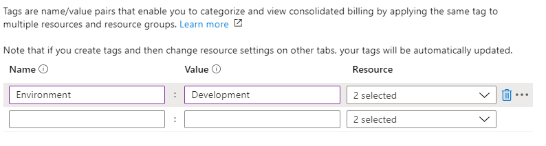  

**Step 14 - Review and create**

Finally, select **Next : Review + create**. Here you can review your deployment selections and the [Azure marketplace terms](https://go.microsoft.com/fwlink/?linkid=2045624).  

> You also have the option to **Download a template for automation**. This workshop will not cover that method, but if you're interested, you can [learn more](https://docs.microsoft.com/en-us/azure/azure-resource-manager/).

Take time here to ensure all of your selections match the workshop instructions.

Finally, select **Create** to deploy the service.  

Soon after selecting Create, you will be redirected to a page that looks like this (below), and where you can monitor the status of your deployment. This deployment option and configuration typically takes less than five minutes to deploy. Some images of what you might see are below.  

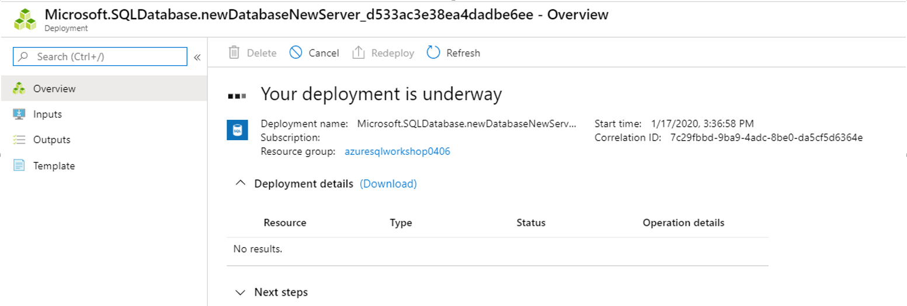

And some time later ...

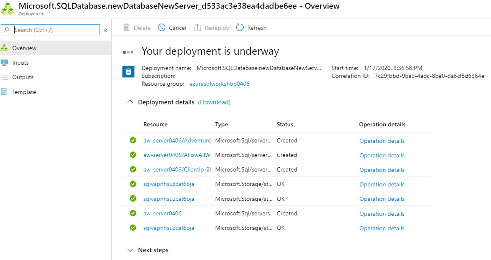

And finally...

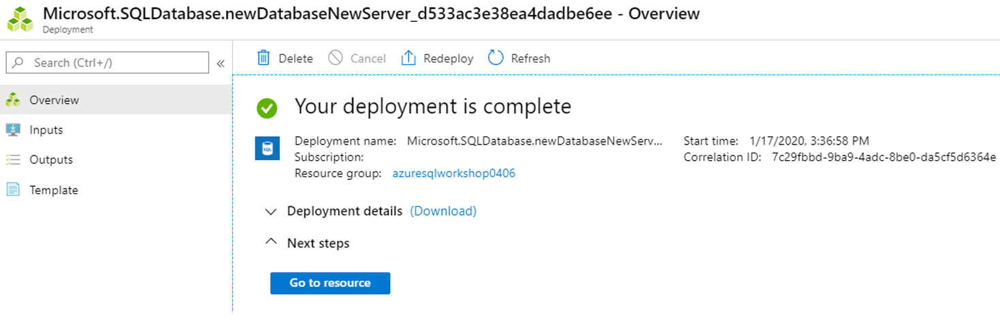

If, for whatever reason, you get lost from this page and the deployment has not completed, you can navigate to your resource group, and select **Deployments**. This will give you the various deployments, their status, and more information.  

Once your resource has deployment, review the **Overview** pane for the SQL database in the Azure portal and confirm that the Status is **Online**.  

<a name="2"><b>Activity 2</a>: Initial connect and comparison</b>

In this activity you will learn the basics of connecting to your deployed Azure SQL Database and compare that experience to connecting to SQL Server.

**Step 1 - Connect to SQL Server 2019**

Now that everything looks to be up and running in the Azure portal, let's switch to a familiar tool, SQL Server Management Studio (SSMS). Open SSMS and connect, using Windows Authentication, to the local instance of SQL Server 2019 that's running on your Azure VM (if you don't have this, please revisit the prerequisites).  

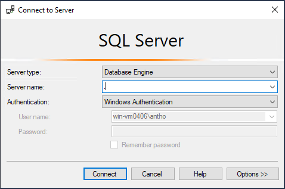  

If you completed the prerequisites, expanding the databases and system databases folders should result in a view similar to the following.  

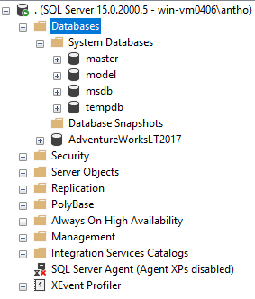   

**Step 2 - Connect to Azure SQL Database**  

Next, let's connect to your Azure SQL Database logical server and compare. First, select **Connect > Database Engine**.  

  

For server name, input the name of your Azure SQL Database logical server. You may need to refer to the Azure portal to get this, e.g. *aw-server0406.database.windows.net*.  

> **Tip: locating resources in the Azure portal**  
> If you're new to the portal, there are a few ways you can locate resources, and depending on who you talk to, they may use a different method. Here are a few options to get you started:  
> 1. In the search bar type the **resource name** and select it under "Resources". For example, in the below image I search for a SQL Managed Instance called "antho-mi", and I can then select it.  
>   
> 2. If you select **Microsoft Azure** in the top left corner of the Azure portal, it will take you to "Home". From here, you can select **Resource groups** and then select your resource group. This will bring you to a view of all the resources that you deploy in the resource group. You could alternatively select SQL Databases or Virtual machines, depending what you are looking for.  
> 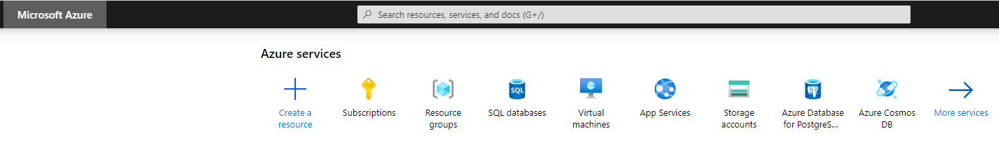
> 3. Other options / more information can be found in the [Azure portal overview](https://docs.microsoft.com/en-us/azure/azure-portal/azure-portal-overview) documentation page.  

Change the authentication to **SQL Server Authentication**, and input the corresponding Server Admin Login and Password (the one you provided during deployment in Activity 1)

Check the **Remember password** box and select **Connect**.

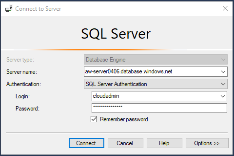   

Expanding the databases and system databases should result in a view similar to the following.  

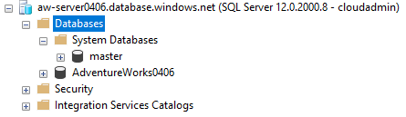   

Spend a few minutes clicking around and exploring the differences, at first glance, between the Azure SQL Database logical server and SQL Server. You won't deploy an Azure SQL Managed Instance as part of this workshop, but the image below shows how Azure SQL Managed Instance would appear in SSMS.

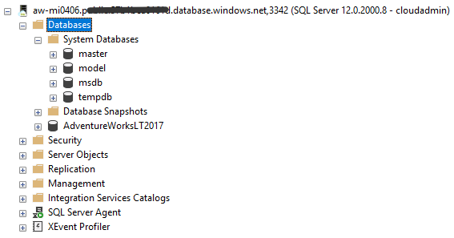   

<a name="3"><b>Activity 3</a>: Verify deployment queries</b>

Now that you've seen how Azure SQL appears in SSMS, let's explore a tool that may be new to you called Azure Data Studio (ADS). ADS is a source-open tool that provides a lightweight editor and other tools (including Notebooks which you'll see soon) for interacting with Azure Data Services (including SQL Server on-prem, Azure SQL, Azure Database for PostgreSQL, and more). Let's take a brief tour to get acquainted.  

**Step 1 - Open Azure Data Studio and Connect**  

Open Azure Data Studio (ADS). When opening for the first time, you'll first be prompted to make a connection.  

>**NOTE**: If you get prompted to enable preview features, select **Yes**.  

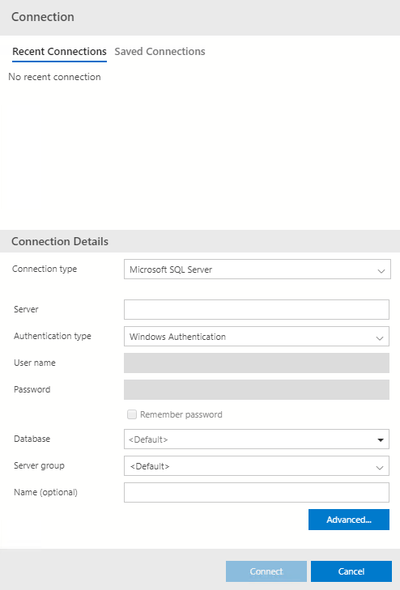  

Note that you can connect to your local instance of SQL Server 2019 here. Let's do that first. You can also supply a Server group and Name, if you want to group different connections together. For example, when you connect to SQL Server 2019, create new Server group called **SQL Server 2019**. Since you are on a local server use a Server of **.** and connect to SQL Server 2019 by selecting **Connect**.  

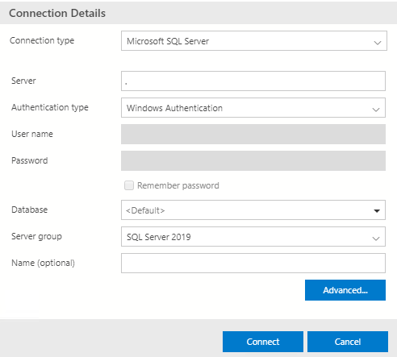  

You'll then go to a page that contains the **Server Dashboard**. Select the **Connections** button (red square in below image) to view your Server groups and connections.

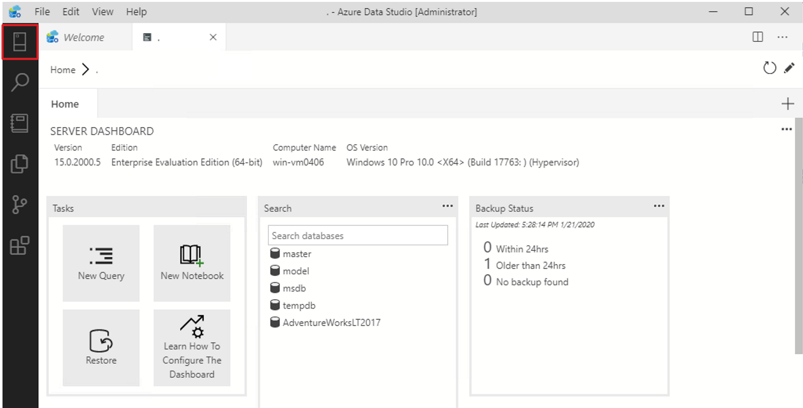  

Your results should be similar to what you saw in SSMS. Select the **New connection** button in the **Servers** bar.  

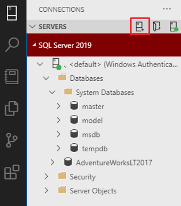  

Now, connect to your Azure SQL Database logical server, just as you did in SSMS, but putting it in a new Server group called **Azure SQL Database**. Note you need to use Authentication type **SQL Login** and supply your Server Admin login name and password. Check **Remember Password** and select **Connect**.

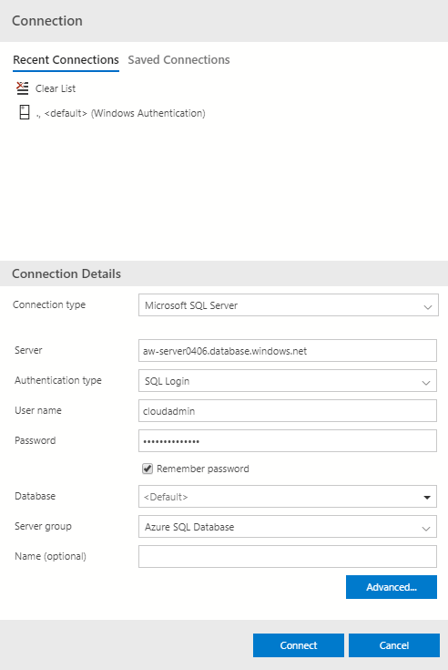  

In your **Connections** tab, under **Servers**, you should now see both connections, and you should be able to expand the folders similar to SSMS.  

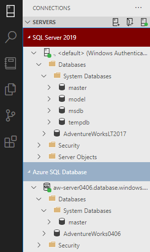   

Finally, to run queries in ADS, it's very similar to SSMS. Right-click on a database or server name and select **New query**. For Azure SQL Database, since you are not really getting a full "server", **`USE [DatabaseName]`** is not supported to change the database context. You must either change the connection to specifically the database you want to run a query on or use the drop-down. Change to the context of your **AdventureWorksID** database by selecting the drop-down box next to "master" and run `SELECT @@VERSION`.  

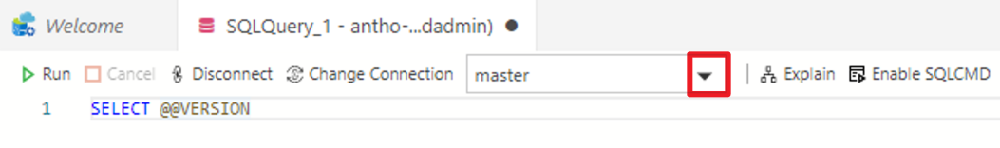

**Step 2 - Set up easy file access with ADS**  

Now that your connected, you might want an easy way to access scripts and Jupyter notebooks. A Jupyter notebook (often referred to just as "Notebooks") is a way of integrating runnable code with text. If you aren't familiar with Jupyter notebooks, you will be soon, and you can check out more details later in the [documentation](https://docs.microsoft.com/en-us/sql/big-data-cluster/notebooks-guidance?view=sql-server-ver15).  

First, in ADS, select **File > Open Folder**.  

  

Next, navigate to where the repository of all the workshop resources are. If you followed the prerequisites, the path should be similar to `C:\Users\<vm-username>\sqlworkshops\AzureSQLWorkshop`. Once you're there, select **Select Folder**.  

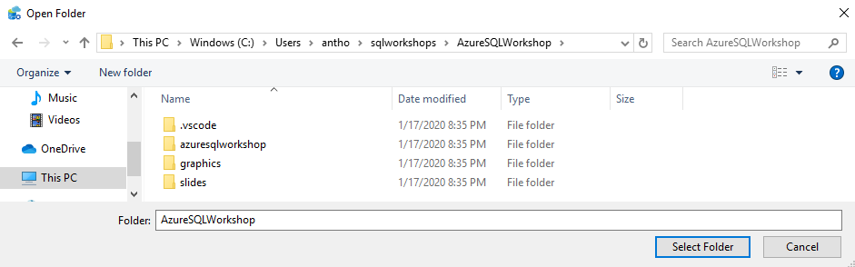  

Next, select the **Explorer** icon from the left taskbar to navigate through the files in the workshop.  

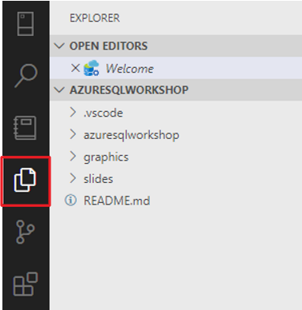  

Throughout the workshop, you'll be instructed at various points to open a notebook (file ending in `.ipynb`), and you can access those from here directly.   

**Step 3 - Verify deployment queries**  

Once you've deployed an instance of SQL (be it Azure SQL or SQL Server), there are typically some queries you would run to verify your deployment. In Azure SQL, some of these queries vary from SQL Server. In this step, you'll see what and how things change from SQL Server, and what is new.   

For this step, you'll use the notebook **VerifyDeployment.ipynb** which is under `azuresqlworkshop\02-DeployAndConfigure\verifydeployment\VerifyDeployment.ipynb`. Navigate to that file in ADS to complete this activity, and then return here.  

<h2><a name="2.3">2.3 Configure</h2></a>

TODO: Put in text here that talks about the process to configure, and configure/deploy databases with Azure SQL comparing this to SQL Server

 

<b>(Bonus) <a name="4">Activity 4</a>: Configure with Azure CLI</b>

So you've seen the Azure portal, SSMS, and SQL Notebooks in ADS, but there are other tools available to you to use to manage Azure SQL. Two of the most popular are the [Azure CLI](https://docs.microsoft.com/en-us/cli/azure/?view=azure-cli-latest) and [Azure PowerShell](https://docs.microsoft.com/en-us/powershell/azure). They are similar in their functionality, but for this activity we will focus on the Azure CLI.  

To complete this activity, you'll use a PowerShell notebook, which is the same concept as a SQL notebook, but the coding language is PowerShell. You can use PowerShell notebooks to leverage Azure CLI or Azure PowerShell, but we will focus on Azure CLI. For more information on the Azure PowerShell module, [see the documentation](https://docs.microsoft.com/en-us/azure/sql-database/sql-database-powershell-samples?tabs=single-database). For both of these tools, you can also use the [Azure Cloud Shell](https://docs.microsoft.com/en-us/azure/cloud-shell/overview), which is an interactive shell environment that you can use through your browser in the Azure portal.  

In the example that follows, you'll also explore the latency effects of using different connection policies in Azure SQL.  

For this activity, you'll use the notebook called **AzureCli.ipynb** which is under `azuresqlworkshop\02-DeployAndConfigure\cli\AzureCli.ipynb`. Navigate to that file in ADS to complete this activity, and then return here.  

 

<h2><a name="2.4">2.4 Load data</h2></a>

TODO: Put in text here that talks about the process to load data with Azure SQL comparing this to SQL Server

 

<b>(Bonus) <a name="5">Activity 5</a>: Load data into Azure SQL Database</b>

In this activity, you'll explore one scenario for bulk loading data from Azure Blob storage using T-SQL and Shared Access Signatures (SAS) into Azure SQL Database.   

For this activity, you'll use the notebook called **LoadData.ipynb** which is under `azuresqlworkshop\02-DeployAndConfigure\loaddata\LoadData.ipynb`. Navigate to that file in ADS to complete this activity, and then return here.  

In this module and throughout the activities, you learned how to deploy and configure Azure SQL. In the next module, you'll dive into security for Azure SQL.  

<b>For Further Study</b>

<ul>
    <li><a href="https://docs.microsoft.com/en-us/sql/dma/dma-sku-recommend-sql-db?view=sql-server-ver15" target="_blank">Data Migration Assistant tool (DMA) SKU Recommender</a></li>
    <li><a href="https://docs.microsoft.com/en-us/azure/sql-database/sql-database-managed-instance-get-started" target="_blank">Quickstart: Create an Azure SQL Managed Instance</a></li>
    <li><a href="https://docs.microsoft.com/en-us/azure/sql-database/sql-database-managed-instance-migrate" target="_blank">How to migrate to Azure SQL Managed Instance</a></li>
</ul>

<b >Next Steps</b>

Next, Continue to <a href="https://github.com/microsoft/sqlworkshops/blob/master/AzureSQLWorkshop/azuresqlworkshop/03-Security.md" target="_blank"><i> 03 - Security</i></a>.
