# The Azure SQL Workshop

#### <i>A Microsoft workshop from the SQL team</i>

<p style="border-bottom: 1px solid lightgrey;"></p>

 <h2>03 - Security</h2>
   
> You must complete the [prerequisites](../azuresqlworkshop/00-Prerequisites.md) before completing these activities. You can also choose to audit the materials if you cannot complete the prerequisites. If you were provided an environment to use for the workshop, then you **do not need** to complete the prerequisites.    

Ensuring security and compliance of your data is always a top priority. In this module, you’ll learn how to use Azure SQL to secure your data, how to configure logins and users, how to use tools and techniques for monitoring security, how to ensure your data meets industry and regulatory compliance standards, and how to leverage the extra benefits and intelligence that is only available in Azure. We’ll also cover some of the networking considerations for securing SQL.


In this module, you'll cover these topics:  
[3.1](#3.1): Platform and network security   
&nbsp;&nbsp;&nbsp;&nbsp;&nbsp;&nbsp;[Activity 1](#1): Configure Auditing  
&nbsp;&nbsp;&nbsp;&nbsp;&nbsp;&nbsp;[Activity 2](#2): Create and manage firewall/vNet rules for Azure SQL Database  
[3.2](#3.2): Access management and Authorization   
&nbsp;&nbsp;&nbsp;&nbsp;&nbsp;&nbsp;[Activity 3](#3): Getting started with Azure AD authentication    
[3.3](#3.3): Information protection and encryption  
&nbsp;&nbsp;&nbsp;&nbsp;&nbsp;&nbsp;[Activity 4](#4): Confirm TDE is enabled   
[3.4](#3.4): Security management  
&nbsp;&nbsp;&nbsp;&nbsp;&nbsp;&nbsp;[Activity 5](#5): Advanced data security   
&nbsp;&nbsp;&nbsp;&nbsp;&nbsp;&nbsp;(Bonus) [Activity 6](#6): Data classification, Dynamic data masking, and SQL Audit


<p style="border-bottom: 1px solid lightgrey;"></p>

<h2><a name="3.1">3.1 Platform and network security</h2></a>

TODO: Put in text here that talks about the process for network security with Azure SQL comparing this to SQL Server


<br>

<p><a name="1"><b>Activity 1</a>: Configure Auditing</b></p> <br>

>Note: This activity may appear slightly out of place. However, we want to enable auditing as soon as possible, so you have more to "audit" in later activities. 

The auditing feature tracks database events and writes events to an audit log in either Azure storage, Azure Monitor logs, or to an Event hub. Auditing helps maintain regulatory compliance, understand database activity, and gain insight into discrepancies and anomalies that could indicate potential security violations. In this activity, you'll set up Auditing at the server level (also available at the database level).  

> **Aside**: The main differences between auditing in Azure SQL and auditing in SQL Server are:  
> * With Azure SQL Database, auditing is at server or database level, but with Azure SQL Managed Instance and SQL Server is at the server level.  
> * XEvent auditing supports Azure Blob storage targets  
> * [SQL Server Auditing](https://docs.microsoft.com/en-us/sql/relational-databases/security/auditing/sql-server-audit-database-engine?view=sql-server-ver15) is only available (with some differences) in Azure SQL Managed Instance
> * For Azure SQL Managed Instance specifically:  
>    * With `CREATE AUDIT`, you have new syntax `TO URL` and `TO EXTERNAL MONITOR` allow you to specify an Azure Blob storage container and enable Event Hub and Azure Monitor logs target, respectively.  
>    * `TO FILE`, shutdown option, and `queue_delay`=0 are not supported in Azure SQL.  

<p><b>Steps</b></p>

**Step 1 - Enable auditing on the Azure SQL Database logical server**  

Open the Azure portal and navigate to your Azure SQL Database. In the left-hand task menu, under Security, select **Auditing**. Review the options and then select **View server settings**. The Microsoft recommendation is to apply auditing at the server level, which then applies to all databases within the Azure SQL Database logical server.  

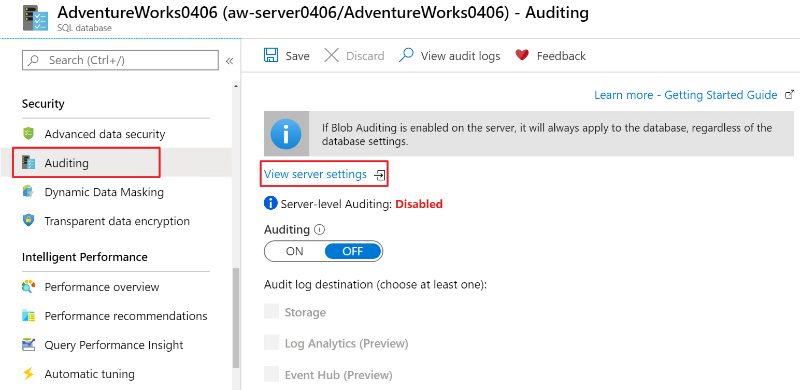  

Next, set **Auditing** to **ON**. Notice you have different options for your log destination, depending how you want to audit your data. In this lab, you'll configure Storage and Log Analytics. In a later activity in this module, you'll get to look at the logs in both. You can also explore the implementations by reviewing [the documentation](https://docs.microsoft.com/en-us/azure/sql-database/sql-database-auditing).  

Select **Log Analytics (Preview)** and the **Configure** button.  

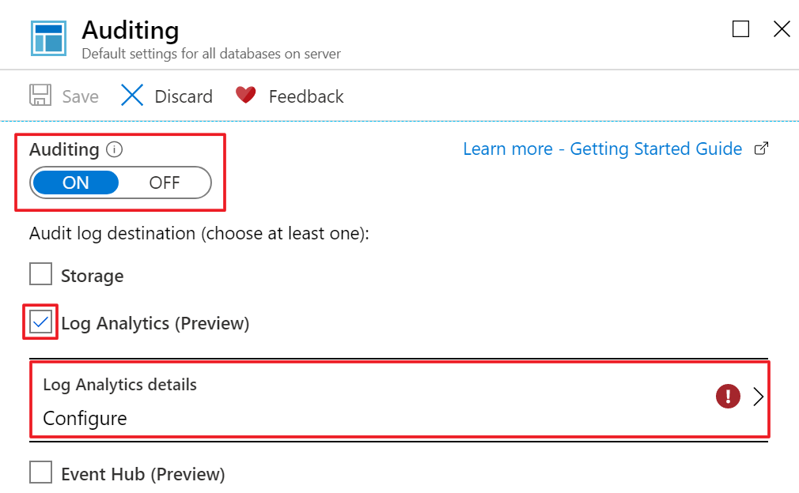   

Next, select **+ Create New Workspace**.  

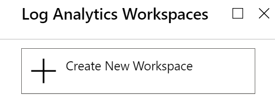  

Fill in the information according to the subscription, resource group, and location, that you are using to complete this workshop. We recommend naming your Log Analytics Workspace **azuresqlworkshopUID-la**, using your unique ID for your resources. Select **OK**.  

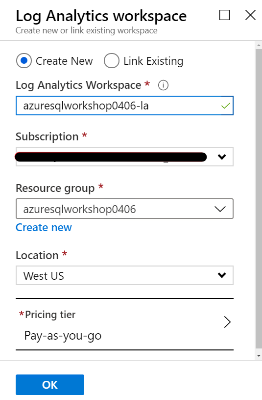  

This may take a few moments to validate and create. You should now see your Log Analytics account.  

Next, select **Storage**. This option allows you to collect XEvent log files in an Azure Blob storage account. In a later activity, you'll see more on how this differs from Log Analytics. Select **Configure**.  

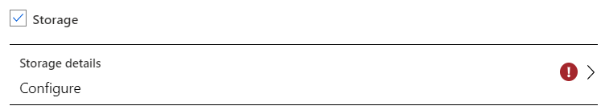  

Next, select the subscription you're using for this workshop as well as the storage account that was created to be used with Advanced data security (should be *sql* + *a random string of letters and numbers*). In this storage account, auditing logs will be saved as a collection of blob files within a container named **sqldbauditlogs**.  

You also have options for the number of days you want to retain data. The default, **0**, means to retain data forever. You can change this to something else, if you want to cut back on the storage that may be generated and charged here. For this exercise, input **7**.  

Finally, you can make a decision of which storage access key to use. Note you can use this to switch between keys when it's time to rotate them. Select **Primary**.   

After you've configured your options, select **OK**.  

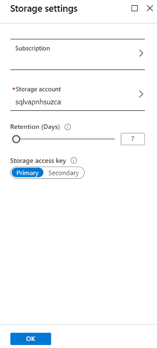  

Select **Save**.  

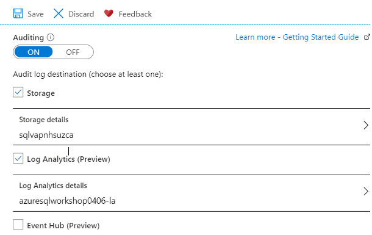  

Once it saves, you can select the **X** button to close the server level Auditing pane. Back in the Azure SQL Database Auditing pane, you may notice that the **Auditing** option says **OFF**. It's important to note that if auditing is enabled on the server, it will always apply to the database.  

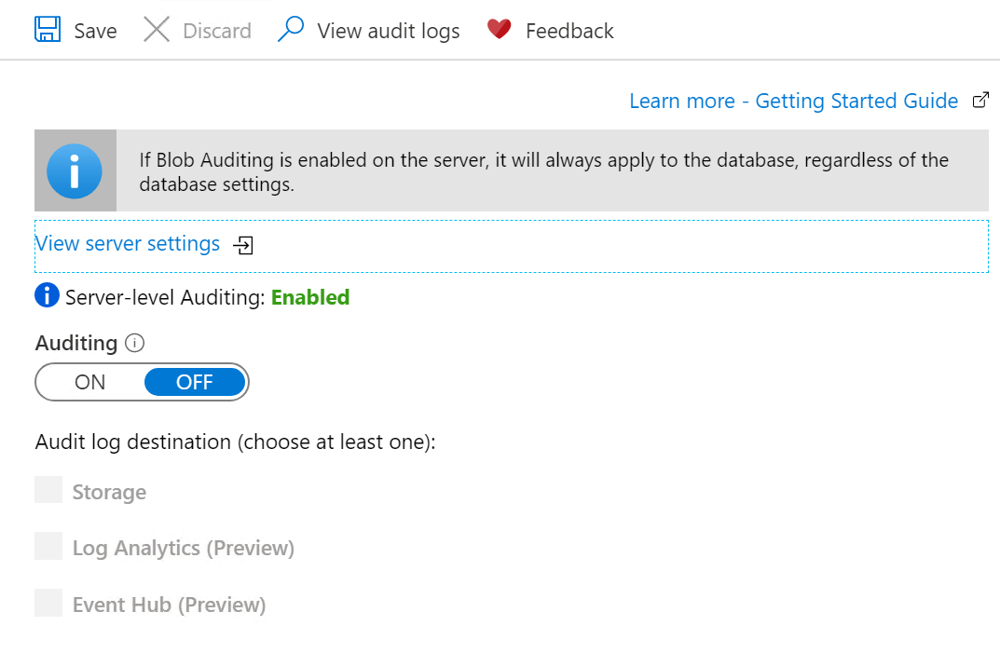  

This is the end of this activity. In a later activity in this module, you'll see how to analyze the audit logs to view all of the changes you've made throughout the module, as well as some other interesting use cases.  

<br>

<p><a name="2"><b>Activity 2</a>: Create and manage firewall/vNet rules for Azure SQL Database</b></p>

In this short activity, you'll see how to review and manage your firewall rules using the Azure portal.

<p><b>Description</b></p>

During deployment of Azure SQL Database, you selected "Allow Azure services and resources access to this server" to **ON**. If you can, switching it to **OFF** is the most secure configuration. In this activity, you'll see how to view and edit your firewall rules. Setting this up can be complicated, since it means you'll have to specify a range of IP addresses for all your connections (which can sometimes have dynamic IP addresses). A much easier alternative is to use Virtual network (vNet) rules to establish and to manage access from specific subnet(s) that contain VMs or other services that need to access the data. You'll walk through setting this up next.  

In reality, you'll want to partner with your networking team to ensure you have the most secure, functional network. A few handy resources include:  
* [Azure SQL Database network access controls](https://docs.microsoft.com/en-us/azure/sql-database/sql-database-networkaccess-overview)
* [Connecting your applications to Managed Instance](https://docs.microsoft.com/en-us/azure/sql-database/sql-database-managed-instance-connect-app)
* [IP firewall rules for Azure SQL Database](https://docs.microsoft.com/en-us/azure/sql-database/sql-database-firewall-configure)
* [Data exfiltration prevention](https://docs.microsoft.com/en-us/azure/sql-database/sql-database-private-endpoint-overview#data-exfiltration-prevention)  
* [vNet endpoints and rules](https://docs.microsoft.com/en-us/azure/sql-database/sql-database-vnet-service-endpoint-rule-overview#anchor-how-to-by-using-firewall-portal-59j)  

<p><b>Steps</b></p>

**Step 1 - create and manage firewall rules with the Azure portal**  
In your Azure virtual machine, navigate to the Azure portal, specifically to your Azure SQL Database logical server. Select **Firewalls and virtual networks** from the left-hand menu.    

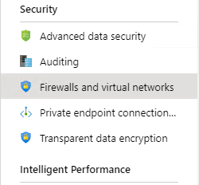    

Switch "Allow Azure services and resources to access this server" to **OFF**. During deployment, you should have added your Client IP address already, but if one of the Rules do not match your Client IP displayed (see below), select **Add Client IP**.  

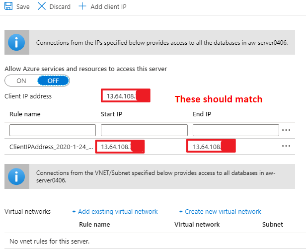  

Finally, select **Save**.  

To confirm you still have access from your Azure VM, navigate to SSMS and refresh your connection to the Azure SQL Database logical server. If no errors occur, you have successfully configured access to your Azure SQL Database logical server for your IP address only.    

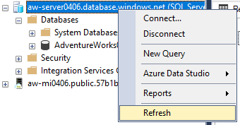  

**Step 2 - Create and manage firewall rules with the Azure Cloud Shell**  

You can also use commands `az sql server firewall-rule` to create, delete, and view server-level firewall rules. You can use the Azure CLI through the command-line of your Azure VM or through a PowerShell notebook. For this step, you'll experiment with the Azure Cloud Shell.  

Return to the Azure portal in your Azure VM. In the top bar, select the Azure Cloud Shell button.  

  

If this is your first time using the Azure Cloud Shell, you will be prompted to select a subscription to create a storage account and Microsoft Azure Files share. For this workshop, you can just use any of the storage accounts that are in your resource group already. More information about the Azure Cloud Shell can be found in the [documentation](https://docs.microsoft.com/en-us/azure/cloud-shell/overview).    

Then, you can select Bash or PowerShell. Select **Bash**. You should see a view similar to below.  

  

Next, run `az account list` to find the name of the subscription you are using for the workshop.  

Then, run `az account set --subscription 'my-subscription-name'` to set the default subscription for this Azure Cloud Shell session. You can confirm this worked by running `az account show`.  

Now that you're set up, you can list your server's firewall settings with the following command:  

```bash
az sql server firewall-rule list -g <ResourceGroup> -s <Server>
```
Your client IP address rule should match what you saw in the previous step using the Azure portal.  

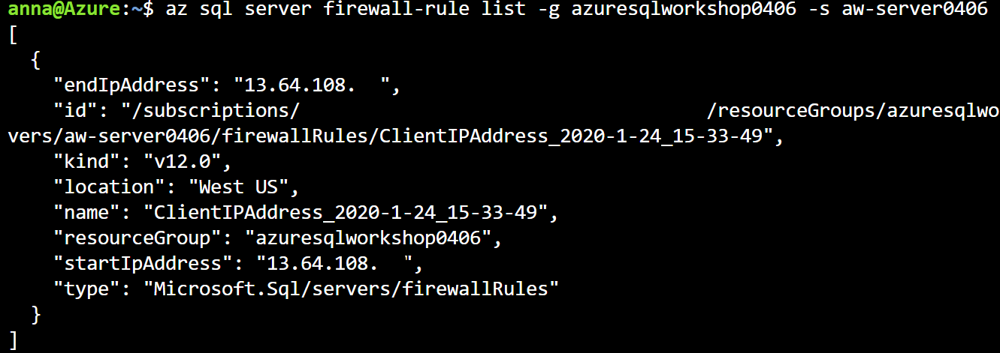

There are other commands available for creating, deleting, and updating rules, which you can explore [here](https://docs.microsoft.com/en-us/cli/azure/sql/server/firewall-rule?view=azure-cli-latest).  

Note that this method of setting the firewall rules (using the Azure portal or Azure Cloud Shell) grants your client IP address access to all of the databases that are in that logical server. After you've configured the server-level firewall rule, which you did above, you can optionally configure database-level firewall rules that apply to individual databases. This can only be done with T-SQL, using the command `EXECUTE sp_set_database_firewall_rule`. For more information, see the references in the **Description** of this activity.  

**Step 3 - Create a vNet rule using the Azure portal**   

You've now seen how to update firewall rules for specific IP addresses or ranges of IP addresses. However, VMs in Azure have dynamic IP addresses (they change). You can set up static IP addresses, but even this can be difficult to maintain. You can, alternatively, use virtual network (vNet) rules to manage access from specific subnet(s) that contain your VMs or other services. Let's see how.  

In the Azure portal, navigate to your Azure SQL Database logical server (e.g. `aw-server0406`). In the left-hand menu, under Security, select **Firewalls and virtual networks**. This is where you added your Client IP address and turned "Allow Azure services and resources access to this server" to **OFF**. You can also manage access to vNets from here.  

At the bottom, select **+ Add existing virtual network**. For the options, input the following:  
* Name: **VmVnet**
* Subscription: *Select the subscription you're using for this workshop*  
* Virtual network: **azuresqlworkshop`ID`-vnet** (replacing `ID` with your ID for the workshop and other resources)  
* Subnet name / Address prefix : *Default is fine*  

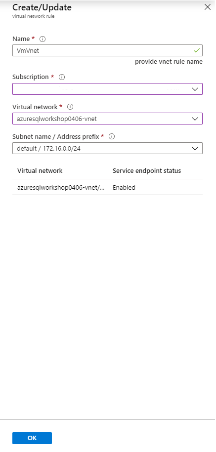  

Select **OK**.  

Next, remove your Client IP address by selecting the **...** next to the End IP and select **Delete**.  

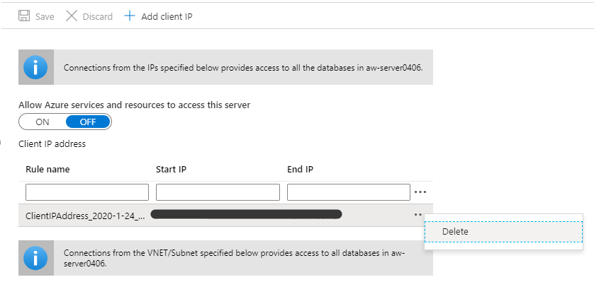  

Finally, select **Save** to apply your changes.  

  

To confirm you still have access from your Azure VM, navigate to SSMS and refresh your connection to the Azure SQL Database logical server.  

  

If no errors occur, you have successfully configured access to your Azure SQL Database logical server from resources in your vNet, which can simplify the challenge of configuring access to all the IP addresses (static and dynamic) that need to access the data. You can now specify one or multiple subnets within a virtual network or networks, encompassing all of the resources within.        


<p style="border-bottom: 1px solid lightgrey;"></p>

<h2><a name="3.2">3.2 Access management and Authorization</h2></a>

TODO: Put in text here that talks about the process to access management with Azure SQL comparing this to SQL Server  

TODO: I think we should also cover RBAC scenarios. For example, who has the authority to create databases, servers, MI, etc.  
Security best practices related to RBAC: https://docs.microsoft.com/en-us/azure/security/fundamentals/database-best-practices#protect-your-data-by-using-encryption-and-row-level-security  
Azure RBAC roles (ctrl f for SQL) https://docs.microsoft.com/en-us/azure/role-based-access-control/built-in-roles  
Config of Azure AD: https://docs.microsoft.com/en-us/azure/security/fundamentals/database-best-practices#enable-database-authentication


<p><a name="3"><b>Activity 3</a>: Getting started with Azure AD authentication</b></p>

In this activity, you'll learn how to configure an Azure AD administrator on a server level for Azure SQL Database. Next, you'll change your connection in SSMS from SQL authentication to Azure AD authentication, and you'll see how to grant other Azure AD users access to the database like normal users in SQL Server.  
  

<p><b>Steps</b></p>

**Step 1 - Create an Azure AD admin**  

In the Azure portal, navigate to your Azure SQL Database logical server. In the left-hand task menu, select **Active Directory Admin** and **Set Admin**.  

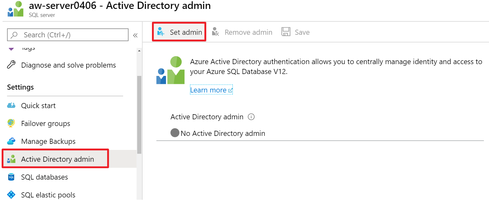  

Search for you account. Easiest way is to type in your full email address. Click your user and then choose **Select**.  

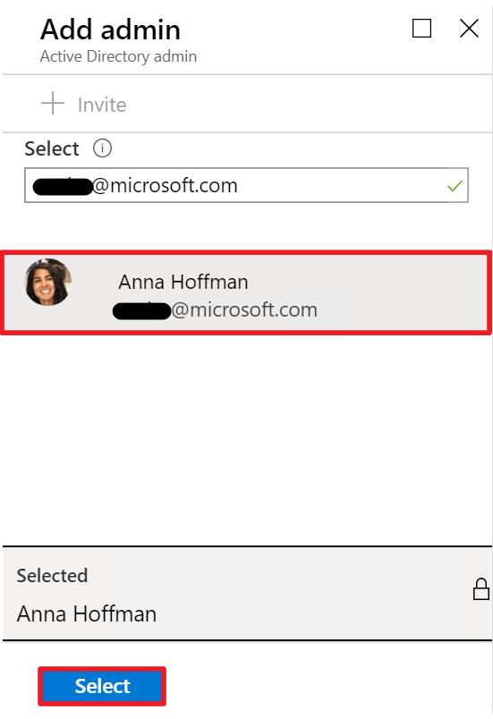  

You might think that's it, but you still have to select **Save** to confirm your actions.  

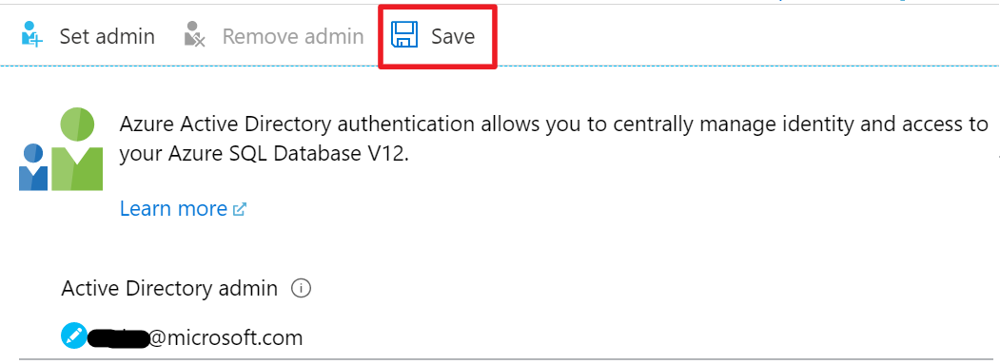  


**Step 2 - Authenticate using Azure AD**  

Now that you've configured access for yourself to your Azure SQL Database logical server, let's update the connection in SSMS and ADS.  

First, in SSMS, right click on you Azure SQL Database logical server and select **Connect**.  

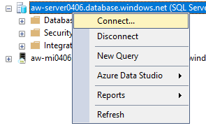  

Notice that under *Authentication*, there are several different Azure Active Directory authentication methods, which will depend on how your organization is set up. For this workshop, select **Azure Active Directory - Password**.  

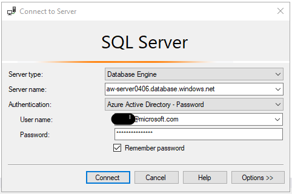  

> Note: If you get the following error, this indicates your organization requires you to select **Azure Active Directory - Universal with MFA**. Connect accordingly.  
>
> 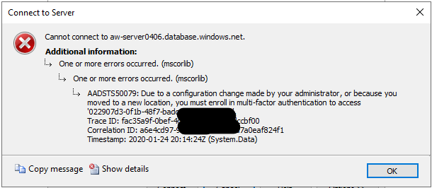

Next to the server name, you should now be able to see that you are authenticated using your Azure AD account and not the `cloudadmin` SQL user as before.  

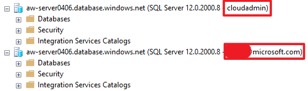  

**Step 3 - Grant other users access (SQL)**  

Now that you're authenticated using Azure AD, your next step might be to add other users. Just as in SQL Server, you can add new logins and users. In SSMS, using your Azure AD connection, right-click on your database and create a new query. Run the following.

> Note: You must right-click on the **database** within your Azure SQL Database logical server. In SQL Server and Azure SQL managed instance, you can query at the server level and use `USE DatabaseName`, but in Azure SQL Database, you must query the database directly, the `USE` statement is not supported. 

```sql
-- Create a new SQL login and give them a password
CREATE LOGIN ApplicationUser WITH PASSWORD = 'YourStrongPassword1';

-- Create a new SQL user from that login
CREATE USER ApplicationUser FOR LOGIN ApplicationUser;

-- Until you run the following two lines, ApplicationUser has no access to read or write data
ALTER ROLE db_datareader ADD MEMBER ApplicationUser;
ALTER ROLE db_datawriter ADD MEMBER ApplicationUser;
```

As you likely already know, the best practice is to create non-admin accounts at the database level, unless they need to be able to execute administrator tasks.  


**Step 4 - Grant other users access (Azure AD)**   

Azure AD authentication is a little different. From the documentation, "*Azure Active Directory authentication requires that database users are created as contained. A contained database user maps to an identity in the Azure AD directory associated with the database and has no login in the master database. The Azure AD identity can either be for an individual user or a group*."  

Additionally, the Azure portal can only be used to create administrators, and Azure RBAC roles don't propagate to Azure SQL Database logical servers, Azure SQL Databases, or Azure SQL Managed Instances. Additional server/database permissions must be granted using T-SQL.  

How you complete this next step will depend on how you are consuming this workshop. If you were given an environment, find a neighbor to work with. If you are doing this self-paced, or in a group that is multi-organization, you will just review this step, observing the screenshots.  

1. With your neighbor, first determine who will be *Person A* and who will be *Person B*.  
2. Both *Person A* and *Person B* should note their Azure VM's **Public IP Address** (can locate this in the Azure portal)
3. *Person A* should run the following T-SQL to authorize *Person B* to their server:  
```sql
-- Create the Azure AD user with access to the server
CREATE USER <Person B Azure AD account> FROM EXTERNAL PROVIDER;

-- Until you run the following two lines, the user has no access to read or write data
ALTER ROLE db_datareader ADD MEMBER <Person B Azure AD account>;

-- Create firewall to allow Person B's Azure VM
EXECUTE sp_set_firewall_rule @name = N'AllowPersonB',
    @start_ip_address = 'Person B VM Public IP', 
    @end_ip_address = 'Person B VM Public IP'
```
4. *Person B* should run the following T-SQL to authorize *Person A* to their server:
```sql
-- Create the Azure AD user with access to the server
CREATE USER <Person A Azure AD account> FROM EXTERNAL PROVIDER;

-- Until you run the following two lines, the user has no access to read or write data
ALTER ROLE db_datareader ADD MEMBER <Person A Azure AD account>;

-- Create firewall to allow Person A's Azure VM
EXECUTE sp_set_firewall_rule @name = N'AllowPersonA',
    @start_ip_address = 'Person A VM Public IP', 
    @end_ip_address = 'Person A VM Public IP'
```
5. **Person A** should now try to connect to **Person B**'s Azure SQL Database logical server.  
6. **Person B** should now try to connect to **Person A**'s Azure SQL Database logical server.  
7. **Person A** should have read access but no write access on **Person B**'s database. Similarly, **Person B** should have read access but no write access on **Person A**'s database. Each person should try the following commands on each database:  
```sql
-- Example of a read command
SELECT *
  FROM [SalesLT].[ProductCategory];

-- Example of a write command
UPDATE [SalesLT].[ProductCategory]
    SET ModifiedDate = GETDATE()
    WHERE ProductCategoryID = 1;
```  
8. Compare results.  

If you were not able to complete this exercise for whatever reason, some screenshots below are included. Note that "a" represents **Person A** and "b" represents **Person B** in this example.  


TODO Add screenshots and test with Bob.  

<p style="border-bottom: 1px solid lightgrey;"></p>

<h2><a name="3.3">3.3 Information protection and encryption</h2></a>

TODO: Put in text here that talks about the process to protect information/encryption with Azure SQL comparing this to SQL Server


<p><a name="4"><b>Activity 4</a>: Confirm TDE is enabled</b></p>

This is a quick activity to show you how easily you can confirm that TDE is enabled, or you can enable it if it is not.  

<p><b>Steps</b></p>

In the Azure portal, navigate to your Azure SQL Database, and in the left-hand menu, under Security, select **Transparent data encryption**. Confirm your database is set to **ON**.  

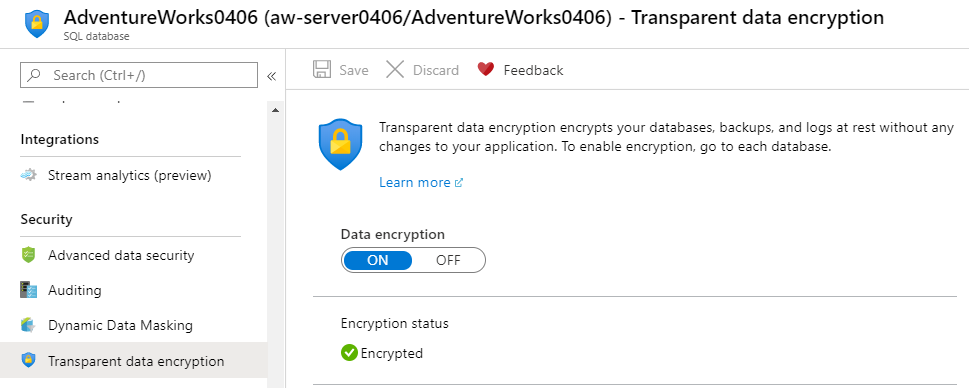  

Next, navigate to your Azure SQL Database logical server, and in the left-hand menu, under Security, select **Transparent data encryption**. Notice that you have a different view:  

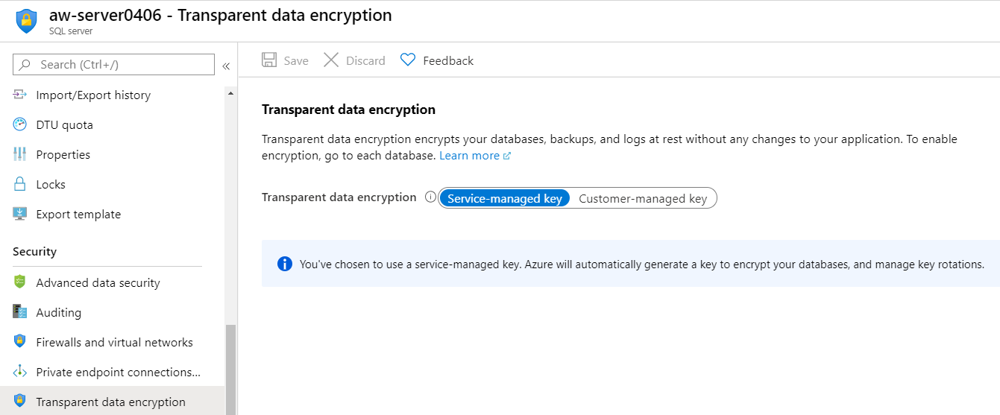  

The default is to let the Azure service manage your key. As it says, Azure will automatically generate a key to encrypt your databases, and manage the key rotations. You've seen how to do this with the Azure portal, but you can also use PowerShell, Azure CLI, T-SQL, or REST APIs. For more details, [refer here](https://docs.microsoft.com/en-us/azure/sql-database/transparent-data-encryption-azure-sql?tabs=azure-portal).  

You can, alternatively, bring your own key (BYOK) leveraging Azure key vault. In this scenario, you (not Azure) are responsible for and in full control of a key lifecycle management (key creation, rotation, deletion), key usage permissions, and auditing of operations on keys. For more information regarding Azure SQL TDE with BYOK, please [refer here](https://docs.microsoft.com/en-us/azure/sql-database/transparent-data-encryption-byok-azure-sql?view=sql-server-ver15).  

<p style="border-bottom: 1px solid lightgrey;"></p>

<h2><a name="3.4">3.4 Security management</h2></a>

TODO: Put in text here that talks about the process for security management with Azure SQL comparing this to SQL Server


TODO: Topic Description CONTD

<p><a name="5"><b>Activity 5</a>: Advanced Data Security</b></p>

Advanced data security (ADS) is a unified package for advanced SQL security capabilities, providing a single go-to location for enabling and managing three main capabilities:  
* [Data discovery & classification](https://docs.microsoft.com/en-us/azure/sql-database/sql-database-data-discovery-and-classification)  
* [Vulnerability assessment](https://docs.microsoft.com/en-us/azure/sql-database/sql-vulnerability-assessment)  
* [Advanced Threat Protection](https://docs.microsoft.com/en-us/azure/sql-database/sql-database-threat-detection-overview)  

In this activity, you'll enable ADS and explore some of the features within each of the capabilities mentioned above.  


<p><b>Steps</b></p>

**Step 1 - Enable ADS**  

In the Azure portal, navigate to your Azure SQL Database logical server. Then, in the left-hand menu, under Security, select **Advanced data security**. If you followed the deployment activity in Module 2, ADS should already be enabled. If it is not, select **ON** and select **Save**.

  


**Step 2 - ADS server level settings**  

In this step, you'll review the selections you've made for your Azure SQL Database logical server. In the same pane as step 1 (Azure SQL Database logical server > Security > Advanced data security), you will also see information regarding Vulnerability Assessments and Advanced Threat Protection.  

At the highest level, SQL Vulnerability Assessment (VA) is a scanning service that provide visibility into your security state. It then provides actionable steps to address any potential concerns. When you configure periodic recurring scans, you're enabling the service to scan your databases every seven days and check for any vulnerabilities. You can then choose to send those reports to the admins, subscription owners, or anyone else that might need to be made notified of changes. In order for this service to operate, you have to specify a storage account for the results to be stored. This storage account was deployed during deployment of your Azure SQL Database, as you opted in to turn on ADS. Review the options and add your email address if you want to view a recurring scan.  

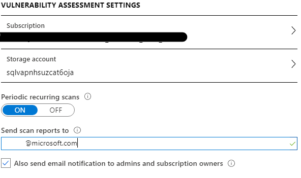  

Lastly, you can configure your Advanced Threat Protection (ATP) settings. ATP enables you to detect and respond to potential threats as they occur by providing security alerts on anomalous activities. To check the ATP alert types available, select **All** under Advanced Threat Protection types.  

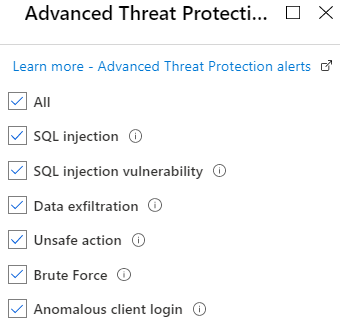  

Just like you can configure who receives the VA scans, you can configure who receives the ATP alerts. Review the options and add your email address if you want to be alerted (recommended for future lab).  

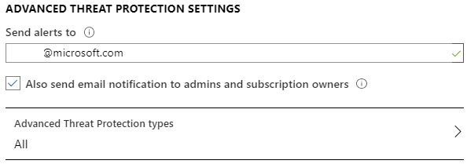  

Once you've updated all your settings, don't forget to select **Save**.  

  

Setting these settings up will enable you to complete some of the other steps in this activity, so you'll see more of VA and ATP soon.  

**Step 3 - Data Discovery & Classification**  

Navigate back to your Azure SQL Database (not the logical server!). In the left-hand menu, under Security, Select **Advanced data security**. 

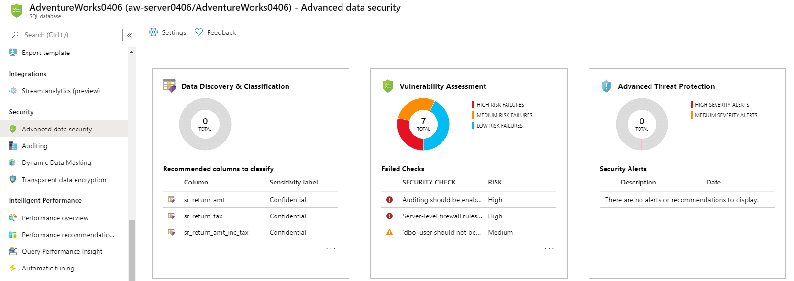   

First, you'll review Data Discovery & Classification (DD&C). Select the **Data Discovery & Classification** box. This wizard type of view is similar (but not exactly matching) to the Data Discovery & Classification tool that exists in SQL Server today through SSMS. Using the SSMS wizard is **not supported** for Azure SQL, but you can achieve similar functionality here.    

Select the information bar that says **We have found XX columns with classification recommendations**.  

  

DD&C tries to identify potential sensitive data based on the column names in your tables. Review some of the suggested labels and then select **Select all** and **Accept selected recommendations**.  

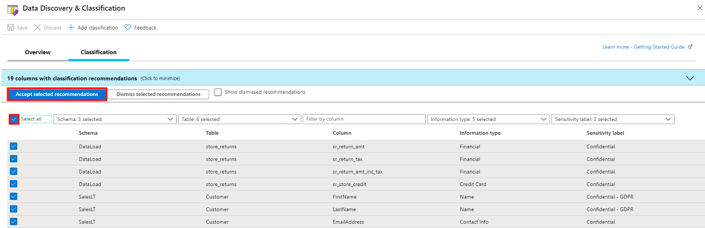  

Then, select **Save** near the top left corner.

  

Finally, select **Overview** to view the overview dashboard and review the classifications you've added.  

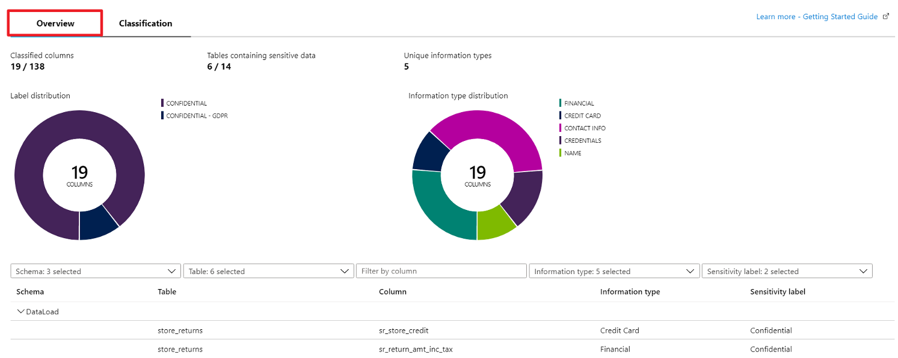  

**Step 4 - Vulnerability Assessment**  

Select the **X** in the top right corner of DD&C to bring you back to the ADS dashboard. Next, you'll review the Vulnerability Assessment (VA) capabilities. Start by selecting the **Vulnerability Assessment** box.  

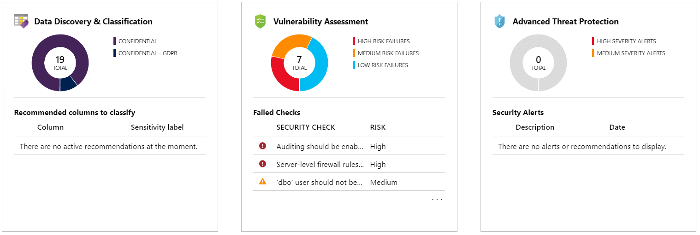  

Next, select **Scan** to get the most current VA results. This will take a few moments, while VA scans all the databases in your Azure SQL Database logical server.    

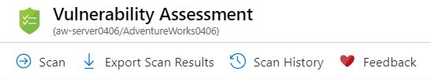  

Your resulting view should be similar to below.  

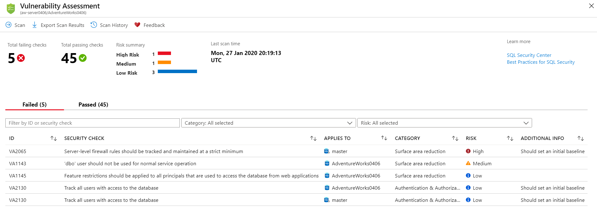  

Every security risk has a risk level (high, medium, or low) and additional information. Select the security check **VA2065** to get a detailed view, similar to below. Review the status and other available information.   

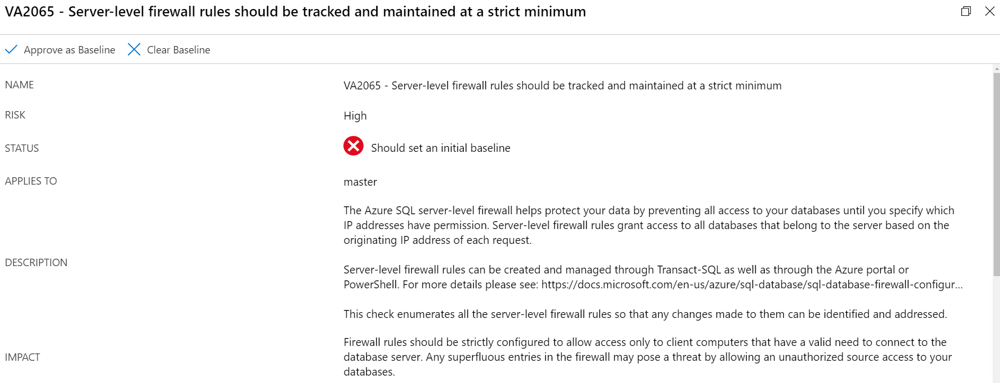  
  

In this case, VA is suggesting that you configure a baseline of your server level firewall rules. Once you have a baseline, you can then monitor and assess any changes.  

Depending on the security check, there will be alternate views and recommendations. For this security check, you can select the **Approve as Baseline** button at the top of the details page.  

You can now re-scan your logical server to confirm that you are now passing **VA2065**.  

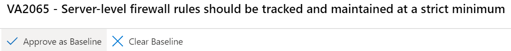  

You can then optionally complete another scan and confirm that VA2065 is now showing up as a **Passed** security check.  

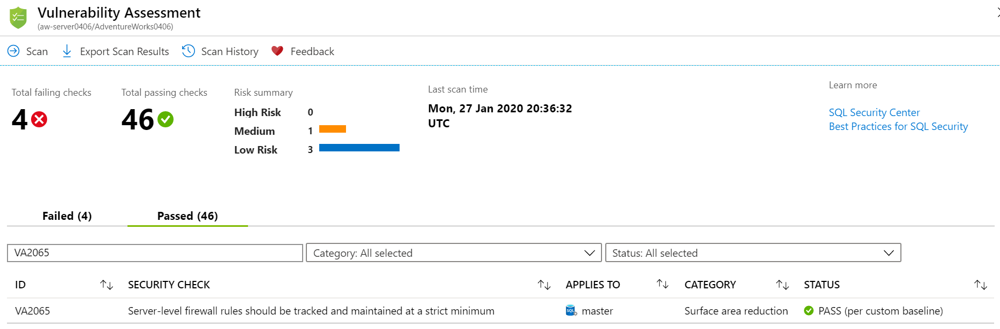  

**Step 5 - Advanced Threat Protection overview**  

Select the **X** in the top right corner of VA to get back to the ADS dashboard. Select the **Advanced Threat Protection** (ATP) box to drill in and review the results.  

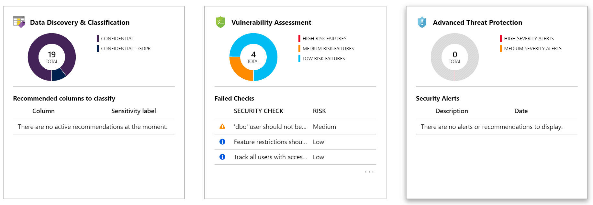  

Likely, you won't see any security alerts. In the next step, you will run a test that will trigger an alert, so you can review the results in ATP.  

**Step 6 - Testing ATP capabilities**  

TODO with help of Bob  


<p><b>(Bonus) <a name="6">Activity 6</a>: Data classification, Dynamic data masking, and SQL Audit</b></p>

In this activity, you will learn how to audit users trying to view columns that were marked for data classification. This activity will combine several of the things you've already learned about in the module, and take those learnings to the next level.    

<p><b>Steps</b></p>

**Step 1 - Add new data classification manually**  

In the Azure portal, navigate to your Azure SQL Database (not logical server!). In the left-hand menu, under Security, select **Advanced data security** and then select the **Data Discovery & Classification** box.  

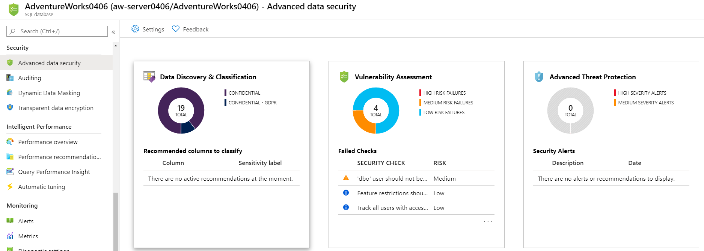  

Next, select the **Classification** tab and then select **+ Add classification**.  

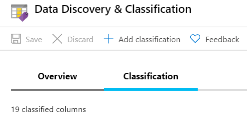  

In a previous activity, you added all the recommended column classifications. In this step, you will *manually* add a potentially sensitive column to the list of classified columns.  

In the SalesLT Customer table, DD&C identified FirstName and LastName to be classified, but not MiddleName. Using the drop-downs, add it now. Then, select **Add classification**.  

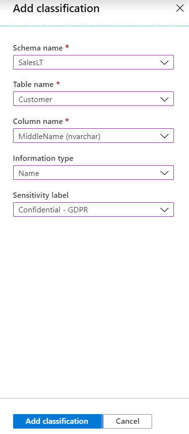  

Select **Save**.  

  

You can confirm that this was successful by viewing the **Overview** tab and confirming that MiddleName is now present in the list of classified columns under the SalesLT schema.  

**Step 2 - Apply Dynamic Data Masking over the Name columns**  

Dynamic Data Masking (DDM) is something available in Azure SQL as well as in SQL Server. It limits data exposure by masking sensitive data to non-privileged users. Azure SQL will recommend things for you to mask, or you can add masks manually. You'll mask the FirstName, MiddleName, and LastName columns which you reviewed in the previous step.  

In the Azure portal, navigate to your Azure SQL Database. In the left-hand menu, under Security, select **Dynamic Data Masking** and then select **+ Add mask**.  

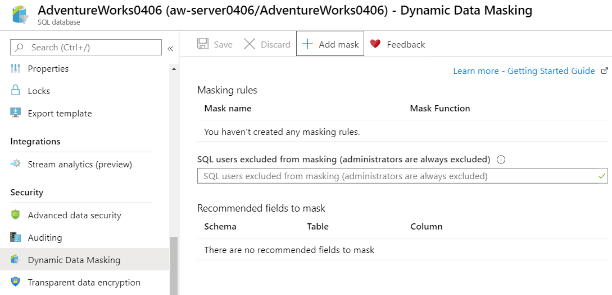   

First, select the **SalesLT** schema, **Customer** table, and **FirstName** column. Then, you can review the options for masking, but the default is good for this scenario. Select **Add** to add the masking rule.    

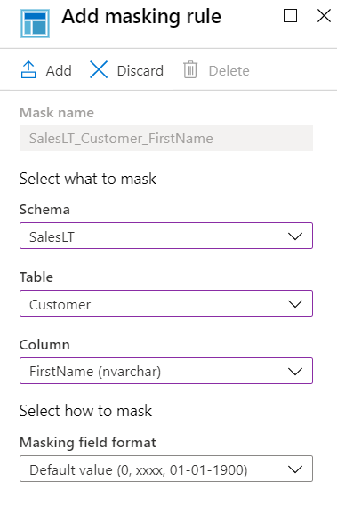   

Repeat this for both **MiddleName** and **LastName** in that table.  

After, you should have three masking rules, similar to below.  

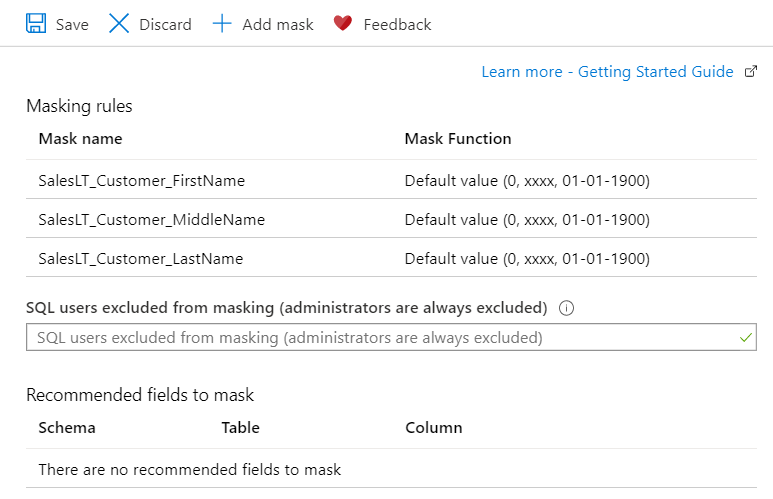   

Select **Save**.  

   

**Step 3 - Query classified and masked columns**  

Now, navigate to SSMS and create a new query in your AdventureWorks database.  

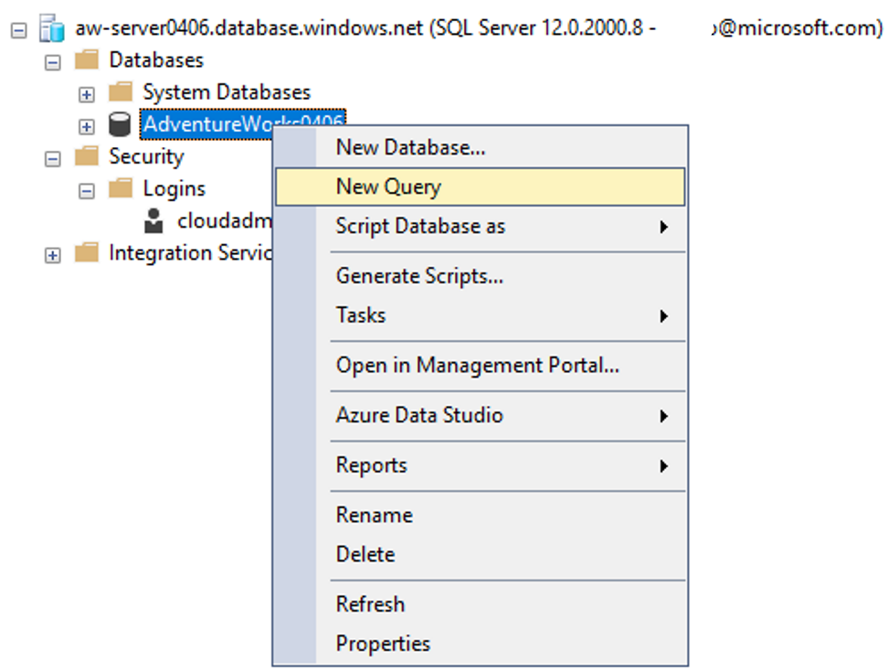   

> Note: You should be connected to this logical server using Azure AD authentication. If you are connected as `cloudadmin`, create a new connection and connect using Azure AD authentication.  

Now, run the following query to return the classified (and in some cases masked) data.  
```sql
SELECT TOP 10 FirstName, MiddleName, LastName
FROM SalesLT.Customer
```
You should get a result of the first ten names, with no masking applied. Why? Because you are the admin for this Azure SQL Database logical server.  

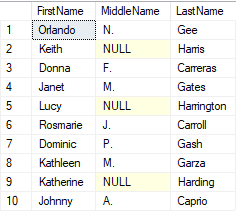   

Now, run the following query to create a new user and run the previous query as that user. You may notice the first few commands, they are a repeat from Activity 2, Step 3.  
```sql
-- Create a new SQL user and give them a password
CREATE USER Bob WITH PASSWORD = 'gocowboys1!';

-- Until you run the following two lines, Bob has no access to read or write data
ALTER ROLE db_datareader ADD MEMBER Bob;
ALTER ROLE db_datawriter ADD MEMBER Bob;

-- Execute as our new, low-privilege user, Bob
EXECUTE AS USER = 'Bob';
SELECT TOP 10 FirstName, MiddleName, LastName
FROM SalesLT.Customer;
REVERT;
```

Now, you should get a result of the first ten names, but masking applied. Bob has not been granted access to the unmasked form of this data.  

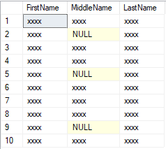   

**Step 4 - Add excluded users from masking**  

What if, for some reason, Bob needs access to the names and gets permission to have it?  

You can update excluded users from masking in the Azure portal (in the Dynamic Data Masking pane under Security), but you can also do it using T-SQL. Use the query below to allow Bob to query the names results without masking.  

```sql
GRANT UNMASK TO Bob;  
EXECUTE AS USER = 'Bob';
SELECT TOP 10 FirstName, MiddleName, LastName
FROM SalesLT.Customer;
REVERT;   
```
Your results should include the names in full.  
   

Finally, you can also take away a user's unmasking privileges, and confirm that with the following T-SQL.  
```sql
-- Remove unmasking privilege
REVOKE UNMASK TO Bob;  

-- Execute as Bob
EXECUTE AS USER = 'Bob';
SELECT TOP 10 FirstName, MiddleName, LastName
FROM SalesLT.Customer;
REVERT;   
```
Your results should include the masked names.  
   

**Step 5 - Analyze audit logs from Azure Blob storage with SSMS**  

As an admin, you may want to review and audit who is accessing the databases and specifically the classified data. Next, you'll take a look at the audit files that are being sent to Azure Blob storage. The first thing you have to do is merge the audit files, in case logs span multiple files. You can do this from SSMS. First, select **File** > **Open** > **Merge Audit Files**.  

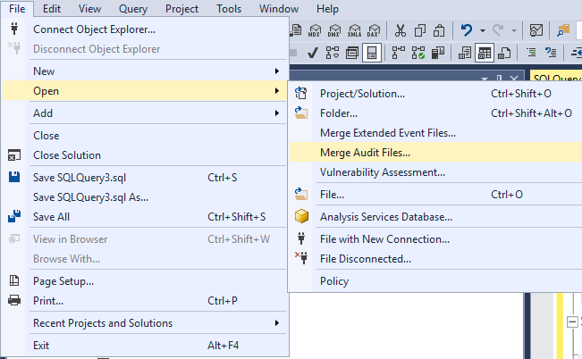   

Next, select **Add**.  

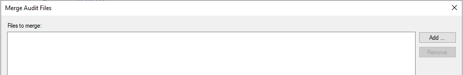   

Specify to add then from Azure Blob storage and select **Connect**.  

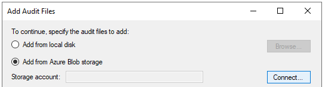   

Now sign into Azure with the account you are using for this workshop.  

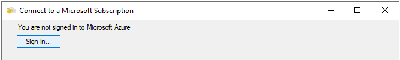  

Select the subscription, storage account, and blob container you configured Audit logs to go to (refer to your selection in the Azure portal under your Azure SQL Database logical server's Auditing blade). The container will be called `sqldbauditlogs`.  

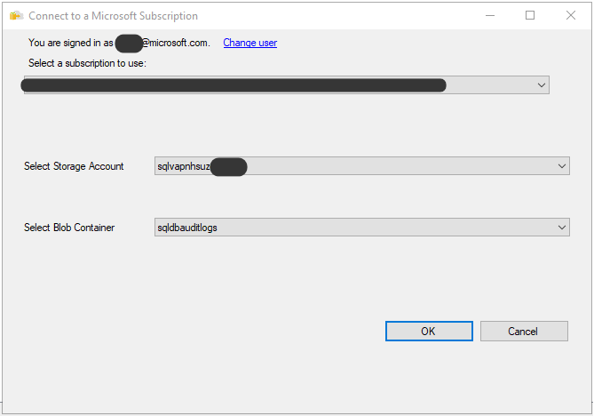  

Select your Azure SQL Database logical server and your AdventureWorks database. It should take everything from the day up until the second you select the Database name. Select **OK**.  

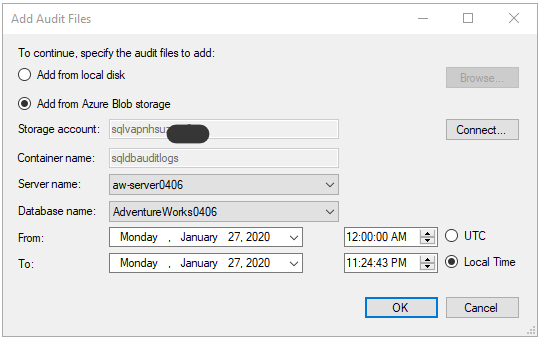  

The confirmation window lets you know how many files are being downloaded and merged. Select **OK**.  

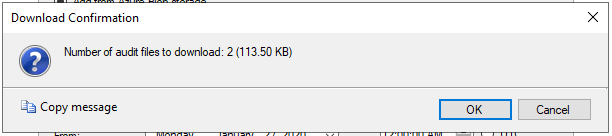  

Review the files and select **OK** one last time.  

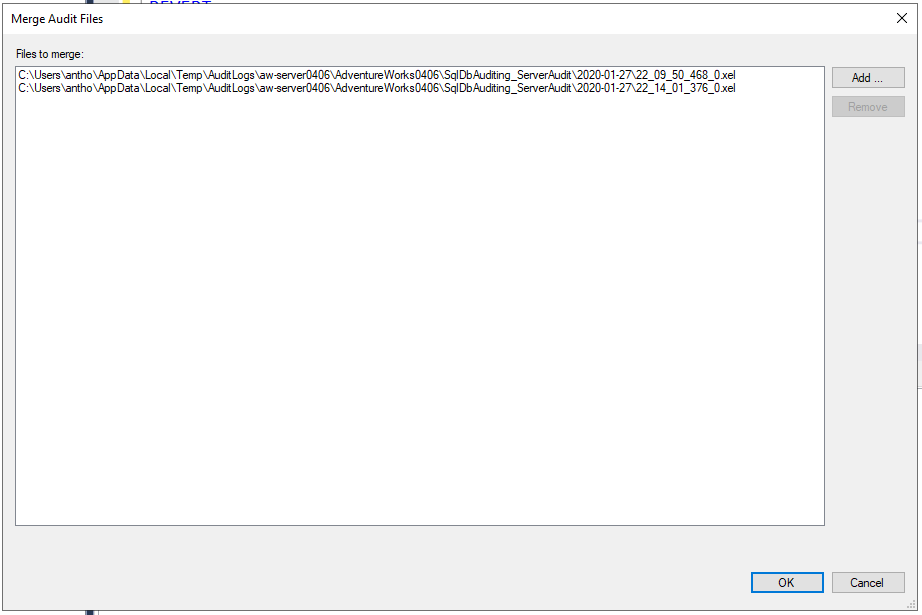  

You should now be able to see all the audit logs. Look for where you were testing with masking with Bob. You can select the statement, and then use the detail pane below to review the information. For example, for one of the queries where Bob tries to view classified data, under the `data_sensitivity_information` field, you can see the data that is classified. For more information on the naming conventions in audit logs, [see here](https://docs.microsoft.com/en-us/azure/sql-database/sql-database-audit-log-format).    

This merged file can then be exported to an XEL or CSV file (or to a table) for additional analysis. You can also query the [Extended Events files using PowerShell](https://sqlscope.wordpress.com/reading-extended-event-files-using-client-side-tools-only/). 

**Step 6 - Analyze audit logs with Log Analytics**  

Analyzing your audit logs will depend on your preference, and the method in Step 5 may be more familiar. In this step, you'll be exposed to querying security logs in the Azure portal with Log Analytics.   

In the Azure portal, navigate to your Azure SQL Database. In the left-hand menu, under Security, select **Auditing**. Then select **View audit logs**.  

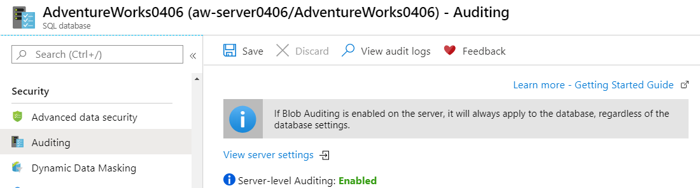  

You should now be able to see a query of your event records, options to run in Query Editor (run T-SQL queries through the portal), options for Log Analytics/View dashboard, and more.  

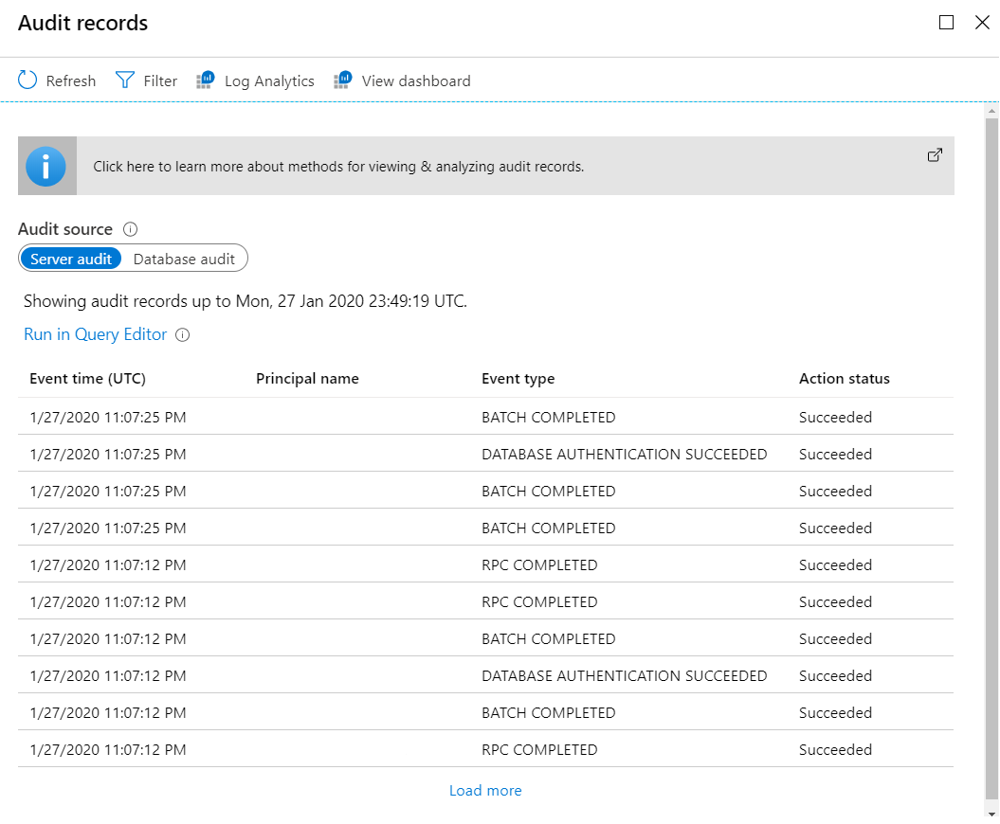  

Feel free to click around and understand what some of the options are.  

Then, click on **Log Analytics**. This takes you to a query editor but it is not T-SQL. This view allows you to query logs using Kusto query language or KQL, which is meant to be easy to use and understand by SQL professionals. For the KQL documentation, [refer here](https://docs.microsoft.com/en-us/azure/kusto/query/).  

The default query is querying the category `SQLSecurityAuditEvents`, so while you might use this category now to view security related incidents, this tool can also be used for querying other Azure logs and categories in [Azure Monitor](https://docs.microsoft.com/en-us/azure/azure-monitor/log-query/log-query-overview).  

  

This workshop won't go deep into KQL querying of logs, but there are many resources in the references above if you want more practice later.  

**Step 7 - Analyze audit logs and monitor security with the Log Analytics SQL Security dashboard**  

In this step, you'll see how SQL Security has built a dashboard based on Log Analytics for you to monitor and audit the logs and other SQL activity. To get back to Audit records, select the **X** in the top right corner of the Log Analytics query window.  

Then, select **View dashboard**.  

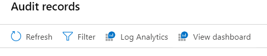  

You should now see an overview dashboard. Drill in to **Azure SQL - Access to Sensitive Data**.  

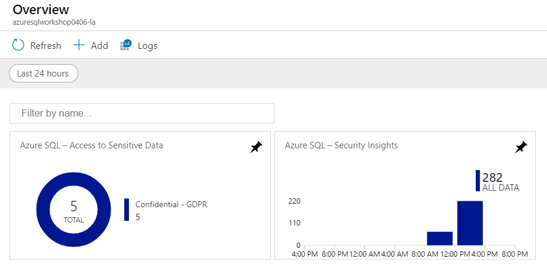  

You can use this drill down to find out:  
1. How many queries are accessing sensitive data
1. Which types and sensitivities of are being accessed
1. Which principals are accessing sensitive data
1. Which IPs are accessing sensitive data  

Review what's available here, and how you can audit usage with this tool.  

When you're done, select the **X** in the top right corner of the **Azure SQL - Access to Sensitive Data** tab.  

Back in the overview, select **Azure SQL - Security Insights**.  

  

This dashboard gives more auditing information to help you understand database activity, and gain insight into anomalies. Spend a few minutes reviewing the options here.  

> Looking for another bonus security activity? Try this tutorial: [Always Encrypted: Protect sensitive data and store encryption keys in Azure Key Vault](https://docs.microsoft.com/en-us/azure/sql-database/sql-database-always-encrypted-azure-key-vault?tabs=azure-powershell). You will need VS for this, you can download [Visual Studio Community for free here](https://visualstudio.microsoft.com/downloads/).   

In this module and throughout the activities, you got to get hands-on with many security features that are available for Azure SQL. In the next module, you'll take a look at how performance is different in Azure, and you'll see how you can optimize it in Azure SQL.  

<p style="border-bottom: 1px solid lightgrey;"></p>

<p><b>For Further Study</b></p>
<ul>
    <li><a href="https://docs.microsoft.com/en-us/azure/sql-database/sql-database-security-overview" target="_blank">Azure SQL Security Documentation</a></li>
    <li><a href="https://docs.microsoft.com/en-us/azure/sql-database/sql-database-security-best-practice" target="_blank">Azure SQL Security Best Practices Playbook</a></li>
    <li><a href="https://docs.microsoft.com/en-us/azure/sql-database/sql-database-managed-instance-aad-security-tutorial" target="_blank">Configure security for Azure SQL Managed Instance</a></li>
    <li><a href="https://docs.microsoft.com/en-us/azure/sql-database/sql-database-security-tutorial" target="_blank">Configure security for Azure SQL Database</a></li>
</ul>

<p><b >Next Steps</b></p>

Next, Continue to <a href="https://github.com/microsoft/sqlworkshops/blob/master/AzureSQLWorkshop/azuresqlworkshop/04-Performance.md" target="_blank"><i> 04 - Performance</i></a>.