# Module 4 - Performance

#### <i>The Azure SQL Workshop</i>

<p style="border-bottom: 1px solid lightgrey;"></p>

 <h2>Overview</h2>

> You must complete the [prerequisites](../azuresqlworkshop/00-Prerequisites.md) before completing these activities. You can also choose to audit the materials if you cannot complete the prerequisites. If you were provided an environment to use for the workshop, then you **do not need** to complete the prerequisites.     

You’ve been responsible for getting your SQL fast, keeping it fast, and making it fast again when something is wrong. In this module, we’ll show you how to leverage your existing performance skills, processes, and tools and apply them to Azure SQL, including taking advantage of the intelligence in Azure to keep your database tuned.

In each module you'll get more references, which you should follow up on to learn more. Also watch for links within the text - click on each one to explore that topic.

(<a href="https://github.com/microsoft/sqlworkshops/blob/master/AzureSQLWorkshop/azuresqlworkshop/00-Prerequisites.md" target="_blank">Make sure you check out the <b>Prerequisites</b> page before you start</a>. You'll need all of the items loaded there before you can proceed with the workshop.)

In this module, you'll cover these topics:  
[4.1](#4.1): Azure SQL performance capabilities and Tasks<br>
[4.2](#4.2): Monitoring performance in Azure SQL<br>
&nbsp;&nbsp;&nbsp;&nbsp;&nbsp;&nbsp;[Activity 1](#1): How to monitor performance in Azure SQL Database  
[4.3](#4.3): Improving Performance in Azure SQL<br>
&nbsp;&nbsp;&nbsp;&nbsp;&nbsp;&nbsp;[Activity 2](#2): Scaling your workload performance in Azure SQL Database<br>
&nbsp;&nbsp;&nbsp;&nbsp;&nbsp;&nbsp;[Activity 3](#2): Optimizing application performance for Azure SQL Database.<br>
[4.4](#4.3): Intelligent Performance in Azure SQL<br>
&nbsp;&nbsp;&nbsp;&nbsp;&nbsp;&nbsp;[Activity 4 (BONUS)](#4): Using Automatic Tuning in Azure SQL Database

<p style="border-bottom: 1px solid lightgrey;"></p>

<h2><a name="4.1">4.1  Azure SQL performance capabilities and Tasks</h2></a>

In this section you will learn how to monitor the performance of a SQL workload using tools and techniques both familiar to the SQL Server professional along with differences with Azure SQL.

**Azure SQL Performance Capabilities**

**Monitoring and Troubleshooting Performance**

**Accelerating and Improving Performance**

<p style="border-bottom: 1px solid lightgrey;"></p>

<h2><a name="4.2">4.2 Monitoring performance in Azure SQL</h2></a>

In this section you will learn how to monitor the performance of a SQL workload using tools and techniques both familiar to the SQL Server professional along with differences with Azure SQL.

**Monitoring SQL queries**

- DMVs
- Extended Events
- Azure Portal
- Azure Monitor (TODO: Joe Sack has thoughts)

**Monitoring CPU usage**

- DMVs
- Azure Portal
- Query Store

**Monitoring Waits**

- DMVs

**Other Monitoring Methods**

Alerts
Intelligent Insights

TODO: This is in preview. Do we want to cover it? https://docs.microsoft.com/en-us/azure/sql-database/sql-database-intelligent-insights

sys.dm_exec_requests can be used to see wait types, duration, and wait resources for any active request. This DMV also works across Azure SQL. There can be some wait types that are unique to Azure SQL which can be found at XXXXXX...

Some of the more common new wait type values new to Azure SQL are:

XXXX
XXXX
XXXX

SQL Server supports **sys.dm_os_wait_stats**. Azure SQL Database supports a database specific DMV for this called **sys.dm_db_wait_stats**. sys.dm_os_waits or sys.dm_db_wait_stats can be used with Azure SQL Database Managed Instance.

- Query Store
- Azure Portal

**Monitoring Memory**

**Monitoring Transaction Log Usage**

**Monitoring I/O**

<p><a name="1"><b>Activity 1</a>: How to monitor performance in Azure SQL Database</b></p>

>**IMPORTANT**: This activity assumes you have completed all the activities in Module 2.

All scripts for this activity can be found in the **azuresqlworkshop\04-Performance\monitor_and_scale** folder.

>**NOTE:** This activity will work against an Azure SQL Database Managed Instance. However, you may need to make some changes to the scripts to increase the workload since the minimum number of vCores for Managed Instance General Purpose is 4 vCores.

In this activity, you will take a typical workload based on SQL queries and learn how to monitor performance for Azure SQL Database. You will learn how to identify a potential performance bottleneck using familiar tools and techniques to SQL Server. You will also learn differences with Azure SQL Database for performance monitoring.

Using the Azure SQL Database based on the AdventureWorksLT sample, you are given an example workload and need to observe its performance. You are told there appears to be a performance bottleneck. Your goal is to identify the possible bottleneck and identify solutions.

>**NOTE**: These scripts use the database name **AdventureWorks0406**. Anywhere this database name is used you should substitute in the name of the database you deployed in Module 2.

**Step 1: Setup to monitor Azure SQL Database**

TODO: Do we have them setup Azure Alert Monitoring. I've tried this but it seems to lag when the problem actually happens. Chatting with Joe Sack about this.

>**TIP**: To open a script file in the context of a database in SSMS, click on the database in Object Explorer and then use the File/Open menu in SSMS.

- Launch SQL Server Management Studio (SSMS) and load a query *in the context of the database you deployed in Module 2* to monitor the Dynamic Management View (DMV) **sys.dm_exec_requests** from the script **sqlrequests.sql** which looks like the following:

```sql
SELECT er.session_id, er.status, er.command, er.wait_type, er.last_wait_type, er.wait_resource, er.wait_time
FROM sys.dm_exec_requests er
INNER JOIN sys.dm_exec_sessions es
ON er.session_id = es.session_id
AND es.is_user_process = 1
```
Unlike SQL Server, the familiar DMV dm_exec_requests shows active requests for a specific Azure SQL Database vs an entire server. Azure SQL Database Managed instance will behave just like SQL Server.

In another session for SSMS *in the context of the database you deployed in Module 2* load a query to monitor a Dynamic Management View (DMV) unique to Azure SQL Database called **sys.dm_db_resource_stats** from a script called **azuresqlresourcestats.sql**

```sql
SELECT * FROM sys.dm_db_resource_stats
```

This DMV will track overall resource usage of your workload against Azure SQL Database such as CPU, I/O, and memory.

**Step 2: Run the workload and observe performance**

- Examine the workload query from the script **topcustomersales.sql**. 

This database is not large so the query to retrieve customer and their associated sales information ordered by customers with the most sales shouldn't generate a large result set. It is possible to tune this query by reducing the number of columns from the result set but these are needed for demostration purposes of this activity.


```sql
SELECT c.*, soh.OrderDate, soh.DueDate, soh.ShipDate, soh.Status, soh.ShipToAddressID, soh.BillToAddressID, soh.ShipMethod, soh.TotalDue, soh.Comment, sod.*
FROM SalesLT.Customer c
INNER JOIN SalesLT.SalesOrderHeader soh
ON c.CustomerID = soh.CustomerID
INNER JOIN SalesLT.SalesOrderDetail sod
ON soh.SalesOrderID = sod.SalesOrderID
ORDER BY sod.LineTotal desc
GO
```
- Run the workload from the command line using ostress.

Edit the script script that runs ostress **sqlworkload.cmd**:<br><br>
Substitute your Azure Database Server created in Module 2 for the **-S parameter**<br>
Substitute the login name created for the Azure SQL Database Server created in Module 2 for the **-U parameter**
Substitute the database you deployed in Module 2 for the **-d parameter**<br>
Substitute the password for the login for the Azure SQL Database Server created in Module 2 for the **-P parameter**.

This script will use 10 concurrent users running the workload query 2500 times.

>**NOTE:** If you are not seeing CPU usage behavior with this workload for your environment you can adjust the **-n parameter** for number of users and **-r parameter** for iterations.

From a powershell command prompt, change to the directory for this module activity: 

[vmusername] is the name of the user in your Windows Virtual Machine. Substitute in the path for c:\users\[vmusername] where you have cloned the GitHub repo.

<pre>
cd c:\users\[vmusername]\AzureSQLWorkshop\azuresqlworkshop\03-Performance\monitor_and_scale
</pre>

Run the workload with the following command

```Powershell
.\sqlworkload.cmd
```

Your screen at the command prompt should look similar to the following

<pre>[datetime] [ostress PID] Max threads setting: 10000
[datetime] [ostress PID] Arguments:
[datetime] [ostress PID] -S[server].database.windows.net
[datetime] [ostress PID] -isqlquery.sql
[datetime] [ostress PID] -U[user]
[datetime] [ostress PID] -dAdventureWorks0406
[datetime] [ostress PID] -P********
[datetime] [ostress PID] -n10
[datetime] [ostress PID] -r2500
[datetime] [ostress PID] -q
[datetime] [ostress PID] Using language id (LCID): 1024 [English_United States.1252] for character formatting with NLS: 0x0006020F and Defined: 0x0006020F
[datetime] [ostress PID] Default driver: SQL Server Native Client 11.0
[datetime] [ostress PID] Attempting DOD5015 removal of [directory]\sqlquery.out]
[datetime] [ostress PID] Attempting DOD5015 removal of [directory]\sqlquery_1.out]
[datetime] [ostress PID] Attempting DOD5015 removal of [directory]\sqlquery_2.out]
[datetime] [ostress PID] Attempting DOD5015 removal of [directory]\sqlquery_3.out]
[datetime] [ostress PID] Attempting DOD5015 removal of [directory]\sqlquery_4.out]
[datetime] [ostress PID] Attempting DOD5015 removal of [directory]\sqlquery_5.out]
[datetime] [ostress PID] Attempting DOD5015 removal of [directory]\sqlquery_6.out]
[datetime] [ostress PID] Attempting DOD5015 removal of [directory]\sqlquery_7.out]
[datetime] [ostress PID] Attempting DOD5015 removal of [directory]\sqlquery_8.out]
[datetime] [ostress PID] Attempting DOD5015 removal of [directory]\sqlquery_9.out]
[datetime] [ostress PID] Starting query execution...
[datetime] [ostress PID]  BETA: Custom CLR Expression support enabled.
[datetime] [ostress PID] Creating 10 thread(s) to process queries
[datetime] [ostress PID] Worker threads created, beginning execution...</pre>

- Use the query in SSMS to monitor dm_exec_requests (**sqlrequests.sql**) to observe active requests. Run this query 5 or 6 times and observe some of the results.

You should see many of the requests have a status = RUNNABLE and last_wait_type = SOS_SCHEDULER_YIELD. One indicator of many RUNNABLE requests and many SOS_SCHEDULER_YIELD seen often is a possible lack of CPU resources for active queries.

>**NOTE:** You may see one or more active requests with a command = SELECT and a wait_type = XE_LIVE_TARGET_TVF. These are queries run by services managed by Microsoft to help power capabilities like Performance Insights using Extended Events. Microsoft does not publish the details of these Extended Event sessions.

The familiar SQL DMV dm_exec_requests can be used with Azure SQL Database but must be run in the context of a database unlike SQL Server (or Azure SQL Database Managed Instance) where dm_exec_requests shows all active requests across the server instance.

- Run the query in SSMS to monitor dm_db_resource_stats (**azuresqlresourcestats.sql**). Run the query to see the results of this DMV 3 or 4 times.

This DMV records of snapshot of resource usage for the database every 15 seconds (kept for 1 hour).  You should see the column **avg_cpu_percent** close to 100% for several of the snapshots. (at least in the high 90% range). This is a symptom of a workload pushing the limits of CPU resources for the database. You can read more details about this DMV at https://docs.microsoft.com/en-us/sql/relational-databases/system-dynamic-management-views/sys-dm-db-resource-stats-azure-sql-database?view=azuresqldb-current. This DMV also works with Azure SQL Database Managed Instance.

For a SQL Server on-premises environment you would typically use a tool specific to the Operating System like Windows Performance Monitor to track overall resource usage such a CPU. If you ran this example on a on-premises SQL Server or SQL Server in a Virtual Machine with 2 CPUs you would see near 100% CPU utilization on the server.

>**NOTE**: Another DMV called, **sys.resource_stats**, can be run in the context of the master database of the Azure Database Server to see resource usage for all Azure SQL Database databases associated with the server. This view is less granular and shows resource usage every 5 minutes (kept for 14 days).

- Let the workload complete and take note of its overall duration. When the workload completes you should see results like the following and a return to the command prompt

<pre>[datetime] [ostress PID] Total IO waits: 0, Total IO wait time: 0 (ms)
[datetime] [ostress PID] OSTRESS exiting normally, elapsed time: 00:01:22.637</pre>

Your duration time may vary but this typically takes at least 1-2 minutes.

**Step 3: Use Query Store to do further performance analysis**

Query Store is a capability in SQL Server to track performance execution of queries. Performance data is stored in the user database. You can read more about Query Store at https://docs.microsoft.com/en-us/sql/relational-databases/performance/monitoring-performance-by-using-the-query-store?view=sql-server-ver15.

Query Store is not enabled by default for databases created in SQL Server but is on by default for Azure SQL Database (and Azure SQL Database Managed Instance). You can read more about Query Store and Azure SQL Database at https://docs.microsoft.com/en-us/azure/sql-database/sql-database-operate-query-store.

Query Store comes with a series of system catalog views to view performance data. SQL Server Management Studio (SSMS) provides reports using these system views.

- Look at queries consuming the most resource usage using SSMS.

Using the Object Explorer in SSMS, open the Query Store Folder to find the report for **Top Resource Consuming Queries**<br>


Select the report to find out what queries have consumed the most avg resources and execution details of those queries. Based on the workload run to this point, your report should look something like the following:<br>


The query shown is the SQL query from the workload for customer sales. This report has 3 components: Queries with the high total duration (you can change the metric), the associated query plan and runtime statistics, and the associated query plan in a visual map.

If you click on the bar chart for the query (the query_id may be different for your system), your results should look like the following:<br>

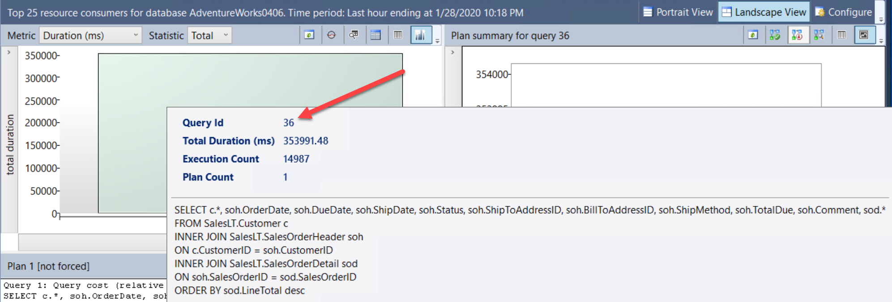

You can see the total duration of the query and query text.

Right of this bar chart is a chart for statistics for the query plan associated with the query. Hover over the dot associated with the plan. Your results should look like the following:<br>

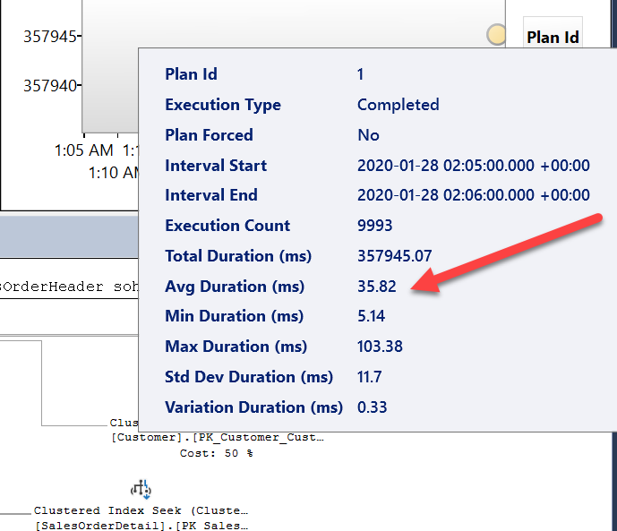

Note the average duration of the query. Your times may vary but the key will be to compare this average duration to the average wait time for this query and eventually the average duration when we introduce a performance improvement.

The final component is the visual query plan. The query plan for this query looks like the following:<br>

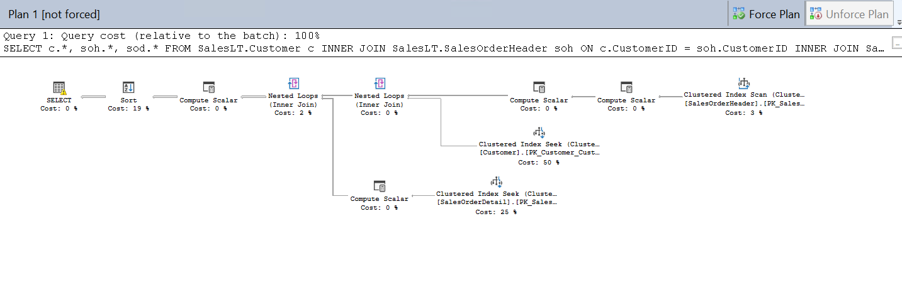

Given the small nature of rows in the tables in this database, this query plan is not inefficient. There could be some tuning opportunities but not much performance will be gained by tuning the query itself.

- Observe waits to see if they are affecting performance.

We know from earlier diagnostics that a high number of requests constantly were in a RUNNABLE status along with almost 100% CPU. Query Store comes with reports to look at possible performance bottlenecks to due waits on resources.

Below the Top Resource Consuming Queries report in SSMS is a report called Query Wait Statistics. Click on this report and hover over the bar chart. Your results should look like the following:<br>


You can see the top wait category is CPU and the average wait time. Furthermore, the top query waiting for CPU is the query from the workload we are using.

Click on the bar chart for CPU to see more about query wait details. Hover over the bar chart for the query. Your results should look like the following:<br>

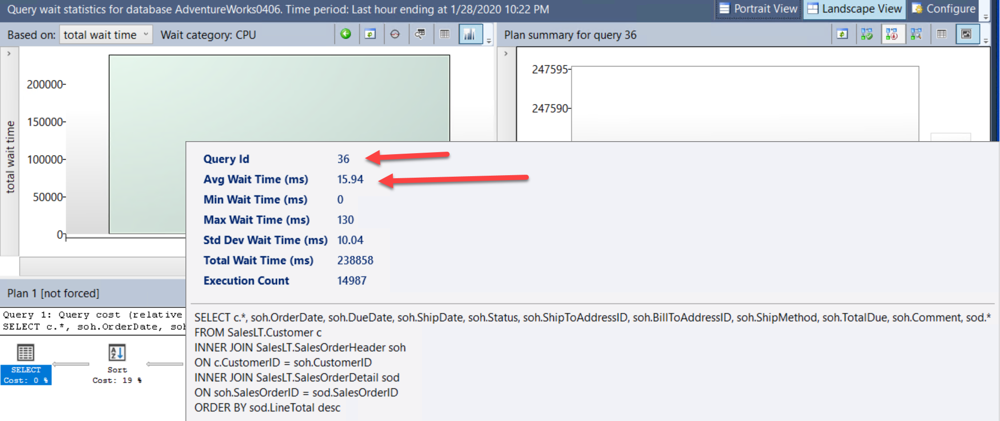

Notice that the average wait time for CPU for this query is a high % of the overall average duration for the query.

The DMV **sys.dm_db_wait_stats** will show a high number of SOS_SCHEDULER_YIELD waits with this scenario.

Given the evidence to this point, without any query tuning, our workload requires more CPU capacity than we have deployed for our Azure SQL Database.

TODO: This is where we would interject Query Performance Insights since it uses the Query Store. The charts don't show what I expect so need to research.

**Step 5: Observing performance using Azure Monitor Metrics**

Azure Monitor provides performance metrics which you can view in various methods including Azure Portal. In the Overview page for an Azure SQL database, the standard default view is called **Compute Utilization** which you can see on the Overview blade for your database:<br><br>

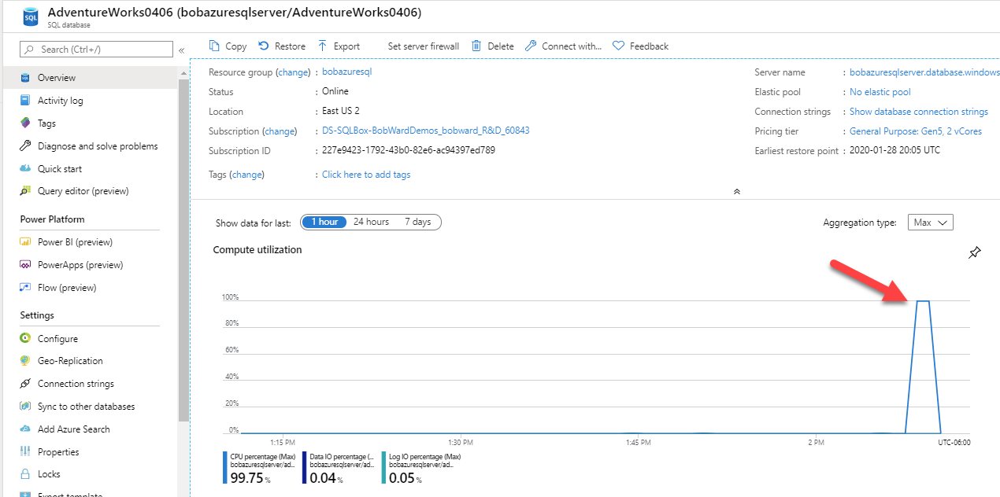

Notice in this example, the CPU utilization near 100% for a recent time range. This chart will show resource usage (defaults to CPU and I/O) over the last hour and is refreshed continually. If you click on the chart you customize the chart (Ex. bar chart) and look at other resource usage.

Another method to see the same compute utilization metrics and others automatically collected by Azure Monitor for Azure SQL Database is to use the **Metrics Explorer** under Monitoring in the portal (The Compute Utilization is a just a pre-defined view of the Metrics Explorer) If you click on Metrics you will see the following:

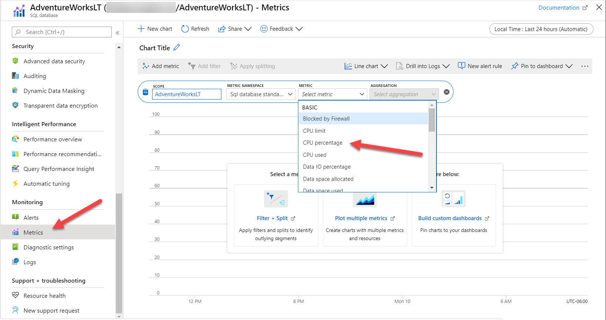

You can read more about the Metrics Explorer for any Azure resource at https://docs.microsoft.com/en-us/azure/azure-monitor/platform/metrics-charts. Metrics for Azure SQL Database are kept for 93 days. Yuo can also read more details about Metrics in Azure Monitor at https://docs.microsoft.com/en-us/azure/azure-monitor/platform/data-platform-metrics.

As you can see in the screenshot there are several metrics you can use to view with the Metrics Explorer. The default view of Metrics Explorer is for a 24 hour period showing a 5 minute granularity. The Compute Utilization view is the last hour with a 1 minute granularity (which you can change). To see the same view, select CPU percentage and change the capture for 1 hour. The granularity will change to 1 minute and should look like the following:

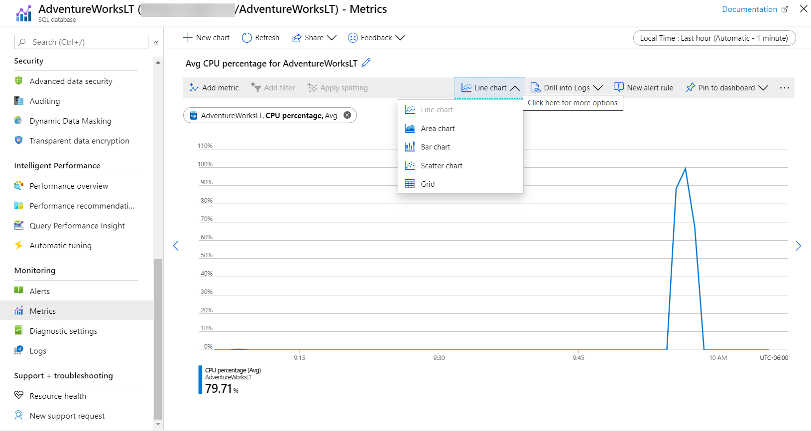

The default is a line chart but the Explorer view allows you to change the chart type. There are various options with Metrics Explorer including the ability to show multiple metrics on the same chart.

**Step 6: Observe performance with Azure Monitor Logs**

In addition to ad-hoc access to Azure Monitor Metrics, Azure Monitor provides logging capabilities across the Azure platform. Azure SQL Database has specific logging capabilities. You can read more about Azure SQL logs at https://docs.microsoft.com/en-us/azure/sql-database/sql-database-metrics-diag-logging.

Let's use the logging you setup in Module 2 of the workshop to analyze the same type of performance data you have seen with DMVs, Query Store, and Azure Monitor Metrics.


TODO: Show how to see the same CPU metric data using either Kusto queries or Azure SQL Analytics.

<p style="border-bottom: 1px solid lightgrey;"></p>

<h2><a name="4.3">4.3 Improving Performance in Azure SQL</h2></a>

In this section you will learn how to improve the performance of a SQL workload in Azure SQL using your knowledge of SQL Server and gained knowledge from Module 4.2.

**SQL Query Tuning**

**Azure SQL Database Auto Tuning**

**Scaling Performance**

Here is a good article to reference: https://docs.microsoft.com/en-us/azure/sql-database/sql-database-monitor-tune-overview#troubleshoot-performance-problems and https://docs.microsoft.com/en-us/azure/sql-database/sql-database-monitor-tune-overview#improve-database-performance-with-more-resources.

<p><a name="2"><b>Activity 2</a>: Scaling your workload performance in Azure SQL Database</b></p>

>**IMPORTANT**: This activity assumes you have completed all the steps in Activity 1 in Module 4.

In this activity you will take the results of your monitoring in Module 4.2 and learn how to scale your workload in Azure to see improved results.

All scripts for this activity can be found in the **azuresqlworkshop\04-Performance\monitor_and_scale** folder.

**Step 1: Decide options on how to scale performance**

Since workload is CPU bound one way to improve performance is to increase CPU capacity or speed. A SQL Server user would have to move to a different machine or reconfigure a VM to get more CPU capacity. In some cases, even a SQL Server administrator may not have permission to make these scaling changes or the process could take time.

For Azure, we can use ALTER DATABASE, az cli, or the portal to increase CPU capacity.

Using the Azure Portal we can see options for how you can scale for more CPU resources. Using the Overview blade for the database, select the Pricing tier current deployment.<br>

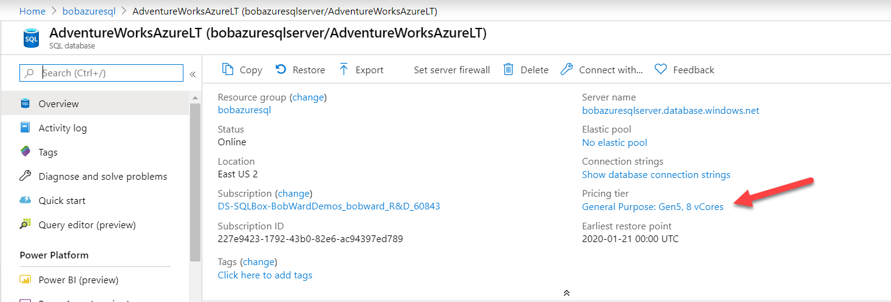

Here you can see options for changing or scaling compute resources. For General Purpose, you can easily scale up to something like 8 vCores.<br>

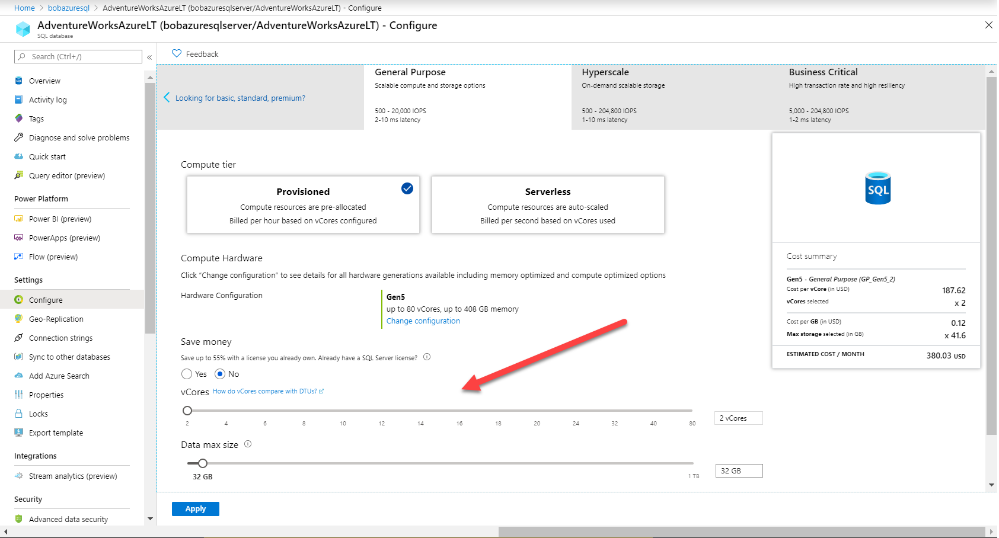

Instead of using the portal, I'll show you a different method to scale your workload.

**Step 2: Increase capacity of your Azure SQL Database**

There are other methods to change the Pricing tier and one of them is with the T-SQL statement ALTER DATABASE.

>**NOTE**: For this demo you must first flush the query store using the following script **flushhquerystore.sql** or T-SQL statement:

```sql
EXEC sp_query_store_flush_db
```

- First, learn how to find out your current Pricing tier using T-SQL. The Pricing tier is also know as a *service objective*. Using SSMS, open the script **get_service_object.sql** or the T-SQL statements to find out this information:

```sql
SELECT database_name,slo_name,cpu_limit,max_db_memory, max_db_max_size_in_mb, primary_max_log_rate,primary_group_max_io, volume_local_iops,volume_pfs_iops
FROM sys.dm_user_db_resource_governance;
GO
SELECT DATABASEPROPERTYEX('AdventureWorks0406', 'ServiceObjective');
GO
```

For the current Azure SQL Database deployment, your results should look like the following:<br><br>

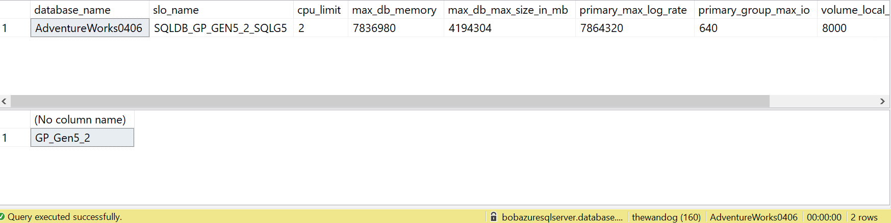

Notice the term **slo_name** is also used for service objective. The term **slo** stands for *service level objective*.

The various slo_name values are not documented but you can see from the string value this database uses a General Purpose SKU with 2 vCores:

>**NOTE:** Testing shows that SQLDB_OP_... is the string used for Business Critical.

The documentation for ALTER DATABASE shows all the possible options for service objectives and how they match to the Azure portal: https://docs.microsoft.com/en-us/sql/t-sql/statements/alter-database-transact-sql?view=sql-server-ver15.

When you view the ALTER DATABASE documentation, notice the ability to click on your target SQL Server deployment to get the right syntax options. Click on SQL Database single database/elastic pool to see the options for Azure SQL Database. To match the compute scale you found in the portal you need the service object **'GP_Gen5_8'**

Using SSMS, run the script modify_service_objective.sql or T-SQL command:

```sql
ALTER DATABASE AdventureWorks0406 MODIFY (SERVICE_OBJECTIVE = 'GP_Gen5_8');
```

This statement comes back immediately but the scaling of the compute resources take place in the background. A scale this small should take less than a minute and for a short period of time the database will be offline to make the change effective. You can monitor the progress of this scaling activity using the Azure Portal.<br>


TAnother way to monitor the progress of a change for the service object for Azure SQL Database is to use the DMV **sys.dm_operation_status**. This DMV exposes a history of changes to the database with ALTER DATABASE to the service objective and will show active progress of the change. Here is an example of this DMV after executing the above ALTER DATABASE statement:

<pre>
session_activity_id	resource_type	resource_type_desc	major_resource_id	minor_resource_id	operation	state	state_desc	percent_complete	error_code	error_desc	error_severity	error_state	start_time	last_modify_time
97F9474C-0334-4FC5-BFD5-337CDD1F9A21	0	Database	AdventureWorks0406		ALTER DATABASE	1	IN_PROGRESS	0	0		0	0	[datetime]	[datetime]</pre>

During a change for the service objective, queries are allowed against the database until the final change is implemented so an application cannot connect for a very brief period of time. For Azure SQL Database Managed Instance, a change to Tier (or SKU) will allow queries and connections but prevents all database operations like creation of new databases (in these cases operations like these will fail with the error message "**The operation could not be completed because a service tier change is in progress for managed instance '[server]' Please wait for the operation in progress to complete and try again**".)

When this is done using the queries listed above to verify the new service objective or pricing tier of 8 vCores has taken affect.

**Step 3: Run the workload again**

Now that the scaling has complete, we need to see if the workload duration is faster and whether waits on CPU resources has decreased.

Run the workload again using the command **sqlworkload.cmd** that you executed in Section 4.2

**Step 4: Observe new performance of the workload**

- Observe DMV results

Use the same queries from Section 4.2 Activity 1 to observe results from **dm_exec_requests** and **dm_db_resource_stats**.

You will see there are more queries with a status of RUNNING (less RUNNABLE although this will appear some) and the avg_cpu_percent should drop to 40-60%.

- Observe the new workload duration.

The workload duration from **sqlworkload.cmd** should now be much less and somewhere ~20 seconds.

- Observe Query Store reports

Using the same techniques as in Section 4.2 Activity 1, look at the **Top Resource Consuming Queries** report from SSMS:<br>

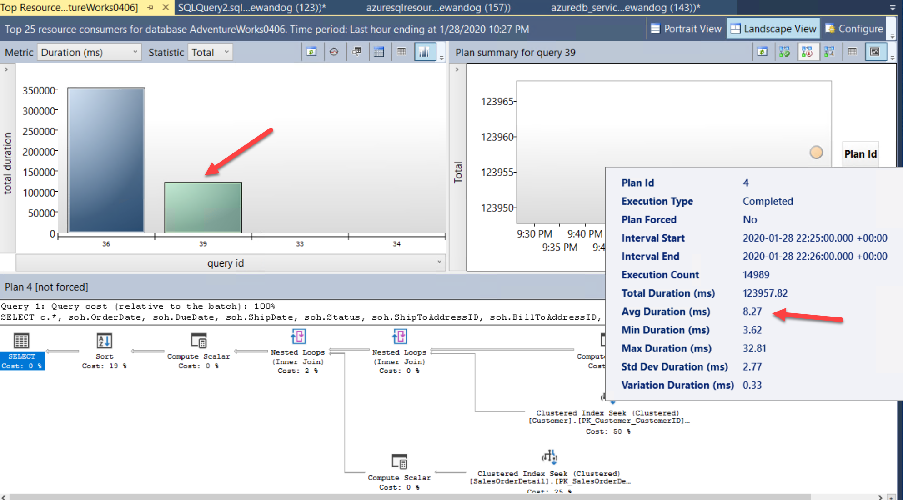

You will now see two queries (query_id). These are the same query but show up as different query_id values in Query Store because the scale operation required a restart so the query had to be recompiled. You can see in the report the overall and average duration was significantly less.

Look also at the Query Wait Statistics report as you did in Section 4.2 Activity 1. You can see the overall average wait time for the query is less and a lower % of the overall duration. This is good indication that CPU is not as much of a resource bottleneck when the database had a lower number of vCores:<br>

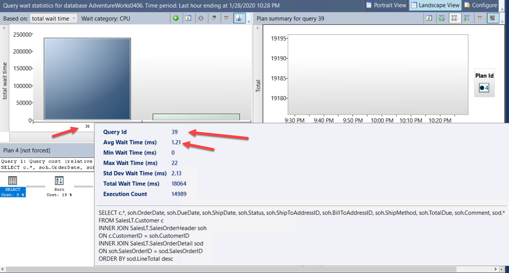

- Observe Azure Portal Compute Utilization

Look at the Overview blade again for the Compute Utilization. Notice the significant drop in overall CPU resource usage compared to the previous workload execution:<br>

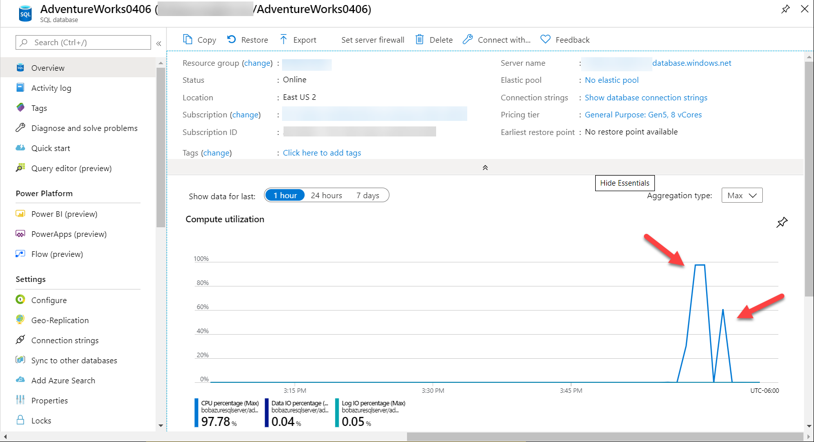

>**NOTE:** If you continue to increase vCores for this database you can improve performance up to a threshold where all queries have plenty of CPU resources. This does not mean you must match the number of vCores to the number of concurrent users from your workload. In addition, you can change the Pricing Tier to use **Serverless** *Compute Tier* instead of **Provisioned** to achieve a more "auto-scaled" approach to a workload. For example, for this workload if you chose a min vCore value of 2 and max VCore value of 8, this workload would immediately scale to 8vCores.

<p><a name="2"><b>Activity 3</a>: Optimizing application performance for Azure SQL Database</b></p>

>**IMPORTANT**: This activity assumes you have completed all Activities in Module 2

Good article read: https://azure.microsoft.com/en-us/blog/resource-governance-in-azure-sql-database/

In some cases, migrating an existing application and SQL query workload to Azure may uncover opportunities to optimize and tune queries.

Assume that to support a new extension to a website for AdventureWorks orders to support a rating system from customers you need to add a new table to support a heavy set of concurrent INSERT activity for ratings. You have tested the SQL query workload on a development computer that has a local SSD drive for the database and transaction log.

When you move your test to Azure SQL Database using the General Purpose tier (8 vCores), the INSERT workload is slower. You need to discover whether you need to change the service objective or tier to support the new workload.

All scripts for this activity can be found in the **azuresqlworkshop\04-Performance\tuning_applications** folder.

**Step 1 - Create a new table**

Run the following statement (or use the script**order_rating_ddl.sql**) to create a table in the AdventureWorks database you have used in Activity 1 and 2:

```sql
DROP TABLE IF EXISTS SalesLT.OrderRating;
GO
CREATE TABLE SalesLT.OrderRating
(OrderRatingID int identity not null,
SalesOrderID int not null,
OrderRatingDT datetime not null,
OrderRating int not null,
OrderRatingComments char(500) not null);
GO
```

**Step 2 - Load up a query to monitor query execution**

- Use the following query or script **sqlrequests.sql** to look at active SQL queries *in the context of the AdventureWorks database*:

```sql
SELECT er.session_id, er.status, er.command, er.wait_type, er.last_wait_type, er.wait_resource, er.wait_time
FROM sys.dm_exec_requests er
INNER JOIN sys.dm_exec_sessions es
ON er.session_id = es.session_id
AND es.is_user_process = 1;
```
- Use the following query or script **top_waits.sql** to look at top wait types by count *in the context of the AdventureWorks database*:

```sql
SELECT * FROM sys.dm_os_wait_stats
ORDER BY waiting_tasks_count DESC;
```
- Use the following query or script **tlog_io.sql** to observe latency for transaction log writes:

```sql
SELECT io_stall_write_ms/num_of_writes as avg_tlog_io_write_ms, * 
FROM sys.dm_io_virtual_file_stats
(db_id('AdventureWorks0406'), 2);
```

**Step 3 - Run the workload**

Run the test INSERT workload using the script order_rating_insert_single.cmd. This script uses ostress to run 25 concurrent users running the following T-SQL statement (in the script **order_rating_insert_single.sql**):

```sql
DECLARE @x int;
SET @x = 0;
WHILE (@x < 100)
BEGIN
SET @x = @x + 1;
INSERT INTO SalesLT.OrderRating
(SalesOrderID, OrderRatingDT, OrderRating, OrderRatingComments)
VALUES (@x, getdate(), 5, 'This was a great order');
END
```
You can see from this script that it is not exactly a real depiction of data coming from the website but it does simulate many order ratings being ingested into the database.

**Step 4 - Observe query requests and duration**

Using the queries in Step 2 you should observe the following:

- Many requests constantly have a wait_type of WRITELOG with a value > 0
- The WRITELOG wait type is the highest count
- The avg time to write to the transaction log is somewhere around 2ms.

The duration of this workload on a SQL Server 2019 instance with a SSD drive is somewhere around 15 seconds. The total duration using this on Azure SQL Database using a Gen5 v8core is around 32+ seconds. 

WRITELOG wait types are indicative of latency flushing to the transaction log. 2ms per write doesn't seem like much but on a local SSD drive these waits may < 1ms.

TODO: WRITELOG waits sometimes don't show up in Query Store?

**Step 5 - Decide on a resolution**

The problem is not a high% of log write activity. The Azure Portal and **dm_db_resource_stats** don't show any numbers higher than 20-25%. The problem is not an IOPS limit as well. The issue is that application requires low latency for transaction log writes but with the General Purpose database configuration a latency. In fact, the documenation for resource limits lists latency between 5-7ms (https://docs.microsoft.com/en-us/azure/sql-database/sql-database-vcore-resource-limits-single-databases).

If you examine the workload, you will see each INSERT is a single transaction commit which requires a transaction log flush.

One commit for each insert is not efficient but the application was not affected on a local SSD because each commit was very fast. The Business Critical pricing tier (servie objective or SKU) provides local SSD drives with a lower latency but maybe there ia an application optimization.

The T-SQL batch can be changed for the workload to wrap a BEGIN TRAN/COMMIT TRAN around the INSERT iterations.

**Step 6 - Run the modified workload and observe**

The modified workload can be found in the script **order_rating_insert.sql**. Run the modified workload using the script with ostress called **order_rating_insert.cmd**

Now the workload runs in almost 5 seconds compared to even 18-19 seconds with a local SSD using singleton transactions. This is an example of tuning an application for SQL queries that will run after in or outside of Azure.

The workload runs so fast it may be difficult to observe diagnostic data from queries used previously in this activity. It is important to note that sys.dm_os_wait_stats cannot be cleared using DBCC SQLPERF as it can be with SQL Server.

TODO: There is no metric in Azure Monitor for 

TODO: The first test is interesting. A GP MI with 8 vCore is MUCH SLOWER than GP v8core???? Even with "batched" INSERTs it was 10 seconds. WRITELOG waits can be very bad on MI????

The concept of "batching" can help most applications including Azure. Read more at https://docs.microsoft.com/en-us/azure/sql-database/sql-database-use-batching-to-improve-performance.

>*NOTE:** Very large transactions can be affected on Azure and the symptoms will be LOG_RATE_GOVERNOR. In this example, the char(500) not null column pads spaces and causes large tlog records. Performance can even be more optimized by making that column a variable length column. TODO: Add more to this paragraph.

<p style="border-bottom: 1px solid lightgrey;"></p>

<h2><a name="4.4">4.4 Intelligent Performance in Azure SQL</h2></a>

In this section you will learn about the built-in intelligent performance capabilities of Azure SQL.

**Intelligent Query Processing**

**Automatic Plan Correction**

**Azure SQL Database Auto Tuning**

**Azure SQL Database Intelligent Insights**

<p><a name="2"><b>Activity 4 (BONUS) </a>: Performance Recommendations from Azure SQL Database</b></p>

TODO: The idea here is to show the steps and results of running a workload and getting index and parameterized query recommendations. In a classroom setting they won't be doing this because it takes too long but I'll document the exact steps to make this repeatable and show the results.

<p style="border-bottom: 1px solid lightgrey;"></p>

<p><b>For Further Study</b></p>
<ul>
    <li><a href="url" target="_blank">TODO: Enter courses, books, posts, whatever the student needs to extend their study</a></li>
</ul>

<p><b >Next Steps</b></p>

Next, Continue to <a href="https://github.com/microsoft/sqlworkshops/blob/master/AzureSQLWorkshop/azuresqlworkshop/05-Availability.md" target="_blank"><i> 05 - Availability</i></a>.