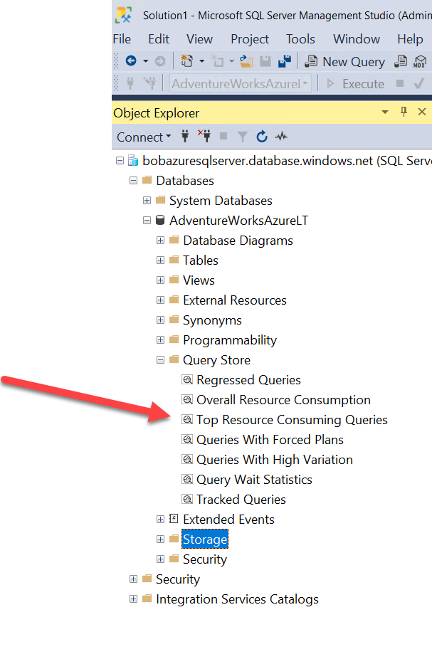
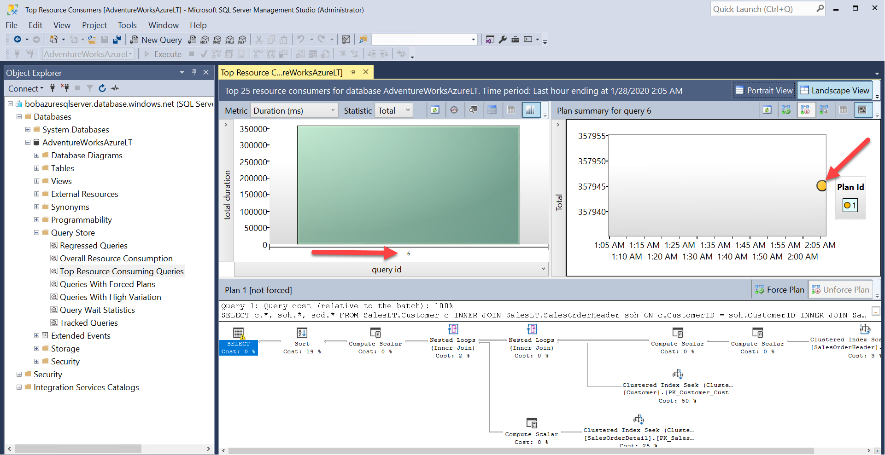

# Module 4 - Performance

#### <i>The Azure SQL Workshop</i>

<p style="border-bottom: 1px solid lightgrey;"></p>

 <h2>Overview</h2>

> You must complete the [prerequisites](../azuresqlworkshop/00-Prerequisites.md) before completing these activities. You can also choose to audit the materials if you cannot complete the prerequisites. If you were provided an environment to use for the workshop, then you **do not need** to complete the prerequisites.     

You’ve been responsible for getting your SQL fast, keeping it fast, and making it fast again when something is wrong. In this module, we’ll show you how to leverage your existing performance skills, processes, and tools and apply them to Azure SQL, including taking advantage of the intelligence in Azure to keep your database tuned.

In each module you'll get more references, which you should follow up on to learn more. Also watch for links within the text - click on each one to explore that topic.

(<a href="https://github.com/microsoft/sqlworkshops/blob/master/AzureSQLWorkshop/azuresqlworkshop/00-Prerequisites.md" target="_blank">Make sure you check out the <b>Prerequisites</b> page before you start</a>. You'll need all of the items loaded there before you can proceed with the workshop.)

In this module, you'll cover these topics:  
[4.1](#4.1): Azure SQL performance capabilities and Tasks<br>
[4.2](#4.2): Monitoring performance in Azure SQL<br>
&nbsp;&nbsp;&nbsp;&nbsp;&nbsp;&nbsp;[Activity 1](#1): How to monitor performance in Azure SQL Database  
[4.3](#4.3): Improving Performance in Azure SQL<br>
&nbsp;&nbsp;&nbsp;&nbsp;&nbsp;&nbsp;[Activity 2](#2): Scaling your workload performance in Azure SQL Database
&nbsp;&nbsp;&nbsp;&nbsp;&nbsp;&nbsp;[Activity 3 (BONUS)](#2): Scaling your workload performance with Azure SQL Database Serverless<br>
&nbsp;&nbsp;&nbsp;&nbsp;&nbsp;&nbsp;[Activity 4 (BONUS)](#2): Optimizing performance of data loading

<p style="border-bottom: 1px solid lightgrey;"></p>

<h2><a name="4.1">4.1  Azure SQL performance capabilities and Tasks</h2></a>

In this section you will learn how to monitor the performance of a SQL workload using tools and techniques both familiar to the SQL Server professional along with differences with Azure SQL.

**TODO:** Here is where we would put in more details comparing the performance capabilities and tasks of SQL Server with Azure SQL including Database and MI. This includes performance features and tools to get fast, stay fast, and get faster.

<p style="border-bottom: 1px solid lightgrey;"></p>

<h2><a name="4.2">4.2 Monitoring performance in Azure SQL</h2></a>

In this section you will learn how to monitor the performance of a SQL workload using tools and techniques both familiar to the SQL Server professional along with differences with Azure SQL.

**TODO:** Put in text here that talks about the process to monitor performance with Azure SQL comparing this to SQL Server.

<p><a name="1"><b>Activity 1</a>: How to monitor performance in Azure SQL Database</b></p>

>**IMPORTANT**: This activity assumes you have completed all the activities in Module 2.

All scripts for this activity can be found in the **azuresqlworkshop\04-Performance\monitor_and_scale** folder.

In this activity, you will take a typical workload based on SQL queries and learn how to monitor performance for Azure SQL Database. You will learn how to identify a potential performance bottleneck using familiar tools and techniques to SQL Server. You will also learn differences with Azure SQL Database for performance monitoring.

Using the Azure SQL Database based on the AdventureWorksLT sample, you are given an example workload and need to observe its performance. You are told there appears to be a performance bottleneck. Your goal is to identify the possible bottleneck and identify solutions.

>**NOTE**: These scripts use the database name **AdventureWorks0406**. Anywhere this database name is used you should substitute in the name of the database you deployed in Module 2.

**Step 1: Setup to monitor Azure SQL Database**

>**TIP**: To open a script file in the context of a database in SSMS, click on the database in Object Explorer and then use the File/Open menu in SSMS.

- Launch SQL Server Management Studio (SSMS) and load a query *in the context of the database you deployed in Module 2* to monitor the Dynamic Management View (DMV) **sys.dm_exec_requests** from the script **sqlrequests.sql** which looks like the following:

```sql
SELECT er.session_id, er.status, er.command, er.wait_type, er.last_wait_type, er.wait_resource, er.wait_time
FROM sys.dm_exec_requests er
INNER JOIN sys.dm_exec_sessions es
ON er.session_id = es.session_id
AND es.is_user_process = 1
```
Unlike SQL Server, the familiar DMV dm_exec_requests shows active requests for a specific Azure SQL Database vs an entire server. Azure SQL Database Managed instance will behave just like SQL Server.

In another session for SSMS *in the context of the database you deployed in Module 2* load a query to monitor a Dynamic Management View (DMV) unique to Azure SQL Database called **sys.dm_db_resource_stats** from a script called **azuresqlresourcestats.sql**

```sql
SELECT * FROM sys.dm_db_resource_stats
```

This DMV will track overall resource usage of your workload against Azure SQL Database such as CPU, I/O, and memory.

- Setup an XEvent trace for queries

TODO: Show steps to setup XEvent to an Azure Storage account to trace queries

**Step 2: Run the workload and observe performance**

- Examine the workload query from the script **topcustomersales.sql**. 

This database is not large so the query to retrieve customer and their associated sales information ordered by customers with the most sales shouldn't generate a large result set. It is possible to tune this query by reducing the number of columns from the result set but these are needed for demostration purposes of this activity.


```sql
SELECT c.*, soh.OrderDate, soh.DueDate, soh.ShipDate, soh.Status, soh.ShipToAddressID, soh.BillToAddressID, soh.ShipMethod, soh.TotalDue, soh.Comment, sod.*
FROM SalesLT.Customer c
INNER JOIN SalesLT.SalesOrderHeader soh
ON c.CustomerID = soh.CustomerID
INNER JOIN SalesLT.SalesOrderDetail sod
ON soh.SalesOrderID = sod.SalesOrderID
ORDER BY sod.LineTotal desc
GO
```

- Run the workload from the command line using ostress.

Edit the script script that runs ostress **sqlworkload.cmd**:<br><br>
Substitute your Azure Database Server created in Module 2 for the **-S parameter**<br>
Substitue the login name created for the Azure SQL Database Server created in Module 2 for the **-U parameter**
Substitute the database you deployed in Module 2 for the **-d parameter**<br>
Substitute the password for the login for the Azure SQL Database Server created in Module 2 for the **-P parameter**.

This script will use 15 concurrent users running the workload query 1000 times.

From a powershell command prompt, change to the directory for this module activity:

<pre>
cd AzureSQLWorkshop\azuresqlworkshop\03-Performance
</pre>

Run the workload with the following command

```Powershell
.\sqlworkload.cmd
```


Your screen at the command prompt should look similar to the following

<pre>[datetime] [ostress PID] Max threads setting: 10000
[datetime] [ostress PID] Arguments:
[datetime] [ostress PID] -S[server].database.windows.net
[datetime] [ostress PID] -isqlquery.sql
[datetime] [ostress PID] -U[user]
[datetime] [ostress PID] -dAdventureWorks0406
[datetime] [ostress PID] -P********
[datetime] [ostress PID] -n15
[datetime] [ostress PID] -r1000
[datetime] [ostress PID] -q
[datetime] [ostress PID] Using language id (LCID): 1024 [English_United States.1252] for character formatting with NLS: 0x0006020F and Defined: 0x0006020F
[datetime] [ostress PID] Default driver: SQL Server Native Client 11.0
[datetime] [ostress PID] Attempting DOD5015 removal of [directory]\sqlquery.out]
[datetime] [ostress PID] Attempting DOD5015 removal of [directory]\sqlquery_1.out]
[datetime] [ostress PID] Attempting DOD5015 removal of [directory]\sqlquery_2.out]
[datetime] [ostress PID] Attempting DOD5015 removal of [directory]\sqlquery_3.out]
[datetime] [ostress PID] Attempting DOD5015 removal of [directory]\sqlquery_4.out]
[datetime] [ostress PID] Attempting DOD5015 removal of [directory]\sqlquery_5.out]
[datetime] [ostress PID] Attempting DOD5015 removal of [directory]\sqlquery_6.out]
[datetime] [ostress PID] Attempting DOD5015 removal of [directory]\sqlquery_7.out]
[datetime] [ostress PID] Attempting DOD5015 removal of [directory]\sqlquery_8.out]
[datetime] [ostress PID] Attempting DOD5015 removal of [directory]\sqlquery_9.out]
[datetime] [ostress PID] Starting query execution...
[datetime] [ostress PID]  BETA: Custom CLR Expression support enabled.
[datetime] [ostress PID] Creating 15 thread(s) to process queries
[datetime] [ostress PID] Worker threads created, beginning execution...</pre>

- Use the query in SSMS to monitor dm_exec_requests (**sqlrequests.sql**) to observe active requests. Run this query 5 or 6 times and observe some of the results.

You should see many of the requests have a status = RUNNABLE and last_wait_type = SOS_SCHEDULER_YIELD.

>NOTE: You may see one or more active requests with a command = SELECT and a wait_type = XE_LIVE_TARGET_TVF. These are queries run by services managed by Microsoft to help power capabilities like Performance Insights using Extended Events. Microsoft does not publish the details of these Extended Event sessions.

The familiar SQL DMV dm_exec_requests can be used with Azure SQL Database but must be run in the context of a database unlike SQL Server (or Azure SQL Database Managed Instance) where dm_exec_requests shows all active requests across the server instance.

- Run the query in SSMS to monitor dm_db_resource_stats (**azuresqlresourcestats.sql**). Run the query to see the results of this DMV 3 or 4 times.

This DMV records of snapshot of resource usage for the database every 15 seconds (kept for 1 hour).  You should see the column **avg_cpu_percent** close to 100% for several of the snapshots. (at least in the high 90% range). This is a symptom of a workload pushing the limits of CPU resources for the database. You can read more details about this DMV at https://docs.microsoft.com/en-us/sql/relational-databases/system-dynamic-management-views/sys-dm-db-resource-stats-azure-sql-database?view=azuresqldb-current.

TODO: This DMV seems to work for MI but what does it show?

For a SQL Server on-premises environment you would typically use a tool specific to the Operating System like Windows Performance Monitor to track overall resource usage such a CPU. If you ran this example on a on-premises SQL Server or SQL Server in a Virtual Machine with 2 CPUs you would see near 100% CPU utilization on the server.

>**NOTE**: Another DMV called, **sys.resource_stats**, can be run in the context of the master database of the Azure Database Server to see resource usage for all Azure SQL Database databases associated with the server. This view is less granular and shows resource usage every 5 minutes (kept for 14 days).

- Let the workload complete and take note of its overall duration. When the workload completes you should see results like the following and a return to the command prompt

<pre>[datetime] [ostress PID] Total IO waits: 0, Total IO wait time: 0 (ms)
[datetime] [ostress PID] OSTRESS exiting normally, elapsed time: 00:01:02.637</pre>

Your duration time may vary but this typically takes at least 1 minute.

**Step 3: Use Query Store to do further performance analysis**

Query Store is a capability in SQL Server to track performance execution of queries. Performance data is stored in the user database. You can read more about Query Store at https://docs.microsoft.com/en-us/sql/relational-databases/performance/monitoring-performance-by-using-the-query-store?view=sql-server-ver15.

Query Store is not enabled by default for databases created in SQL Server but is on by default for Azure SQL Database (and Azure SQL Database Managed Instance). You can read more about Query Store and Azure SQL Database at https://docs.microsoft.com/en-us/azure/sql-database/sql-database-operate-query-store.

Query Store comes with a series of system catalog views to view performance data. SQL Server Management Studio (SSMS) provides reports using these system views.

- Look at queries consuming the most resource usage using SSMS.

Using the Object Explorer in SSMS, open the Query Store Folder to find the report for **Top Resource Consuming Queries**<br><br>



Select the report to find out what queries have consumed the most avg resources and execution details of those queries. Based on the workload run to this point, your report should look something like the following:<br><br>


The query shown is the SQL query from the workload for customer sales. Hover over the Plan_id circle to observe execution statistics for the query

- Look at Waits Report. Observe CPU waits and look at waits for CPU for query

**Step 4: Observe query performance with Extended Events**

- Load up XEvent file and observe information in the query trace.

**Step 5: Observe performance using the Azure Portal**

- Observe performance in the portal for the resource graph for the db

<p style="border-bottom: 1px solid lightgrey;"></p>

<h2><a name="4.3">4.3 Improving Performance in Azure SQL</h2></a>

In this section you will learn how to improve the performance of a SQL workload in Azure SQL using your knowledge of SQL Server and gained knowledge from Module 4.2.

**TODO:** Put in text here about various ways to improve performance in SQL Server and how that compares to Azure SQL including Database and MI. A discussion of Hyperscale is fine here as well although we won't use that in the Activity.

Here is a good article to reference: https://docs.microsoft.com/en-us/azure/sql-database/sql-database-monitor-tune-overview#troubleshoot-performance-problems and https://docs.microsoft.com/en-us/azure/sql-database/sql-database-monitor-tune-overview#improve-database-performance-with-more-resources.

<p><a name="2"><b>Activity 2</a>: Scaling your workload performance in Azure SQL Database</b></p>

>**IMPORTANT**: This activity assumes you have completed all the steps in Activity 1 in Module 4.

In this activity you will take the results of your monitoring in Module 4.2 and learn how to scale your workload in Azure to see improved results.

**Step 1: Decide options on how to scale performance**

Since workload is CPU bound one way to improve performance is to increase CPU capacity or speed. A SQL Server user would have to move to a different machine or reconfigure a VM to get more CPU capacity.

For Azure, we can use ALTER DATABASE, az cli, or the portal to increase CPU capacity.

Look at the portal for options.

**Step 2: Increase capacity of your Azure SQL Database**

Use ALTER DATABASE to move up to 8vcores for General Purpose.

Example queries to use

```sql
select  database_name,slo_name,cpu_limit,max_db_memory
,max_db_max_size_in_mb, primary_max_log_rate,primary_group_max_io, volume_local_iops,volume_pfs_iops
from  sys.dm_user_db_resource_governance
go
ALTER DATABASE AdventureWorksAzureLT
MODIFY (SERVICE_OBJECTIVE = 'GP_Gen5_8')
go
SELECT DATABASEPROPERTYEX('AdventureWorksAzureLT', 'ServiceObjective')
```

**Step 3: Run the workload again**

Re-run the ostress workload.

**Step 4: Observe new performance of the workload**

- Observe DMV queries

More RUNNING queries
avg CPU down to 30-50%

- Workload should finish in < 20secs

- Observe query store reports

Avg duration 50% or more
Wait stats show average CPU wait signficantly down for new query_id

- Observe azure portal

Compute in portal down under 60%

- Observe differences with XEvents.

<p><a name="2"><b>Activity 3 (BONUS)</a>: Scaling your workload performance with Azure SQL Database Serverless</b></p>

>**IMPORTANT**: This activity assumes you have completed all the steps in Activity 1 in Module 4.

In this activity you will take the results of your monitoring in Module 4.2 and learn how to scale your workload in Azure to see improved results.

**Step 1: xxxxxxx**

xxxxxxx

**Step 2: Change to Serverless**

xxxxxx

**Step 3: Run the workload again**

Re-run the ostress workload.

**Step 4: Observe new performance of the workload**

- Observe DMV queries
- Observe query store reports
- Observe azure portal
- Observe differences with XEvents.

- **TODO:** - Why does dm_db_resource_stats show lower overall CPU% on serverless? 


<p><a name="2"><b>Activity 4 (BONUS)</a>: Optimizing performance of data loading</b></p>

>**IMPORTANT**: This activity assumes you have completed all Activities in Module 2

In this activity you will take the results of your monitoring in Module 4.2 and learn how to scale your workload in Azure to see improved results.

**Step 1: xxxxx**

Since workload is CPU bound one way to improve performance is to increase CPU capacity or speed. A SQL Server user would have to move to a different machine or reconfigure a VM to get more CPU capacity.

For Azure, we can use ALTER DATABASE, az cli, or the portal to increase CPU capacity.

Look at the portal for options.

**Step 2: xxxxx**

Use ALTER DATABASE to move up to 8vcores for General Purpose.

**Step 3: xxxxxx**

Re-run the ostress workload.

**Step 4: xxxxxxx**

- Observe DMV queries
- Observe query store reports
- Observe azure portal
- Observe differences with XEvents.

<p style="border-bottom: 1px solid lightgrey;"></p>

<p><b>For Further Study</b></p>
<ul>
    <li><a href="url" target="_blank">TODO: Enter courses, books, posts, whatever the student needs to extend their study</a></li>
</ul>

<p><b >Next Steps</b></p>

Next, Continue to <a href="https://github.com/microsoft/sqlworkshops/blob/master/AzureSQLWorkshop/azuresqlworkshop/05-Availability.md" target="_blank"><i> 05 - Availability</i></a>.