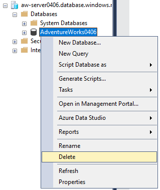
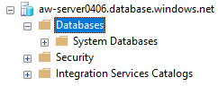
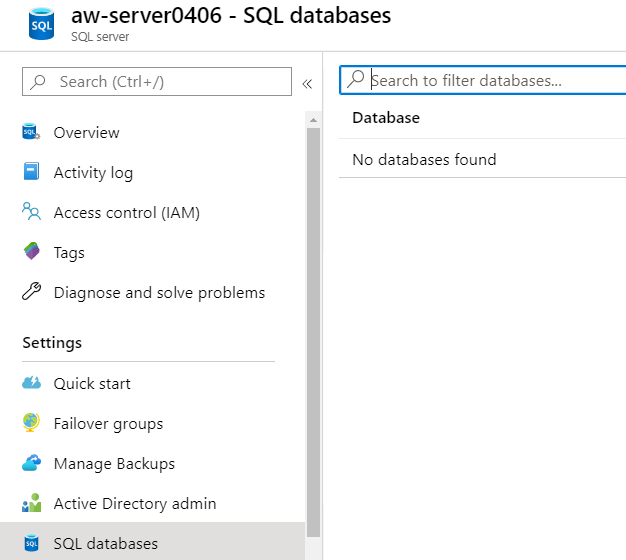
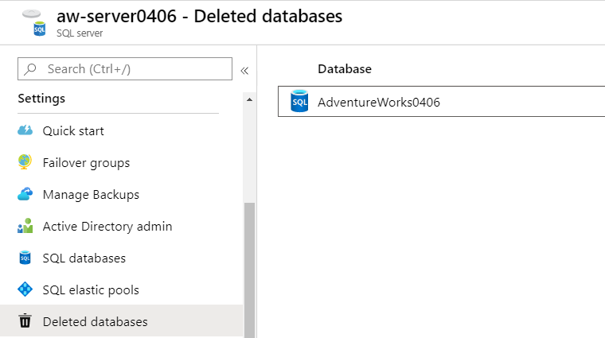
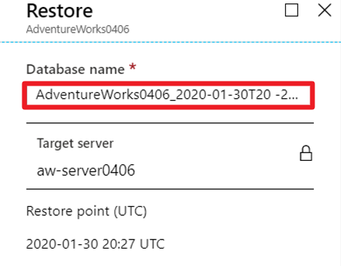
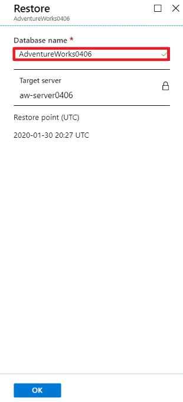
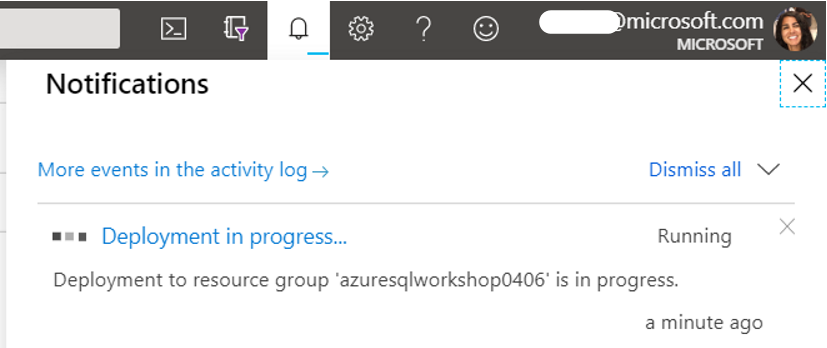
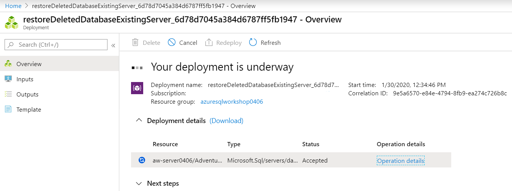

# The Azure SQL Workshop

#### <i>A Microsoft workshop from the SQL team</i>

 <h2>05 - Availability</h2>

> You must complete the [prerequisites](../azuresqlworkshop/00-Prerequisites.md) before completing these activities. You can also choose to audit the materials if you cannot complete the prerequisites. If you were provided an environment to use for the workshop, then you **do not need** to complete the prerequisites.   

Depending on the SLA your business requires, Azure SQL has the options you need including built-in capabilities. In this module, you will learn how to translate your knowledge of backup/restore, Always on failover cluster instances, and Always On availability groups to the options for business continuity in Azure SQL.

In this module, you'll cover these topics:  
[5.1](#5.1): Azure SQL high availability basics   
&nbsp;&nbsp;&nbsp;&nbsp;&nbsp;&nbsp;[Activity 1](#1): TODO-Turn-key FCIs  
[5.2](#5.2): Backup and restore   
&nbsp;&nbsp;&nbsp;&nbsp;&nbsp;&nbsp;[Activity X](#X): Restore a deleted database  
&nbsp;&nbsp;&nbsp;&nbsp;&nbsp;&nbsp;[Activity 2](#2): Restore to a point in time    
[5.3](#5.3): The highest availability  
&nbsp;&nbsp;&nbsp;&nbsp;&nbsp;&nbsp;[Activity 3](#3): TODO-Turn-key AGs in Business critical  
&nbsp;&nbsp;&nbsp;&nbsp;&nbsp;&nbsp;[Activity 4](#4): Geo-distributed auto-failover groups with read-scale in Business critical  

<h2><a name="5.1">5.1 Azure SQL high availability basics</h2></a>

TODO: Explain basic architecture of general purpose/business critical/hyperscale for availability

 

<a name="1"><b>Activity 1</a>: TODO: TODO-Turn-key FCIs</b>

TODO: Activity Description and tasks

<b>Description</b>

TODO: Enter activity description with checkbox

<b>Steps</b>

TODO: Enter activity steps description with checkbox

<h2><a name="5.2">5.2 TODO: Backup and restore</h2></a>

TODO: Explain how on prem you have to have a plan for DR and a BU/R strategy, but how it's built for you in Azure. Also talk about how it all works, ADR, LTR, etc.

<a name="X"><b>Activity X</a>: TODO: Restore a deleted database</b>

TODO: Activity Description and tasks

<b>Description</b>

TODO: Enter activity description with checkbox

<b>Steps</b>

TODO: Enter activity steps description with checkbox

  

  

  

  
(this takes about 2 min to show up)  

  

  

  

  

NOTE: It took 11 MINUTES to restore the deleted database and 2-3 min for it to show up so I could delete it. With 14 minutes waiting time, I think we should drop this lab, I will mention it at the end of activity 2.  

<a name="2"><b>Activity 2</a>: Undo errors to a point in time</b>

In all organizations, big or small, mistakes can happen. That's why you always have to have a plan for how you will restore to where you need to be. In SQL Server, ideally, you want choose to [restore to a point in time](https://docs.microsoft.com/en-us/sql/relational-databases/backup-restore/restore-a-sql-server-database-to-a-point-in-time-full-recovery-model?view=sql-server-ver15), but you can only do that if you are running in full recovery model. Under the bulk-logged recovery model, it's more likely that you'll have to recover the database to the end of the transaction log backup.  

One of the benefits of Azure SQL is that Azure can take care of all of this for you. Since Azure SQL manages your backups and runs in full recovery model, it can restore you to any point in time (you can even [restore a deleted database](https://docs.microsoft.com/en-us/azure/sql-database/sql-database-recovery-using-backups#deleted-database-restore)). In this activity, you'll see how a common error can be recovered using point in time restore (PITR). This is easy to do in the portal or programmatically, but in this activity you'll see how to do it with the Azure CLI.  

<b>Steps</b>

For this activity, you'll use the notebook called **pitr.ipynb** which is under `azuresqlworkshop\05-Availability\pitr\pitr.ipynb`. Navigate to that file in ADS to complete this activity, and then return here.  

<h2><a name="5.3">5.3 The highest availability</h2></a>

TODO: We've shown you basics/how to get data back, now we'll show HA tech, what do you get in BC… Focus on BC here

<a name="3"><b>Activity 3</a>: TODO-Turn-key AGs in Business critical</b>

TODO: Activity Description and tasks

<b>Description</b>

TODO: Enter activity description with checkbox

<b>Steps</b>

TODO: Enter activity steps description with checkbox

<a name="4"><b>Activity 4</a>: Geo-distributed auto-failover groups with read-scale in Business critical</b>

TODO: Activity Description and tasks

<b>Description</b>

TODO: Enter activity description with checkbox

<b>Steps</b>

TODO: Enter activity steps description with checkbox

<b>For Further Study</b>

<ul>
    <li><a href="url" target="_blank">TODO: Enter courses, books, posts, whatever the student needs to extend their study</a></li>
</ul>

<b >Next Steps</b>

Next, Continue to <a href="https://github.com/microsoft/sqlworkshops/blob/master/AzureSQLWorkshop/azuresqlworkshop/06-PuttingItTogether.md" target="_blank"><i> 06 - Putting it all together</i></a>.