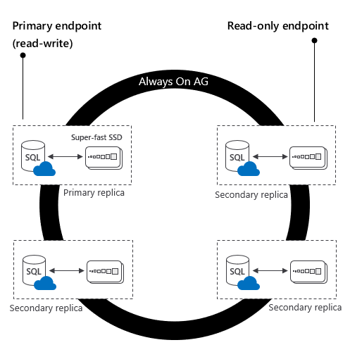
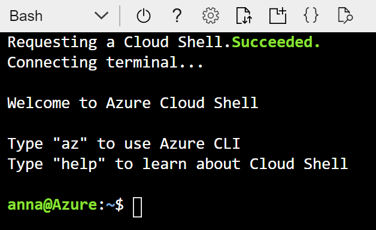
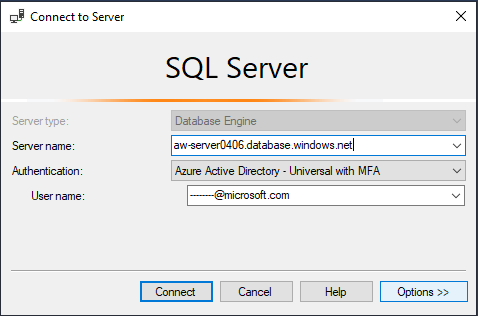
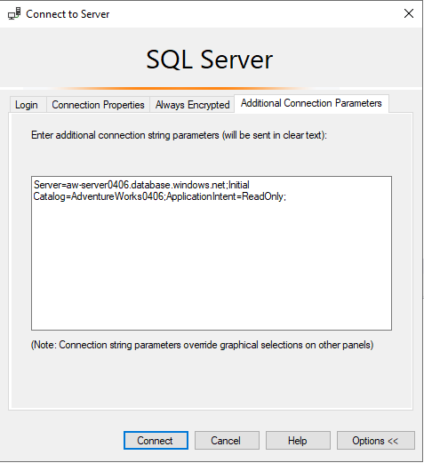
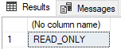
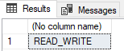

# The Azure SQL Workshop

#### <i>A Microsoft workshop from the SQL team</i>

<p style="border-bottom: 1px solid lightgrey;"></p>

 <h2>05 - Availability</h2>

> You must complete the [prerequisites](../azuresqlworkshop/00-Prerequisites.md) before completing these activities. You can also choose to audit the materials if you cannot complete the prerequisites. If you were provided an environment to use for the workshop, then you **do not need** to complete the prerequisites.   


Depending on the SLA your business requires, Azure SQL has the options you need including built-in capabilities. In this module, you will learn how to translate your knowledge of backup/restore, Always on failover cluster instances, and Always On availability groups to the options for business continuity in Azure SQL.


In this module, you'll cover these topics:  
[5.1](#5.1): Backup and restore   
&nbsp;&nbsp;&nbsp;&nbsp;&nbsp;&nbsp;[Activity 1](#1): Restore to a point in time  
[5.2](#5.2): Azure SQL high availability basics     
&nbsp;&nbsp;&nbsp;&nbsp;&nbsp;&nbsp;[Activity 2](#2): TODO-Turn-key FCIs    
[5.3](#5.3): The highest availability  
&nbsp;&nbsp;&nbsp;&nbsp;&nbsp;&nbsp;[Activity 3](#3): TODO-Turn-key AGs in Business critical  
&nbsp;&nbsp;&nbsp;&nbsp;&nbsp;&nbsp;[Activity 4](#4): Geo-distributed auto-failover groups with read-scale in Business critical  

<p style="border-bottom: 1px solid lightgrey;"></p>

<h2><a name="5.1">5.1 TODO: Backup and restore</h2></a>

TODO: Explain how on prem you have to have a plan for DR and a BU/R strategy, but how it's built for you in Azure. Also talk about how it all works, ADR, LTR, etc.
<br>

<p><a name="1"><b>Activity 1</a>: Undo errors to a point in time</b></p>

In all organizations, big or small, mistakes can happen. That's why you always have to have a plan for how you will restore to where you need to be. In SQL Server, ideally, you want choose to [restore to a point in time](https://docs.microsoft.com/en-us/sql/relational-databases/backup-restore/restore-a-sql-server-database-to-a-point-in-time-full-recovery-model?view=sql-server-ver15), but you can only do that if you are running in full recovery model. Under the bulk-logged recovery model, it's more likely that you'll have to recover the database to the end of the transaction log backup.  

One of the benefits of Azure SQL is that Azure can take care of all of this for you. Since Azure SQL manages your backups and runs in full recovery model, it can restore you to any point in time (you can even [restore a deleted database](https://docs.microsoft.com/en-us/azure/sql-database/sql-database-recovery-using-backups#deleted-database-restore)). In this activity, you'll see how a common error can be recovered using point in time restore (PITR). This is easy to do in the portal or programmatically, but in this activity you'll see how to do it with the Azure CLI.  

TODO Need to add a note about prereq from Module 3

<p><b>Steps</b></p>

For this activity, you'll use the notebook called **pitr.ipynb** which is under `azuresqlworkshop\05-Availability\pitr\pitr.ipynb`. Navigate to that file in ADS to complete this activity, and then return here.  

<p style="border-bottom: 1px solid lightgrey;"></p>

<h2><a name="5.2">5.2 TODO: Azure SQL high availability basics</h2></a>

TODO: Explain basic architecture of general purpose/business critical/hyperscale for availability

<p><a name="2"><b>Activity 2</a>: TODO: TODO-Turn-key FCIs</b></p>

TODO: Activity Description and tasks  


<p><b>Steps</b></p>

TODO: Enter activity steps description with checkbox


<p style="border-bottom: 1px solid lightgrey;"></p>

<h2><a name="5.3">5.3 The highest availability</h2></a>

TODO: We've shown you basics/how to get data back, now we'll show HA tech, what do you get in BC… Focus on BC here

You've seen some of the capabilities that Azure SQL offers generally as far as high availability goes in Azure SQL. In this topic, you'll move to the Business critical service tier, which is meant to obtain the highest performance and availability of all Azure SQL service tiers (General purpose, Hyperscale, Business critical). Business critical is meant for mission-critical applications that need low latency and minimal downtime.  

You may recall from [Module 1](./01-IntroToAzureSQL.md) that Business critical is very similar to deploying an Always on Availability Group (AG) behind the scenes.  

  

Unlike the General purpose tier, in Business critical the compute and storage is on directly attached SSDs, which reduces network latency significantly (General purpose uses remote storage). In this AG, there are three replicas, and one of them can be used as a read-only endpoint (at no additional charge). One important note is that with Business critical, you get one read-only replica for free with no configuration, but with Hyperscale you have the ability to set up **multiple** read-only replicas. If any type of failure occurs, failing over to a secondary replica is very fast, because it already exists and has the data attached to it.  

Additionally, in the Business critical tier, you can opt-in (for no additional fee) for a [zone redundant configuration](https://docs.microsoft.com/en-us/azure/sql-database/sql-database-high-availability#zone-redundant-configuration) if your [region supports that](https://docs.microsoft.com/en-us/azure/availability-zones/az-overview#services-support-by-region). You can read more in the documentation, but at a high level, the four replicas (one primary and three secondary) are deployed to three different availability zones (AZ) within a region, meaning three different datacenters with some distance between them. This protects against catastrophic failures that may occur in a region to a datacenter. There is a small increase in network latency, since now they are spread across datacenters with some distance between them, so you have the choice to opt for what's commonly called "multi-az" or "single-az".  

More information about Business critical can be found [here](https://docs.microsoft.com/en-us/azure/sql-database/sql-database-service-tier-business-critical).  


<p><a name="3"><b>Activity 3</a>: TODO-Turn-key AGs in Business critical</b></p>

In this activity, you'll upgrade your database to the Business critical tier and explore the offering, including read-replicas, availability zones, and increased performance.  


<p><b>Steps</b></p>

**Step 1 - Upgrade your database to Business critical**  

It's easy to use the Azure portal GUI to modify your service tier. In this step, you'll revisit the Azure Cloud Shell and use the Azure CLI. Then, you'll confirm your changes using the Azure portal GUI.  

Navigate to the Azure portal and select the Azure Cloud Shell button in the top menu bar to open.  

  

Since we're using the Azure CLI, you can use Bash or PowerShell here, but the screenshots will be for Bash.  

  

Next, run `az account show` to confirm the default subscription matches the one you are using for the workshop.  

> Note: If it doesn't, you can run `az account list` to find the name of the subscription you are using for the workshop. Then, run `az account set --subscription 'my-subscription-name'` to set the default subscription for this Azure Cloud Shell session. You can confirm this worked by running `az account show` again.  
  

> Tip: You can't always use `CTRL + V` to paste in the Azure Cloud Shell (on Windows), but you can use `SHIFT + ENTER`.  

Now that you're set up, you can update the database's service tier.   

Run the following commands (adding your information) to update your service tier to Business critical and some other settings.  

First, set the `id` variable, replacing `0406` with your ID you've been using for the workshop.
```cli
id='0406'
```

Now, you can use the following command to update the service tier.  
```cli
az sql db update --resource-group azuresqlworkshop$id --server aw-server$id --name AdventureWorks$id --edition BusinessCritical --read-scale Enabled --zone-redundant false
```
This will take a few moments to complete, but while it's running, you can review some of the parameters we used:  
* `edition`: this term is a bit misleading, because it is really referring to the service tier, which is not the same as what edition means in the SQL Server box product.  
* `read-scale`: This is not enabled by default, but there is no additional cost associated with it. By enabling it, you're enabling one of your secondary replicas to be used as a readable secondary.  
* `zone-redundant`: By default, this is set to false, but you can set it to true if you want a multi-az deployment, with no additional cost. Note that this is only available in [certain regions](https://docs.microsoft.com/en-us/azure/availability-zones/az-overview#services-support-by-region) and not (yet) in Azure SQL managed instance.  

After it completes, you should see detailed information about the database that you changed.  

Another way to confirm this is to navigate to your database in the Azure portal and review the **Overview** tab, locating the **Pricing tier**.  

  

> Note: There are many other ways to check this, but another way is through SSMS. If you right-click on your database and select **Properties** > **Configure SLO**, you can also view the changes.  

**Step 2 - Leverage the read-only replica for reports**  

Since you enabled the `read-scale` parameter, you have the ability to use one of the secondary replicas for read-only workloads. In order to access the read-only replica in applications, you just have to add the following parameter to your connection string for a database:  
```
ApplicationIntent=ReadOnly;
```
In SSMS, create a new connection (select **Connect** > **Database Engine**).  

  

Using the same way you've been connecting to your Azure SQL Database logical server (either with SQL Auth or Azure AD Auth), select **Options**.  

  

Then select **Additional Connection Parameters** and copy and paste the following into the text box **updating your ID for the workshop**. Finally, select **Connect**.  

```sql
Server=aw-server<ID>.database.windows.net;Initial Catalog=AdventureWorks<ID>;ApplicationIntent=ReadOnly;
```  
>Note: In using SSMS, you have to specify the server and database to which you want to connect read-only, because there may be multiple databases in a server with different capabilities as far as readable secondaries goes.

  

To test, try the following query on your database, and observe the results. Is it what you would expect?  

```sql
SELECT DATABASEPROPERTYEX(DB_NAME(), 'Updateability')
```
  

You can optionally re-connect and update the Additional Connection Parameters (replace `ReadOnly` with `ReadWrite`), and confirm you are accessing the read-write primary replica.  

  

**Step 3 - Compare failover time to General purpose (TODO repeat of GP lab activity)**  

TODO copy Bob's instructions and test  

**Step 4 - Is there a quick performance test that we can use to compare with something done in Module 4 activities?**


<p><a name="4"><b>Activity 4</a>: Geo-distributed auto-failover groups with read-scale in Business critical</b></p>

TODO: Activity Description and tasks  

Compare geo-repl and FGs.
Both available in DB, GP/BS/HS?
Geo-repl is only avail in DB
FGs in MI and DB
Include chart
  

Explain activity  https://docs.microsoft.com/en-us/azure/sql-database/sql-database-implement-geo-distributed-database?tabs=azure-powershell  


<p><b>Steps</b></p>

**Step 1 - Create failover group**  

**Step 2 - Configure network**

**Step 2 - Configure application**  

**Step 3 - Run application**  

**Step 4 - Initiate a failover**  

**Step 5 - How many read-replicas?**  

<p style="border-bottom: 1px solid lightgrey;"></p>

<p><b>For Further Study</b></p>
<ul>
    <li><a href="url" target="_blank">TODO: Enter courses, books, posts, whatever the student needs to extend their study</a></li>
</ul>

<p><b >Next Steps</b></p>

Next, Continue to <a href="https://github.com/microsoft/sqlworkshops/blob/master/AzureSQLWorkshop/azuresqlworkshop/06-PuttingItTogether.md" target="_blank"><i> 06 - Putting it all together</i></a>.