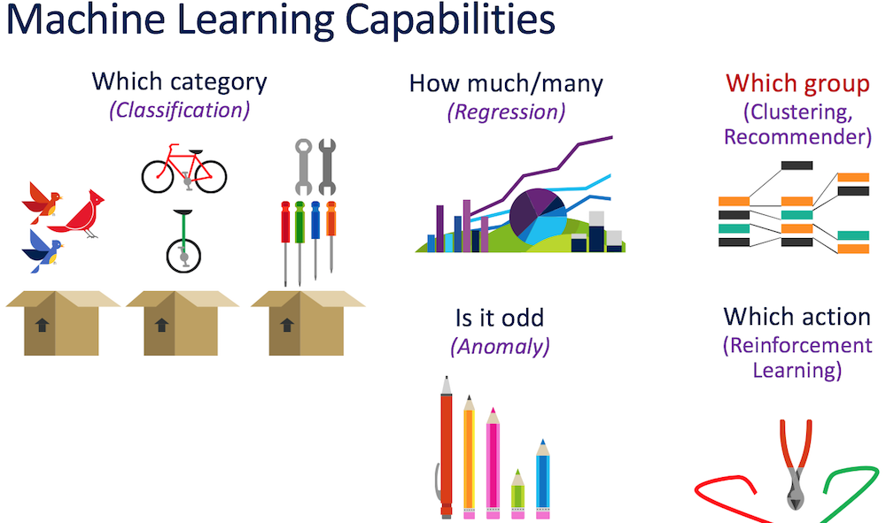
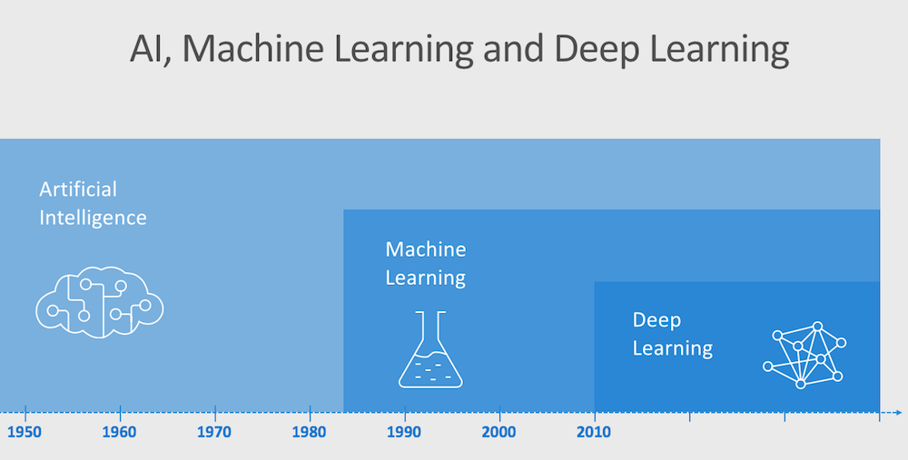

# Hybrid Machine Learning

#### <i>A Microsoft Course from the Learn AI team</i>

## 1 - Project Methodology and Data Science

In this course you'll cover using a Process and a Platform to create a hybrid Machine Learning solution you can deploy on SQL Server. In each section you'll get more references to go deeper, which you should follow up on. Also watch for links within the text - click on each one to explore that topic.

<a href="ML%20Services%20for%20SQL%20Server/00%20Pre-Requisites.md" target="_blank">Make sure you check out the <b>00 Pre-Requisites</b> page before you start</a>. You'll need all of the items loaded there before you can proceed with the course.

You'll cover these topics in the course:

<dl>
  <dt>Modules in this course:</dt>
  <dt><a href="ML%20Services%20for%20SQL%20Server/01%20Project%20Methodology%20and%20Data%20Science.md" target="_blank">1 Project Methodology and Data Science</a></dt>
  <dt><a href="02%20Business%20Understanding.md" target="_blank">2 Business Understanding</a></dt>
  <dt><a href="20Data%20Acquisition%20and%20Understanding.md" target="_blank">3 Data Acquisition and Understanding</a></dt>
  <dt><a href="04%20Modeling.md" target="_blank">4 Modeling</a></dt>
  <dt><a href="05%20Deployment.md" target="_blank">5 Deployment</a></dt>
  <dt><a href="06%20Customer%20Acceptance%20and%20Retraining.md" target="_blank">6 Customer Acceptance and Model Retraining</a></dt>
<dl>

<h2>1.1 Creating an Advanced Analytics Project</h2>

This course covers the Process and Platform you can use for Data Science projects, using SQL Server 2017 (or higher) and Azure Machine Learning Services. Using Machine Learning Services inside a database engine allows you to keep the data integrity you have built into your RDBMS, provides a high level of security, the ability to work on premises, in the cloud, or in a hybrid fashion, and eliminates data travel outside your database environment. It also allows your data professionals to work in the area they know well, and still allow Data Scientists to work with R or Python to perform predictive, clustering, and categorical models with easy deployment. Using Azure Machine Learning Services in the cloud allows you to train on larger sets of data and with more functions and with flexible scalability. This course shows you how to combine both platforms to train on anonymized data remotely in Azure, and then deploy the model it creates, making predictions on data in-house.

To begin, it's best to focus not on the technologies you will use, but the process you can follow to determine the best solution. It's important to involve the right team members in the project, especially where security is involved. The activities typically involved in an Advanced Analytics project contain the following phases:

 <table style="width: 75%; tr:nth-child(even) {background-color: #f2f2f2;}; text-align: left; display: table; border-collapse: collapse; border-spacing: 2px; border-color: gray;">

  <tr>
    <th style="background-color: #1b20a1; color: white;">Phase</th>
    <th style="background-color: #1c6afc; color: white;">Description</th>
    <th style="background-color: #1b20a1; color: white;">Typical Deliverable</th>
  </tr>

  <tr>
    <td><b>Discovery</b></td>
    <td>Initial Contact between technical teams, consultants, and business owners.  <i>Outcome: Problem statement definition</i></td>
    <td><a href="assets/Project/1%20-%20Discovery.docx" target="_blank">Discovery Word Document</a></td>
  </tr>

  <tr>
    <td><b>Envisioning</b></td>
    <td>Technical team and consultants develop initial components of proposed solution.  <i>Outcome: Team briefing on the decision points for creating a solution</i></td>
    <td><a href="assets/Project/2%20-%20Envisioning.pptx" target="_blank">Envisioning PowerPoint</a></td>
  </tr>

  <tr>
    <td><b>Architecture Design Session (ADS)</b></td>
    <td>Using the decision points from the previous phase, the technical team selects the components for a Proof of Concept exercise.  <i>Outcome: ADS Diagram and explanation of decisions</i></td>
    <td><a href="assets/Project/3%20-%20ADS%20Decision%20Tree.xlsx" target="_blank">ADS Decision Matrix Excel Sheet</a> and <a href="assets/Project/3%20-%20ADS.vsdx" target="_blank">ADS Visio Template</a></td>
  </tr>

  <tr>
    <td><b>Proof-Of-Concept (POC)</b></td>
    <td>A small version of the solution is created, using the actual data flow. Here you discover any issues with the ADS output.  <i>Outcome: A simple example worked through end-to-end that demonstrates data flow.</i></td>
    <td><a href="assets/Project/4%20-%20POC.mpp" target="_blank">POC Project Plan</a></td>
  </tr>

  <tr>
    <td><b>Implementation</b></td>
    <td>Project is put into place using the learnings from the ADS and POC, with regular CI/CD and other DevOps controls. If the previous activities result in a Predictive or Classification solution (including AI), then the <b>Data Science Process</b> described below is implemented here.  <i>Outcome: Completed project</i></td>
    <td><a href="assets/Project/Project%20Plan.xlsx" target="_blank">Implementation Plan in Excel</a>  <a href="assets/Project/5%20-%20Implementation.mpp" target="_blank">(Full Microsoft Project File here)</a></td>
  </tr>

  <tr>
    <td><b>Handoff</b></td>
    <td>Post-mortem on the project is performed, end-customer or support staff is given control of the project, enhancements and V2 is discussed, team disbands.  <i>Outcome: Project post-mortem briefing, V2 discussion</i> </td>
    <td><a href="assets/Project/6%20-%20Handoff.pptx" target="_blank">Handoff PowerPoint Briefing File</a></td>
  </tr>

  </table>

The output of this project planning is a high level architecture diagram, and a Project Plan defining the team and the timelines.

During the Architecture Design Session *(ADS)* phase, you will create your architecture. During the Implementation phase, you will invoke the *Team Data Science Process*, which you'll focus on for the rest of this course.

<h2>1.2 The Data Science Process</h2>

If the discovery and architecture for the solution results in the need for a Prediction, Classification or Artificial Intelligence solution, you'll follow a Data Science process to understand the business requirements, examine the data from a customer database, create two experiments to find the best model, and deploy the completed model in a Stored Procedure that is called from a client application.

In this particular solution you'll set up your SQL Server environment and use a client tool to work with a database to create a predictive solution that you will deploy with a Stored Procedure.
<h2>1.2.1 Data Science</h2>

Data Science is an "umbrella" term that encompasses almost all Advanced Analytics. It combines the processes from working with data with technology, and also the scientific process.

To work in the Data Science field, it's helpful to have a background in various maths families (linear algebra, statistics, even formal logic), computing data technologies (such as programming in functional and object-oriented languages, database technologies such as NoSQL and RDBMS's, and "Big Data" areas such as Spark) and a "domain" of knowledge in some general area (finance, healthcare, government, manufacturing and such) or a broad knowledge in many industries.

The Data Scientist performs multiple types of analysis, from historical descriptive evaluations through predictive and prescriptive analysis.

To do predictive and prescriptive analysis, the Data Science team leverages *Machine Learning*. Machine Learning technologies consume large amounts of data in the form of *Features* (columns of data that are predictive or classifying in nature) and *Labels* (the data you want to predict or classify). For instance, knowing where someone grew up or traveled to can give you insight into the types of food they might like to eat.

There are various "families" of algorithms that you can use to answer questions. They include the following:

Machine Learning uses algorithms to create (train) a completed *Model*. The training looks at various Features and "learns" how it affects a supplied "Label". It then selects the best path to work with data it has *not* seen. You can then send new data (Features) and the Model will return it's guess for the Label, usually along with how confident it is in the guess.

Machine Learning is used in both Deep Learning and Artificial Intelligence. You can see this interaction here:

Machine Learning, when layered in certain ways, forms the concept of *Deep Learning*. Machine Learning also forms the basis for Artificial Intelligence, which normally involves adding in "sensory" areas like vision, text and language.

There are various Platforms you can use to implement Machine Learning, such as Spark, Hadoop, AzureML and more. In this course you'll focuson using the SQL Server Platform to create, train, and deploy your completed predictive Model.

<h2>1.2.2 A Brief overview of The Team Data Science Process</h2>

Now that you understand the technologies and Platforms behind Data Science, you need to understand a repeatable, scalable Process for your solutions.

While it's tempting to start with the algorithms and the outputs, it's actually more important to understand the general process of a Data Science project. To do that, you can use the *Team Data Science Process* - in fact, you have been studying many of these steps already:

Each of these phases has a specific set of steps you follow to complete them. You'll work with each in the course modules that follow.

<h4>Step One - Business Understanding</h4>

Read the [Documentation Reference here](https://docs.microsoft.com/en-us/azure/machine-learning/team-data-science-process/lifecycle-business-understanding)

In this first step you identify the key business variables that the analysis needs to predict. We refer to these variables as the model targets, and we use the metrics associated with them to determine the success of the project.

You've actually already done this step in the first three phases of the project we've been creating. You can take the outputs you created and include them as the assets for this step described in the documentation reference.

<h4>Step Two - Data Acquisition and Understanding</h4>

Read the [Documentation Reference here](https://docs.microsoft.com/en-us/azure/machine-learning/team-data-science-process/lifecycle-data)

The Data Acquisition and Understanding phase of the TDSP you ingest or access data from various locations to answer the questions the organization has asked. In most cases, this data will be in multiple locations. Once the data is ingested into the system, you’ll need to examine it to see what it holds. All data needs cleaning, so after the inspection phase, you’ll replace missing values, add and change columns. You’ve already seen the Libraries you'll need to work with for Data Wrangling - Pandas being the most common in use.

<h4>Step Three - Modeling</h4>

In this phase, you will create the experiment runs, perform feature engineering, and run experiments with various settings and parameters. After selecting the best performing run, you will create a trained model and save it for operationalization in the next phase. This modeling is done with yet another set of Python Libraries - the most common being SciKit Learn and TensorFlow, You'll see this in action in just a bit.

Read the [Documentation Reference here](https://docs.microsoft.com/en-us/azure/machine-learning/team-data-science-process/lifecycle-modeling)

<h4>Step Four - Deployment</h4>

In this phase you will take the trained model and any other necessary assets and deploy them to a system that will respond to API requests.

Read the [Documentation Reference here](https://docs.microsoft.com/en-us/azure/machine-learning/team-data-science-process/lifecycle-deployment)

<h4>Step Five - Customer Acceptance</h4>

The final phase involves testing the model predictions on real-world queries to ensure that it meets all requirements. In this phase we also document the project so that all parameters are well-known. Finally, a mechanism is created to re-train the model.

Read the [Documentation Reference here](https://docs.microsoft.com/en-us/azure/machine-learning/team-data-science-process/lifecycle-acceptance)

As you can see, there are quite a few things to do to in a Data Science Machine Learning project. Rather than have you create an entire solution, there is one you can examine to see each phase. You'll do that throughout the rest of this course.

<b>Activity: Review/Create the Solution Architecture</b>

In this activity, you will review (or if time permits, create) the architecture for your solution. Open the *ML Services For SQL Server/assets/Project* folder for this course, and locate the *ADS Decision Tree.xlsx* file you see there.

NOTE: If you do not have Microsoft Excel installed, you can use the Visual Studio Excel Preview add-in by right-clicking the Excel file name in the Files area of the Explorer in Visual Studio Code - you can also <a href="https://support.microsoft.com/en-us/help/979860/supported-versions-of-the-office-viewers" target=_blank>install a viewer from this location</a>.

In an actual project, you would include the appropriate team members for each area, and document the discussions in the proper tab in the spreadsheet. For each area, you type each option for that function in the left-most column, and then put the reason you would, and would not, use that option for the tab's function in the next two columns. Your team gives each option a score, with 3 being the best choice, and 1 being the least desirable (multiple options may end up with the same score). Your team selects the option you want to suggest for that function. This exercise can take a few minutes, or several days, depending on how complex the solution becomes.

Rank each of the tab's options from highest to lowest, and then place the winning option on the "Rollup" tab, along with your justification of that choice.

This activity forms the basis of your solution, and it's diagram. For this course, you may only have time to examine each of these choices, but you should return to this process when you can spend more time on it.

Based on the choices made for this course exercise, you have the following diagram:

<h2>1.3 Understanding the SQL Server ML Services Architecture</h2>

Since you will operationalize on-premises using SQL Server, it's important to understand how it works with its Machine Learning Services feature.

SQL Server 2016 introduced the R as a companion process inside the SQL Server space. SQL Server 2017 and later also now have Python language support, in the same fashion and usage as R.

If selected, the Installer program for SQL Server installs the Microsoft ML Server *alongside* the SQL Server Instance, and then sets up a Service (called *SQL Launchpad*) allowing the two servers to communicate over a hybrid memory channel. When the R or Python language is called via a special Stored Procedure (which you must enable) SQL Server transfers data to the R or Python process which runs the code, and returns the result to the Stored Procedure in SQL Server.

You can run code to execute in Python as well as R. You can use either language by simply setting a parameter in the Stored Procedure.

This allows SQL Server professionals to work with and hybrid data in the way they are familiar with, and the Data Scientist to develop their R or Python code anywhere, and then deploying that code to SQL Server by embedding it in a Stored Procedure.

<b>Activity: Enable external script execution in SQL Server</b>

- Open Visual Studio Code, and then open the course file `ML Services for SQL Server/code/SQL Scripts for hybrid ML Course.sql`. NOTE: If this is the first time that VS Code has connected to SQL Server, the Extension may open a console window showing the installation and configuration of the add-in. Allow that to complete before you proceed.

- Press F1 and type `sql connect` to connect to your SQL Server Instance. <a href="https://docs.microsoft.com/en-us/sql/linux/sql-server-linux-develop-use-vscode?view=sql-server-2017" target=_blank>(More on how to do that here)</a>:

- Find the section in the file marked `/* Activity: Enable external script execution in SQL Server */`, and run the code blocks (ending with **GO**) for each block in that section (*highlight and press* **CTRL-SHIFT-E**) from that section until `/* End Activity: Enable external script execution in SQL Server */`. Follow any instructions you see there.

<b>For Further Study</b>

 

- Primary Documentation: https://docs.microsoft.com/en-us/sql/advanced-analytics/r/sql-server-r-services?view=sql-server-2017

Next, you'll continue following the Team Data Science Process with <a href="02%20Business%20Understanding.md" target="_blank"><i>Phase 2 - Business Understanding</i></a>