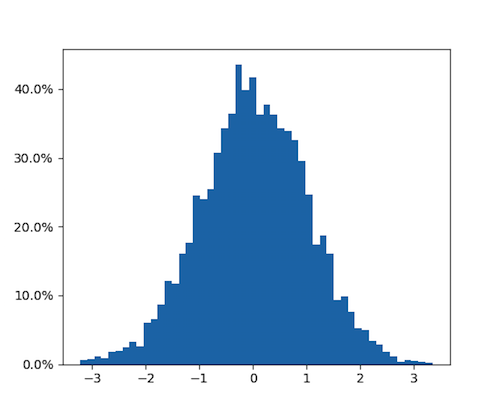



# Python for Data Professionals

## 03 Working with Data

<dl>
  <dt>Course Outline</dt>
  <dt>1 - Overview and Course Setup</dt>
  <dt>2 - Programming Basics</dt>
  <dt>3 Working with Data <i>(This section)</i></dt>
    <dd>3.1 Data Types</dd>
    <dd>3.2 Data Ingestion</dd>
    <dd>3.3 Data Inspection</dd>
    <dd>3.4 Graphing</dd>
    <dd>3.5 Machine Learning and AI</dd>
  <dt>4 Deployment and Environments</dt>
<dl>

Working with data is the main part of this course. This section will be quite a bit longer than what you have done so far, and the Activities will be harder. Remember to use the cheat-sheets and other references in the `./assets` course directory, because not everything you need to know will be in the course explanation. You'll need to dig a bit more and experiment, use the `help()` function, and do a bit of researching to figure out how to complete the Activities.

<b>3.1 Data Types</b>

In most any language, after the Data Professional learns how to use help, they want to find out what data types the language supports, and how the language works with them. You covered the way Python works with data in the last module (under the topic *Operators*), so now you need to figure out the types of data Python can work with.

Note that the data types you'll see next are the ones built-in to the Python language. Just like a Data Platform will often take a "primitive" data type and build on that with libraries, Python will do the same thing. You'll cover that in more depth in a moment.

Python has 5 standard data type "families":

- Numbers
- Strings
- Lists
- Tuples
- Dictionaries

<b>Numbers</b>

Numbers contain the following types:

- int (signed integer)
- long (long integers in either decimal, octal or hex)
- float (real floating point numbers)
- complex (integers in the range of 0-255)

<b>Strings</b>

Strings are ASCII characters within a single quote, double quote, or if you want to span a line, triple quotes. They are treated as an array of sorts, so if you do this:

`myName = "Buck"`

Then you can do this:

`print(myName[0])`

And you get back this:

<pre>B</pre>

Oh, and there are all kinds of formatting options you have with strings. [Check those out here](https://pyformat.info/)

<b>Lists</b>

Lists are arrays - and you're not limited to a single dimension. You define them by enclosing the values in square brackets.

Here's a list:

`myList = [0, 1, 2]`

And now you can decorate that with data:

`myList[0] = "One"`

`myList[1] = "Two"`

`myList[2] = "Three"`

`print(myList)`

`print(myList[2])`

And so on. There are also ranges, loops, and methods you can use on lists - [more on that here](https://www.tutorialspoint.com/python/python_lists.htm)

<b>Tuples</b>

Tuples are similar to Lists, but are immutable - you can't extend or shrink them dynamically. Think of them as a readable SQL Table. You define a tuple with parenthesis rather than square brackets.

Use a Tuple when you want to "protect" the data structure so that no one changes the structure after you define it. You'll see some real-world examples throughout this course.

<b>Dictionaries</b>

Dictionaries are Key-Value Pair (KVP) data. You set these up with a curly-brace, the key, a colon, and then the value, like this:

`myDict = {1: "Buck", 2: "Jane", 3: "Jim"}`

Now you can work with them by the key or the value. For instance, to show the value for key 1, it's simply: 

`myDict[1]`

Or to find the key for Buck, you simply type this:

`myDict["Buck"]`

Dictionaries are used quite frequently in Python, so you should take some time to [read up on them here](https://docs.python.org/2/tutorial/datastructures.html#dictionaries)

<b>Activity - Programming basics</b>

Open the **03_WorkingWithData.py** file and enter the code you find for section 3.1. The exercises will be marked out using comments:

`# <TODO> - 3.1 `

<b>3.2 Side-track: Working with Libraries for Data</b>

Python includes most of the functions you need to read data from files, work with them in memory and so on in the base installation. However, There is a way to add in to the functions you have for your code, using *Libraries*. Libraries are code someone else has written that you add in to your program from the start, using an `import` statement. You'll cover more information on working with Libraries (sometimes referred to as Modules or Packages, but more correctly Libraries) in a future lesson, but data "wrangling" (importing, manipulating and exporting) usually involves adding in at least one or two Libraries, so you'll cover that here.  

<b>NumPy</b>

*NOTE: You'll need to install both NumPy and Pandas before you can use them. You will cover that in a later lesson - your pre-requisites included this installation for now.*

To work with numeric data, the first library you should become familiar with is *NumPy* (Numerical Python). The primary structure in NumPy is the *array*.

To load the library, use the `import` statement with an optional "alias" of np:

`import numpy as np`

Now when you reference NumPy's methods and properties, you can use the shorter `np` label.

It's simple enough to create and work with an array, now that you have the library loaded. This code creates a 2-dimensional NumPy array, and sets the values to integer:

`x = np.array([(1,2,3), (4,5,6)], dtype = int)`

The next important concept in NumPy is that the array is actually a set of pointers, involving four main components:

- *data* : The memory address of the first byte in the array

- *dtype* : The type of the elements in the array

- *shape* : The layout of the array

- *strides* : The number of bytes skipped in memory to go to the next element of the array

Here are those properties in action:

`print(x.data)`

`print(x.dtype)`

`print(x.shape)`

`print(x.strides)`

Now you can use the array, mostly by doing maths on them. Here are a few examples:

Add, subtract, multiply and divide x and y:

`np.add(x,y)`

`np.subtract(x,y)`

`np.multiply(x,y)`

`np.divide(x,y)`

You can experiment with a few more NumPy operations on your own in the Activities that follow.

<b>Activity - Programming with NumPy</b>

Open the **03_WorkingWithData.py** file and enter the code you find for section 3.1a. The exercises will be marked out using comments:

`# <TODO> - 3.1a`

<b>Pandas</b>

The primary library you'll use in working with data in Python is *Pandas* (the *Python Analysis Data Library*). Pandas provides many methods and properties that you can work with for your data, and it also has other data structures that make it more efficient to work with data.

Just as in NumPy, use the `import` statement to load the Pandas Library:

`import pandas as pd`

Once the library is in memory, you start using it by creating a *dataframe* - the primary object Pandas works with. A dataframe is a mixed-type structure that looks similar to a SQL Table, and is very efficient. You can assign almost any data to a dataframe - here's an example that creates a dataframe by reading a comma-separated file:

`my_df = pd.read_csv('./data/data.csv')`

This illustrates one way of ingesting data, and in a moment you'll see a few more. Pandas has a lot of data sources it can work with, from the Clipboard to various filetypes. Here's a short list:

- Flat Files

- Clipboard

- Excel

- JSON

- HTML

- HDFStore: PyTables (HDF5)

- Feather

- Parquet

- SAS

- SQL

- Google BigQuery

- STATA

...among others.

Now with the dataframe (`my_df`) loaded, it's an object you can work with. If you just type the name of the dataframe, you'll get back the data in the "table".

Pandas has a lot of functions that allow you to work with data after you've inspected it. To work with datasets like you would in an RDBMS, here are a few examples.

Starting with an equivalent (kind of) to the SELECT statement in SQL, you can project a column with the statement `my_df[col]`. Use a comma and include other columns to form *column, column*. These will come back as a new dataframe.

If you want to use an ordinal position use `my_df.iloc[0]`. 

f you know the index you want, use `my_df.loc['index_one']`.

If you want the whole row, use `my_df.iloc[0,:]` (for the first row).

For a WHERE clause, use the comparison tokens you saw earlier. For instance, to get the months lower than October, use `my_df[my_df[month] > 9]`. 

For ORDER BY, use the sort_values function. This command sorts the first column of the dataframe in ascending order: `my_df.sort_values(col1,ascending=True)`.

Moving on to JOIN operations, you have the ability to use multiple kinds of joins - for instance, the statement `my_df.join(my_df2,on=col1,how='inner')` joins the two dataframes `my_df` and `my_df2' on the column *col1* (which must exist in both dataframes).

There's a lot more you can do with Pandas, including a lot of data cleaning operations that you'll use for Machine Learning and other Data Science tasks. You'll experiment with this in your Activities.

Want to learn more? Check this reference: https://pandas.pydata.org/pandas-docs/stable/tutorials.html 

<b>Activity - Programming with Pandas</b>

Open the **03_WorkingWithData.py** file and enter the code you find for section 3.1b. The exercises will be marked out using comments:

`# <TODO> - 3.1b`

(Note: Use the Cheat-sheets in the `./assets` directory in the exercise that follows)

<b>3.3 Data Ingestion</b>

Python has many ways to read data in (*sometimes into memory, sometimes streaming as it reads it*) built right in to the standard libraries. Other Libraries, such as Pandas and NumPy, have their own way of reading in data.

In any case, the data is assigned to a data family or *structure*, which you learned about earlier. Depending on which Library you are using, you'll pick a data structure that makes the most sense for how you want to work with it. For instance, Pandas uses a dataframe as the primary data structure it works with. This is why it's important to know the data types, so that you understand what stucture you need to perform your desired operations.

<b>Reading from Files</b>

Many times the data you are looking for is in storage, either locally or remotely. *File-source* based data is loosely defined as whatever data the operating system can reach natively.

*NOTE:* This means that when you write your code, it's important to know where it will run. Python is an *interpreted* language, which means that it will run on a given platform in a certain way. If you load data from a Windows file system, and it gets deployed to a Linux system, you need to make sure the file-paths check for validity.

You've already seen how to read data with Pandas. For the built-in Python library, you most often use the csv reader on comma-separated value data. To use it, import the `csv` module. From there, you can use a "with" block to process the file. This example opens a file, uses an if statement to process each line, and if the line contains "carrot", prints the ingredient, the type of carrot (shredded, sliced, etc.), and the amount for the recipe:

<pre>
import csv
with open('mydata.csv') as csvfile:
    reader = csv.DictReader(csvfile)
    for row in reader:
        if row['ingredient'] == 'carrot':
            print(row['ingredient'] ,row ['type'],row ['amount'])
</pre>

(Note the indentation - very important!)

The csv reader has a "dialect" modifier so that you can work with CSV files that are stored in a particular way - use the `help()` function to learn more.

Reference: https://realpython.com/python-csv/ 

<b>Working with Data in Databases</b>

Python has Libraries available that allow you to connect to a Relational Database Management System (RDBMS). the `pydobc` Library is one of the most widely used, and works well with Microsoft's SQL Server. You can read more about pyodbc and download it here: https://docs.microsoft.com/en-us/sql/connect/python/pyodbc/python-sql-driver-pyodbc?view=sql-server-2017 

Once you install it (more on installing Libraries later), you once again import it, and then set up your connection. You then use the connection to send a query, returning a dataset, or updating data if that's what you're going for. Here's an example:

<pre>
    import pyodbc

    server = 'tcp:myserver.database.windows.net'
    # Some other example server values are
    # server = 'localhost\sqlexpress' for a named instance
    # server = 'myserver,port' to specify an alternate port

    database = 'mydb'
    username = 'myusername'
    password = 'mypassword'

    cnxn = pyodbc.connect('DRIVER={ODBC Driver 17 for SQL Server};SERVER='+server+';DATABASE='+database+';UID='+username+';PWD='+ 
    password)

    cursor = cnxn.cursor()

    # Sample select query
    cursor.execute("SELECT @@version;")
    row = cursor.fetchone()

    while row: 

        print row[0]
        row = cursor.fetchone()

    # Sample insert query

    cursor.execute("INSERT SalesLT.Product (Name, ProductNumber, StandardCost, ListPrice, SellStartDate) OUTPUT INSERTED.ProductID 
    VALUES ('SQL Server Express New 20', 'SQLEXPRESS New 20', 0, 0, CURRENT_TIMESTAMP )")

    row = cursor.fetchone()
    while row:
        print 'Inserted Product key is ' + str(row[0]) 
        row = cursor.fetchone()
</pre>

<b>Data in Other Sources</b>

Many other data sources, such as cloud databases and network streams, also have ways of connecting from Python. Even web pages can be used as data sources. One of the primary Libraries for working with web data is *Beautiful Soup*, [which you can find here](https://www.crummy.com/software/BeautifulSoup/). You normally need to connect to the web page first, so for that you use another import, using `requests`, or perhaps `urllib` or `urllib2`. 

Here's an example of reading a web page and printing all the links it has:

<pre>
    from bs4 import BeautifulSoup
    import requests
    html_doc  = requests.get("http://coolwebpage.com")
    soup = BeautifulSoup(html_doc, 'html.parser')
    print(soup.get_text())
</pre>

<b>Activity - Data Ingestion</b>

Open the **03_WorkingWithData.py** file and enter the code you find for section 3.2. The exercises will be marked out using comments:

`# <TODO> - 3.2`

<b>3.4 Data Inspection</b>

After the data is loaded into a structure, the first step in analytics is to examine the data. You've already seen how to display the data using Pandas, and it's one of the best libraries for data exploration as well.

Analytics professionals often start with the basics of the statistical layout of the numeric data in a dataset. If you want to see the basic statistics of your data stored in a dataframe called *my_df*, type `my_df.describe()`.  

You'll also want to determine the amount of data you're working with. To do that, type `my_df.shape` to get the number of rows and columns in a dataframe. 

Typing `my_df.head(n)` gives you `n` first rows of the data, or use `my_df.tail(n)` to get the end number of rows returned. 

Another way to see the "shape" of the data is to use `my_df.info()` to see the index, datatypes and memory information for the dataframe.

<b>Activity - Data Inspection</b>

Open the **03_WorkingWithData.py** file and enter the code you find for section 3.3. The exercises will be marked out using comments:

`# <TODO> - 3.3`

<b>3.4 Graphing</b>

Examining the data in tabular format won't give you all you need to evaluate and interpret it. It is very useful to display the data in a graphical format, and once again you'll turn to Libraries to do that. There are many Libraries for graphing data in Python, and more are written constantly. The  primary Libraries you should be familiar with are MatPlotLib and ggplot.

<b>Graphing Data with MatPlotLib</b>

MatPlotLib is quite old, bu it’s the most widely used graphical library for plotting in Python. It borrowed much of it's design  from an industry commercial standard called MATLAB. Many other Libraries are built on top of MatPlotLib or simply work along side it.

Take a look at an example of a histogram plot with MatPlotLib:

<pre>
    import matplotlib
    from numpy.random import randn
    import matplotlib.pyplot as plt
    from matplotlib.ticker import FuncFormatter

    def to_percent(y, position):
        # Ignore the passed in position. This has the effect of scaling the default
        # tick locations.
        s = str(100 * y)

        # The percent symbol needs escaping in latex
        if matplotlib.rcParams['text.usetex'] is True:
            return s + r'$\%$'
        else:
            return s + '%'

    x = randn(5000)

    # Make a normed histogram. It'll be multiplied by 100 later.
    plt.hist(x, bins=50, normed=True)

    # Create the formatter using the function to_percent. This multiplies all the
    # default labels by 100, making them all percentages
    formatter = FuncFormatter(to_percent)

    # Set the formatter
    plt.gca().yaxis.set_major_formatter(formatter)

    plt.show()
</pre>

Of course, MatPlotLib can do so much more. [Take a look at this reference from the documentation which goes deeper.](https://matplotlib.org/examples/index.html)

<b>Graphing with ggplot</b>

The ggplot library is also used in the R language (in a newer version called *ggplot2*). It follows the guidelines from the *Grammar of Graphics* reference work. The commands in ggplot layer the graphical components. You'll make a base graphic, and even after you create the chart you add axes, a line, add a trendline, coloring and more.

Here's an example of a plot using the ggplot Library, with the mtcars sample dataset. Notice how it "builds" on the plot so that it's fairly easy to see how it represents each part:
<pre>
    from ggplot import *

    p = ggplot(aes(x='mpg'), data=mtcars)
    p += geom_histogram()
    p += xlab("Miles per Gallon")
    p += ylab("# of Cars")
    p
</pre>

[Check out the official documentation for many more examples.](https://github.com/yhat/ggpy/tree/master/docs)

<b>Activity - Graphing</b>

Open the **03_WorkingWithData.py** file and enter the code you find for section 3.4. The exercises will be marked out using comments:

`# <TODO> - 3.4`

<b>3.6 Altering Data</b>

Most data isn't "clean" by default. It's either in the wrong format, missing values, or isn't all structured the way you need it. For this type of work, there are two basic tasks you should learn: Regular Expressions and once again, Pandas. You won't cover an exercise on data editing in this section; instead you'll see an example of that as part of a Machine Learning exercise.

You can use Regular Expressions in Python to make a lot of your changes - you can read more about that here: https://docs.python.org/3/library/re.html

But most of the time you'll be using Pandas to make those changes. You can read more about that here: https://tomaugspurger.github.io/modern-5-tidy.html 

And of course there are lots of other things to know about altering data. Read this resource for more: https://www.springboard.com/blog/data-wrangling/ 

<b>3.7 Machine Learning and AI</b>

A full course on Machine Learning (and one of its applications, Artificial Intelligence), is long and involved. Machine Learning involves evaluating data for *features* (columns) that can create *labels* (predictions or classifications). You do this by using a collection of historical data, and selecting the most predictive features and applying one or more algorithms to that data. You get back a *model* (which is kind of like a function) that you can send new data to for a prediction. This is a bit of an oversimplification of course, but it will serve you well as you work through this course. For a more comprehensive discussion on Data Science and Machine Learning with Python, check out this reference: https://notebooks.azure.com/jakevdp/libraries/PythonDataScienceHandbook

There are a few "families" of problems you can solve with a Machine Learning Solution:

While it's tempting to start with the algorithms and the outputs, it's actually more important to understand the general process of a Data Science project. To do that, you can use the Team Data Science Process - in fact, you have been studying many of these steps already:

Each of these phases has a specific set of steps you follow to complete them:

 
<h4>Phase One - Business Understanding</h4>

In the Business Understanding Phase the team determines the prediction or categorical work your organization wants to create. You'll also set up your project planning documents, locate your initial data source locations, and set up the environment you will use to create and operationalize your models. This phase involves a great deal of coordination among the team and the broader organization.

Read the [Documentation Reference here](https://docs.microsoft.com/en-us/azure/machine-learning/team-data-science-process/lifecycle-business-understanding)

 

<h4>Phase Two - Data Acquisition and Understanding</h4>

Read the [Documentation Reference here](https://docs.microsoft.com/en-us/azure/machine-learning/team-data-science-process/lifecycle-data)

The Data Aquisition and Understanding phase of the TDSP you ingest or access data from various locations to answer the questions the organization has asked. In most cases, this data will be in multiple locations. Once the data is ingested into the system, you’ll need to examine it to see what it holds. All data needs cleaning, so after the inspection phase, you’ll replace missing values, add and change columns. You’ve already seen the Libraries you'll need to work with for Data Wrangling - Pandas being the most common in use.

 
<h4>Phase Three - Modeling</h4>

In this phase, you will create the experiment runs, perform feature engineering, and run experiments with various settings and parameters. After selecting the best performing run, you will create a trained model and save it for operationalization in the next phase. This modeling is done with yet another set of Python Libraries - the most common being SciKit Learn and TensorFlow <TODO>: References, among others. You'll see this in action in just a bit.

Read the [Documentation Reference here](https://docs.microsoft.com/en-us/azure/machine-learning/team-data-science-process/lifecycle-modeling)

 
<h4>Phase Four - Deployment</h4>

In this phase you will take the trained model and any other necessary assets and deploy them to a system that will respond to API requests.

Read the [Documentation Reference here](https://docs.microsoft.com/en-us/azure/machine-learning/team-data-science-process/lifecycle-deployment)

 
<h4>Phase Five - Customer Acceptance</h4>

The final phase involves testing the model predictions on real-world queries to ensure that it meets all requirements. In this phase you also document the project so that all parameters are well-known. Finally, a mechanism is created to re-train the model.

Read the [Documentation Reference here](https://docs.microsoft.com/en-us/azure/machine-learning/team-data-science-process/lifecycle-acceptance)

 

As you can see, there are quite a few things to do to work with Python in a Data Science Machine Learning project. Rather than have you create an entire solution, there is one you can examine to see each phase. You'll do that next.

<b>Activity - Machine Learning</b>

Now open the `/code/03_MachineLearning.py` file and read the code-blocks you see there marked "Machine Learning". 

Don't worry too much about the math and the functions in the Machine Learning Libraries, just focus on the process. Then swing back around to that Data Science with Python references for a deeper dive into this very large area.

Want to see this in action? Check out this reference: https://tdsppython-buckwoodynotebooks.notebooks.azure.com/nb/notebooks/Instructor%20Notebook.ipynb 

<b>For Further Study</b>

- [Python Docs for Data Types](https://docs.python.org/2/tutorial/datastructures.html#)

Next, Continue to *04 Environments and Deployment*