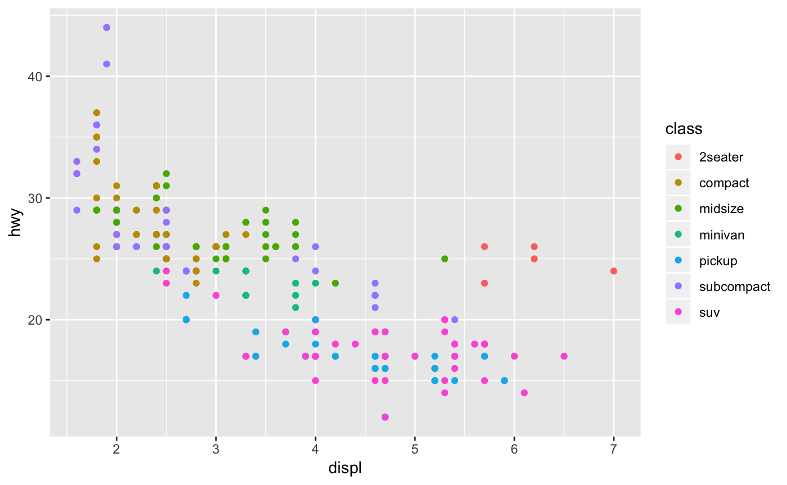



# R for Data Professionals

## 03 Working with Data

<dl>
  <dt>Course Outline</dt>
  <dt>1 - Overview and Course Setup</dt>
  <dt>2 - Programming Basics</dt>
  <dt>3 Working with Data <i>(This section)</i></dt>
    <dd>3.1 Data Types</dd>
    <dd>3.2 Data Ingestion</dd>
    <dd>3.3 Data Inspection</dd>
    <dd>3.4 Graphing</dd>
    <dd>3.5 Altering Data</dd>
    <dd>3.6 Machine Learning and AI</dd>
  <dt>4 Deployment and Environments</dt>
<dl>

Working with data is the main part of this course. This section will be quite a bit longer than what you have done so far, and the Activities will be harder. Remember to use the references in the `/assets` course directory, because not everything you need to know will be in the course files. You'll need to dig a bit more and experiment, use the `help()` function, and do a bit of researching to figure out how to complete the Activities.

<b>3.1 Data Types and Structures</b>

In most any language, after you learn how to use help, you'll want to find out what data types the language supports, and how the language works with them. You covered the way R works with data in the last module (under the topic *Operators*), so now you need to figure out the types of data R can work with. R has these general data types:

 - Character
 - Numeric
 - Integer
 - Logical
 - Complex

Note that these data types are the ones built-in to the R language. Just like a Data Platform will often take a "primitive" data type and build on that with libraries, R will do the same thing. You'll cover that in more depth in a moment.

R has 5 standard data type "families", called *Data Structures*:

- Vectors
- Matrices
- Arrays
- Data Frames (sometimes called DataFrames)
- Lists
- Factors

Within each of these, most accept characters or numbers. Some let you mix the two, others require that the data be all character or all numeric within a single structure.

<b>Vectors</b>

A vector is a line of discrete items, like cells in a spreadsheet. The vector data structure holds the data, and the position it holds. A vector holds data items of the same data type.

This example holds three values, and uses the `c()` (combine) operator you'll see shortly:

`x <- c(1, 2, 3)`

`x`

<pre>
    [1] 1 2 3
</pre>

<b>Matrices</b>

A matrix is another vector, but has more than one dimension:

`x <- matrix(nrow = 2, ncol = 2)`

`x`

<pre>
        [,1] [,2]
    [1,]   NA   NA
    [2,]   NA   NA
</pre>

<b>Arrays</b>

An array is like a matrix, but can have more than two dimensions.

<b>Lists</b>

A list can hold multiple data types, and looks like a vector:

`x <- list(10, "Buck", TRUE, 1 + 2)`

`x`

<pre>
    [[1]]
    [1] 10

    [[2]]
    [1] "Buck"

    [[3]]
    [1] TRUE

    [[4]]
    [1] 3
</pre>

<b>Data Frames</b>

Data Frames are the primary data structure you'll see used in R. It looks similar to a Matrix or List, but it has row and column headings in addition to other useful attributes:

<pre>
x <- c(1,2,3,4)
y <- c("red", "white", "blue", "red")
z <- c(TRUE,FALSE,TRUE,FALSE)
MyDataFrame <- data.frame(x,y,z)
names(MyDataFrame) <- c("ID","Color","Passed")
</pre>

Now you can work with this table-like structure in an intuitive way:

<pre>
MyDataFrame[3:5] # Columns 3,4,5 of data frame
MyDataFrame[c("ID","Color")] # Columns ID and Color from data frame
MyDataFrame[2, ] # Row 2 in the data frame
</pre>

There is a LOT more that you can do in Data Frames - and you'll work with those in the rest of the course.

<b>Factors</b>

Factors represent data numerically, even when it isn't. That's very handy for putting things into statistical groups (such as yes/no) and then doing analysis over it. For instance:

`x <- factor(c("yes", "no", "no", "yes", "no"))`

`x`

take a look at this result:

`table(x)`

<pre>
    x
    no yes 
    3   2 
</pre>

<b>3.1a Side-track: Working with Packages for Data</b>

R includes most of the functions you need to read data from files, work with them in memory and so on in the base installation. However, There is a way to add in to the functions you have for your code, using *Packages*. Packages contain functions someone else has written that you add in to your program from the start, using a `library()` statement. You'll cover more information on working with Libraries (sometimes referred to as Modules or Packages, but more correctly Libraries) in a future lesson, but data "wrangling" (importing, manipulating and exporting) usually involves adding in at least one or two Libraries, so you'll cover that here.  

<b>tidyverse</b>

*NOTE: You'll need to install tidyverse before you can use it. You will cover that in a later lesson - your pre-requisites included this installation for now.*

The primary Packages you'll use in working with data in R is using *tidyverse*. The [tidyverse](https://tidyverse.tidyverse.org/) package consists of other packages and libraries that provides many methods and properties that you can work with for your data, and it also has other data structures that make it more efficient to work with data. It includes the following packages:

<pre>
    ggplot2, for data visualisation.
    dplyr, for data manipulation.
    tidyr, for data tidying.
    readr, for data import.
    purrr, for functional programming.
    tibble, for tibbles, a modern re-imagining of data frames.
    stringr, for strings.
    forcats, for factors.
</pre>

To use these functions, call the `library()` function:

`library(dplyr)`

Once the library is in memory, you start using it.

There's a lot more you can do with tidyverse, including a lot of data cleaning operations that you'll use for Machine Learning and other Data Science tasks.

<b>Activity - Programming basics</b>

Open the **03_WorkingWithData.R** file and enter the code you find for section 3.1. The exercises will be marked out using comments:

`# <TODO> - 3.1 `

<b>3.2 Data Ingestion</b>

R has many ways to read data in (*sometimes into memory, sometimes streaming as it reads it*) built right in to the standard libraries. Other Libraries have their own way of reading in data.

In any case, the data is assigned to a data *structure*, which you learned about earlier. Depending on which Library you are using, you'll pick a data structure that makes the most sense for how you want to work with it. This is why it's important to know the data types and the Data Structures R uses, so that you understand what structure you need to perform your desired operations.

<b>Reading Data from Files</b>

Many times the data you are looking for is in storage, either locally or remotely. *File-source* based data is loosely defined as whatever data the operating system can reach natively.

*NOTE:* This means that when you write your code, it's important to know where it will run. R is an *interpreted* language, which means that it will run on a given platform in a certain way. If you load data from a Windows file system, and it gets deployed to a Linux system, you need to make sure the file-paths check for validity.

You've already seen how to read data with tidyverse's readr Library. For the built-in R library, you most often use the csv reader on comma-separated value data. To use it, use the the `read.csv()` function.

This example opens a website, stores it in a variable, and then displays the top few values from the data frame:

`data <- read.csv("https://aql.datapress.com/leeds/dataset/polling-station-locations/2016-03-17T10:33:18/Polling%20stations.csv")`

`head(data)`

<pre>
                                        STATION_NAME          STATION_ADD1 STATION_ADD2 STATION_ADD3 STATION_ADD4 STATION_ADD5 STATION_PCODE
    1                            Holy Trinity Church            Green Lane    Cookridge        Leeds                        NA      LS16 7LP
    2                     Adel Methodist Church Hall   Gainsborough Avenue         Adel        Leeds                        NA      LS16 7NX
    3             Holy Trinity C of E Primary School (Access via Car Park)   Green Lane    Cookridge        Leeds           NA      LS16 7EZ
    4                               Holt Park Active     Holtdale Approach        Leeds                                     NA      LS16 7RX
    5                             Adel Memorial Hall           Church Lane         Adel        Leeds                        NA      LS16 8DE
    6 Adel St John The Baptist C of E Primary School         Long Causeway         Adel        Leeds                        NA      LS16 8EX
</pre>

Note that the csv reader has various modifiers so that you can work with CSV files that are stored in a particular way - use the `help(read.csv)` function to learn more.

<b>Working wih Data in Databases</b>

R has Libraries available that allow you to connect to a Relational Database Management System (RDBMS). The primary Library is `odbc`, which uses the DBI interface, and works well with Microsoft's SQL Server. You can read more about odbc and download it here: https://cran.r-project.org/web/packages/odbc/index.html

Once you install it (more on installing Libraries later), you once again call it, and then set up your connection. You then use the connection to send a query, returning a dataset, or updating data if that's what you're going for. Here's an example, only using the internal sample `mtcars` dataset as a database:

<pre>
library(DBI)
con <- dbConnect(odbc::odbc())
dbListTables(con)
dbWriteTable(con, "mtcars", mtcars, temporary = TRUE)
dbReadTable(con, "mtcars")
dbListTables(con)
dbExistsTable(con, "mtcars")
# A zero row data frame just creates a table definition.
dbWriteTable(con, "mtcars2", mtcars[0, ], temporary = TRUE)
dbReadTable(con, "mtcars2")
dbDisconnect(con)
</pre>

<b>Other Sources</b>

Many other data sources, such as cloud databases and network streams, also have ways of connecting from R. Even web pages can be used as data sources. Three Libraries (XML, RCurl and rlist) can work together to read a Wikipedia table:

<pre>
library(XML)
library(RCurl)
library(rlist)
pageurl <- getURL("https://en.wikipedia.org/wiki/Portugal_national_football_team",.opts = list(ssl.verifypeer = FALSE) )
tables <- readHTMLTable(pageurl)
tables <- list.clean(tables, fun = is.null, recursive = FALSE)
tables
</pre>

<b>Activity - Data Ingestion</b>

Open the **03_WorkingWithData.R** file and enter the code you find for section 3.2. The exercises will be marked out using comments:

`# <TODO> - 3.2`

<b>3.4 Data Inspection</b>

After the data is loaded into a structure, the first step in analytics is to examine the data. You've already seen how to display the data using Pandas, and it's one of the best libraries for data exploration as well. R has many sample data sets you can use without having to load anything - here are a few of them:

<pre>
    AirPassengers           Monthly Airline Passenger Numbers 1949-1960
    BJsales                 Sales Data with Leading Indicator
    BJsales.lead (BJsales)
                            Sales Data with Leading Indicator
    BOD                     Biochemical Oxygen Demand
    CO2                     Carbon Dioxide Uptake in Grass Plants
    ChickWeight             Weight versus age of chicks on different diets
    DNase                   Elisa assay of DNase
    EuStockMarkets          Daily Closing Prices of Major European Stock
                            Indices, 1991-1998
    Formaldehyde            Determination of Formaldehyde
    HairEyeColor            Hair and Eye Color of Statistics Students
    Harman23.cor            Harman Example 2.3
    Harman74.cor            Harman Example 7.4
    Indometh                Pharmacokinetics of Indomethicin
    InsectSprays            Effectiveness of Insect Sprays
    JohnsonJohnson          Quarterly Earnings per Johnson & Johnson Share
    LakeHuron               Level of Lake Huron 1875-1972
    LifeCycleSavings        Intercountry Life-Cycle Savings Data
    Loblolly                Growth of Loblolly pine trees
    Nile                    Flow of the River Nile
    Orange                  Growth of Orange Trees
    OrchardSprays           Potency of Orchard Sprays
    PlantGrowth             Results from an Experiment on Plant Growth
    Puromycin               Reaction Velocity of an Enzymatic Reaction
    Seatbelts               Road Casualties in Great Britain 1969-84
    Theoph                  Pharmacokinetics of Theophylline
    Titanic                 Survival of passengers on the Titanic
    ToothGrowth             The Effect of Vitamin C on Tooth Growth in
                            Guinea Pigs
</pre>

And there are a LOT more. Use this statement to show them:

`data(package = .packages(all.available = TRUE))`

You can simply call these data sets by name and load them up - most are already in the form of a data frame. You can put them in a variable (object) or just look at them directly:

`head(mtcars)`

<pre>
                    mpg cyl disp  hp drat    wt  qsec vs am gear carb
    Mazda RX4         21.0   6  160 110 3.90 2.620 16.46  0  1    4    4
    Mazda RX4 Wag     21.0   6  160 110 3.90 2.875 17.02  0  1    4    4
    Datsun 710        22.8   4  108  93 3.85 2.320 18.61  1  1    4    1
    Hornet 4 Drive    21.4   6  258 110 3.08 3.215 19.44  1  0    3    1
    Hornet Sportabout 18.7   8  360 175 3.15 3.440 17.02  0  0    3    2
    Valiant           18.1   6  225 105 2.76 3.460 20.22  1  0    3    1
</pre>

You can call out a "slice" of the data in a data frame as you saw in your previous exercises, with a $ symbol and the column name:

`mtcars$mpg` 

Analytics professionals often start with the basics of the statistical layout of the numeric data in a data set. If you want to see the basic statistics of your data use the `fivenum()` function which gives you the five basic statistics (*minimum, lower-hinge, median, upper-hinge, maximum*)for a group of data. Note that you can only do this for numeric data:

`fivenum(mtcars$mpg)`.  

There is a LOT more exploration you can do with exploring data R - you'll see that in the exercises that follow.

<b>Activity - Data Inspection</b>

Open the **03_WorkingWithData.R** file and enter the code you find for section 3.3. The exercises will be marked out using comments:

`# <TODO> - 3.3`

<b>3.4 Graphing Data with R</b>

Examining the data in tabular format won't give you all you need to evaluate and interpret it. It is very useful to display the data in a graphical format, and once again you'll turn to Libraries to do that. There are many Libraries for graphing data in R, and more are written constantly. The  primary Libraries you should be familiar with are the built-in plots and *ggplot2*.

<b>Graphing with the standard R Charts</b>

R was purpose-built to be a data programming language, so it comes bundled with a graphics capability. You have histograms, scatterplots, boxplots, and Q-Q charts out of the box, and many more.

Type the following command to see a list of what you have available with the base R package, with examples:

`library(help = "graphics")`

In the exercises that follow you'll get more experience with these graphics.

<b>Graphing with ggplot2</b>

The [ggplot2 Library](https://ggplot2.tidyverse.org/reference/) follows the guidelines from the *Grammar of Graphics* reference work. The commands in ggplot2 layer the graphical components. You'll make a base graphic, and even after you create the chart you add axes, a line, add a trendline, coloring and more.

Happily, ggplot2 is part of the tidyverse, so if you followed the pre-requisites, you already have it.

Here's an example of a plot using the ggplot Library, with the mtcars sample data set. Notice how it "builds" on the plot so that it's fairly easy to see how it represents each part:

`library(ggplot2)`

`ggplot(mpg, aes(displ, hwy, colour = class)) + `
`   geom_point()`

There's a cheat-sheet for ggplot in the ./assets directory of this course that you should review, and [check out the official documentation for many more examples.](https://ggplot2.tidyverse.org/index.html)

<b>Activity - Graphing</b>

Open the **03_WorkingWithData.R** file and enter the code you find for section 3.4. The exercises will be marked out using comments:

`# <TODO> - 3.4 `

<b>3.7 Altering Data</b>

Most data isn't "clean" by default. It's either in the wrong format, missing values, or isn't all structured the way you need it. For this type of work, there are two basic tasks you should learn: Regular Expressions and once again, tidyverse.

You won't cover altering your data in this section, but you'll see how that is used in practice in the Machine Learning example.

You can use Regular Expressions in R to make a lot of your changes - you can read more about that here: http://biostat.mc.vanderbilt.edu/wiki/pub/Main/SvetlanaEdenRFiles/regExprTalk.pdf

But most of the time you'll be using tidyverse to make those changes. You can read more about that here: https://uoftcoders.github.io/rcourse/lec04-dplyr.html 

<b>3.6 Machine Learning and AI</b>

A full course on Machine Learning (and one of its applications, Artificial Intelligence), is long and involved. Machine Learning involves evaluating data for *features* (columns) that can create *labels* (predictions or classifications). You do this by using a collection of historical data, and selecting the most predictive features and applying one or more algorithms to that data. You get back a *model* (which is kind of like a function) that you can send new data to for a prediction. This is a bit of an oversimplification of course, but it will serve you well as you work through this course. For a more comprehensive discussion on Data Science and Machine Learning with Python, check out this reference: https://notebooks.azure.com/jakevdp/libraries/PythonDataScienceHandbook

There are a few "families" of problems you can solve with a Machine Learning Solution:

While it's tempting to start with the algorithms and the outputs, it's actually more important to understand the general process of a Data Science project. To do that, you can use the Team Data Science Process - in fact, you have been studying many of these steps already:

Each of these phases has a specific set of steps you follow to complete them:

 
<h4>Phase One - Business Understanding</h4>

In the Business Understanding Phase the team determines the prediction or categorical work your organization wants to create. You'll also set up your project planning documents, locate your initial data source locations, and set up the environment you will use to create and operationalize your models. This phase involves a great deal of coordination among the team and the broader organization.

Read the [Documentation Reference here](https://docs.microsoft.com/en-us/azure/machine-learning/team-data-science-process/lifecycle-business-understanding)

 

<h4>Phase Two - Data Acquisition and Understanding</h4>

Read the [Documentation Reference here](https://docs.microsoft.com/en-us/azure/machine-learning/team-data-science-process/lifecycle-data)

The Data Aquisition and Understanding phase of the TDSP you ingest or access data from various locations to answer the questions the organization has asked. In most cases, this data will be in multiple locations. Once the data is ingested into the system, you’ll need to examine it to see what it holds. All data needs cleaning, so after the inspection phase, you’ll replace missing values, add and change columns. You’ve already seen the Libraries you'll need to work with for Data Wrangling - Pandas being the most common in use.

 
<h4>Phase Three - Modeling</h4>

In this phase, you will create the experiment runs, perform feature engineering, and run experiments with various settings and parameters. After selecting the best performing run, you will create a trained model and save it for operationalization in the next phase. This modeling is done with yet another set of Python Libraries - the most common being SciKit Learn and TensorFlow <TODO>: References, among others. You'll see this in action in just a bit.

Read the [Documentation Reference here](https://docs.microsoft.com/en-us/azure/machine-learning/team-data-science-process/lifecycle-modeling)

 
<h4>Phase Four - Deployment</h4>

In this phase you will take the trained model and any other necessary assets and deploy them to a system that will respond to API requests.

Read the [Documentation Reference here](https://docs.microsoft.com/en-us/azure/machine-learning/team-data-science-process/lifecycle-deployment)

 
<h4>Phase Five - Customer Acceptance</h4>

The final phase involves testing the model predictions on real-world queries to ensure that it meets all requirements. In this phase you also document the project so that all parameters are well-known. Finally, a mechanism is created to re-train the model.

Read the [Documentation Reference here](https://docs.microsoft.com/en-us/azure/machine-learning/team-data-science-process/lifecycle-acceptance)

 

As you can see, there are quite a few things to do to work with Python in a Data Science Machine Learning project. Rather than have you create an entire solution, there is one you can examine to see each phase. You'll do that next.

<b>Activity - Machine Learning</b>

Now open the `/code/03_MachineLearning.py` file and read the code-blocks you see there marked "Machine Learning". 

Don't worry too much about the math and the functions in the Machine Learning Libraries, just focus on the process. Then swing back around to that Data Science with Python references for a deeper dive into this very large area.

As you can see, there are quite a few things to do to work with R in a Data Science Machine Learning project. Rather than have you create an entire solution, there is one you can examine to see each phase. You can review that using the references section.

<b>For Further Study</b>

- [R for Data Science from LinkedIn Learning](https://www.lynda.com/R-tutorials/R-Data-Science-Lunchbreak-Lessons/651209-2.html)

Next, Continue to *04 Environments and Deployment*