# Workshop: SQL Ground-to-Cloud

#### <i>A Microsoft workshop from the SQL Server team</i>

<p style="border-bottom: 1px solid lightgrey;"></p>

 <h2> 04 - SQL Server on the Microsoft Azure Platform </h2>

In the previous modules, you learned about SQL Server 2019, big data, and more. In this module, you'll learn more about Azure SQL, including the benefits, the options, and how to get there. Near the end of the module, you'll learn how to assess your on-premises estate (via Tailspin Toys) with tools like [Azure Migrate](https://docs.microsoft.com/en-us/azure/migrate/migrate-services-overview) and [Data Migration Assistant](https://docs.microsoft.com/en-us/sql/dma/dma-overview?view=sql-server-2017). The activities in this module include:  

[4.1](#4.1): Introduction to Azure SQL (15 minutes)  
[4.2](#4.2): Fundamentals of Azure SQL (15 minutes)  
[4.3](#4.3): Migrating to Azure SQL (15 minutes)  
[4.4](#4.4): Database Discovery and Assessment (15 minutes)  
&ensp;&ensp;&ensp;[Activity 1](#4.4.1): Set up Azure Migrate  
&ensp;&ensp;&ensp;[Activity 2](#4.4.2): Restore TailspinToys on the SQLServer2008 VM  
&ensp;&ensp;&ensp;[Activity 3](#4.4.3): Perform assessment for migration to Azure SQL Database  
&ensp;&ensp;&ensp;[Activity 4](#4.4.4): Perform assessment for migration to Azure SQL Database Managed Instance  


(<a href="https://github.com/microsoft/sqlworkshops/blob/master/SQLGroundToCloud/sqlgroundtocloud/00-Pre-Requisites.md" target="_blank">Make sure you check out the <b>Prerequisites</b> page before you start</a>. You'll need all of the items loaded there before you can proceed with the workshop.)  

SELF-PACED USERS ONLY: If you are using this module self-paced, carefully read through Module 4 of this workshop and the references provided before completing the lab in Module 4.4 Then continue to Module 5.  

<p style="border-bottom: 1px solid lightgrey;"></p>

<h2><a name="4.1">4.1 Azure SQL (15 minutes)</h2></a>

### Scenario Review: Tailspin Toys Gaming

Tailspin Toys is the developer of several popular online video games. Founded in 2010, the company has experienced exponential growth since releasing the first installment of their most popular game franchise to include online multiplayer gameplay. They have since built upon this success by adding online capabilities to the majority of their game portfolio.

Adding online gameplay has greatly increased popularity of their games, but the rapid increase in demand for their services has made supporting the current setup problematic. To facilitate online gameplay, they host gaming services on-premises using rented hardware. For each game, their gaming services setup consists of three virtual machines running the gaming software and five game databases hosted on a single SQL Server 2008 R2 instance. In addition to the dedicated gaming VMs and databases, they also host authentication and gateway VMs and databases, which are shared by all their games. At its foundation, Tailspin Toys is a game development company, made up primarily of software developers. The few dedicated database and infrastructure resources they do have are struggling to keep up with their ever-increasing workload.

Tailspin Toys is hoping that migrating their services from on-premises to the cloud can help to alleviate some of their infrastructure management issues, while simultaneously helping them to refocus their efforts on delivering business value by releasing new and improved games. They are looking for a proof-of-concept (PoC) for migrating their gamer information web application and database into the cloud. They maintain their gamer information database, `TailspinToys`, on an on-premises SQL Server 2008 R2 database. This system is used by gamers to update their profiles, view leader boards, purchase game add-ons and more. Since this system helps to drive revenue, it is considered a business-critical application, and needs to be highly-available. They are aware that SQL Server 2008 R2 is approaching end of support, and are looking at options for migrating this database into Azure. They have read about some of the advanced security and performance tuning options that are available only in Azure and would prefer to a migrate the database into a platform-as-a-service (PaaS) offering, if possible. Tailspin Toys is using the Service Broker feature of SQL Server for messaging within the `TailspinToys` database. This functionality is being used for several critical processes, and they cannot afford to lose this capability when migrating their operations database to the cloud. They have also stated that, at this time, they do not have the resources to rearchitect the solution to use an alternative message broker.  

### Azure SQL  deployment options

Tailspin Toys has requested your help in determining where and how they should land their data in Azure. This is a decision that all businesses moving to the cloud have to make, and the result will depend on their unique business requirements. Microsoft has recently introduced Azure SQL, which brings all the SQL Server products in Azure under one suite. If you're already familiar with [Azure SQL Database](https://azure.microsoft.com/en-us/services/sql-database/), this slight shift means that Azure SQL also includes [Azure SQL VMs](https://azure.microsoft.com/en-us/services/virtual-machines/sql-server/), which Microsoft is continuously investing in and enhancing the benefits associated with it.  
<!-- TODO: point to Ninar's blog and video when they god live (August 21)-->

There are several different options within Azure SQL, and one visual is shown below.  
   

Every business is going to have unique requirements that make some options better for them than others. There won't necessarily be one 'correct' answer, but there are gives and gets to consider. Let's look at some examples of Azure SQL customers and what they decided:  

* [Allscripts](https://customers.microsoft.com/en-us/story/allscripts-partner-professional-services-azure): Allscripts is a leading healthcare software manufacturer, serving physician practices, hospitals, health plans, and Big Pharma. To transform its applications frequently and host them securely and reliably, Allscripts wanted to move to Azure, quickly. In just three weeks, the company lifted and shifted dozens of acquired applications running on 1,000 virtual machines to Azure with [Azure Site Recovery](https://azure.microsoft.com/en-us/services/site-recovery/). After the migration, Allscripts began to evaluate and test Azure SQL Managed Instance, and started to move some workloads there. 
* [Komatsu](https://customers.microsoft.com/en-us/story/komatsu-australia-manufacturing-azure): Komatsu is a manufacturing company that procudes and sells heavy equipment for construction. They had multiple mainframe applications for different types of data, which they wanted to consolidate to get a holistic view. Additionally, they wanted a way reduce overhead. Because of the large SQL Server surface area, they were able to move about 1.5 terabytes of data smoothly to Azure SQL Managed Instance, and [start enjoying benefits like automatic patching and version updates, automated backups, high availability, and reduced management overhead](https://docs.microsoft.com/en-us/azure/sql-database/sql-database-technical-overview). After migrating, they reported ~49% cost reduction and ~25-30% performance gains.  
* [AccuWeather](https://customers.microsoft.com/en-us/story/accuweather-partner-professional-services-azure): AccuWeather has been analyzing and predicting the weather for more than 55 years. They wanted access to the rich and rapidly advanced platform of Azure that includes big data, machine learning, and AI capaiblities. They want to focus on building new models and applications, not managing databases. They selected Azure SQL Database (single database) to use with other services, like [Azure Data Factory](https://docs.microsoft.com/en-us/azure/data-factory/) and [Azure Machine Learning Services](https://docs.microsoft.com/en-us/azure/machine-learning/service/), to quickly and easily deploy new internal applications to make sales and customer predictions.  
* [Paychex](https://customers.microsoft.com/en-us/story/paychex-azure-sql-database-us): Paychex is a human capital management firm that serves more than 650,000 businesses across the US and Europe. They needed a way to separately manage the time and pay management for each of their businesses, and any saved costs is more money in their pockets. They opted for [elastic pools](https://docs.microsoft.com/en-us/azure/sql-database/sql-database-elastic-pool), which allowed them to simplify the management and enable resource sharing between separate databases to lower costs.  

If you want to dive deeper into the deployment options and how to choose, check out the following resources:  
* [Microsoft Customer Stories](https://customers.microsoft.com/en-us/home?sq=&ff=&p=0) for many more stories similar to the ones above. You can use this to explore various use cases, industries, and solutions.  
* [Choose the right deployment option in Azure SQL](https://docs.microsoft.com/en-us/azure/sql-database/sql-database-paas-vs-sql-server-iaas) is a page in the documentation regularly updated to help provide insight into making the decisions between the Azure SQL options.
* [Choosing your database migration path to Azure](https://azure.microsoft.com/mediahandler/files/resourcefiles/choosing-your-database-migration-path-to-azure/Choosing_your_database_migration_path_to_Azure.pdf) is a white paper that talks about tools for discovering, assessing, planning and migrating SQL databases to Azure. This workshop will refer to it several times, and it's a highly recommended read. Chapter 5 deeply discusses choosing the right deployment option.  
* [Feature comparison between SQL database and SQL managed instance](https://docs.microsoft.com/en-us/azure/sql-database/sql-database-features) 
* There are also tools covered later in this module that can help in recommending a deployment option.  

### Azure SQL service tiers

Once you've landed on a deployment option, the next thing to determine is the service tier.  

#### SQL Server on Azure Virtual Machines options
For SQL VMs, you'll want to review the [guidance on images](https://docs.microsoft.com/en-us/azure/virtual-machines/windows/sql/virtual-machines-windows-sql-server-iaas-overview), the [quick checklist](https://docs.microsoft.com/en-us/azure/virtual-machines/windows/sql/virtual-machines-windows-sql-performance) to obtain optimal performance of SQL Server on Azure Virtual Machines, and the guidance for [storage configuration](https://docs.microsoft.com/en-us/azure/virtual-machines/windows/sql/virtual-machines-windows-sql-server-storage-configuration).  
> Note: If you're specifically looking at SQL Server on RHEL Azure VMs, there's a full operations guide available [here](https://azure.microsoft.com/en-us/resources/sql-server-on-rhel-azure-vms-operations-guide/
).

#### Azure SQL Database options  

For Azure SQL Database, there are several options and tiers available, and the choices will depend on the scenario. Next, you'll review the decisions to be made.  

*Decision 1: Choose the purchasing model*  
You have two options, [virtual core (vCore)-based](https://docs.microsoft.com/en-us/azure/sql-database/sql-database-service-tiers-vcore) (recommended) or [Database transaction unit (DTU)-based](https://docs.microsoft.com/en-us/azure/sql-database/sql-database-purchase-models
). For the purposes of this workshop, we'll focus on the vCore purchasing model (recommended), but you can [compare vCores and DTUs here](https://docs.microsoft.com/en-us/azure/sql-database/sql-database-purchase-models
).  

The vCore-based model allows you to independently choose compute and storage resources. This model also allows you to use [Azure Hybrid Benefit for SQL Server](https://azure.microsoft.com/pricing/hybrid-benefit/) to gain cost savings. In the [vCore model](https://docs.microsoft.com/en-us/azure/sql-database/sql-database-service-tiers-vcore), you pay for:  

* Compute resources (the service tier + the number of vCores and the amount of memory + the generation of hardware).
* The type and amount of data and log storage.
* Backup storage (RA-GRS).

*Decision 2: Choose service tier for availability*  
There are three tiers available in the vCore model for Azure SQL Database:
* **[General purpose](https://docs.microsoft.com/en-us/azure/sql-database/sql-database-service-tier-general-purpose)**: Most business workloads. Offers budget-oriented, balanced, and scalable compute and storage options.
* **[Business critical](https://docs.microsoft.com/en-us/azure/sql-database/sql-database-service-tier-business-critical)**: Business applications with high I/O requirements. Offers highest resilience to failures by using several isolated replicas.
* **[Hyperscale](https://docs.microsoft.com/en-us/azure/sql-database/sql-database-service-tier-hyperscale)**: Most business workloads with highly scalable storage and read-scale requirements. *Currently only available in single databases, not managed instances*.  

A member of the Product Group recently released a [blog](https://azure.microsoft.com/en-gb/blog/understanding-and-leveraging-azure-sql-database-sla/) and [video](https://www.youtube.com/watch?v=l7FUNJd5TSE) explaining the SLA (service level agreements that set an expectation for uptime and performance). This resource will help you make informed decision about which tier to move to.  

For a deeper explanation between the three tiers (including scenarios), you can also refer to the [service-tier characteristics](https://docs.microsoft.com/en-us/azure/sql-database/sql-database-service-tiers-vcore#service-tier-characteristics) in the documentation.  

*Decision 3: Provisioned or serverless compute?*  
If you choose **General Purpose within Single databases**, you have an additional decision to make regarding the compute that you pay for:
* **Provisioned compute** is meant for more regular usage patterns with higher average compute utilization over time, or multiple databases using elastic pools. 
* **Serverless compute** is meant for intermittent, unpredictable usage with lower average compute utilization over time.  

For a deeper explanation between the two compute options (including scenarios), you can refer to the detailed [comparison in the documentation](https://docs.microsoft.com/en-us/azure/sql-database/sql-database-serverless#comparison-with-provisioned-compute-tier).  

> If you're looking for compute saving opportunities, you can prepay for compute resources with [Azure SQL Database reserved capacity](https://docs.microsoft.com/en-us/azure/sql-database/sql-database-reserved-capacity).

*Decision 4: Choose hardware generation*  
The vCore model lets you choose the generation of hardware:  
* **Gen4**: Up to 24 logical CPUs based on Intel E5-2673 v3 (Haswell) 2.4-GHz processors, vCore = 1 PP (physical core), 7 GB per core, attached SSD
* **Gen5**: Up to 80 logical CPUs based on Intel E5-2673 v4 (Broadwell) 2.3-GHz processors, vCore = 1 LP (hyper-thread), 5.1 GB per core, fast eNVM SSD  

Basically, Gen4 hardware offers substantially more memory per vCore. However, Gen5 hardware allows you to scale up compute resources much higher. The only exception is the serverless compute tier is only available with Gen5 harware.  

*Summary*  
As you've hopefully noticed, while there are a lot of options, Azure is able to provide flexibility in letting you get exactly what you need, nothing less. A summary of the options with some additional information is included below, but be sure to check out [pricing information](https://azure.microsoft.com/en-us/pricing/details/sql-database/managed/) for latest information.


> Note: Data Migration Assistant (covered later in this module) contains a SKU recommending functionality, which you could employ after running the tool. [Learn more here](https://docs.microsoft.com/en-us/sql/dma/dma-sku-recommend-sql-db?view=sql-server-2017).


<p style="border-bottom: 1px solid lightgrey;"></p>

<h2><a name="4.2">4.2 Fundamentals of Azure SQL (15 minutes)</h2></a>

TODO: Topic Description

Topic 2:  Fundamentals overview and links to more resources (15 minutes)  
	- Networking basics  
	- Security basics  
	- Business Continuity Disaster Recovery and HA  
	- Performance  
	- Scale  
	- Intelligence  

<br>

<p style="border-bottom: 1px solid lightgrey;"></p>

<h2><a name="4.3">4.3 Migration process (15 minutes)</h2></a>

TODO: Topic Description

TODO: content  
Topic 3: Migration process (15 minutes)  
* Discover, Assess   
    * DMA, SKU Recommender  
	    * Other tools: MAP Toolkit, Data workload assessment   model/tool, Bulk database creation with PowerShell, bulk schema deployment with MSSQL-scripter and PowerShell, utility to move on-prem SQL Server logins to Azure SQL MI  
	* Conclude some to SQL VM and some to MI  
* Migrate  
	* DMS  
	* Data sync, etc.  
	* Cutover  
	* Migrating SSxS guidance  
* Post-migration  
	* Remediate apps  
	* Testing  
	* Optimizing  
* Scaling the migration to other workloads  
 

<br>


<p style="border-bottom: 1px solid lightgrey;"></p>

<h2><a name="4.4">4.4 Database discovery and assessment</h2></a>


In this series of hands-on labs (throughout Modules 4 and 5), you will implement a proof-of-concept (PoC) for migrating an on-premises SQL Server 2008 R2 database into Azure SQL Database Managed Instance (SQL MI). You will perform assessments to reveal any feature parity and compatibility issues between the on-premises SQL Server 2008 R2 database and the managed database offerings in Azure. You will then migrate the customer's on-premises gamer information, web application and database into Azure, with minimal to no down-time. Finally, you will enable some of the advanced SQL features available in SQL MI to improve security and performance in the customer's application.

At the end of these hands-on labs, you will be better able to implement a cloud migration solution for business-critical applications and databases.  

> **Important Note!** These labs were modified from an existing day-long, hands-on-labs workshop to fit into this workshop. If you'd like to access the extended version of these labs refer to [MCW: Migrating SQL databases to Azure](https://github.com/microsoft/MCW-Migrating-SQL-databases-to-Azure).


## Solution architecture

Below is a diagram of the solution architecture you will build in this lab. Please study this carefully, so you understand the whole of the solution as you are working on the various components.

<!--TODO Need to update the architecture to show the app running locally. May need to connect with Bob on the ideas around this... -->  
![This solution diagram includes a virtual network containing SQL MI in a isolated subnet, along with a JumpBox VM and Database Migration Service in a management subnet. The MI Subnet displays both the primary managed instance, along with a read-only replica, which is accessed by reports from the web app. The web app connects to SQL MI via a subnet gateway and point-to-site VPN. The web app is published to App Services using Visual Studio 2019. An online data migration is conducted from the on-premises SQL Server to SQL MI using the Azure Database Migration Service, which reads backup files from an SMB network share.](../graphics/media/preferred-solution-architecture.png "Preferred Solution diagram")

Throughout the solution, you can use [Azure Migrate](https://docs.microsoft.com/en-us/azure/migrate/migrate-services-overview) as the central hub to track the discovery, assessment, and migration of Tailspin Toys. The solution begins with using the Microsoft Data Migration Assistant to perform assessments of feature parity and compatibility of the on-premises SQL Server 2008 R2 database against both Azure SQL Database (Azure SQL DB) and Azure SQL Database Managed Instance (SQL MI), with the goal of migrating the `TailspinToys` database into an Azure PaaS offering with minimal or no changes. After completing the assessments and reviewing the findings, the SQL Server 2008 R2 database is migrated into SQL MI using the Azure Database Migration Service's online data migration option. This allows the database to be migrated with little to no downtime, by using a backup and transaction logs stored in an SMB network share.

The web app is deployed to an Azure App Service Web App using Visual Studio 2019. Once the database has been migrated and cutover, the `TailspinToysWeb` application is configured to talk to the SQL MI VNet through a virtual network gateway using point-to-site VPN, and its connection strings are updated to point to the new SQL MI database.

In SQL MI, several features of Azure SQL Database are examined. Advanced Data Security (ADS) is enabled and Data Discovery and Classification is used to better understand the data and potential compliance issues with data in the database. The ADS Vulnerability Assessment is used to identify potential security vulnerabilities and issues in the database, and those finding are used to mitigate one finding by enabling Transparent Data Encryption in the database. Dynamic Data Masking (DDM) is used to prevent sensitive data from appearing when querying the database. Finally, Read Scale-out is used to point reports on the Tailspin Toys web app to a read-only secondary, allowing reporting to occur without impacting the performance of the primary database.  

> **Important Note!**  
> If you are attending this lab as part of a day-long workshop, all of the activities below **except** Activity 2 should be skipped. **You must complete Activity 2** prior to moving to the next module.

<p><b><a name="4.4.1">Activity 1: Set up Azure Migrate</b></p></a>

> **Important Note!**  
> If you are attending this lab as part of a day-long workshop, you should skip this activity, it was demoed earlier. If you have time at the end of the day, feel free to return to it.


<p><b>Steps</b></p>

1. Log in to the Azure portal (with the account you're using for this workshop), and search for Azure Migrate.  
      
2. As you can see, Azure Migrate can be used to migrate more than just databases. For now, select "Assess and migrate databases".  
      
3. Select "Add tool(s)" under Assessment tools section.  
  
4. In "Migrate project" select the subscription and resource group you're using for the workshops. Then, supply a Migration project name "MigrateTailspinToys" and region. Select "Next".
      
    > Note: for region, select the one closest to you. The geography specified for the project is only used to store the metadata gathered from on-premises VMs. You can select any target region for the actual migration.
5. For assessment tools, select **Azure Migrate: Database Assessment**, then select "Add tool".  
5. For migration tools, select **Azure Migrate: Database Migration**, and then select "Add tool". Azure Migrate is now set up for you to use. In the next activity, you'll use some of the tools you added to assess and migrate Tailspin Toys to Azure.  


<p><b><a name="4.4.2">Activity 2: Restore TailspinToys on the SQLServer2008 VM</b></p></a>

> **Important Note!**  
> If you are attending this lab as part of a day-long workshop, you **must complete this activity prior to moving to the next module**. The rest of the activities in this lab can be skipped, they were demoed earlier.

<!--TODO: Can we make it so this part is done on each VM for each user ahead of the labs?-->

Before you begin the assessments, you need to restore a copy of the `TailspinToys` database in your SQL Server 2008 R2 instance. In this task, you will create an RDP connection to the SqlServer2008 VM and then restore the `TailspinToys` database onto the SQL Server 2008 R2 instance using a backup provided by Tailspin Toys.

<p><b>Steps</b></p>


1. In the [Azure portal](https://portal.azure.com), navigate to your **SqlServer2008** VM by selecting **Resource groups** from the left-hand navigation menu, selecting the **hands-on-lab-SUFFIX** resource group, and selecting the **SqlServer2008** VM from the list of resources. On the SqlServer2008 Virtual Machine's **Overview** blade, select **Connect** on the top menu.

    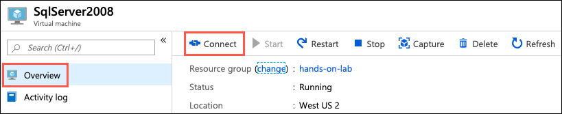

2. On the Connect to virtual machine blade, select **Download RDP File**, then open the downloaded RDP file.

3. Select **Connect** on the Remote Desktop Connection dialog.

    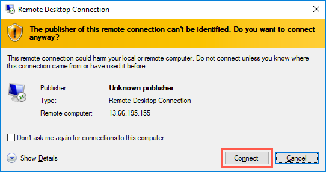

4. Enter the following credentials when prompted, and then select **OK**:

    - **Username**: sqlmiuser
    > Note: Password should be consistent among all labs, ask your instructor if you don't know what your password is.

    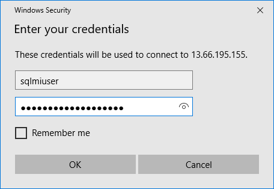

5. Select **Yes** to connect, if prompted that the identity of the remote computer cannot be verified.

    

6. Once logged into the SqlServer2008 VM, download a [backup of the TailspinToys database](https://raw.githubusercontent.com/microsoft/Migrating-SQL-databases-to-Azure/master/Hands-on%20lab/lab-files/Database/TailspinToys.bak), and save it to the `C:\` of the VM.

7. Next, open **Microsoft SQL Server Management Studio 17** by entering "sql server" into the search bar in the Windows Start menu.

    

8. In the SSMS **Connect to Server** dialog, enter **SQLSERVER2008** into the Server name box, ensure **Windows Authentication** is selected, and then select **Connect**.

    

9. Once connected, right-click **Databases** under SQLSERVER2008 in the Object Explorer, and then select **Restore Database** from the context menu.

    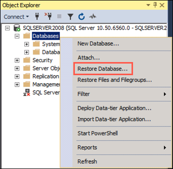

10. You will now restore the `TailspinToys` database using the downloaded `TailspinToys.bak` file. On the **General** page of the Restore Database dialog, select **Device** under Source, and then select the Browse (...) button to the right of the Device box.

    

11. In the **Select backup devices** dialog that appears, select **Add**.

    

12. In the **Locate Backup File** dialog, browse to the location you saved the downloaded `TailspinToys.bak` file, select that file, and then select **OK**.

    

13. Select **OK** on the **Select backup devices** dialog. This will return you to the Restore Database dialog. The dialog will now contain the information required to restore the `TailspinToys` database.

    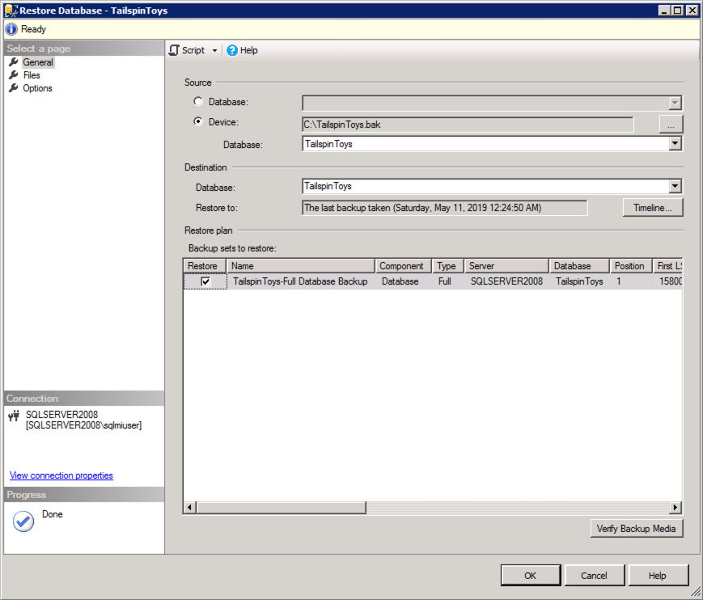

14. Select **OK** to start the restore.

15. Select **OK** in the dialog when the database restore is complete.

    

16. Next, you will execute a script in SSMS, which will reset the `sa` password, enable mixed mode authentication, enable Service broker, create the `WorkshopUser` account, and change the database recovery model to FULL. To create the script, open a new query window in SSMS by selecting **New Query** in the SSMS toolbar.

    

17. Copy and paste the SQL script below into the new query window (replacing `<YourPasswordHere>` with the same password as the SQL Server 2008 VM):

    ```sql
    USE master;
    GO

    -- SET the sa password
    ALTER LOGIN [sa] WITH PASSWORD=N'<YourPasswordHere>';
    GO

    -- Enable Service Broker on the database
    ALTER DATABASE TailspinToys SET ENABLE_BROKER WITH ROLLBACK immediate;
    GO

    -- Enable Mixed Mode Authentication
    EXEC xp_instance_regwrite N'HKEY_LOCAL_MACHINE',
    N'Software\Microsoft\MSSQLServer\MSSQLServer', N'LoginMode', REG_DWORD, 2;
    GO

    -- Create a login and user named WorkshopUser
    CREATE LOGIN WorkshopUser WITH PASSWORD = N'<YourPasswordHere>';
    GO

    EXEC sp_addsrvrolemember
        @loginame = N'WorkshopUser',
        @rolename = N'sysadmin';
    GO

    USE TailspinToys;
    GO

    IF NOT EXISTS (SELECT * FROM sys.database_principals WHERE name = N'WorkshopUser')
    BEGIN
        CREATE USER [WorkshopUser] FOR LOGIN [WorkshopUser]
        EXEC sp_addrolemember N'db_datareader', N'WorkshopUser'
    END;
    GO

    -- Update the recovery model of the database to FULL
    ALTER DATABASE TailspinToys SET RECOVERY FULL;
    GO
    ```

18. To run the script, select **Execute** from the SSMS toolbar.

    

19. For Mixed Mode Authentication and the new `sa` password to take effect, you must restart the SQL Server (MSSQLSERVER) Service on the SqlServer2008 VM. To do this, you can use SSMS. Right-click the SQLSERVER2008 instance in the SSMS Object Explorer, and then select **Restart** from the context menu.

    

20. When prompted about restarting the MSSQLSERVER service, select **Yes**. The service will take a few seconds to restart.

    


<p><b><a name="4.4.3">Activity 3: Perform assessment for migration to Azure SQL Database</b></p></a>

> **Important Note!**  
> If you are attending this lab as part of a day-long workshop, you should skip this activity, it was demoed earlier. If you have time at the end of the day, feel free to return to it.

In this task, you will use the Microsoft Data Migration Assistant (DMA) to perform an assessment of the `TailspinToys` database against Azure SQL Database (Azure SQL DB). The assessment will provide a report about any feature parity and compatibility issues between the on-premises database and the Azure SQL DB service.

<p><b>Steps</b></p>


1. On the SqlServer2008 VM, launch DMA from the Windows Start menu by typing "data migration" into the search bar, and then selecting **Microsoft Data Migration Assistant** in the search results.

    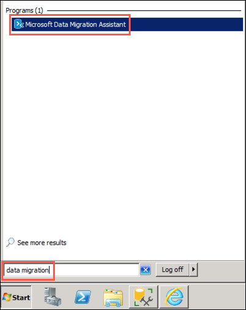

2. In the DMA dialog, select **+** from the left-hand menu to create a new project.

    

3. In the New project pane, set the following:

    - **Project type**: Select Assessment.
    - **Project name**: Enter ToAzureSqlDb.
    - **Source server type**: Select SQL Server.
    - **Target server type**: Select Azure SQL Database.

    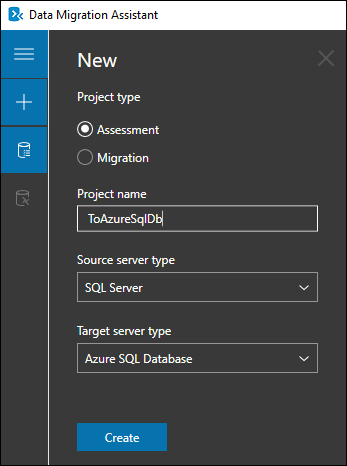

> Note: There's also an option to select "Migration" within DMA. You could use this option if you have restrictions around pushing versus pulling the data to Azure. Using DMA to migrate would be pushing data from the SQL Server 2008 VM into Azure. In this workshop, we'll instead pull data from the SQL Server 2008 VM. You can learn more about migrating to Azure using DMA [here](https://docs.microsoft.com/en-us/sql/dma/dma-migrateonpremsqltosqldb?view=sql-server-2017).
4. Select **Create**.

5. On the **Options** screen, ensure **Check database compatibility** and **Check feature parity** are both checked, and then select **Next**.

    

6. On the **Sources** screen, enter the following into the **Connect to a server** dialog that appears on the right-hand side:

    - **Server name**: Enter **SQLSERVER2008**.
    - **Authentication type**: Select **SQL Server Authentication**.
    - **Username**: Enter **WorkshopUser**
    - **Password**: Enter your password.  
    - **Encrypt connection**: Check this box.
    - **Trust server certificate**: Check this box.

    > Note: Password should be consistent among all labs, ask your instructor if you don't know what your password is.  

    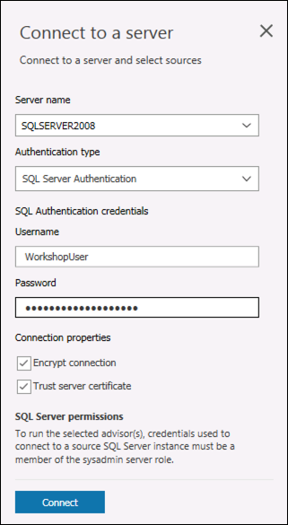

7. Select **Connect**.

8. On the **Add sources** dialog that appears next, check the box for **TailspinToys** and select **Add**.

    

9. Select **Start Assessment**.

    

10. Review the assessment of ability to migrate to Azure SQL DB.

    

    > The DMA assessment for a migrating the `TailspinToys` database to a target platform of Azure SQL DB shows two features in use which are not supported. These features, cross-database references and Service broker, will prevent TailspinToys from being able to migrate to the Azure SQL DB PaaS offering without first making changes to their database.

11. In the bottom right (see above), select "Upload to Azure Migrate". You'll be prompted to sign in (use the credentials you're using for this workshop). Then, select the subscription and Azure Migrate Project created earlier. Select "Upload".  

    

12. When it's done, you'll see the following message:  
      


<p><b><a name="4.4.4">Activity 4: Perform assessment for migration to Azure SQL Database Managed Instance</b></p></a>

> **Important Note!**  
> If you are attending this lab as part of a day-long workshop, you should skip this activity, it was demoed earlier. If you have time at the end of the day, feel free to return to it.


With one PaaS offering ruled out due to feature parity, you will now perform a second assessment. In this task, you will use DMA to perform an assessment of the `TailspinToys` database against Azure SQL Database Managed Instance (SQL MI). The assessment will provide a report about any feature parity and compatibility issues between the on-premises database and the SQL MI service.


<p><b>Steps</b></p>


1. To get started, select **+** on the left-hand menu in DMA to create another new project.

    

2. In the New project pane, set the following:

    - **Project type**: Select Assessment.
    - **Project name**: Enter ToSqlMi.
    - **Source server type**: Select SQL Server.
    - **Target server type**: Select Azure SQL Database Managed Instance.

    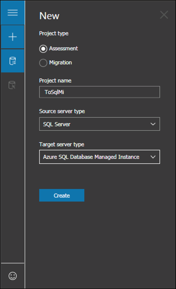

3. Select **Create**.

4. On the **Options** screen, ensure **Check database compatibility** and **Check feature parity** are both checked, and then select **Next**.

    

5. On the **Sources** screen, enter the following into the **Connect to a server** dialog that appears on the right-hand side:

    - **Server name**: Enter **SQLSERVER2008**.
    - **Authentication type**: Select **SQL Server Authentication**.
    - **Username**: Enter **WorkshopUser**.
    - **Password**: Enter your password.
    - **Encrypt connection**: Check this box.
    - **Trust server certificate**: Check this box.

    > Note: Password should be consistent among all labs, ask your instructor if you don't know what your password is.

    

6. Select **Connect**.

7. On the **Add sources** dialog that appears next, check the box for **TailspinToys** and select **Add**.

    

8. Select **Start Assessment**.

    


9. Review the assessment of ability to migrate to Azure SQL Database Managed Instance, then upload to Azure Migrate, as in the previous activity.

    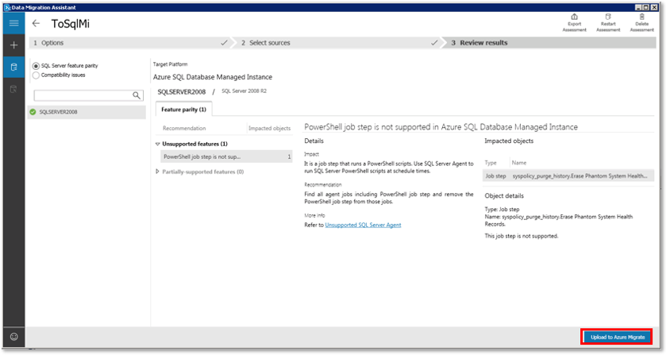

>**Note**: The assessment report for a migrating the `TailspinToys` database to a target platform of Azure SQL Database Managed Instance shows feature parity only with a PowerShell job step. The step listed is associated with a built-in SQL Server Agent Job, and it will not impact the migration of the `TailspinToys` database to SQL MI.

10. The database, including the cross-database references and Service broker features, can be migrated as is, providing the opportunity for TailspinToys to have a fully managed PaaS database running in Azure. Previously, their options for migrating a database using features, such as Service Broker, incompatible with Azure SQL Database, were to deploy the database to a virtual machine running in Azure (IaaS) or modify their database and applications to not use the unsupported features. The introduction of Azure SQL MI, however, provides the ability to migrate databases into a managed Azure SQL database service with near 100% compatibility, including the features that prevented them from using Azure SQL Database.  

11. Open the Azure portal, and navigate back to Azure Migrate. Under "Databases", you should now see the results from the DMA scans. This will bring all of the databases and servers you scan and upload using DMA together, and provide a consolidated view.

    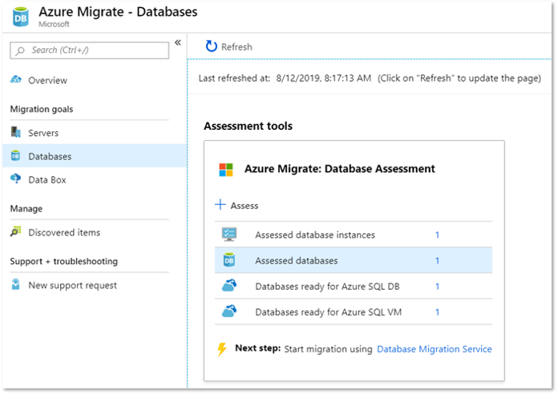
  

12. You can click into **Assessed databases > TailspinToys** to see additional details and recommendations.  
    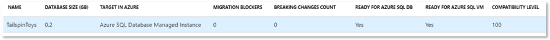


<p style="border-bottom: 1px solid lightgrey;"></p>

<p><b>For Further Study</b></p>
<ul>
    <li><a href="https://datamigration.microsoft.com/
    " target="_blank">Azure Database Migration Guide</a> contains lots of resources that will help in guiding and supporting database migrations to Azure.</li>
    <li><a href="https://docs.microsoft.com/en-us/azure/migrate/migrate-services-overview
    " target="_blank">Azure Migrate Documentation</a> contains more information, guidance, and pointers on how to migrate your entire on-premises estate to Azure.</li>
    <li><a href="https://docs.microsoft.com/en-us/azure/migrate/migrate-services-overview
    " target="_blank">Data Migration Assistant Documentation</a> contains more information and best practices around the DMA tool explored in this module.</li>
    <li><a href="https://azure.microsoft.com/mediahandler/files/resourcefiles/choosing-your-database-migration-path-to-azure/Choosing_your_database_migration_path_to_Azure.pdf
    " target="_blank">Choosing your database migration path to Azure</a> is a white paper created by Microsoft for deeper understanding of how to modernize and migrate on-premises SQL Server to Azure.</li>
</ul>

<p><b >Next Steps</b></p>

Next, Continue to <a href="https://github.com/microsoft/sqlworkshops/blob/master/SQLGroundToCloud/sqlgroundtocloud/05-MigratingtoAzureSQL.md" target="_blank"><i> 05 - Migrating to Azure SQL</i></a>.