[AT] TODO add a link to the MCW and a message saying this is an abbreviated version
[AT] Update and review this heading and license info to see how much of it can be removed
[AT] Update the links and table of contents]
[AT] Renumber all the execises and tasks to be consistent with the other way in the sqlworkshops repo


<div class="MCWHeader1">
Migrating SQL databases to Azure
</div>

<div class="MCWHeader2">
Hands-on lab step-by-step guide
</div>

<div class="MCWHeader3">
June 2019
</div>

Information in this document, including URL and other Internet Web site references, is subject to change without notice. Unless otherwise noted, the example companies, organizations, products, domain names, e-mail addresses, logos, people, places, and events depicted herein are fictitious, and no association with any real company, organization, product, domain name, e-mail address, logo, person, place or event is intended or should be inferred. Complying with all applicable copyright laws is the responsibility of the user. Without limiting the rights under copyright, no part of this document may be reproduced, stored in or introduced into a retrieval system, or transmitted in any form or by any means (electronic, mechanical, photocopying, recording, or otherwise), or for any purpose, without the express written permission of Microsoft Corporation.

Microsoft may have patents, patent applications, trademarks, copyrights, or other intellectual property rights covering subject matter in this document. Except as expressly provided in any written license agreement from Microsoft, the furnishing of this document does not give you any license to these patents, trademarks, copyrights, or other intellectual property.

The names of manufacturers, products, or URLs are provided for informational purposes only and Microsoft makes no representations and warranties, either expressed, implied, or statutory, regarding these manufacturers or the use of the products with any Microsoft technologies. The inclusion of a manufacturer or product does not imply endorsement of Microsoft of the manufacturer or product. Links may be provided to third party sites. Such sites are not under the control of Microsoft and Microsoft is not responsible for the contents of any linked site or any link contained in a linked site, or any changes or updates to such sites. Microsoft is not responsible for webcasting or any other form of transmission received from any linked site. Microsoft is providing these links to you only as a convenience, and the inclusion of any link does not imply endorsement of Microsoft of the site or the products contained therein.

© 2019 Microsoft Corporation. All rights reserved.

Microsoft and the trademarks listed at <https://www.microsoft.com/en-us/legal/intellectualproperty/Trademarks/Usage/General.aspx> are trademarks of the Microsoft group of companies. All other trademarks are property of their respective owners.

**Contents**

- [Migrating SQL databases to Azure hands-on lab step-by-step](#migrating-sql-databases-to-azure-hands-on-lab-step-by-step)
  - [Abstract and learning objectives](#abstract-and-learning-objectives)
  - [Overview](#overview)
  - [Solution architecture](#solution-architecture)
  - [Requirements](#requirements)
  - [Exercise 1: Perform database assessments](#exercise-1-perform-database-assessments)
    - [Task 1: Restore the TailspinToys database on the SqlServer2008 VM](#task-1-restore-the-tailspintoys-database-on-the-sqlserver2008-vm)
    - [Task 2: Perform assessment for migration to Azure SQL Database](#task-2-perform-assessment-for-migration-to-azure-sql-database)
    - [Task 3: Perform assessment for migration to Azure SQL Database Managed Instance](#task-3-perform-assessment-for-migration-to-azure-sql-database-managed-instance)
  - [Exercise 2: Migrate the database to SQL MI](#exercise-2-migrate-the-database-to-sql-mi)
    - [Task 1: Create an SMB network share on the SqlServer2008 VM](#task-1-create-an-smb-network-share-on-the-sqlserver2008-vm)
    - [Task 2: Change MSSQLSERVER service to run under sqlmiuser account](#task-2-change-mssqlserver-service-to-run-under-sqlmiuser-account)
    - [Task 3: Create backup of TailspinToys database](#task-3-create-backup-of-tailspintoys-database)
    - [Task 4: Retrieve SQL MI and SQL Server 2008 VM connection information](#task-4-retrieve-sql-mi-and-sql-server-2008-vm-connection-information)
    - [Task 5: Create a service principal](#task-5-create-a-service-principal)
    - [Task 6: Create and run an online data migration project](#task-6-create-and-run-an-online-data-migration-project)
    - [Task 7: Perform migration cutover](#task-7-perform-migration-cutover)
    - [Task 8: Verify database and transaction log migration](#task-8-verify-database-and-transaction-log-migration)
  - [Exercise 3: Update the web application to use the new SQL MI database](#exercise-3-update-the-web-application-to-use-the-new-sql-mi-database)
    - [Task 1: Deploy the web app to Azure](#task-1-deploy-the-web-app-to-azure)
    - [Task 2: Update App Service configuration](#task-2-update-app-service-configuration)
  - [Exercise 4: Integrate App Service with the virtual network](#exercise-4-integrate-app-service-with-the-virtual-network)
    - [Task 1: Set point-to-site addresses](#task-1-set-point-to-site-addresses)
    - [Task 2: Configure VNet integration with App Services](#task-2-configure-vnet-integration-with-app-services)
    - [Task 3: Open the web application](#task-3-open-the-web-application)
  - [Exercise 5: Improve database security posture with Advanced Data Security](#exercise-5-improve-database-security-posture-with-advanced-data-security)
    - [Task 1: Enable Advanced Data Security](#task-1-enable-advanced-data-security)
    - [Task 2: Configure SQL Data Discovery and Classification](#task-2-configure-sql-data-discovery-and-classification)
    - [Task 3: Review Advanced Data Security Vulnerability Assessment](#task-3-review-advanced-data-security-vulnerability-assessment)
  - [Exercise 6: Enable Dynamic Data Masking](#exercise-6-enable-dynamic-data-masking)
    - [Task 1: Enable DDM on credit card numbers](#task-1-enable-ddm-on-credit-card-numbers)
    - [Task 2: Apply DDM to email addresses](#task-2-apply-ddm-to-email-addresses)
  - [Exercise 7: Use online secondary for read-only queries](#exercise-7-use-online-secondary-for-read-only-queries)
    - [Task 1: View Leaderboard report in TailspinToys web application](#task-1-view-leaderboard-report-in-tailspintoys-web-application)
    - [Task 2: Update read only connection string](#task-2-update-read-only-connection-string)
    - [Task 3: Reload Leaderboard report in the Tailspin Toys web app](#task-3-reload-leaderboard-report-in-the-tailspin-toys-web-app)
  - [After the hands-on lab](#after-the-hands-on-lab)
    - [Task 1: Delete Azure resource groups](#task-1-delete-azure-resource-groups)
    - [Task 2: Delete the tailspin-toys service principal](#task-2-delete-the-tailspin-toys-service-principal)

# Migrating SQL databases to Azure hands-on lab step-by-step

## Abstract and learning objectives

In this hands-on lab, you will implement a proof-of-concept (PoC) for migrating an on-premises SQL Server 2008 R2 database into Azure SQL Database Managed Instance (SQL MI). You will perform assessments to reveal any feature parity and compatibility issues between the on-premises SQL Server 2008 R2 database and the managed database offerings in Azure. You will then migrate the customer's on-premises gamer information web application and database into Azure, with minimal to no down-time. Finally, you will enable some of the advanced SQL features available in SQL MI to improve security and performance in the customer's application.

At the end of this hands-on lab, you will be better able to implement a cloud migration solution for business-critical applications and databases.

## Overview

Tailspin Toys is the developer of several popular online video games. Founded in 2010, the company has experienced exponential growth since releasing the first installment of their most popular game franchise to include online multiplayer gameplay. They have since built upon this success by adding online capabilities to the majority of their game portfolio.

Adding online gameplay has greatly increased popularity of their games, but the rapid increase in demand for their services has made supporting the current setup problematic. To facilitate online gameplay, they host gaming services on-premises using rented hardware. For each game, their gaming services setup consists of three virtual machines running the gaming software and five game databases hosted on a single SQL Server 2008 R2 instance. In addition to the dedicated gaming VMs and databases, they also host authentication and gateway VMs and databases, which are shared by all their games. At its foundation, Tailspin Toys is a game development company, made up primarily of software developers. The few dedicated database and infrastructure resources they do have are struggling to keep up with their ever-increasing workload.

Tailspin Toys is hoping that migrating their services from on-premises to the cloud can help to alleviate some of their infrastructure management issues, while simultaneously helping them to refocus their efforts on delivering business value by releasing new and improved games. They are looking for a proof-of-concept (PoC) for migrating their gamer information web application and database into the cloud. They maintain their gamer information database, `TailspinToys`, on an on-premises SQL Server 2008 R2 database. This system is used by gamers to update their profiles, view leader boards, purchase game add-ons and more. Since this system helps to drive revenue, it is considered a business-critical application, and needs to be highly-available. They are aware that SQL Server 2008 R2 is approaching end of support, and are looking at options for migrating this database into Azure. They have read about some of the advanced security and performance tuning options that are available only in Azure and would prefer to a migrate the database into a platform-as-a-service (PaaS) offering, if possible. Tailspin Toys is using the Service Broker feature of SQL Server for messaging within the `TailspinToys` database. This functionality is being used for several critical processes, and they cannot afford to lose this capability when migrating their operations database to the cloud. They have also stated that, at this time, they do not have the resources to rearchitect the solution to use an alternative message broker.

## Solution architecture

Below is a diagram of the solution architecture you will build in this lab. Please study this carefully, so you understand the whole of the solution as you are working on the various components.

![This solution diagram includes a virtual network containing SQL MI in a isolated subnet, along with a JumpBox VM and Database Migration Service in a management subnet. The MI Subnet displays both the primary managed instance, along with a read-only replica, which is accessed by reports from the web app. The web app connects to SQL MI via a subnet gateway and point-to-site VPN. The web app is published to App Services using Visual Studio 2019. An online data migration is conducted from the on-premises SQL Server to SQL MI using the Azure Database Migration Service, which reads backup files from an SMB network share.](./media/preferred-solution-architecture.png "Preferred Solution diagram")

The solution begins with using the Microsoft Data Migration Assistant to perform assessments of feature parity and compatibility of the on-premises SQL Server 2008 R2 database against both Azure SQL Database (Azure SQL DB) and Azure SQL Database Managed Instance (SQL MI), with the goal of migrating the `TailspinToys` database into an Azure PaaS offering with minimal or no changes. After completing the assessments and reviewing the findings, the SQL Server 2008 R2 database is migrated into SQL MI using the Azure Database Migration Service's online data migration option. This allows the database to be migrated with little to no downtime, by using a backup and transaction logs stored in an SMB network share.

The web app is deployed to an Azure App Service Web App using Visual Studio 2019. Once the database has been migrated and cutover, the `TailspinToysWeb` application is configured to talk to the SQL MI VNet through a virtual network gateway using point-to-site VPN, and its connection strings are updated to point to the new SQL MI database.

In SQL MI, several features of Azure SQL Database are examined. Advanced Data Security (ADS) is enabled and Data Discovery and Classification is used to better understand the data and potential compliance issues with data in the database. The ADS Vulnerability Assessment is used to identify potential security vulnerabilities and issues in the database, and those finding are used to mitigate one finding by enabling Transparent Data Encryption in the database. Dynamic Data Masking (DDM) is used to prevent sensitive data from appearing when querying the database. Finally, Read Scale-out is used to point reports on the Tailspin Toys web app to a read-only secondary, allowing reporting to occur without impacting the performance of the primary database.

## Requirements

- Microsoft Azure subscription must be pay-as-you-go or MSDN.
  - Trial subscriptions will not work.
  - Rights to create an Azure Active Directory application and service principal and assign roles on your subscription.
- A virtual machine configured with Visual Studio Community 2019 or higher (setup in the Before the hands-on lab exercises).

## Exercise 1: Perform database assessments

Duration: 30 minutes

In this exercise, you will use the Microsoft Data Migration Assistant (DMA) to perform assessments on the `TailspinToys` database. You will create two assessments, one for a migration to Azure SQL Database, and then a second for SQL MI. These assessments will provide reports about any feature parity and compatibility issues between the on-premises database and the Azure managed SQL database service options.

> DMA helps you upgrade to a modern data platform by detecting compatibility issues that can impact database functionality in your new version of SQL Server or Azure SQL Database. DMA recommends performance and reliability improvements for your target environment and allows you to move your schema, data, and uncontained objects from your source server to your target server. To learn more, read the [Data Migration Assistant documentation](https://docs.microsoft.com/sql/dma/dma-overview?view=azuresqldb-mi-current).

### Task 1: Restore the TailspinToys database on the SqlServer2008 VM [AT] 8:32-8:38, I think steps 6-20 could be done as part of the ARM template.

Before you begin the assessments, you need to restore a copy of the `TailspinToys` database in your SQL Server 2008 R2 instance. In this task, you will create an RDP connection to the SqlServer2008 VM and then restore the `TailspinToys` database onto the SQL Server 2008 R2 instance using a backup provided by Tailspin Toys.

1. In the [Azure portal](https://portal.azure.com), navigate to your **SqlServer2008** VM by selecting **Resource groups** from the left-hand navigation menu, selecting the **hands-on-lab-SUFFIX** resource group, and selecting the **SqlServer2008** VM from the list of resources. On the SqlServer2008 Virtual Machine's **Overview** blade, select **Connect** on the top menu.

    

2. On the Connect to virtual machine blade, select **Download RDP File**, then open the downloaded RDP file.

3. Select **Connect** on the Remote Desktop Connection dialog.

    

4. Enter the following credentials when prompted, and then select **OK**:

    - **Username**: sqlmiuser
    - **Password**: Password.1234567890

    

5. Select **Yes** to connect, if prompted that the identity of the remote computer cannot be verified.

    

> [AT] Could Step 6 be done ahead of time?
6. Once logged into the SqlServer2008 VM, download a [backup of the TailspinToys database](https://raw.githubusercontent.com/microsoft/Migrating-SQL-databases-to-Azure/master/Hands-on%20lab/lab-files/Database/TailspinToys.bak), and save it to the `C:\` of the VM.

7. Next, open **Microsoft SQL Server Management Studio 17** by entering "sql server" into the search bar in the Windows Start menu.

    

8. In the SSMS **Connect to Server** dialog, enter **SQLSERVER2008** into the Server name box, ensure **Windows Authentication** is selected, and then select **Connect**.

    

9. Once connected, right-click **Databases** under SQLSERVER2008 in the Object Explorer, and then select **Restore Database** from the context menu.

    

10. You will now restore the `TailspinToys` database using the downloaded `TailspinToys.bak` file. On the **General** page of the Restore Database dialog, select **Device** under Source, and then select the Browse (...) button to the right of the Device box.

    

11. In the **Select backup devices** dialog that appears, select **Add**.

    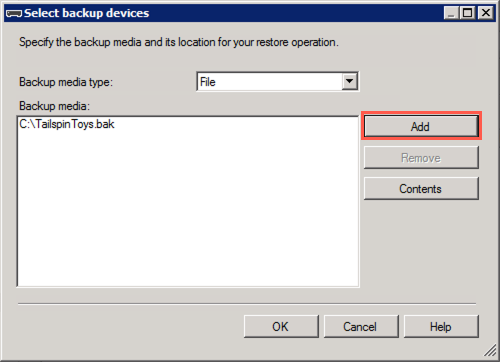

12. In the **Locate Backup File** dialog, browse to the location you saved the downloaded `TailspinToys.bak` file, select that file, and then select **OK**.

    

13. Select **OK** on the **Select backup devices** dialog. This will return you to the Restore Database dialog. The dialog will now contain the information required to restore the `TailspinToys` database.

    

14. Select **OK** to start the restore.

15. Select **OK** in the dialog when the database restore is complete.

    

16. Next, you will execute a script in SSMS, which will reset the `sa` password, enable mixed mode authentication, enable Service broker, create the `WorkshopUser` account, and change the database recovery model to FULL. To create the script, open a new query window in SSMS by selecting **New Query** in the SSMS toolbar.

    

17. Copy and paste the SQL script below into the new query window:

    ```sql
    USE master;
    GO

    -- SET the sa password
    ALTER LOGIN [sa] WITH PASSWORD=N'Password.1234567980';
    GO

    -- Enable Service Broker on the database
    ALTER DATABASE TailspinToys SET ENABLE_BROKER WITH ROLLBACK immediate;
    GO

    -- Enable Mixed Mode Authentication
    EXEC xp_instance_regwrite N'HKEY_LOCAL_MACHINE',
    N'Software\Microsoft\MSSQLServer\MSSQLServer', N'LoginMode', REG_DWORD, 2;
    GO

    -- Create a login and user named WorkshopUser
    CREATE LOGIN WorkshopUser WITH PASSWORD = N'Password.1234567890';
    GO

    EXEC sp_addsrvrolemember
        @loginame = N'WorkshopUser',
        @rolename = N'sysadmin';
    GO

    USE TailspinToys;
    GO

    IF NOT EXISTS (SELECT * FROM sys.database_principals WHERE name = N'WorkshopUser')
    BEGIN
        CREATE USER [WorkshopUser] FOR LOGIN [WorkshopUser]
        EXEC sp_addrolemember N'db_datareader', N'WorkshopUser'
    END;
    GO

    -- Update the recovery model of the database to FULL
    ALTER DATABASE TailspinToys SET RECOVERY FULL;
    GO
    ```

18. To run the script, select **Execute** from the SSMS toolbar.

    

19. For Mixed Mode Authentication and the new `sa` password to take effect, you must restart the SQL Server (MSSQLSERVER) Service on the SqlServer2008 VM. To do this, you can use SSMS. Right-click the SQLSERVER2008 instance in the SSMS Object Explorer, and then select **Restart** from the context menu.

    

20. When prompted about restarting the MSSQLSERVER service, select **Yes**. The service will take a few seconds to restart.

    

### Task 2: Perform assessment for migration to Azure SQL Database [AT] 8:41-

In this task, you will use the Microsoft Data Migration Assistant (DMA) to perform an assessment of the `TailspinToys` database against Azure SQL Database (Azure SQL DB). The assessment will provide a report about any feature parity and compatibility issues between the on-premises database and the Azure SQL DB service.

1. On the SqlServer2008 VM, launch DMA from the Windows Start menu by typing "data migration" into the search bar, and then selecting **Microsoft Data Migration Assistant** in the search results.

    

2. In the DMA dialog, select **+** from the left-hand menu to create a new project.

    

3. In the New project pane, set the following:

    - **Project type**: Select Assessment.
    - **Project name**: Enter ToAzureSqlDb.
    - **Source server type**: Select SQL Server.
    - **Target server type**: Select Azure SQL Database.

    

4. Select **Create**.

5. On the **Options** screen, ensure **Check database compatibility** and **Check feature parity** are both checked, and then select **Next**.

    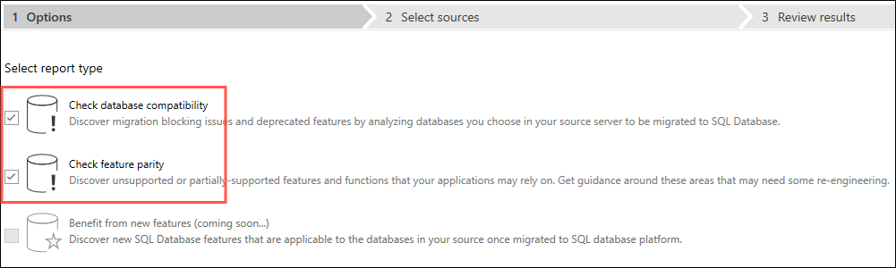

6. On the **Sources** screen, enter the following into the **Connect to a server** dialog that appears on the right-hand side:

    - **Server name**: Enter **SQLSERVER2008**.
    - **Authentication type**: Select **SQL Server Authentication**.
    - **Username**: Enter **WorkshopUser**
    - **Password**: Enter **Password.1234567890**
    - **Encrypt connection**: Check this box.
    - **Trust server certificate**: Check this box.

    

7. Select **Connect**.

8. On the **Add sources** dialog that appears next, check the box for **TailspinToys** and select **Add**.

    

9. Select **Start Assessment**.

    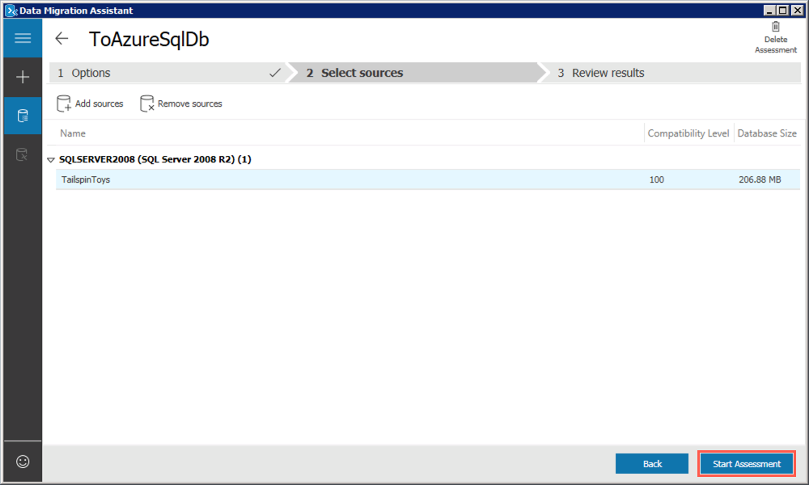

10. Review the assessment of ability to migrate to Azure SQL DB.

    

    > The DMA assessment for a migrating the `TailspinToys` database to a target platform of Azure SQL DB shows two features in use which are not supported. These features, cross-database references and Service broker, will prevent TailspinToys from being able to migrate to the Azure SQL DB PaaS offering without first making changes to their database.

### Task 3: Perform assessment for migration to Azure SQL Database Managed Instance

With one PaaS offering ruled out due to feature parity, you will now perform a second assessment. In this task, you will use DMA to perform an assessment of the `TailspinToys` database against Azure SQL Database Managed Instance (SQL MI). The assessment will provide a report about any feature parity and compatibility issues between the on-premises database and the SQL MI service.

1. To get started, select **+** on the left-hand menu in DMA to create another new project.

    

2. In the New project pane, set the following:

    - **Project type**: Select Assessment.
    - **Project name**: Enter ToSqlMi.
    - **Source server type**: Select SQL Server.
    - **Target server type**: Select Azure SQL Database Managed Instance.

    

3. Select **Create**.

4. On the **Options** screen, ensure **Check database compatibility** and **Check feature parity** are both checked, and then select **Next**.

    

5. On the **Sources** screen, enter the following into the **Connect to a server** dialog that appears on the right-hand side:

    - **Server name**: Enter **SQLSERVER2008**.
    - **Authentication type**: Select **SQL Server Authentication**.
    - **Username**: Enter **WorkshopUser**.
    - **Password**: Enter **Password.1234567890**.
    - **Encrypt connection**: Check this box.
    - **Trust server certificate**: Check this box.

    

6. Select **Connect**.

7. On the **Add sources** dialog that appears next, check the box for **TailspinToys** and select **Add**.

    

8. Select **Start Assessment**.

    

9. Review the assessment of ability to migrate to Azure SQL Database Managed Instance.

    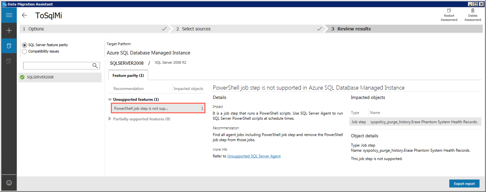

    >**Note**: The assessment report for a migrating the `TailspinToys` database to a target platform of Azure SQL Database Managed Instance shows feature parity only with a PowerShell job step. The step listed is associated with a built-in SQL Server Agent Job, and it will not impact the migration of the `TailspinToys` database to SQL MI.

10. The database, including the cross-database references and Service broker features, can be migrated as is, providing the opportunity for TailspinToys to have a fully managed PaaS database running in Azure. Previously, their options for migrating a database using features, such as Service Broker, incompatible with Azure SQL Database, were to deploy the database to a virtual machine running in Azure (IaaS) or modify their database and applications to not use the unsupported features. The introduction of Azure SQL MI, however, provides the ability to migrate databases into a managed Azure SQL database service with near 100% compatibility, including the features that prevented them from using Azure SQL Database.

[AT] Then upload to Azure Migrate 8:48-8:54

## Exercise 2: Migrate the database to SQL MI

Duration: 60 minutes

In this exercise, you will use the [Azure Database Migration Service](https://azure.microsoft.com/services/database-migration/) (DMS) to migrate the `TailspinToys` database from the on-premises SQL 2008 R2 database to SQL MI. Tailspin Toys mentioned the importance of their gamer information web application in driving revenue, so for this migration you will target the [Business Critical service tier](https://docs.microsoft.com/azure/sql-database/sql-database-managed-instance#managed-instance-service-tiers).

> The Business Critical service tier is designed for business applications with the highest performance and high-availability (HA) requirements. To learn more, read the [Managed Instance service tiers documentation](https://docs.microsoft.com/azure/sql-database/sql-database-managed-instance#managed-instance-service-tiers).

### Task 1: Create an SMB network share on the SqlServer2008 VM [AT] 9:04-9:05

In this task, you will create a new SMB network share on the SqlServer2008 VM. This will be the folder used by DMS for retrieving backups of the `TailspinToys` database during the database migration process.

1. On the SqlServer2008 VM, open **Windows Explorer** by selecting its icon on the Windows Task bar.

    

2. In the Windows Explorer window, expand **Computer** in the tree view, select **Windows (C:)**, and then select **New folder** in the top menu.

    

3. Name the new folder **dms-backups**, then right-click the folder and select **Share with** and **Specific people** in the context menu.

    

4. In the File Sharing dialog, ensure the **sqlmiuser** is listed with a **Read/Write** permission level, and then select **Share**.

    

5. In the **Network discovery and file sharing** dialog, select the default value of **No, make the network that I am connected to a private network**.

    

6. Back on the File Sharing dialog, note the path of the shared folder, `\\SQLSERVER2008\dms-backups`, and select **Done** to complete the sharing process.

    

### Task 2: Change MSSQLSERVER service to run under sqlmiuser account [AT] 9:06-9:07

In this task, you will use the SQL Server Configuration Manager to update the service account used by the SQL Server (MSSQLSERVER) to the `sqlmiuser` account. This is done to ensure the SQL Server service has the appropriate permissions to write backups to the shared folder.

1. On your SqlServer2008 VM, select the **Start menu**, enter "sql configuration" into the search bar, and then select **SQL Server Configuration Managed** from the search results.

    

    > **Note**: Be sure to choose **SQL Server Configuration Manager**, and not **SQL Server 2017 Configuration Manager**, which will not work for the installed SQL Server 2008 R2 database.

2. In the SQL Server Configuration Managed dialog, select **SQL Server Services** from the tree view on the left, then right-click **SQL Server (MSSQLSERVER)** in the list of services and select **Properties** from the context menu.

    

3. In the SQL Server (MSSQLSERVER) Properties dialog, select **This account** under Log on as, and enter the following:

    - **Account name**: sqlmiuser
    - **Password**: Password.1234567890

     Properties")

4. Select **OK**.

5. Select **Yes** in the Confirm Account Change dialog.

    

6. You will now see the **Log On As** value for the SQL Server (MSSQLSERVER) service changed to `./sqlmiuser`.

    

### Task 3: Create backup of TailspinToys database [AT]: 9:15-9:17

To perform online data migrations, DMS looks for backups and logs in the SMB shared backup folder on the source database server. In this task, you will create a backup of the `TailspinToys` database using SSMS, and write it to the SMB network share you created in the previous task. The backup file needs to include a checksum, so you will add that during the backup steps.

1. On the SqlServer2008 VM, open **Microsoft SQL Server Management Studio 17** by entering "sql server" into the search bar in the Windows Start menu.

    

2. In the SSMS **Connect to Server** dialog, enter **SQLSERVER2008** into the Server name box, ensure **Windows Authentication** is selected, and then select **Connect**.

    

3. Once connected, expand **Databases** under SQLSERVER2008 in the Object Explorer, and then right-click the **TailspinToys** database. In the context menu, select **Tasks** and then **Back Up**.

    

4. In the Back UP Database dialog, you will see `C:\TailspinToys.bak` listed in the Destinations box. This is no longer needed, so select it, and then select **Remove**.

    

5. Next, select **Add** to add the SMB network share as a backup destination.

    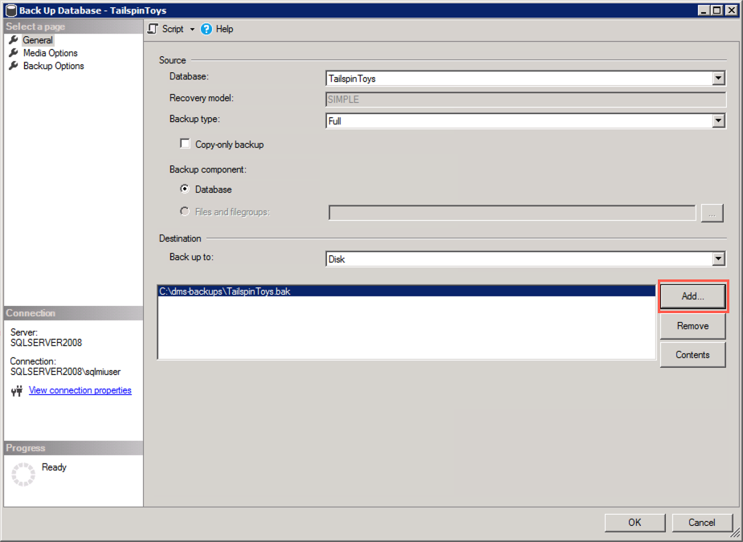

6. In the Select Backup Destination dialog, select the Browse (...) button.

    

7. In the Location Database Files dialog, select the `C:\dma-backups` folder, enter `TailspinToys.bak` into the File name field, and then select **OK**.

    

8. Select **OK** to close the Select Backup Destination dialog.

9. In the Back Up Database dialog, select the **Media Options** in the Select a page pane, and then set the following:

    - Select **Back up to the existing media set** and then select **Overwrite all existing backup sets**
    - Under Reliability, check the box for **Perform checksum before writing to media**. This is require by DMS when using the backup to restore the database to SQL MI.

    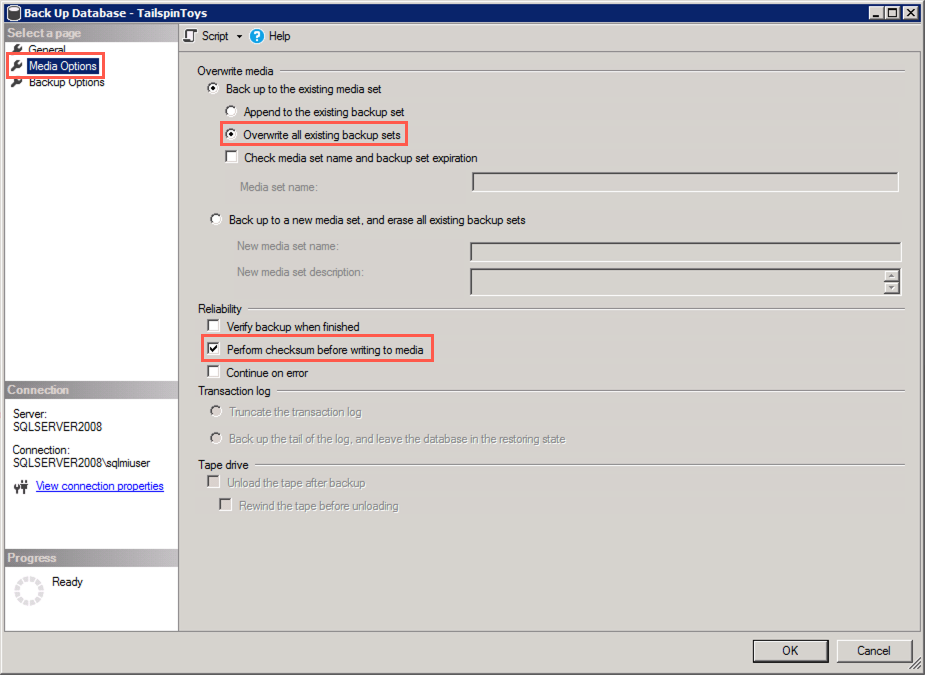

10. Select **OK** to perform the backup.

11. You will receive a message when the backup is complete. Select **OK**.

    

### Task 4: Retrieve SQL MI and SQL Server 2008 VM connection information [AT] 9:20-9:23

In this task, you will use the Azure Cloud shell to retrieve the information necessary to connect to your SQL MI and SqlServer2008 VM from DMS.

1. In the [Azure portal](https://portal.azure.com), select the Azure Cloud Shell icon from the top menu.

    

2. In the Cloud Shell window that opens at the bottom of your browser window, select **PowerShell**.

    

3. If prompted that you have no storage mounted, select the subscription you are using for this hands-on lab and select **Create storage**.

    

    > **Note**: If creation fails, you may need to select **Advanced settings** and specify the subscription, region and resource group for the new storage account.

4. After a moment, you will receive a message that you have successfully requested a Cloud Shell, and be presented with a PS Azure prompt.

    

5. At the prompt, you will retrieve information about SQL MI in the hands-on-lab-SUFFIX resource group by entering the following PowerShell command, **replacing SUFFIX** with your unique identifier:

    ```powershell
    az sql mi list --resource-group hands-on-lab-SUFFIX
    ```

6. Within the output of the above command, locate and copy the value of the `fullyQualifiedDomainName` property. Paste the value into a text editor, such as Notepad.exe, for later reference.

    

7. Next, you will enter a second command to retrieve the public IP address of the SqlSerer2008 VM, which you will use to connect to the database on that server. Enter the following PowerShell command, **replacing SUFFIX** with your unique identifier:

    ```powershell
    az vm list-ip-addresses -g hands-on-lab-SUFFIX -n SqlServer2008
    ```

8. Within the output of the command above, locate and copy the value of the `ipAddress` property within the `publicIpAddresses` object. Paste the value into a text editor, such as Notepad.exe, for later reference.

    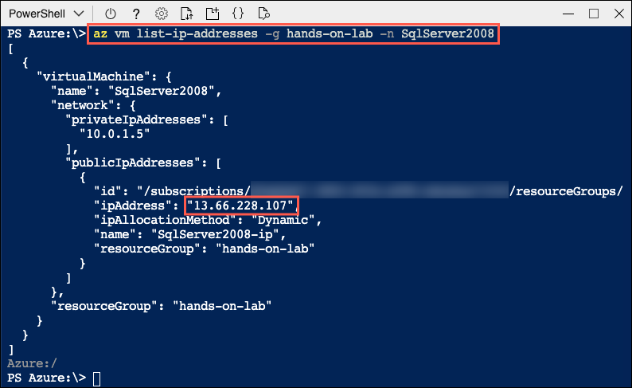

9. Leave the Azure Cloud Shell open for the next task.

### Task 5: Create a service principal

In this task, you will use the Azure Cloud Shell to create an Azure Active Directory (Azure AD) application and service principal (SP) that will provide DMS access to Azure SQL MI. You will grant the SP permissions to the hands-on-lab-SUFFIX resource group.

> **IMPORTANT**: You must have rights within your Azure AD tenant to create applications and assign roles to complete this task.

1. Next, you will issue a command to create a service principal named **tailspin-toys** and assign it contributor permissions to your **hands-on-lab-SUFFIX** resource group.

2. First, you need to retrieve your subscription ID. Enter the following at the Cloud Shell prompt:

    ```powershell
    az account list --output table
    ```

3. In the output table, locate the subscription you are using for this hands-on lab, and copy the SubscriptionId value into a text editor, such as Notepad, for use below.

4. Next, enter the following `az ad sp create-for-rbac` command at the Cloud Shell prompt, replacing `{SubscriptionID}` with the value you copied above and `{ResourceGroupName}` with the name of your **hands-on-lab-SUFFIX** resource group, and then press `Enter` to run the command.

    ```powershell
    az ad sp create-for-rbac -n "tailspin-toys" --role owner --scopes subscriptions/{SubscriptionID}/resourceGroups/{ResourceGroupName}
    ```

    

5. Copy the output from the command into a text editor, as you will need the `appId` and `password` in the next task. The output should be similar to:

    ```json
    {
        "appId": "aeab3b83-9080-426c-94a3-4828db8532e9",
        "displayName": "tailspin-toys",
        "name": "http://tailspin-toys",
        "password": "76ff5bae-8d25-469a-a74b-4a33ad868585",
        "tenant": "d280491c-b27a-XXXX-XXXX-XXXXXXXXXXXX"
    }
    ```

6. To verify the role assignment, select **Access control (IAM)** from the left-hand menu of the **hands-on-lab-SUFFIX** resource group blade, and then select the **Role assignments** tab and locate **tailspin-toys** under the OWNER role.

    

7. Next, you will issue another command to grant the CONTRIBUTOR role at the subscription level to the newly created service principal. At the Cloud Shell prompt, run the following command:

    ```powershell
    az role assignment create --assignee http://tailspin-toys --role contributor
    ```

### Task 6: Create and run an online data migration project [AT] 1:53-2

In this task, you will create a new online data migration project in DMS for the `TailspinToys` database.

1. In the [Azure portal](https://portal.azure.com), navigate to the Azure Database Migration Service by selecting **Resource groups** from the left-hand navigation menu, selecting the **hands-on-lab-SUFFIX** resource group, and then selecting the **tailspin-dms** Azure Database Migration Service in the list of resources.

    

2. On the Azure Database Migration Service blade, select **+New Migration Project**.

    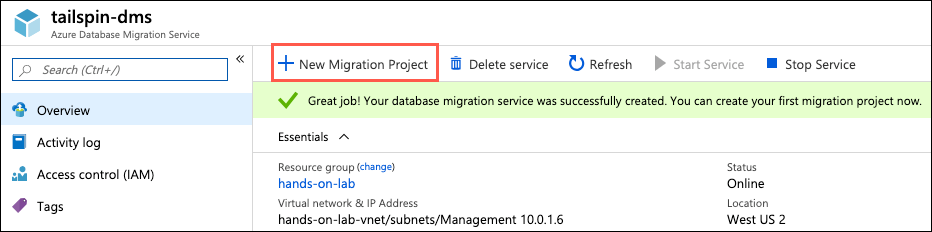

3. On the New migration project blade, enter the following:

    - **Project name**: Enter OnPremToSqlMi.
    - **Source server type**: Select SQL Server.
    - **Target server type**: Select Azure SQL Database Managed Instance.
    - **Choose type of activity**: Select **Online data migration** and select **Save**.

    

4. Select **Create and run activity**.

5. On the Migration Wizard **Select source** blade, enter the following:

    - **Source SQL Server instance name**: Enter the IP address of your SqlServer2008 VM that you copied into a text editor in the previous task. For example, `13.66.228.107`.
    - **Authentication type**: Select SQL Authentication.
    - **Username**: Enter **WorkshopUser**. [AT] should be sqlmiuser for target
    - **Password**: Enter **Password.1234567890**.
    - **Connection properties**: Check both Encrypt connection and Trust server certificate.

    

6. Select **Save**.

7. On the Migration Wizard **Select target** blade, enter the following:

    - **Application ID**: Enter the `appId` value from the output of the `az ad sp create-for-rbac' command you executed in the last task.
    - **Key**: Enter the `password` value from the output of the `az ad sp create-for-rbac' command you executed in the last task.
    - **Subscription**: Select the subscription you are using for this hand-on lab.
    - **Target Azure SQL Managed Instance**: Select the sqlmi-UNIQUEID instance.
    - **SQL Username**: Enter **sqlmiuser**
    - **Password**: Enter **Password.1234567890**

    

8. Select **Save**.

9. On the Migration Wizard **Select databases** blade, select `TailspinToys`.

    

10. Select **Save**.

11. On the Migration Wizard **Configure migration settings** blade, enter the following configuration:

    - **Network share location**: Enter `\\SQLSERVER2008\dms-backups`. This is the path of the SMB network share you created during the before the hands-on lab exercises.
    - **Windows User Azure Database Migration Service impersonates to upload files to Azure Storage**: Enter `SQLSERVER2008\sqlmiuser`
    - **Password**: Enter Password.1234567890
    - **Subscription containing storage account**: Select the subscription you are using for this hands-on lab.
    - **Storage account**: Select the sqlmistoreUNIQUEID storage account.

    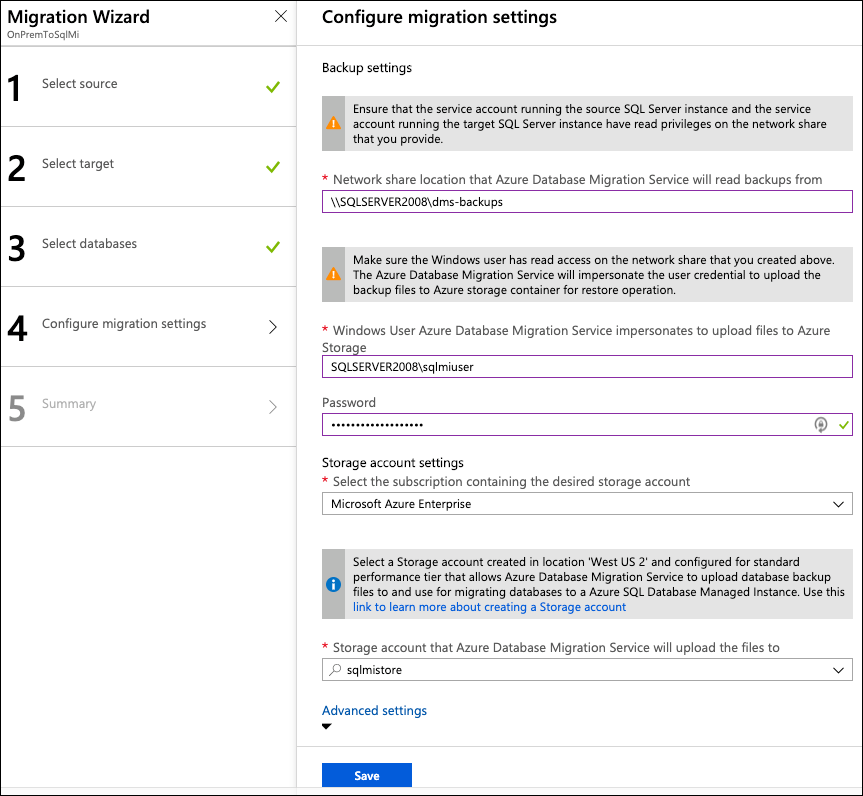

12. Select **Save** on the **Configure migration setting** blade.

13. On the Migration Wizard **Summary** blade, enter the following:

    - **Activity name**: Enter TailspinToysMigration.

    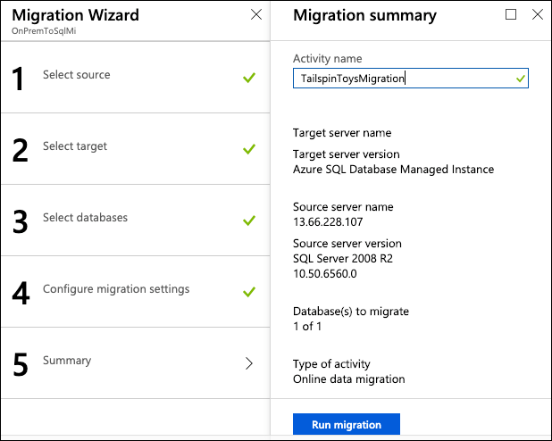

14. Select **Run migration**.

15. Monitor the migration on the status screen that appears. Select the refresh icon in the toolbar to retrieve the latest status.

    

16. Continue selecting **Refresh** every 5-10 seconds, until you see the status change to **Log files uploading**. When that status appears, move on to the next task.

    

### Task 7: Perform migration cutover [AT] 2:09-2:16

Since you performed the migration as an "online data migration," the migration wizard will continue to monitor the SMB network share for newly added log files. This allows for any updates that happen on the source database to be captured until you cut over to the SQL MI database. In this task, you will add a record to one of the database tables, backup the logs, and complete the migration of the `TailspinToys` database by cutting over to the SQL MI database.

1. In the migration status window in the Azure portal and select **TailspinToys** under database name to view further details about the database migration.

    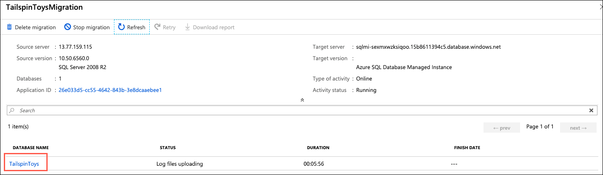

2. On the TailspinToys screen you will see a status of **Restored** for the `TailspinToys.bak` file.

    

3. To demonstrate log shipping and how transactions made on the source database during the migration process will be added to the target SQL MI database, you will add a record to one of the database tables.

4. Return to SSMS on your SqlServer2008 VM and select **New Query** from the toolbar.

    

5. Paste the following SQL script, which inserts a record into the `Game` table, into the new query window:

    ```sql
    USE TailspinToys;
    GO

    INSERT [dbo].[Game] (Title, Description, Rating, IsOnlineMultiplayer)
    VALUES ('Space Adventure', 'Explore the universe with are newest online multiplayer gaming experience. Build your own rocket ships, and take off for the stars in an infinite open world adventure.', 'T', 1)
    ```

6. Execute the query by selecting **Execute** in the SSMS toolbar.

    

7. With the new record added to the `Games` table, you will now backup the transaction logs, which will be shipped to DMS. Select **New Query** again in the toolbar, and paste the following script into the new query window:

    ```sql
    USE master;
    GO

    BACKUP LOG TailspinToys
    TO DISK = 'c:\dms-backups\TailspinToysLog.trn'
    WITH CHECKSUM
    GO
    ```

8. Execute the query by selecting **Execute** in the SSMS toolbar.

9. Return to the migration status page in the Azure portal. On the TailspinToys screen, select **Refresh** you should see the **TailspinToysLog.trn** file appear, with a status of **Uploaded**.

    

    >**Note**: If you don't see it the transaction logs entry, continue selecting Refresh every few seconds until it appears.

10. Once the transaction logs are uploaded, they need to be restored to the database. Select **Refresh** every 10-15 seconds until you see the status change to **Restored**, which can take a minute or two.

    

11. After verifying the transaction log status of **Restored**, select **Start Cutover**.

    

12. On the Complete cutover dialog, verify pending log backups is `0`, check Confirm, and select **Apply**.

    

13. You will be given a progress bar below the Apply button in the Complete cutover dialog. When the migration is complete, you will see the status as **Completed**.

    

14. Close the Complete cutover dialog by selecting the "X" in the upper right corner of the dialog, and do the same thing for the TailspinToys blade. This will return you to the TailspinToysMigration blade. Select **Refresh**, and you should see a status of **Completed** from the TailspinToys database.

    

15. You have now successfully migrated the `TailspinToys` database to Azure SQL Managed Instance.

### Task 8: Verify database and transaction log migration [AT] 2:16-2:18

In this task, you will connect to the SQL MI database using SSMS, and quickly verify the migration.

1. Return to SSMS on your SqlServer2008 VM, and then select **Connect** and **Database Engine** from the Object Explorer menu.

    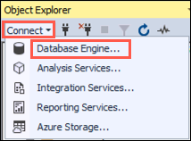

2. In the Connect to Server dialog, enter the following:

    - **Server name**: Enter the fully qualified domain name of your SQL managed instance, which you copied from the Azure Cloud Shell in a previous task.
    - **Authentication**: Select SQL Server Authentication.
    - **Login**: Enter sqlmiuser
    - **Password**: Enter Password.1234567890
    - Check the **Remember password** box.

    

3. Select **Connect**.

4. You will see you SQL MI connection appear below the SQLSERVER2008 connection. Expand Databases the SQL MI connection and select the `TailspinToys` database.

    

5. With the `TailspinToys` database selected, select **New Query** on the SSMS toolbar to open a new query window.

6. In the new query window, enter the following SQL script:

    ```sql
    SELECT * FROM Game
    ```

7. Select **Execute** on the SSMS toolbar to run the query. You will see the records contained in the `Game` table displayed, including the new `Space Adventure` you added after initiating the migration process.

    

8. You are now done using the SqlServer2008 VM. Close any open windows and log off of the VM. You will use the JumpBox VM for the remaining tasks of this hands-on lab.

## Exercise 3: Update the web application to use the new SQL MI database

Duration: 30 minutes

With the `TailspinToys` database now running on SQL MI in Azure, the next step is to make the required modifications to the TailspinToys gamer information web application.

>**Note**: SQL Managed Instance has private IP address in its own VNet, so to connect an application you need to configure access to the VNet where Managed Instance is deployed. To learn more, read [Connect your application to Azure SQL Database Managed Instance](https://docs.microsoft.com/azure/sql-database/sql-database-managed-instance-connect-app).

### Task 1: Deploy the web app to Azure [AT] 2:18-2:30

In this task, you will create an RDP connection to the JumpBox VM, and then using Visual Studio on the JumpBox, deploy the `TailspinToysWeb` application into the App Service in Azure.

1. In the [Azure portal](https://portal.azure.com), select **Resource groups** in the Azure navigation pane, and select the **hands-on-lab-SUFFIX** resource group from the list.

    

2. In the list of resources for your resource group, select the JumpBox VM.

    

3. On your JumpBox VM blade, select **Connect** from the top menu.

    

4. On the Connect to virtual machine blade, select **Download RDP File**, then open the downloaded RDP file.

    

5. Select **Connect** on the Remote Desktop Connection dialog.

    

6. Enter the following credentials when prompted, and then select **OK**:

    - **Username**: sqlmiuser
    - **Password**: Password.1234567890

    

7. Select **Yes** to connect, if prompted that the identity of the remote computer cannot be verified.

    

8. Once logged in, download the [MCW Migrating SQL databases to Azure GitHub repo](https://github.com/microsoft/Migrating-SQL-databases-to-Azure/archive/master.zip).

9. If you receive a message that downloads are not allowed, select the Tools icon at the top right of the browser window, and then select **Internet options** from the context menu.

    

10. In the **Internet Options** dialog, select **Custom level** in the Security level for this zone box.

    

11. In the Security Settings - Internet Zone dialog, locate the **Downloads** settings and choose **Enable**, then select **OK**.

    

12. Select **OK** on the Internet Options dialog, and then attempt the download again.

13. When prompted, choose to save the file and then select Open folder.

    

14. And once it is download, extract the ZIP file to `C:\hands-on-lab`.

    

    > **IMPORTANT**: Ensure to use the path above, or something similarly short. Failure to do so could result in errors opening some of the files due to a log file path.

15. Open the `C:\hands-on-lab` folder, and then drill down to `Migrating-SQL-databases-to-Azure-master\Hands-on lab\lab-files`. In the `lab-files` folder, double-click `TailspinToysWeb.sln` to open the solution in Visual Studio.

    

16. If prompted about how you want to open the file, select **Visual Studio 2019** and then select **OK**.

    

17. Select **Sign in** and enter your Azure account credentials when prompted.

    

18. At the security warning prompt, uncheck Ask me for every project in this solution, and then select **OK**.

    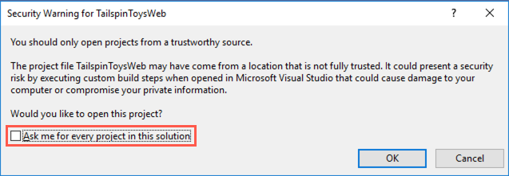


[AT] New altered instructions from here:
19. Open appsettings.json and enter your SQL 2008 VM information in the Connection strings section
```
"ConnectionStrings": {
    "TailspinToysContext": "Server=tcp:<your-sql-2008-vm-ip>,1433;Database=TailspinToys;User ID=Workshopuser;Password=Password.1234567890;Trusted_Connection=False;Encrypt=True;TrustServerCertificate=True;",
    "TailspinToysReadOnlyContext": "Server=tcp:<your-sql-2008-vm-ip>,1433;Database=TailspinToys;User ID=WorkshopUser;Password=Password.1234567890;Trusted_Connection=False;Encrypt=True;TrustServerCertificate=True;"
  }

```
20. Save the file (CTRL+S)
21. Run the application (IIS Express button)
22. You should be able to run the app locally and view the site and it's data which is accessing the on-prem data
22. Stop the application
23. Now, in order to have the app run with the MI, update appsettings.json by replace the SQL 2008 VM IP with the fully qualified domain name for your MI.
24. Run the application (IIS Express button)

> Note: If you want to complete an extension of this lab where you deploy the web app to Azure and integrate the App Service within the virtual network using point-to-site and VNet integration, see exercises 3 and 4 in the non-abbreviated lab [**TODO link needed**]


## Exercise 5: Improve database security posture with Advanced Data Security [AT] 8:18-8:23

Duration: 30 minutes

In this exercise you will enable Advanced Data Security (ADS) on your SQL MI database, and explore some of the security benefits that come with running your database in Azure. [SQL Database Advance Data Security](https://docs.microsoft.com/azure/sql-database/sql-database-advanced-data-security) (ADS) provides advanced SQL security capabilities, including functionality for discovering and classifying sensitive data, surfacing and mitigating potential database vulnerabilities, and detecting anomalous activities that could indicate a threat to your database.

### Task 1: Enable Advanced Data Security

In this task, you will enable ADS for all databases on the Managed Instance.

1. In the [Azure portal](https://portal.azure.com), select **Resource groups** from the left-hand menu, select the **hands-on-lab-SUFFIX** resource group, and then select the **TailspinToys** Managed database resource from the list.

    

2. On the TailspinToys Managed database blade, select **Advanced Data Security** from the left-hand menu, under Security, and then select **Enable Advanced Data Security on the managed instance**.

    

3. Within a few minutes, ADS will be enabled for all databases on the Managed Instance. You will see the three tiles on the Advanced Data Security blade become enabled when it has been enabled.

    

### Task 2: Configure SQL Data Discovery and Classification

In this task, you will look at the [SQL Data Discovery and Classification](https://docs.microsoft.com/sql/relational-databases/security/sql-data-discovery-and-classification?view=sql-server-2017) feature of Advanced Data Security. Data Discovery & Classification introduces a new tool for discovering, classifying, labeling & reporting the sensitive data in your databases. It introduces a set of advanced services, forming a new SQL Information Protection paradigm aimed at protecting the data in your database, not just the database. Discovering and classifying your most sensitive data (business, financial, healthcare, etc.) can play a pivotal role in your organizational information protection stature.

>**Note**: This functionality is currently available *in Preview* for SQL MI through the Azure portal.

1. On the Advanced Data Security blade, select the **Data Discovery & Classification** tile.

    

2. In the **Data Discovery & Classification** blade, select the info link with the message **We have found 40 columns with classification recommendations**.

    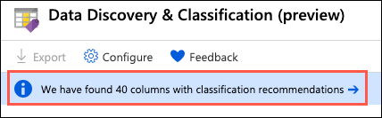

3. Look over the list of recommendations to get a better understanding of the types of data and classifications are assigned, based on the built-in classification settings. In the list of classification recommendations, select the recommendation for the **Sales - CreditCard - CardNumber** field.

    

4. Due to the risk of exposing credit card information, Tailspin Toys would like a way to classify it as highly confidential, not just **Confidential**, as the recommendation suggests. To correct this, select **+ Add classification** at the top of the Data Discovery & Classification blade.

    

5. Quickly expand the **Sensitivity label** field, and review the various built-in labels you can choose from. You can also add your own labels, should you desire.

    

6. In the Add classification dialog, enter the following:

    - **Schema name**: Select Sales.
    - **Table name**: Select CreditCard.
    - **Column name**: Select CardNumber (nvarchar).
    - **Information type**: Select Credit Card.
    - **Sensitivity level**: Select Highly Confidential.

    

7. Select **Add classification**.

8. You will see the **Sales - CreditCard - CardNumber** field disappear from the recommendations list, and the number of recommendations drop by 1.

9. Other recommendations you can review are the **HumanResources - Employee** fields for **NationIDNumber** and **BirthDate**. Note that these have been flagged by the recommendation service as **Confidential - GDPR**. As Tailspin Toys maintains data about gamers from around the world, including Europe, having a tool which helps them discover data which may be relevant to GDPR compliance will be very helpful.

    

10. Check the **Select all** check box at the top of the list to select all the remaining recommended classifications, and then select **Accept selected recommendations**.

    

11. Select **Save** on the toolbar of the Data Classification window. It may take several minutes for the save to complete.

    
    
    >**Note**: This feature is still in preview.  If you receive an error when saving, try returning to the Advanced Data Security blade, and selecting the Data Discovery & Classification tile again to see the results.

12. When the save completes, select the **Overview** tab on the Data Discovery & Classification blade to view a report with a full summary of the database classification state.

    

### Task 3: Review Advanced Data Security Vulnerability Assessment [AT] 8:23-8:26 - then needed to download ssms 18. 8:59-9:03

In this task, you will review an assessment report generated by ADS for the `TailspinToys` database and take action to remediate one of the findings in the `TailspinToys` database. The [SQL Vulnerability Assessment service](https://docs.microsoft.com/azure/sql-database/sql-vulnerability-assessment) is a service that provides visibility into your security state, and includes actionable steps to resolve security issues, and enhance your database security.

1. Return to the **Advanced Data Security** blade for the `TailspinToys` Managed database and then select the **Vulnerability Assessment** tile.

    

2. On the Vulnerability Assessment blade, select **Scan** on the toolbar.

    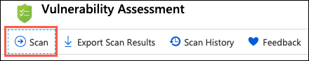

3. When the scan completes, you will see a dashboard, displaying the number of failing checks, passing checks, and a breakdown of the risk summary by severity level.

    

    >**Note**: Scans are run on a schedule, so if you see a message that no vulnerabilities are found your database may not have been scanned yet. You will need to run a scan manually. To do this, select the **Scan** button on the toolbar, and follow any prompts to start a scan. This will take a minute or so to complete.

4. In the scan results, take a few minutes to browse both the Failed and Passed checks, and review the types of checks that are performed. In the **Failed** the list, locate the security check for **Transparent data encryption**. This check has an ID of **VA1219**.

    

5. Select the **VA1219** finding to view the detailed description.

    

    > The details for each finding provide more insight into the reason for the finding. Of note are the fields describing the finding, the impact of the recommended settings, and details on remediation for the finding.

6. You will now act on the recommendation remediation steps for the finding, and enable [Transparent Data Encryption](https://docs.microsoft.com/azure/sql-database/transparent-data-encryption-azure-sql) for the `TailspinToys` database. To accomplish this, you will switch over to using SSMS on your JumpBox VM for the next few steps.

    >**Note**: Transparent data encryption (TDE) needs to be manually enabled for Azure SQL Managed Instance. TDE helps protect Azure SQL Database, Azure SQL Managed Instance, and Azure Data Warehouse against the threat of malicious activity. It performs real-time encryption and decryption of the database, associated backups, and transaction log files at rest without requiring changes to the application.

7. On your JumpBox VM, open Microsoft SQL Server Management Studio 18 from the Start menu, and enter the following information in the **Connect to Server** dialog.

    - **Server name**: Enter the fully qualified domain name of your SQL managed instance, which you copied from the Azure Cloud Shell in a previous task.
    - **Authentication**: Select SQL Server Authentication.
    - **Login**: Enter sqlmiuser
    - **Password**: Enter Password.1234567890
    - Check the **Remember password** box.

    

8. In SSMS, select **New Query** from the toolbar, paste the following SQL script into the new query window.

    ```sql
    ALTER DATABASE [TailspinToys] SET ENCRYPTION ON
    ```

    

    > You turn transparent data encryption on and off on the database level. To enable transparent data encryption on a database in Azure SQL Managed Instance use must use T-SQL.

9. Select **Execute** from the SSMS toolbar. After a few seconds, you will see a message that the "Commands completed successfully."

    

10. You can verify the encryption state and view information the associated encryption keys by using the [sys.dm_database_encryption_keys view](https://docs.microsoft.com/sql/relational-databases/system-dynamic-management-views/sys-dm-database-encryption-keys-transact-sql). Select **New Query** on the SSMS toolbar again, and paste the following query into the new query window:

    ```sql
    SELECT * FROM sys.dm_database_encryption_keys
    ```

    

11. Select **Execute** from the SSMS toolbar. You will see two records in the Results window, which provide information about the encryption state and keys used for encryption.

    

    > By default, service-managed transparent data encryption is used. A transparent data encryption certificate is automatically generated for the server that contains the database.

12. Return to the Azure portal and the Advanced Data Security - Vulnerability Assessment blade of the `TailspinToys` managed database. On the toolbar, select **Scan** to start a new assessment of the database.

    

13. When the scan completes, select the **Failed** tab, enter **VA1219** into the search filter box, and observe that the previous failure is no longer in the Failed list.

    

14. Now, select the **Passed** tab, and observe the **VA1219** check is listed with a status of **PASS**.

    

    > Using the SQL Vulnerability Assessment, it is simple to identify and remediate potential database vulnerabilities, allowing you to proactively improve your database security.

## Exercise 6: Enable Dynamic Data Masking

Duration: 15 minutes

In this exercise, you will enable [Dynamic Data Masking](https://docs.microsoft.com/azure/sql-database/sql-database-dynamic-data-masking-get-started) (DDM) on credit card numbers in the `TailspinToys` database. DDM limits sensitive data exposure by masking it to non-privileged users. This feature helps prevent unauthorized access to sensitive data by enabling customers to designate how much of the sensitive data to reveal with minimal impact on the application layer. It’s a policy-based security feature that hides the sensitive data in the result set of a query over designated database fields, while the data in the database is not changed.

> For example, a service representative at a call center may identify callers by several digits of their credit card number, but those data items should not be fully exposed to the service representative. A masking rule can be defined that masks all but the last four digits of any credit card number in the result set of any query. As another example, an appropriate data mask can be defined to protect personally identifiable information (PII) data, so that a developer can query production environments for troubleshooting purposes without violating compliance regulations.

> [AT] For more you can check out this extra lab for tailspin toys around dynamic data masking. TODO add link and more explanation!

## Exercise 7: Use online secondary for read-only queries

Duration: 15 minutes

In this exercise, you will look at how you can use the automatically created online secondary for reporting, without feeling the impacts of a heavy transactional load on the primary database. Each database in the SQL MI Business Critical tier is automatically provisioned with several AlwaysON replicas to support the availability SLA. Using [**Read Scale-Out**](https://docs.microsoft.com/azure/sql-database/sql-database-read-scale-out) allows you to load balance Azure SQL Database read-only workloads using the capacity of one read-only replica.

### Task 1: View Leaderboard report in TailspinToys web application

In this task, you will open a web report using the web application you deployed to your App Service.

1. In the [Azure portal](https://portal.azure.com), select **Resource groups** from the left-hand menu, and then select the resource group named **hands-on-lab-SUFFIX**.

   

2. In the hands-on-lab-SUFFIX resource group, select the **tailspintoysUNIQUEID** App Service from the list of resources.

   

3. On the App Service overview blade, select the **URL** to open the web application in a browser window.

   

4. In the TailspinToys web app, select **Leaderboard** from the menu.

   

   > Note the `READ_WRITE` string on the page. This is the output from reading the `Updateability` property associated with the `ApplicationIntent` option on the target database. This can be retrieved using the SQL query `SELECT DATABASEPROPERTYEX(DB_NAME(), "Updateability")`.

### Task 2: Update read only connection string

[AT] This is a 5 minute lab but requires updating the default application setting to be set to ReadWrite instead of ReadOnly and then here they run it locally and then change to ReadOnly to see update. May want to add some explanation as well for what is happening.

In this task, you will enable Read Scale-Out for the `TailspinToys`database, using the `ApplicationIntent` option in the connection string. This option dictates whether the connection is routed to the write replica or to a read-only replica. Specifically, if the `ApplicationIntent` value is `ReadWrite` (the default value), the connection will be directed to the database’s read-write replica. If the `ApplicationIntent` value is `ReadOnly`, the connection is routed to a read-only replica.

1. Return to the App Service blade in the Azure portal and select **Configuration** under Settings on the left-hand side.

   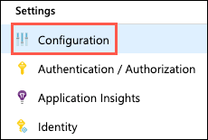

2. On the Configuration blade, scroll down and locate the connection string named `TailspinToysReadOnlyContext` within the **Connection strings** section, and select the Pencil (edit) icon on the right.

   

3. In the Add/Edit connection string dialog, select the **Value** for the `TailspinToysReadOnlyContext` and paste the following parameter to end of the connection string.

   ```sql
   ApplicationIntent=ReadOnly;
   ```

4. The `TailspinToysReadOnlyContext` connection string should now look something like the following:

   ```sql
   Server=tcp:sqlmi-abcmxwzksiqoo.15b8611394c5.database.windows.net,1433;Database=TailspinToys;User ID=sqlmiuser;Password=Password.1234567890;Trusted_Connection=False;Encrypt=True;TrustServerCertificate=True;ApplicationIntent=ReadOnly;
   ```

5. Select **Update**.

6. Select **Save** at the top of the Configuration blade.

   

### Task 3: Reload Leaderboard report in the Tailspin Toys web app

In this task, you will refresh the Leaderboard report in the Tailspin Toys web app, and observe the result.

1. Return to the TailspinToys gamer information website you opened previously, and refresh the **Leaderboard** page. The page should now look similar to the following:

    

    > Notice the `updateability` option is now displaying as `READ_ONLY`. With a simple addition to your database connection string, you are able to send read-only queries to the online secondary of your SQL MI Business critical database, allowing you to load-balance read-only workloads using the capacity of one read-only replica. The SQL MI Business Critical cluster has built-in Read Scale-Out capability that provides free-of charge built-in read-only node that can be used to run read-only queries that should not affect performance of your primary workload.

## After the hands-on lab

Duration: 10 minutes

In this exercise, you will de-provision all Azure resources that were created in support of this hands-on lab.

### Task 1: Delete Azure resource groups

1. In the Azure portal, select **Resource groups** from the left-hand menu, and locate and delete the **hands-on-lab-SUFFIX** following resource group.

### Task 2: Delete the tailspin-toys service principal

1. In the Azure portal, select **Azure Active Directory** and then select **App registrations**.

2. Select the **tailspin-toys** application, and select **Delete** on the application blade.

You should follow all steps provided *after* attending the Hands-on lab.
