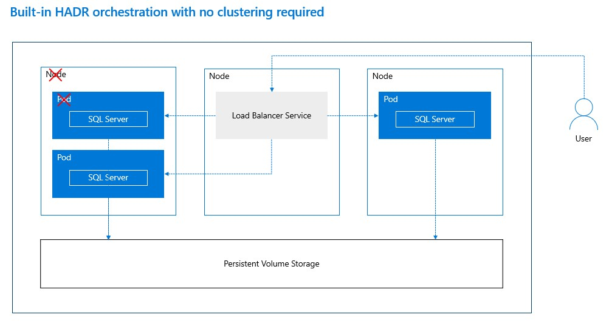

# Workshop: SQL Server 2019 on OpenShift (CTP 2.5)

#### <i>A Microsoft workshop from the SQL Server team</i>

 <h2>SQL Server High Availability on OpenShift</h2>

You'll cover the following topics in this Module:

<dl>

  <dt><a href="#4-0">4.0 SQL Server High Availability on OpenShift</a></dt>
  <dt><a href="#4-1">4.1 Updating SQL Server on OpenShift</a></dt>
  
</dl>

>**NOTE**: *If at anytime during the Activities of this Module you need to "start over" you can execute the **step6_cleanup.sh** script. Then you will need to complete all the steps in Module 1 and 2 to redeploy the pod and restore the WideWorldImporters database. You do not need to go through the steps in Module 3.*

<h2><a name="3-0">4.0 SQL Server High Availability on OpenShift</a></h2>

In this module you will learn how to use the built-in capabilities of OpenShift for high availability for SQL Server.

OpenShift, which is based on Kubernetes, allows you to deploy a pod and specify a declaration for a number of replicas. In previous modules, you deployed a SQL Server container in a single pod on OpenShift. You used a declarative yaml file to instruct OpenShift how to deploy SQL Server with a replica. The fragment of the yaml file looks similar to this:

<pre>
apiVersion: apps/v1beta1
kind: Deployment
metadata:
  name: mssql-deployment
spec:
  replicas: 1
  strategy:
    type: Recreate
</pre>

By stating **replicas of 1**, OpenShift will attempt to ensure at least one pod for SQL Server is always running. Since you used **PersistentVolumeClaim** for SQL Server databases, your data will always be available even if OpenShift has to start new SQL Server containers. In section 4.1, you will learn the significance of the **type: Recreate** syntax.

In addition, you created a load balancer service with the following yaml fragment:

<pre>
apiVersion: v1
kind: Service
metadata:
  name: mssql-service
spec:
  selector:
    app: mssql
  ports:
    - protocol: TCP
      port: 31433
      targetPort: 1433
  type: LoadBalancer
</pre>

The **LoadBalancer** service in OpenShift will have a consistent IP address and port (*31433*) that will always map to the private IP address for the SQL Server container and port 1433, which is the default port for the SQL Server database engine. So even if OpenShift has to deploy a new SQL Server container with a new private IP address, the **LoadBalancer** will always be directed to the correct SQL Server.

The following diagram is a simple visual on how OpenShift provides built-in High Availability:

Proceed to the Activity to see examples of how OpenShift provides high availability for SQL Server.

<b><a name="aks">Activity: SQL Server High Availability on OpenShift</a></b>

Follow these steps to see how high availability works with SQL Server on OpenShift using replicas, PersistentVolumeClaims, and Load Balancers.

Change directories for the scripts for this module

Run the following command from the shell:

`cd ~/sqlworkshops/SQLonOpenShift/sqlonopenshift/04_ha`

Ensure your scripts are executable

Run the following command (depending on your Linux shell and client you may need to preface this with `sudo`):

`chmod u+x *.sh`

Show the Pods for SQL Server

One of the simple methods for High Availability for OpenShift is at the container level. Since SQL Server is the main program in the container, if SQL Server is shutdown or crashes, OpenShift will automatically restart the container. In most cases, the container will be started with the same pod on the same node, but OpenShift may schedule the pod on the best node available. Run the following commands to see the status of the current pod deployed for the project you created in Module 01.

`oc get pods -o wide`

The output of this command should look something like the following:

<pre>
NAME                                READY     STATUS    RESTARTS   AGE       IP            NODE       NOMINATED NODE
mssql-deployment-6d8844988b-j9r84   1/1       Running   0          3m        10.129.0.15   ocpcluster-node01   none
</pre>

Take note of the pod name (under the **NAME** column), the **IP address**, and the **NODE** name (If your cluster has only one node, the node name will not change throughout this activity).

Shut down SQL Server

Run these commands to stop SQL Server. You can also use the script **step1_stop_container.sh**:

`SERVERIP=$(oc get service | grep mssql-service | awk {'print $4'})` 
`PORT=31433` 
`sqlcmd -Usa -PSql2019isfast -S$SERVERIP,$PORT -Q"SHUTDOWN WITH NOWAIT"` 

You should see the following output from the shell:

<pre>
Server shut down by NOWAIT request from login sa
</pre>

Now run the command again to see the pod status:

`oc get pods -o wide`

Note the pod name, IP address, and node have not changed. The **STATUS** should be *Running*.

Check Status

Execute the following commands to test SQL Server is running. You can also use the script **step2_test_sql.sh**

`SERVERIP=$(oc get service | grep mssql-service | awk {'print $4'})` 
`PORT=31433` 
`sqlcmd -Usa -PSql2019isfast -S$SERVERIP,$PORT -Q"SELECT @@version"` 

Your output should look similar to the following:

<pre>
Microsoft SQL Server 2019 (CTP2.2) - 15.0.1200.24 (X64)
Dec  5 2018 16:51:26
Copyright (C) 2018 Microsoft Corporation
Developer Edition (64-bit) on Linux (Red Hat Enterprise Linux Server 7.6 (Maipo)) X64                          

(1 rows affected)
</pre>

Depending on how long it takes OpenShift to restart the container, your re-connection make take longer than a few seconds.

Create a Node Failure

Since you deployed the SQL Server container in a pod using 1 replica, if there is a failure of the pod in a node, OpenShift will attempt to to create a new pod and schedule it on the appropriate available node. For SQL Server, this is like a *failover* since OpenShift will start a new SQL Server container but pointing to the same PersistentVolumeClaim,  hence the same system and user databases. And the LoadBalancer acts like a *listener* so if the new SQL Server container has a new IP address, the application still connects to the same LoadBalancer IP address.

>**NOTE**: *Ths is **not** the same as a SQL Server Availability Group which will be discussed in Module 05, Using an Operator with SQL Server on OpenShift.*

Run the following commands to take note again of the pod details including name, status, IP, and node:

`oc get pods -o wide`

Run the following commands to delete the node for the pod for SQL Server container. You can also use the script **step3_pod_failure.sh**:

`oc delete pod -l app=mssql`

The output of this command should look like the following:

<pre>
pod "mssql-deployment-6d8844988b-j9r84" deleted
</pre>

and then you are returned to the command prompt.

In this example, you took advantage of the label used to create the SQL Server pod. This was defined in the following yaml fragment from Module 01:

<pre>
    template:
      metadata:
        labels:
          app: mssql
</pre>

Now run the command again to see the pod status:

`oc get pods -o wide`

Starting a new pod on the same node should take a matter of seconds but if OpenShift has to start a new pod on a different node, it could take several minutes especially if the SQL Server container image does not exist on that new node.

The output of this command should have a new pod name but start with the name **mssql-deployment**. The IP address should also be different and depending on your OpenShift cluster configuration the pod could be scheduled on a new node. When the pod status is Running, you should be able to access SQL Server.

Test Recovery

If you have completed the steps in Module 02, then you restored the database **WideWorldImporters** to the container. And since the container uses a PersistentVolumeClaim, the WideWorldImporters should have the same data. Execute the following commands or the script **step4_find_people.sh** to query the database:

`SERVERIP=$(oc get service | grep mssql-service | awk {'print $4'})` 
`PORT=31433` 
`sqlcmd -Usa -PSql2019isfast -S$SERVERIP,$PORT -Q"USE WideWorldImporters;SELECT TOP 10 FullName, PhoneNumber, EmailAddress FROM [Application].[People] ORDER BY FullName;" -Y30` 

You should get the same results of data as you did in Module 02. Notice in this example, you connect to SQL Server with the **LoadBalancer** service IP address and port since you cannot determine what the IP address will be of the SQL Server container as it gets recreated on the same or other nodes.

Proceed to the next section of this module to learn how to update SQL Server while keeping it highly available.

<h2><a name="4-1">4.1 Updating SQL Server on OpenShift</a></h2>

To update the version of the SQL Server software outside a container, you would normally use a package manger command such as **yum update**.

However, package management software is not installed in the SQL Server container. Furthermore, the principle of containers is to use a consistent image. So the challenge to update the SQL Server software is that you want your running SQL Server container to keep the same set of databases and data but you want a new SQL server container with a new updated image to connect to the databases.

Fortunately, the SQL Server engine is aware of the version it is running under when it starts up and can detect the compatible versions of metadata within system and user databases. Therefore, if you start a new container using the same **PersistentVolumeClaim** of your databases from the container with the newer version image, SQL Server can be updated in a highly available fashion.

When you deploy your pod with SQL Server on OpenShift you can declare the deployment to stop the container and recreate a new one if you indicate to OpenShift that the image should be updated for the deployment.

The following yaml fragment from Module 01 shows this declaration of strategy to **Recreate**:

<pre>
apiVersion: apps/v1beta1
kind: Deployment
metadata:
  name: mssql-deployment
spec:
  replicas: 1
  strategy:
    type: Recreate
</pre>

>**NOTE**: *SQL Server can be updated from a lower major release to a new one such as SQL Server 2017 to SQL Server 2019. However, you cannot rollback a major version update.*

SQL Server has minor updates called *cumulative updates*. Cumulative updates with a major SQL Server version are compatible to update and rollback. SQL Server releases in preview called Community Technology Preview (CTP) builds are treated like major releases. So you can update for example from SQL Server 2019 CTP 2.2 to 2.3 but you cannot roll back.

This workshop as of April 2019 uses SQL 2019 CTP builds and therefore there is no exercise to rollback. Future versions of this workshop will include a rollback exercise between SQL 2019 cumulative updates.

Proceed to the Activity to learn how to update SQL Server but keep your databases intact making it highly available and consistent while updating the SQL Server software version.

<b><a name="aks">Activity: Updating SQL Server on OpenShift</a></b>

In this activity, you will use OpenShift commands to deploy an update to the release of SQL Server with no change to user data and minimize application downtime.

Update the SQL Server Version

Execute the following commands to take note of the version of SQL Server. You can also execute the script **step2_test_sql.sh**:

`SERVERIP=$(oc get service | grep mssql-service | awk {'print $4'})` 
`PORT=31433` 
`sqlcmd -Usa -PSql2019isfast -S$SERVERIP,$PORT -Q"SELECT @@version"` 

 Depending on what image was used for your workshop, the output should be reflective of the version of SQL Server deployed. In this example, the image used was for SQL Server 2019 CTP 2.2 for Red Hat Enterprise Linux.

<pre>
Microsoft SQL Server 2019 (CTP2.2) - 15.0.1200.24 (X64)
Dec  5 2018 16:51:26
Copyright (C) 2018 Microsoft Corporation
Developer Edition (64-bit) on Linux (Red Hat Enterprise Linux Server 7.6 (Maipo)) X64
</pre>

Execute the following commands to update the image of the SQL Server deployment from Module 01 to SQL Server 2019 CTP 2.3. You can also use the script **step5_update_sql.sh**:

`oc --record deployment set image mssql-deployment mssql=mcr.microsoft.com/mssql/rhel/server:2019-CTP2.3`

The output of this command should look similar to this:

<pre>
deployment.extensions/mssql-deployment image updated
</pre>

Execute the commands to see the status of the image update to the deployment:

`oc get all`

The output of this command while the new pod with the new image is getting created should look similar to this:

<pre>
NAME                                    READY     STATUS              RESTARTS   AGE
pod/mssql-deployment-6748c8d9ff-wqstc   0/1       ContainerCreating   0          1m

NAME                    TYPE           CLUSTER-IP       EXTERNAL-IP     PORT(S)           AGE
service/mssql-service   LoadBalancer   172.30.241.155   13.82.210.117   31433:31372/TCP   38m

NAME                               DESIRED   CURRENT   UP-TO-DATE   AVAILABLE   AGE
deployment.apps/mssql-deployment   1         1         1            0           38m

NAME                                          DESIRED   CURRENT   READY     AGE
replicaset.apps/mssql-deployment-6748c8d9ff   1         1         0         1m
replicaset.apps/mssql-deployment-6d8844988b   0         0         0         38m
</pre>

The time it takes to run the new pod and container could be several minutes as the OpenShift cluster may not have the new container image for SQL 2019 CTP 2.3 in its local docker registry. Once the new container is Running, you can connect to SQL Server. Notice also in this output the previous pod is stopped but available to restart, which is part of the process to rollback should you be using a cumulative update strategy.

You can also run the following command to track the details of the update

`oc get event`

Under production scenarios, images for the SQL Server containers would typically already be on the clusters, so the time it takes to bring up the new updated container will normally be far less. You could repeat the exercises in this module after cleanup up resources to see that behavior.

Run the following commands to see the SQL Server version updates. You can also use the script **step2_test_sql.sh**:

`SERVERIP=$(oc get service | grep mssql-service | awk {'print $4'})` 
`PORT=31433` 
`sqlcmd -Usa -PSql2019isfast -S$SERVERIP,$PORT -Q"SELECT @@version"` 

The SQL Server container will move to a state of running, but internally the SQL Server engine must update the metadata for system and user databases. This process should only take a few minutes, but any attempt to connect to SQL Server before this completes can result in the following error:

<pre>
Sqlcmd: Error: Microsoft ODBC Driver 17 for SQL Server : Login failed for user 'sa'. Reason: Server is in script upgrade mode. Only administrator can connect at this time.
</pre>

Within a few minutes, the above command or script if run again should product results like the following:

<pre>
Microsoft SQL Server 2019 (CTP2.3) - 15.0.1300.359 (X64)
Feb 15 2019 23:50:43
Copyright (C) 2019 Microsoft Corporation
Developer Edition (64-bit) on Linux (Red Hat Enterprise Linux Server 7.6 (Maipo)) X64           

(1 rows affected)
</pre>

If you are going to proceed and complete Module 05, you need to cleanup resources. This can be done by running the following commands. You can also execute the script **step6_cleanup.sh**:

`oc delete project mssql` 
`oc project default` 

When this completes, you should see the following output and be placed back at the shell prompt:

<pre>
project.project.openshift.io "mssql" deleted Now using project "default" on server "https://[masterconsoleurl]:443".
</pre>

You can now proceed to Next Steps to learn more about using operators and SQL Server Always On Availability Groups.

<b>For Further Study</b>

- [High Availability for SQL Server on Kubernetes](https://docs.microsoft.com/en-us/sql/linux/tutorial-sql-server-containers-kubernetes?view=sql-server-2017#ha-solution-on-kubernetes-running-in-azure-kubernetes-service)
- [High Availability for SQL Server Containers](https://docs.microsoft.com/en-us/sql/linux/sql-server-linux-container-ha-overview)

<b >Next Steps</b>

Next, Continue to <a href="05_Operator.md" target="_blank"><i>Using an Operator with SQL Server on OpenShift</i></a>.
