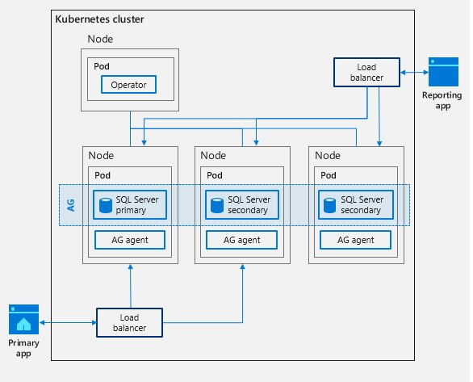

# Workshop: SQL Server 2019 on OpenShift (CTP 2.5)

#### <i>A Microsoft workshop from the SQL Server team</i>

<p style="border-bottom: 1px solid lightgrey;"></p>

 <h2>Using an Operator with SQL Server on OpenShift</h2>

You'll cover the following topics in this Module:

<dl>

  <dt><a href="#5-0">5.0 Deploy an Always On Availability Group on OpenShift with an operator</a></dt>
  <dt><a href="#5-1">5.1 Connect and Query a database in an Availability Group</a></dt>
  <dt><a href="#5-2">5.2 Testing a failover of the Availability Group</a></dt>
  
</dl>

<pre>IMPORTANT: The components used for this Module as of April 2019 are preview software and can not be used for production purposes. Once production version of these components are available the workshop will be updated.</pre>


>**NOTE:**: *If at anytime during the Activities of this Module you need to "start over" you can execute the **step11_cleanup.sh** script. Then you can start again with the first activity in section 5.0*

<p style="border-bottom: 1px solid lightgrey;"></p>

<h2><a name="5-0">5.0 Deploy an Always On Availability Group on OpenShift with an operator</a></h2>

In this module you will learn more about what, how, and why you would deploy an Operator that assists in deployment and management of an Always On Availability Group.

You learned in Module 04 the built-in capabilities of OpenShift to detect the health of the SQL Server container, pod, or node to provide High Availability.

There are a few limitations with these capabilities:

- OpenShift doesn't understand the health of the SQL Server engine
- There is only one SQL Server instance so any restart of SQL Server within the container, in a new pod, or a new node could result in several minutes of downtime.

Always On Availability Groups is the flagship HADR feature for SQL Server. It provides the fastest uptime capabilities using multiple SQL Server instances called *replicas*. You can read more about Always On Availability Groups at https://docs.microsoft.com/en-us/sql/database-engine/availability-groups/windows/overview-of-always-on-availability-groups-sql-server

Installing and configuring an Always On Availability Group can take some time and involve many steps, especially when  you need to configure a failover software package (such as Pacemaker) to help support automated failover capabilities. You can read more about Always On Availability Groups on Linux at https://docs.microsoft.com/en-us/sql/linux/sql-server-linux-availability-group-overview

In Module 04 your learned OpenShift has built-in high availability capabilities. SQL Server 2019 provides the necessary software to cooperate with OpenShift to provide high availability with Always On Availability Groups. In addition, SQL Server 2019 provides an *Operator* to assist in deployment of the Always On Availability Group and coordinate failover activities. This is non-shared storage solution as each SQL Server replica has its own storage. Combined with LoadBalancer services, this provides a complete High Availability solution with less downtime and read capabilities on secondary replicas. The following diagram shows a visual of this design:



Proceed to the Activity to learn how to use an Operator to deploy and configure an Availability Group on OpenShift.

<p style="border-bottom: 1px solid lightgrey;"></p>

<p><b><a name="aks">Activity: Deploy an Always On Availability Group on OpenShift with an operator</a></b></p>

Follow these steps to deploy an Always On Availability Group on OpenShift using an operator.

**CAUTION: If you have gone through all the activities in Modules 1-4, and you are running on a single node OpenShift cluster, you may not have enough resources to do the activities in this Module if the SQL Server you deployed in Module 1 still is running. Therefore, be sure and cleanup all previous resources by executing *step6_cleanup.sh* in Module 04.**

<p>Change directories for the scripts for this module</p>

Run the following command from the shell:

`cd ~/sqlworkshops/SQLonOpenShift/sqlonopenshift/05_operator`

<p>Ensure your scripts are executable</p>

Run the following command (depending on your Linux shell and client you may need to preface this with `sudo`)

`chmod u+x *.sh`

<p>Create a project</p>

Create a project for this activity. Use the following command or execute the **step1_create_project.sh** script:

`oc new-project ag1`

When this completes, you should see output similar to the following:

<pre>
Now using project "ag1" on server "https://masterdnsx5rquio6c54pu.eastus.cloudapp.azure.com:443".

You can add applications to this project with the 'new-app' command. For example, try:
oc new-app centos/ruby-25-centos7~https://github.com/sclorg/ruby-ex.git
to build a new example application in Ruby.
</pre>

<p>Create the SQL Server Operator</p>

Execute the following command or execute the **step2_apply_operator.sh** script:

`oc apply -f operator.yaml --namespace ag1`

When this completes, you should see output similar to the following:

<pre>
Warning: oc apply should be used on resource created by either oc create --save-config or oc apply
namespace/ag1 configured
serviceaccount/mssql-operator created
clusterrole.rbac.authorization.k8s.io/mssql-operator-ag1 configured
clusterrolebinding.rbac.authorization.k8s.io/mssql-operator-ag1 configured
deployment.apps/mssql-operator created
</pre>

You can safely ignore the Warning. To ensure the operator was deployed successfully, run the following command:

`oc get pods`

The **STATUS** of the **mssql-operator** should be **Running**. Wait until the pod is running before proceeding.

<p>Create a secret for the system administrator</p>
 
Set the **sa** password and a password for the master key using the following command or the script **step3_generate_secret.sh**:

`oc create secret generic sql-secrets --from-literal=sapassword="Sql2019isfast" --from-literal=masterkeypassword="Sql2019isfast"  --namespace ag1`

When this completes, you should see output similar to the following:

<pre>
secret/sql-secrets created
</pre>

<p>Deploy Replicas</p>

Using the **sqlserver.yaml** file you will deploy the SQL Server instances for a primary and two secondary replicas. This will coordinate with the deployed operator to install a SQL Server Always On Availability Group configuration. No database will be deployed - that will be done in the next section of this Module. Run the following command or use the script **step4_apply_sqlserver.sh**:

`oc apply -f sqlserver.yaml --namespace ag1`

When this completes, you should see the following message:

<pre>
sqlserver.mssql.microsoft.com/mssql1 created
service/mssql1 created
sqlserver.mssql.microsoft.com/mssql2 created
service/mssql2 created
sqlserver.mssql.microsoft.com/mssql3 created
service/mssql3 created
</pre>

To proceed to the rest of the activity, you need to ensure the deployment of all pods and **LoadBalancer** services are successful. The deployment could take several minutes. Execute the following command:

`oc get all`

When the deployment is successful, these pods should be in a **STATUS** of **Running**:
<pre>
pod/mssql1-0                          2/2       Running     0          4m
pod/mssql2-0                          2/2       Running     0          4m
pod/mssql3-0                          2/2       Running     0          4m
</pre>

And these **LoadBalancer** services should have a valid **EXTERNAL-IP** address:

<pre>
service/mssql1   LoadBalancer   172.30.217.34   23.96.27.207   1433:32145/TCP      4m
service/mssql2   LoadBalancer   172.30.242.37   23.96.58.167   1433:31976/TCP      4m
service/mssql3   LoadBalancer   172.30.6.212    23.96.53.245   1433:30611/TCP      4m
</pre>

 Run the `oc get all` command until the pods and LoadBalancer services are in this state.
   
>**NOTE**: *You will see some pods that start with a name of mssql-initialize. You can ignore these. They are used to deploy the SQL Server Availability Group but may not be needed in the final design of the operator for SQL Server 2019.*

In addition, notice that there are three objects from the oc get all output:

<pre>
NAME                      DESIRED   CURRENT   AGE
statefulset.apps/mssql1   1         1         43s
statefulset.apps/mssql2   1         1         40s
statefulset.apps/mssql3   1         1         37s
</pre>

 As part of the design for SQL Server Availability groups, a concept called a *statefulset* is used. A stateful set provides the capabilities to manage a set of pods that belong in a group like Availability Groups. You can read more about **StatefulSets** at https://kubernetes.io/docs/concepts/workloads/controllers/statefulset/.

<p>Create a <b>LoadBalancer</b> Service</p>

Even though each SQL Server pod has a **LoadBalancer** service, you need to create a **LoadBalancer** service that will always point to the primary replica and a LoadBalancer service that will point to any secondary replicas. Execute the following command or the script **step5_apply_agservices.sh**:

`oc apply -f ag_services.yaml --namespace ag1`
    
When this completes, you should see the following

<pre>
service/ag1-primary created
service/ag1-secondary created
</pre>

Use the following command to check the status of these services. Wait until each of these services has a valid IP address for EXTERNAL-IP before proceeding to the next step. This could take several minutes:
    
`oc get service`

At this point, a SQL Server installation is complete with a Always On Availability enabled and created for use. In the next module, you will learn how to add a database to the availability group, add data, and then query both the primary and secondary replicas.

<p style="border-bottom: 1px solid lightgrey;"></p>

<h2><a name="5-1">5.1 Connect and Query a database in an Availability Group</a></h2>

In this section, you will learn how to connect, add databases, add data, and query data to replicas in an Always On Availability Group deployed in OpenShift.

Once you have an Always On Availability Group deployed on OpenShift, you will want to add a database to the group, add some data, and see the changes reflected in secondary replicas.

SQL Server provides T-SQL statements, such as `ALTER AVAILABILITY GROUP`, to interact and manage the Availability Group including adding one more databases. An Availability Group can have one more or databases and is the unit of failover.

Once you have added your database to the availability group, you will create a database backup, which will initiate a concept called *direct seeding*. This process will send data to the secondary replicas making them in *sync*. You can now connect to the primary replica SQL Server and interact with it like any SQL Server database. You can also connect to the secondary replica(s) with a special connection option to read data. This allows you to offload read users (e.g. reporting users) from your primary SQL Server.

Proceed to the activity to see how this works.

<p style="border-bottom: 1px solid lightgrey;"></p>

<p><b><a name="aks">Activity: Connect and Query a database in an Availability Group</a></b></p>

In this activity you will learn how to connect, add databases, add data, and query data to replicas in an availability group deployed in OpenShift.

<p>Check Replica Status</p>

T-SQL provides capabilities so you can see which SQL Servers instances are currently the primary vs secondary replica.

An example of a T-SQL command to see replica status looks like the following


```sql
SELECT ar.replica_server_name, hars.role_desc, hars.operational_state_desc
FROM sys.dm_hadr_availability_replica_states hars
JOIN sys.availability_replicas ar
ON hars.replica_id = ar.replica_id
GO
```

Run the following command or execute the script **step6_check_replicas.sh** to see the replica status of the Availability Group deployed:

`SERVERIP=$(oc get service | grep ag1-primary | awk {'print $4'})`<br>
`PORT=1433`<br>
`sqlcmd -Usa -PSql2019isfast -S$SERVERIP,$PORT -icheckreplicas.sql -Y30`<br>

In this example, you are using the LoadBalancer directed to the primary replica. Your results should look similar to the following message:

<pre>
replica_server_name            role_desc                      operational_state_desc
------------------------------ ------------------------------ ------------------------------
mssql1-0                       PRIMARY                        ONLINE
mssql2-0                       SECONDARY                      NULL
mssql3-0                       SECONDARY                      NULL
</pre>

It is possible that the replica_server_name for your deployment is any of these replicas. In most cases, it will be **mssql1-0**. You will use this same command later to see that the status of the Availability Group after a failover.

Now it is time to create a new database,  backup the database, and then add the database to the Availability Group. Examine the contents of the script **setupag.sql** to see the T-SQL commands. Run the following command or script **step7_setupag.sh**:

`SERVERIP=$(oc get service | grep ag1-primary | awk {'print $4'})`<br>
`PORT=1433`<br>
`sqlcmd -Usa -PSql2019isfast -S$SERVERIP,$PORT -isetupag.sql`<br>

You should see results similar to the following message:

<pre>
Changed database context to 'master'.
Changed database context to 'master'.
Processed 328 pages for database 'testag', file 'testag' on file 1.
Processed 2 pages for database 'testag', file 'testag_log' on file 1.
BACKUP DATABASE successfully processed 330 pages in 1.239 seconds (2.077 MB/sec).
</pre>

Direct seeding should happen almost instantly because there is no user data in the database.

<p>Create Data for Replication</p>

It's time to create a table in the database and add in data connected to the primary replica SQL Server. SQL Server will automatically send changes to secondary replicas.

Examine the T-SQL script **testag.sql** to see the table and data that will be added. Run the following commands or execute the script **step8_testag.sh**:

`SERVERIP=$(oc get service | grep ag1-primary | awk {'print $4'})`<br>
`PORT=1433`<br>
`sqlcmd -Usa -PSql2019isfast -S$SERVERIP,$PORT -itestag.sql`<br>

Your results should look similar to the following message:

<pre>
Changed database context to 'testag'.

(1 rows affected)
</pre>

<p>Query the Replica</p>

Now you want to query the primary replica to see your data but also query secondary replicas to see if the changes were synchronized and also learn how to run read-only queries against secondary replicas, one of the benefits of using Availability Groups.

In order to do this, you need to know the LoadBalancer of the primary replica and secondary replica. So far, you have been using scripts to connect to the primary replica. You created in the previous section a **LoadBalancer** for the secondary replicas. But, since there are two secondary replicas, which one will be chosen?. That is the benefit of the **LoadBalancer** service. You can have multiple users connect to the secondary replica **LoadBalancer** and these connections will be balanced across available replicas.

Consider the following T-SQL script you will use to query the data and to determine which SQL Server you are connected to:

```sql
SELECT 'Connected to Primary = '+@@SERVERNAME;USE testag;SELECT * FROM ilovesql
```

In this example, you will use the `-Q` option of **sqlcmd** to run a query directly without a script file. The use of the "`;`" serves as a batch delimiter much like the keyword `GO`. In example, the built-in T-SQL function `@@SERVERNAME` indicates what SQL Server host the query is running on and the remaining queries select the data you have inserted. This way even though you are connected to the LoadBalancer you can see which exact replica you are being redirected to.

 Execute the following commands or the script **step9_queryag.sh** to see the results:

`SERVERIP=$(oc get service | grep ag1-primary | awk {'print $4'})`<br>
`PORT=1433`<br>
`sqlcmd -Usa -PSql2019isfast -S$SERVERIP,$PORT -Q"SELECT 'Connected to Primary = '+@@SERVERNAME;USE testag;SELECT * FROM ilovesql" -Y60`<br>
`SERVERIP=$(oc get service | grep ag1-secondary | awk {'print $4'})`<br>
`PORT=1433`<br>
`sqlcmd -Usa -PSql2019isfast -S$SERVERIP,$PORT -Q"SELECT 'Connected to Secondary = '+@@SERVERNAME;USE testag;SELECT * FROM ilovesql" -K ReadOnly -Y60`<br>

The first set of commands connect to the primary replica **LoadBalancer**. The second set of commands to the secondary replica **LoadBalancer**. In the case of the secondary replica, the -K option is used to state the intention of only reading data. This is required to query a secondary replica. You can read more about how applications specify ReadOnly intent at https://docs.microsoft.com/en-us/sql/database-engine/availability-groups/windows/listeners-client-connectivity-application-failover?view=sql-server-2017#ReadOnlyAppIntent.

Your results should look like the following message, although your server names may be different depending on how the primary was elected when the Availability Group was deployed:

<pre>
Connected to Primary = mssql1-0

(1 rows affected)
Changed database context to 'testag'.
col1        col2
----------- ------------------------------------------------------
 
1            SQL Server 2019 is fast, secure, and highly available

(1 rows affected)

Connected to Secondary = mssql2-0

(1 rows affected)
Changed database context to 'testag'.
col1        col2
----------- -------------------------------------------------------

1            SQL Server 2019 is fast, secure, and highly available

(1 rows affected)
</pre>

Now that you have successfully created a database, added it to the Availability Group, and synchronized data, you can proceed to the next section to test how a failover works.

<p style="border-bottom: 1px solid lightgrey;"></p>

<h2><a name="5-2">5.2 Testing a failover of the Availability Group</a></h2>

In this section, you will learn how to simulate a failover of SQL Server in an Availability Group deployed on OpenShift.

Since Availability Groups provide high availability and lower downtime due to its non-shared storage replica design,it is important to see a failover in action to understand the application experience.

In previous sections of this module, you deployed an Availability Group using an operator. The operator also coordinates with *agents* in containers running in the same pod as the SQL Server replicas to detect failover conditions and if necessary trigger a failover. A failover will cause one of the synchronized secondary replicas to shift roles as a new primary replica. The previous primary replica, once it is healthy, can be synchronized and become a secondary replica.

Proceed to the Activity to simulate a failover and test a new primary replica is active.

<p style="border-bottom: 1px solid lightgrey;"></p>

<p><b><a name="aks">Activity: Testing a failover of the Availability Group</a></b></p>

Follow the steps in his activity to simulate a failover and see how a new secondary replica has switched roles to become a primary, resulting in almost no downtime to the application.

<p>Verify Replica State</p>

From the last step in the previous section activity, the primary and secondary replicas were synchronized. Verify the replica state by running the following commands or the script **step6_check_replicas.sh**:

`SERVERIP=$(oc get service | grep ag1-primary | awk {'print $4'})`<br>
`PORT=1433`<br>
`sqlcmd -Usa -PSql2019isfast -S$SERVERIP,$PORT -icheckreplicas.sql -Y30`<br>

Your results should look similar to the following message:

<pre>
replica_server_name            role_desc                      operational_state_desc
------------------------------ ------------------------------ ------------------------------
mssql1-0                       PRIMARY                        ONLINE
mssql2-0                       SECONDARY                      NULL
mssql3-0                       SECONDARY                      NULL
</pre>

If in your results, if the replica_server_name is mssql2-0 for the PRIMARY, you will need to edit the **failover.yaml** file. If not, you can skip to the next step.

The **failover.yaml** file declares how to manually trigger a failover to another replica but is setup so you must specify which replica to target as the new primary. The workshop was built so that **mssql2-0** would be the new primary. In some rare cases, **mssql2-0** might have been chosen as the original primary. If this is the case, you need to edit this part of the **failover.yaml** file and change the name **mssql2-0** to **mssql3-0**. This section is near the bottom of the failover.yaml file.

<pre>
- {name: MSSQL_K8S_AG_NAME, value: ag1}
- {name: MSSQL_K8S_NEW_PRIMARY, value: mssql2-0}
</pre>

Once you have edited and saved the changes, proceed to the next step.

<p>Trigger the Failover</p>

To manually trigger the failover, apply the failover.yaml file which will submit a *job* to trigger the change for a failover. Run the following command or the script **step10_failover.sh**

`oc apply -f failover.yaml`

You should see results similar to the following message:
   
<pre>
serviceaccount/manual-failover created
role.rbac.authorization.k8s.io/manual-failover created
rolebinding.rbac.authorization.k8s.io/manual-failover created
job.batch/manual-failover created
</pre>


<p>Verify the switch</p>

The failover should happen fairly quickly. You can run the following commands or script **step6_check_replicas.sh** to verify the new PRIMARY switch has occurred

`SERVERIP=$(oc get service | grep ag1-primary | awk {'print $4'})`<br>
`PORT=1433`<br>
`sqlcmd -Usa -PSql2019isfast -S$SERVERIP,$PORT -icheckreplicas.sql -Y30`<br>

Your results should show a new PRIMARY similar to the following message:

<pre>
replica_server_name            role_desc                      operational_state_desc
------------------------------ ------------------------------ ------------------------------
mssql1-0                       SECONDARY                      NULL
mssql2-0                       PRIMARY                        ONLINE
mssql3-0                       SECONDARY                      NULL

(3 rows affected)
</pre>

<p>Verify the Data</p>

Now run the following commands or use the script **step9_queryag.sh** to verify that your data is still synchronized and by using the LoadBalancers the application has not changed even though you are connected to a new primary and secondary:

`SERVERIP=$(oc get service | grep ag1-primary | awk {'print $4'})`<br>
`PORT=1433`<br>
`sqlcmd -Usa -PSql2019isfast -S$SERVERIP,$PORT -Q"SELECT 'Connected to Primary = '+@@SERVERNAME;USE testag;SELECT * FROM ilovesql" -Y60`<br>
`SERVERIP=$(oc get service | grep ag1-secondary | awk {'print $4'})`<br>
`PORT=1433`<br>
`sqlcmd -Usa -PSql2019isfast -S$SERVERIP,$PORT -Q"SELECT 'Connected to Secondary = '+@@SERVERNAME;USE testag;SELECT * FROM ilovesql" -K ReadOnly -Y60`<br>

Your results should look similar to the time you ran this query from the previous section activity except the server names should be different and reflect the new primary and secondary replicas:

<pre>
Connected to Primary = mssql2-0

(1 rows affected)
Changed database context to 'testag'.
col1        col2
----------- ------------------------------------------------------------
1            SQL Server 2019 is fast, secure, and highly available

(1 rows affected)


Connected to Secondary = mssql1-0

(1 rows affected)
Changed database context to 'testag'.
col1        col2
----------- ------------------------------------------------------------
1            SQL Server 2019 is fast, secure, and highly available

(1 rows affected)
</pre>

In this activity, you have simulated a failover for your deployed Availability Group and seen your data is still consistent, intact, and your application has connected with no changes and almost no downtime.

You can now run **step11_cleanup.sh** if you would like to repeat this Module or repeat any of the other Modules in the workshop.

<p style="border-bottom: 1px solid lightgrey;"></p>

<p><b>For Further Study</b></p>

This is the final module of the workshop. For further study on the topics in this module, see the following

- [Overview of SQL Server Always On Availability Groups](https://docs.microsoft.com/en-us/sql/database-engine/availability-groups/windows/overview-of-always-on-availability-groups-sql-server)
- [Always On Availability Groups for SQL Server Containers](https://docs.microsoft.com/en-us/sql/linux/sql-server-ag-kubernetes?view=sqlallproducts-allversions)
- [Introducing the Operator Framework](https://blog.openshift.com/introducing-the-operator-framework/)

<p style="border-bottom: 1px solid lightgrey;"></p>
