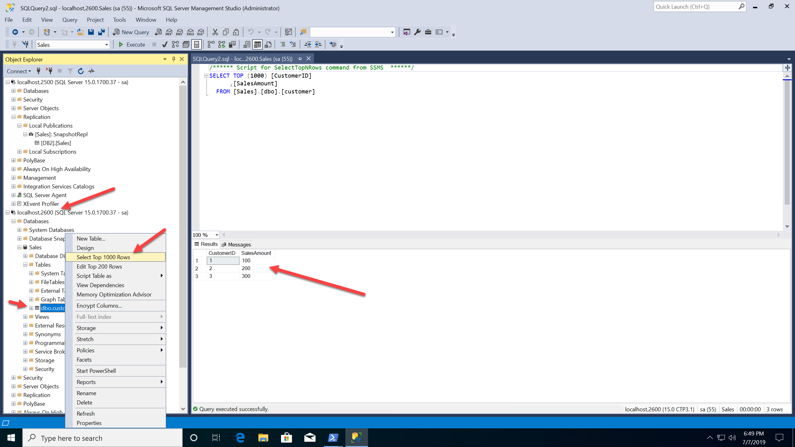

# Workshop: SQL Server 2019 Lab (RC)

#### <i>A Microsoft workshop from the SQL Server team</i>

<h2><b>     SQL Server 2019 Linux and Containers</b></h2>

SQL Server 2017 introduced the world to SQL Server on Linux and Containers. SQL Server on Linux is completely compatible with SQL Server on Windows due to the unique design of the SQL Platform Abstraction Layer (SQLPAL). The core engine features of SQL Server on Linux work exactly as SQL Server on Windows because the engine codebase is the same on both platforms.

However, there were some features that come with SQL Server that were not included in SQL Server 2017 on Linux. SQL Server 2019 shores up these gaps by including the following new enhancements for Linux:

- Replication and Change Data Capture (CDC)
- Distributed Transactions
- Machine Learning Services and Extensibility
- Polybase
- Tempdb file auto-config

Containers were also introduced with SQL Server 2017. Containers provide portability, consistent, reduced footprint, and increased availability due to their unique ability for updates.

SQL Server 2019 introduces the following new enhancements for containers:

- Microsoft Container Registry
- RedHat Images
- Availability Groups on Kubernetes
- Windows Containers (Currently Private Preview)

For this module, we will join forces to show you how to implement SQL Server Replication with Linux Containers.
<dl>

  <dt><a href="#5-0">5.0 SQL Server 2019 Replication on Linux using Containers</a></dt>
   
</dl>

<h2><b><a name="5-0">     5.0 SQL Server 2019 Replication on Linux using Containers</a></b></h2>

In this module you will learn how to deploy SQL Server Replication using Containers.

<h3><b><a name="challenge">The Challenge</a></b></h3>

Customers who need or desire to use Linux as a platform now have a choice with SQL Server. Even though SQL Server 2017 is compatible with SQL Server on Windows, some features like Replication were not included in the release.

In addition, SQL Server 2017 released SQL Server on containers only based on Ubuntu images. Some customers prefer Red Hat Enterprise Linux (RHEL) and in fact Red Hat requires container images to be based on RHEL to be officially supported on platforms like OpenShift.

<h3><b><a name="solution">The Solution</a></b></h3>

SQL Server 2019 on Linux now supports Replication. Since SQL Server supports containers on Linux, it is possible to create a SQL Server replication solution using containers. In addition. SQL Server 2019 now supports container images based on Red Hat Enterprise Linux (RHEL). These forces can be combined to build a solution using Docker. Anywhere Docker runs (Windows, Linux, MacOS, Kubernetes), you can build a SQL Server Replication solution with a publisher, distributor, and subscriber all with docker containers.

SQL Server container images include SQL Server "pre-installed" with the SQL Server Engine, SQL Server Agent, and tools. You can customize the SQL Server container image to include your own files. One scenario would be to include in the customized container images scripts to create database objects. Since Replication can all be deployed using T-SQL, you can use a customized solution to deploy replication across multiple containers. This customized solution is called the "Vin Yu" method named after the lead program manager within the SQL Server team. You can then bring in a tool like **docker-compose** to deploy this solution all with a single command.

The Further Reading section at the end of this module provides reference information about SQL Server 2019 on Linux, Docker containers, and Replication on Linux.

Proceed to the activity to explore how this method can allow you to deploy SQL Server 2019 on Linux with Replication with a single command.

<h2><b><a name="activitylinuxrepl">     Activity: Deploying SQL Server Replication on Linux using Containers</a></b></h2>

In this activity, you will learn how to deploy a SQL Server replication solution with a publisher, distributor, and subscriber using two SQL Server Linux containers.

>**NOTE**: *If at anytime during the Activities of this Module you need to "start over" you can go back to the first Activity in 5.0 and run through all the steps again.*

<h3><b><a name="activitysteps">Activity Steps</a></b></h3>

All scripts for this activity can be found in the **sql2019lab\05_Linux_and_Containers\replication** folder. These scripts and this activity is based on the sample Vin Yu built as found at https://github.com/microsoft/sql-server-samples/tree/master/samples/containers/replication.

>**NOTE**: This activity assumes the following:

- **Docker** is installed. You can use Docker Desktop for Windows or macOS or Docker for Linux to run this activity.
- You have the **docker-compose** tool installed. In many docker installations, docker-compose comes with the install.
- You have internet access to pull SQL Server images from mcr.microsoft.com
- You have **SQL Server Management Studio** (SSMS) 18.1 or higher installed to use as a client. If you are running this example on Linux or MacOS you can still view the results of the replication setup using T-SQL commands. SSMS provides graphical navigation that is not currently available in other tools.

**STEP 1: Explore how the solution works**

It will help to describe how scripts and files are provided to make the solution work. Examine the following files described in this step to see the flow.

In the **sql2019lab\05_Linux_and_Containers\replication** folder there are two directories and a file:

- **db1** - Scripts and files to build a custom container image for the publisher and distributor.
- **db2** - Scripts and files to build a customer container for the subscriber.
- **docker-compose.yml** - A text file that describes how docker-compose should build and run containers for the solution. Notice in this file are specifics for running the container including the SA password and enabling SQL Agent (which is required for replication)

When docker-compose is run it will use the docker-compose.yml file to build two container images and run them based on files in the db1 and db2 directories.

In each **db1** and **db2** directory are the following files:

- **Dockerfile** - This tells docker how to build a custom image based on the SQL Server 2019 RHEL image
- **entrypoint.sh** - This is a Linux shell script included in the custom image which will be the main "program" for the container. This script will run a script called **db-init.sh** and then run the sqlservr program
- **db-init.sh** - This shell script will sleep for a period of time waiting for sqlservr to start up. Then it will use sqlcmd inside the container to run a T-SQL script called **db-init.sql**
- **db-init.sql** - This could be any set of T-SQL statements to run after sqlservr has started. For the db1 directory this will create a database, a table, insert data, and then run T-SQL scripts to configure a publisher, distributor, subscriber, publication, article, and agents to run a snapshot. This script for the db2 directory only creates an empty database to hold the table in the publication.

So the sequence will be:

1. docker-compose up
2. Build the custom image in the db1 directory and run that container
3. Build the custom image in the db2 directory and run that container.

Once the container db1 has been run, docker-compose will shift and build and run db2. db1 will be running its db-init.sql script while db2 starts up so the output from the command line may look interleaved.

**Step 2: Deploy SQL Server Replication Containers with docker-compose**

To run the solution, simple type the following from the command line (you must be in the **replication** directory)

`docker-compose up`

When you run this you will see alot of information scroll by on the command line. If the docker images for the lab have not been pulled it will take a few minutes for docker to pull them into local storage.

Since docker containers run sqlservr from the command line, part of the output is the ERRORLOG from each server startup being written to stdout.

If you are using Docker for Windows, you may also see the following firewall pop-up from Windows Defender if you are running this lab on Windows. Please click Allow Access. vpnkit is a gateway used by Docker on Windows to communicate with the VM hosting Linux containers.

You will also see output of the db-init.sql execution mostly from the db1 directory. If you have not previously pulled the images for SQL Server 2019 for RHEL, that will be done first and you will see that output.

The replication solution should be ready to go when you see this output from the command line. It may take a few minutes to see this as the containers are pausing for enough time for SQL Server to startup.

<pre>db1    | Creating Snapshot...
db1    | Job 'db1-Sales-SnapshotRepl-DB2-1' started successfully.</pre>

The command line will appear to "hang" at this point. This is normal as both programs are running. Once you see this output leave the command line alone. If you attempt `<`Ctrl`>`+`<`C`>` or exit the command line it would stop the 2 containers.

>**NOTE**: *You can use add the **-d** parameter to docker-compose -up to run the containers in the background. But then you would need to monitor SQL Sever replication to see when the snapshot has been applied.*

**Step 3: Verify the Replication Deployment**

The docker-compose.yml file contains key information to connect to both SQL Server containers.

- port 2500 is mapped to the publisher
- port 2600 is mapped to the subscriber

Connect to localhost,2500 (or `<`server`>`,2500) for the SQL Server publisher. The sa password can be found in the **docker-compose.yml** file.

Now navigate using SSMS to check the status of the replication snapshot. Use the figure below as a guide on how to navigate Object Explorer to check this status

Now connect to the subscriber (port 2600) to check that the new table, customers in the Sales database, and data are present. Use the following figure as a guide to navigate and check the table and data. The sa password can be found in the **docker-compose.yml** file.

**Step 4: Shutdown and remove the containers**

If you open up a new command line shell or Powershell window, you can simply run the following command:

`docker-compose down`

and the containers will be stopped and removed.

You can also hit `<`Ctrl`>`+`<`C`>` from the command line where you run docker-compose up. This will stop the containers. You will then need to run

`docker-compose down`

to remove the containers. The images that you built with docker-compose will still be cached on the machine.

When you are done proceed to the **Activity Summary** section for the Activity below.

<h3><b><a name="activitysummary">Activity Summary</a></b></h3>

In this activity, you learned how to deploy a SQL Server replication topology with a single command. You learned that SQL Server on Linux is completely compatible with SQL Server Replication on Windows. You used SQL Server 2019 on Linux combined with containers to easily deploy a publisher, distributor, and subscriber. You learned some of the details behind how to build custom images and add your own T-SQL scripts when a SQL Server container is started.

<h2><b>     For Further Study</b></h2>

- [SQL Server on Linux Overview](https://docs.microsoft.com/en-us/sql/linux/sql-server-linux-overview?view=sql-server-ver15)

- [Running SQL Server container images with Docker ](https://docs.microsoft.com/en-us/sql/linux/quickstart-install-connect-docker?view=sql-server-linux-ver15)
 
- [SQL Server Replication on Linux](https://docs.microsoft.com/en-us/sql/linux/sql-server-linux-replication?view=sql-server-ver15)

- [Dockerfile reference](https://docs.docker.com/engine/reference/builder/)

- [Docker compose](https://docs.docker.com/compose/)