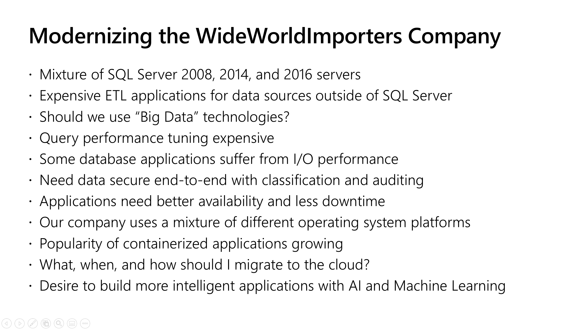

# Lab: SQL Server 2019

#### <i>A Microsoft Course from the SQL Server team</i>

<h2><b>     About this Workshop</b></h2>

Welcome to this Microsoft solutions workshop on *SQL Server 2019 Lab*.

SQL Server 2019 is a modern data platform designed to tackle the challenges of today's data professional. SQL Server 2019 is not just an upgrade option from previous releases of SQL Server. Consider today's modern data challenges for a company called WideWorldImporters

SQL Server 2019 includes new capabilities that can solve these challenges. Consider the following infographic

SQL Server 2019 provides many new capabilities including:

- Data Virtualization with Polybase and Big Data Clusters to reduce the need for data movement
- Intelligent Performance to boost query performance with no application changes
- Security enhancements such as Always Encrypted and Data Classification
- Mission Critical Availability including enhancements for Availability Groups, built-in HA from Kubernetes and OpenShift, and Accelerated Database Recovery
- Modern Development capabilities including Machine Learning Services and Extensibility with Java and the language of your choice
- SQL Server on the platform of your choice with compatibility including Windows, Linux, Docker, Kubernetes, and Arm64 (Azure SQL Database Edge)

In this course you will learn some of the concepts and how to solve modern data challenges using a hands-on lab approach.

This course is intended to be taken as a self-paced lab in 1 to 2 hours but can be instructor-led to broaden the discussion or go deeper into specific subjects. Supplement slide decks are available for this course in the [slides](https://github.com/microsoft/sqlworkshops/tree/master/sql2019lab/slides) folder.

This course is designed for data professionals who have a basic working knowledge of SQL Server and the T-SQL language.

This **README.MD** file explains how the workshop is structured, what you will learn, and the technologies you will use in this solution.

<h2><b>     Learning Objectives</b></h2>

When you complete this course, you will be able to:

- Understand and use **Intelligent Performance** features to boost query performance with application changes
- Understand and use **Data Classification and Auditing** to meet the needs of compliance and regulation standards.
- Understand and use **Accelerated Database Recovery** to increase database availability.
- Understand and use **Polybase** to connect and query other data sources with no data movement.
- Understand and use **Docker containers** to deploy **SQL Server Replication on Linux**.

As part of taking this lab you are also learning about new capabilities in **Azure SQL Database**.

The following features in this lab also exist in Azure SQL Database:

- Intelligent Query Processing
- Data Classification and Auditing
- Accelerated Database Recovery

In addition, SQL Server Polybase allows you to connect to Azure SQL Database, Azure SQL Data Warehouse, and Azure CosmosDB.

<h2>
<b>     Business Applications of this Workshop</b></h2>

- Boosting Database Performance with no application changes
- Classifying data for industry or regulatory compliance
- Ensuring data is highly available
- Reducing costs of expensive data movement applications
- Choosing different platforms for SQL Server and taking advantage of containerized applications.

<h2><b>     Technologies used in this Workshop</b></h2>

 <table style="tr:nth-child(even) {background-color: #f2f2f2;}; text-align: left; display: table; border-collapse: collapse; border-spacing: 2px; border-color: gray;">

  <tr><th style="background-color: #1b20a1; color: white;">Technology</th> <th style="background-color: #1b20a1; color: white;">Description</th></tr>

  <tr><td><i>SQL Server</i></td><td>Database Platform produced by Microsoft</td></tr>
  <tr><td><i>SQL Server 2019</i></td><td>Most current release of SQL Server currently in preview</td></tr>
  <tr><td><i>Intelligent Query Processing</i></td><td>Automated query processing enhancements in SQL Server 2019</td></tr>
 <tr><td><i>Query Store</i></td><td>Built-in query performance execution statistics stored in a user database</td></tr>
 <tr><td><i>Data Classification</i></td><td>Built-in data information classification with SQL Server with auditing</td></tr>
<tr><td><i>Accelerated Database Recovery</i></td><td>Constant Time Recovery, fast rollback, and aggressive transaction log truncation</td></tr>
<tr><td><i>Polybase</i></td><td>Data Virtualization through external tables</td></tr>
  <tr><td><i>Linux</i></td><td>Operating system used in Containers and Container Orchestration</td></tr>
  <tr><td><i>Docker</i></td><td>Engine for running and manage containers</td></tr>
<tr><td><i>SQL Server Management Studio (SSMS)</i></td><td>Graphical User Interface Management and Query Tool</td></tr>
    <tr><td><i>Azure Data Studio<i></td><td>Graphical User Interface to execute T-SQL queries, notebooks, and manage SQL Server</td></tr>

</table>

<h2><b>     Before Taking this Workshop</b></h2>

To complete this workshop you will need the following:

- Clone the workshop using git from https://github.com/microsoft/sqlworkshops.git. All the scripts and files in the labs are found in the **sql2019lab** folder.
- On Windows systems, you should use the following git syntax

    `git clone --config core.autocrlf=false https://github.com/microsoft/sqlworkshops.git`

- Install the software as listed in the **Setup** section below

Each module of this workshop can be studied and used independently of each other or taken all as a single lab. The Modules are designed in a sequence but you can use each of them one at a time at your own pace.

<h3> 
<b>     Setup</b></h3>

In order to complete this workshop you need to install the following software:

- SQL Server 2019 CTP 3.2 or later. You can run all of the activities from this workshop on an installed SQL Server on Windows, Linux, or Containers. You can use the client tools on a separate computer or VM provided it has access to connect to SQL Server.
    - For **Modules 1, 2, and 3** you only need the database engine installed
    - **Module 3** requires disk space to hold a database with a 10Gb data and 10Gb log file.
    - **Module 4** requires you to install and enable Polybase (you don't need the Java option and you can choose a stand-alone Polybase.)
- Install SQL Server Management Studio (SSMS) 18.2 or higher from https://docs.microsoft.com/en-us/sql/ssms/download-sql-server-management-studio-ssms. Several of the modules require features built only into SSMS.
- Install Azure Data Studio June 2019 or higher from https://docs.microsoft.com/en-us/sql/azure-data-studio/download. T-SQL notebooks are used extensively in this course.
- **Docker is required only for Module 5**. You can use Docker for Windows, Linux, or MacOS.
- The WideWorldImporters sample backup from https://github.com/Microsoft/sql-server-samples/releases/download/wide-world-importers-v1.0/WideWorldImporters-Full.bak
- Access to an **Azure SQL Database** is required for **Module 4**.

This workshop was built and designed for a server or VM to run SQL Server with at least 8Gb RAM and 4 CPUs. You may be able to run this lab with less compute resources.

> **NOTE**: *If you run this lab from a virtual machine in Azure running Windows, and you want to use Module 5, you will need to enable nested virtualization. Read more at https://docs.microsoft.com/en-us/azure/virtual-machines/windows/nested-virtualization*

<h2><b>     Workshop Details</b></h2>

This workshop uses SQL Server 2019, SQL Server Management Studio, Azure Data Studio, Docker containers, and Azure SQL Database for you to learn how you can solve modern data challenges with SQL Server 2019.

<table style="tr:nth-child(even) {background-color: #f2f2f2;}; text-align: left; display: table; border-collapse: collapse; border-spacing: 5px; border-color: gray;">

  <tr><td style="background-color: Cornsilk; color: black; padding: 5px 5px;">Primary Audience:</td><td style="background-color: Cornsilk; color: black; padding: 5px 5px;">Data professionals looking to understand and use new capabilities of SQL Server 2019</td></tr>
  <tr><td>Secondary Audience:</td><td> Developers, Architects, and IT Pros</td></tr>
  <tr><td style="background-color: Cornsilk; color: black; padding: 5px 5px;">Level: </td><td style="background-color: Cornsilk; color: black; padding: 5px 5px0;"> 300</td></tr>
  <tr><td>Type:</td><td>Self-Paced or Instructor Led</td></tr>
  <tr><td style="background-color: Cornsilk; color: black; padding: 5px 5px;">Length: </td><td style="background-color: Cornsilk; color: black; padding: 5px 5px;">1-2 hours (self-paced) 4 hours (Instructor Led)</td></tr>

</table>

<h2><b>     Related Workshops</b></h2>

- [Modernize your Database with SQL Server 2019](https://github.com/Microsoft/sqlworkshops/tree/master/ModernizeYourDatabases2019)
- [SQL Server Big Data Clusters Architecture](https://github.com/microsoft/sqlworkshops/tree/master/sqlserver2019bigdataclusters)
- [SQL Server 2019 on OpenShift](https://github.com/microsoft/sqlworkshops/tree/master/SQLonOpenShift)

<h2><b>     Workshop Modules</b></h2>

This is a modular workshop, and in each section, you'll learn concepts, technologies, and processes to help you complete the solution. This table is provided for you to see the list of modules in the workshop. You can use any module in any order you like but the preferred method is to **proceed to Next Steps below to start the workshop.**

<table style="tr:nth-child(even) {background-color: #f2f2f2;}; text-align: left; display: table; border-collapse: collapse; border-spacing: 5px; border-color: gray;">

  <tr><td style="background-color: AliceBlue; color: black;"><b>Module</b></td><td style="background-color: AliceBlue; color: black;"><b>Topics</b></td></tr>

  <tr><td><a href="./01_IntelligentPerformance.md" target="_blank">01 - Intelligent Performance</a></td><td> Learn the how SQL Server can boost your performance with no application changes</td></tr>
  <tr><td style="background-color: AliceBlue; color: black;"><a href="./02_Security.md" target="_blank">02 - Security</a> </td><td td style="background-color: AliceBlue; color: black;"> Learn new security features of SQL Server 2019 such as Data Classification and Auditing</td></tr>
  <tr><td><a href="./03_Availability.md" target="_blank">03 - Availability</a></td><td> Learn new capabilities to make your SQL Server more available such as Accelerated Database Recovery</td></tr>
  <tr><td style="background-color: AliceBlue; color: black;"><a href="./04_DataVirtualization.md" target="_blank">04 - Data Virtualization</a> </td><td td style="background-color: AliceBlue; color: black;">Learn how to use SQL Server as a data hub and reduce data movement using Polybase++ </td></tr> 
  <tr><td><a href="./05_Linux_and_Containers.md" target="_blank">04 - Linux and Containers</a></td><td>Learn how to use Docker containers to deploy SQL Server Replication on Linux.</td></tr>
  <tr></tr>
  <tr></tr>
</table>

<h2><b>     Next Steps</b></h2>

Next, Continue to <a href="./01_IntelligentPerformance.md" target="_blank"><i>Intelligent Performance</i></a>

