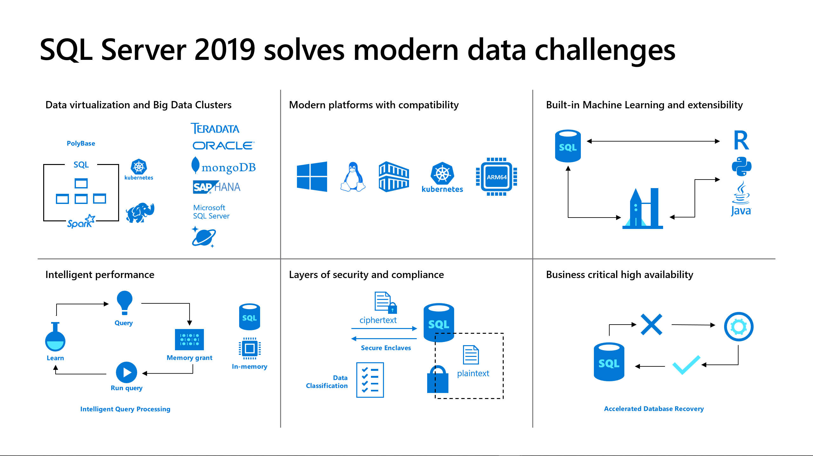

# Workshop: SQL Server 2019 Workshop

#### <i>A Microsoft workshop from the SQL Server team</i>

<h2><b>     Introduction to SQL Server 2019</b></h2>

SQL Server 2019 is a modern data platform designed to tackle the challenges of today's data professional. SQL Server 2019 is not just an upgrade option from previous releases of SQL Server. Consider today's modern data challenges for a business.

SQL Server 2019 includes new capabilities that can solve these challenges. Consider the following infographic.

SQL Server 2019 provides many new capabilities including:

- Data Virtualization with Polybase and Big Data Clusters to reduce the need for data movement.
- SQL Server on the platform of your choice with compatibility including Windows, Linux, containers, Kubernetes, and Arm64 (Azure SQL Database Edge)
- Modern Development capabilities including Machine Learning Services and Extensibility with Java and the language of your choice
- Intelligent Performance to boost query performance with no application changes
- Security enhancements such as Always Encrypted and Data Classification
- Mission Critical Availability including enhancements for Availability Groups, online index enhancements, and Accelerated Database Recovery

Watch this video by Travis Wright, Principal Program Manager on the SQL Server team, introducing SQL Server 2019:

<h2><b>     For Further Study</b></h2>

- [What's new in SQL Server 2019](https://docs.microsoft.com/en-us/sql/sql-server/what-s-new-in-sql-server-ver15)

- [SQL Server 2019 Example Notebooks](https://github.com/microsoft/sql-server-samples/tree/master/samples/features/sql2019notebooks)

- [SQL Server 2019 Video Learning Series](https://aka.ms/sql2019learning)

- [What is Azure Data Studio?](https://docs.microsoft.com/en-us/sql/azure-data-studio/what-is)

- [How to use Notebooks in Azure Data Studio](https://docs.microsoft.com/en-us/sql/azure-data-studio/sql-notebooks)

<h2><b>  Next Steps</b></h2>

Next, Continue to <a href="02_IntelligentPerformance.md" target="_blank"><i>Intelligent Performance</i></a>.
