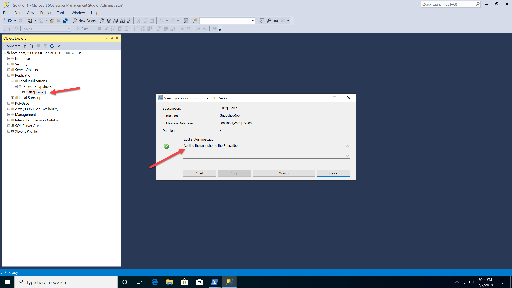

# Workshop: SQL Server 2019 Workshop

#### <i>A Microsoft workshop from the SQL Server team</i>

<p style="border-bottom: 1px solid lightgrey;"></p>

<h2><b>     SQL Server 2019 Linux and Containers</b></h2>

SQL Server 2017 introduced the world to SQL Server on Linux and Containers. SQL Server on Linux is completely compatible with SQL Server on Windows due to the unique design of the SQL Platform Abstraction Layer (SQLPAL). The core engine features of SQL Server on Linux work exactly as SQL Server on Windows because the engine codebase is the same on both platforms.

However, there were some features that come with SQL Server that were not included in SQL Server 2017 on Linux. SQL Server 2019 shores up these gaps by including the following new enhancements for Linux:

- Replication and Change Data Capture (CDC)
- Distributed Transactions
- Machine Learning Services and Extensibility
- Polybase
- Tempdb file auto-config

Containers were also introduced with SQL Server 2017. Containers provide portability, consistent, reduced footprint, and increased availability due to their unique ability for updates.

SQL Server 2019 introduces the following new enhancements for containers:

- Microsoft Container Registry
- Red Hat Images
- Non-root Containers

For this module, we will join forces to show you how to implement SQL Server Replication with Linux Containers.
<dl>

  <dt><a href="#6-0">6.0 Deploying and using SQL Server containers</a></dt>
  <dt><a href="#6-1">6.1 Advanced: SQL Server 2019 Replication on Linux using Containers</a></dt>
   
</dl>

<p style="border-bottom: 1px solid lightgrey;"></p>

<h2><b><a name="5-0">     6.0 Deploying and using SQL Server Containers</a></b></h2>

<h3><b><a name="challenge">The Challenge</a></b></h3>

You would like to explore and use containers as a solution to provide a consistent environment for developing and using SQL Server. You want to your developers to all use the same SQL Server build without maintaining a development server of SQL Server. You also would like to reduce downtime when patching a production SQL Server with cumulative updates and if necessary quickly rollback to a previous cumulative update build.

<h3><b><a name="solution">The Solution</a></b></h3>

SQL Server containers provide solutions for these challenges. Use containers to have all developers work on the same build of SQL Server whether they use Windows, Linux, or MacOS. Since SQL Server cumulative updates are compatible, you can use containers to easily switch between builds maintaining the same databases with minimal downtime. You can learn more about how to use SQL Server containers at https://docs.microsoft.com/en-us/sql/linux/quickstart-install-connect-docker.

<p style="border-bottom: 1px solid lightgrey;"></p>

<h2><b><a name="activitycontainers">     Activity: Updating SQL Server with Containers</a></b></h2>

In this activity you will deploy a SQL Server container and interact with SQL Server by restoring and creating a database. You will also learn various methods to interact and inspect a containers using the docker client. You will also see how fast it can be to update SQL Server to a new cumulative update by *switching* containers.

At the time this Module was built there were no cumulative updates for SQL Server 2019. Therefore, this activity uses SQL Server 2017 containers to show how a cumulative update can be applied with containers. The same concepts will apply once cumulative updates are available for SQL Server 2019.

There are several container runtime programs in the marketplace today. This activity will use Docker as a container runtime engine and tools.

>**NOTE**: *If at anytime during the Activities of this Module you need to "start over" you can run the script **cleanup.ps1** (or cleanup.sh for Linux) and go back to the first Activity in 6.0 and run through all the steps again.*

<h3><b><a name="activitysteps5.0">Activity Steps</a></b></h3>

All scripts for this activity can be found in the **sql2019workshop\sql2019wks\06_Linux_and_Containers\containers** folder.

This activity requires you to download the WideWorldImporters sample database from https://github.com/Microsoft/sql-server-samples/releases/download/wide-world-importers-v1.0/WideWorldImporters-Full.bak. The scripts assume this backup is in the c:\sql_samples_database folder for Windows and /sql_sample_databases for Linux.

There are two subfolders for this Activity:

- **powershell** - Use scripts here for Docker Desktop for Windows
- **bash** - Use these scripts for Docker for Linux.

>**NOTE:** This full activity is currently not supported on MacOS due to problems using volumes. See this GitHub issue for more details https://github.com/Microsoft/mssql-docker/issues/12. It is possible to modify this activity to not use volumes on MacOS to still see aspects of running SQL Server containers.*

The steps documented here will use the Powershell subfolder and Docker Desktop for Windows. Docker Desktop for Windows on Windows 10 uses a Virtual Machine running Linux called DockerDesktopVM. Windows 10 insider builds have an update to the Windows Subsystem for Linux called **wsl2**. wsl2 does not require a full virtual machine to run Linux programs on Windows. Docker for Desktop has a Preview version that takes advantage of wsl2. This Activity does not currently use wsl2 as it and Docker for Desktop are not mainstream builds at this time. Once these become more mainstream this workshop will be changed to use wsl2.

**NOTE:** You may need to run the following command on your computer to execute Powershell scripts:

`Set-ExecutionPolicy -ExecutionPolicy RemoteSigned`

**STEP 1: Start the SQL Server container**

Start a SQL Server container using the script **step1_runsqlconainer.ps1** which runs the command:

```powershell
docker run `
 -e 'ACCEPT_EULA=Y' -e 'MSSQL_SA_PASSWORD=Sql2017isfast' `
 --hostname sql2017cu10 `
 -p 1401:1433 `
 -v sqlvolume:/var/opt/mssql `
 --name sql2017cu10 `
 -d `
 mcr.microsoft.com/mssql/server:2017-CU10-ubuntu
```
Let's examine each of these arguments:

**-e 'ACCEPT_EULA=Y' -e 'MSSQL_SA_PASSWORD=Sql2017isfast'**

These are environment variables used to feed SQL Server in the container to accept the EULA agreement and supply a sa password. You can put in whatever sa password you like but you must use that same sa password in subsequent steps in the activity.

**--hostname sql2017cu10**

This becomes @@SERVERNAME in the container

**-p 1401:1433**

This is used to map port 1433 (the default port for SQL Server) to a new port. Applications will connect now to port 1401 to access this SQL Server in the container. If you only run one SQL Server container on a host and don't run any SQL Server outside of a container on the host, you don't need to map the port.

**-v sqlvolume:/var/opt/mssql**

This is used to map a persisted volume on the host to a directory in the container. If any changes are made in the mapped directory in the container they are reflected in the persisted volume. This is an example of a *named volume* where the container runtime decides the location of the volume. You can also use any valid host volume or mount point.

**--name sql2017cu10**

This tags the SQL Server container with a name you use with other container runtime commands.

**-d**

This parameter indicates the container should be run in the background. If you did not use -d, the SQL Server ERRORLOG would dump to the screen as the sqlservr program by default writes the ERRORLOG as it starts up to stdout. This could be useful for debugging purposes.

When this command completes it will display the CONTAINER ID as a long UUID value. If the container image was not previously pulled, docker would first *pull* the image and then run the container.

**STEP 2: Copy a database backup into the container**

Copy the WideWorldImporters backup into the container by using the script **step2_copyintocontainer.ps1** which runs the command:

```powershell
docker cp c:\sql_sample_databases\WideWorldImporters-Full.bak sql2017cu10:/var/opt/mssql
```
This command will copy the WideWorldImporters-Full.bak file into a folder in the container. This folder is mapped to the persisted container storage volume on the host so if the container is removed the files in that directory will not be lost. Change the path where the WideWorldImporters backup file exists on your environment.

**STEP 3: Restore the WideWorldImporters database**

Restore the backup you copied in the previous step using the **step3_restoredb.ps1** script which runs the following command:

```powershell
docker exec sql2017cu10 /opt/mssql-tools/bin/sqlcmd -S localhost -U sa -P 'Sql2017isfast' -Q"RESTORE DATABASE WideWorldImporters FROM DISK = '/var/opt/mssql/WideWorldImporters-Full.bak' WITH MOVE 'WWI_Primary' TO '/var/opt/mssql/data/WideWorldImporters.mdf', MOVE 'WWI_UserData' TO '/var/opt/mssql/data/WideWorldImporters_userdata.ndf', MOVE 'WWI_Log' TO '/var/opt/mssql/data/WideWorldImporters.ldf', MOVE 'WWI_InMemory_Data_1' TO '/var/opt/mssql/data/WideWorldImporters_InMemory_Data_1'"
```

In this example, docker is used to run a program in the container which is sqlcmd. sqlcmd is installed in all SQL Server containers. An alternative way to restore the database would be to run sqlcmd outside the container and connect using the port mapped to the container. You will see an example of that later in this activity.

The restore will run and could take a few minutes to complete. When this command finishes the result of the RESTORE DATABASE will be displayed on the screen including upgrade steps since the WideWorldImporters sample backup was built on SQL Server 2016.

**STEP 4: Run a query against the SQL Server Container**

Run a query against a table in the WideWorldImporters database and find the SQL Server version using the script **step4_querysql.ps1** which runs the following commands:


```powershell
sqlcmd '-Usa' '-Slocalhost,1401' '-Q"USE WideWorldImporters;SELECT * FROM [Application].[People];"' '-PSql2017isfast'
sqlcmd '-Usa' '-Slocalhost,1401' '-Q"SELECT @@VERSION"' '-PSql2017isfast'
```

These are examples of using sqlcmd outside of the container connecting to port 1401. localhost is used because the container is running on the same computer. As a bonus activity, Connect and query the container with another tool like SQL Server Management Studio or Azure Data Studio. Use the same localhost,1401 as the servername with SQL Authentication and the correct sa password.

The results of these commands should be a list of rows followed by the SQL Server version which should be SQL Server 2017 CU10.

**STEP 5: Update to a new cumulative update**

To update the SQL Server container to the latest cumulative update, you will *switch* containers. You will shutdown the existing container and start a new one using the latest cumulative update image. The volume will be the same as well as the port number. The new SQL Server container will recognize the existing system and user databases and perform a small upgrade step to use the new cumulative update.

Run the script **step5_updatesql.ps1** which uses the following commands:

```powershell
docker stop sql2017cu10
docker run `
 -e 'ACCEPT_EULA=Y' -e 'MSSQL_SA_PASSWORD=Sql2017isfast' `
 -p 1401:1433 `
 -v sqlvolume:/var/opt/mssql `
 --hostname sql2017latest `
 --name `
 sql2017latest `
 -d `
 mcr.microsoft.com/mssql/server:2017-latest
```
Notice the first container is stopped but not removed. The second container is started with the same port and volume but the latest cumulative update image. While this process is running let's learn how to run another SQL Server container.

**STEP 6: Run a second SQL Server container**

SQL Server on Linux does not support named instances. Therefore, the way to run multiple SQL Server instances on Linux is with containers. Using the script **step6_runsqlcontainer2.sql** start a new container. This script uses the following command:

```powershell
docker run `
 -e 'ACCEPT_EULA=Y' -e 'MSSQL_SA_PASSWORD=Sql2017isfast' `
 --hostname sql2 `
 -p 1402:1433 -v `
 sqlvolume2:/var/opt/mssql `
 --name sql2 `
 -d `
 mcr.microsoft.com/mssql/server:2017-latest
```
This looks very similar to the other containers you have run except there is a new hostname and container name as well as a different volume and port mapping.

**STEP 7: List out running containers**

With all of these containers that were stopped and now running, how can you see a list of these? Use the script **step7_containers.ps1** which runs the following command:

```powershell
docker ps -a
```
The results should look something like this:

<pre>CONTAINER ID        IMAGE                                             COMMAND                  CREATED             STATUS                     PORTS                    NAMES
78a9fb10028a        mcr.microsoft.com/mssql/server:2017-latest        "/opt/mssql/bin/nonr…"   2 minutes ago       Up 2 minutes               0.0.0.0:1402->1433/tcp   sql2
f41b12720e91        mcr.microsoft.com/mssql/server:2017-latest        "/opt/mssql/bin/nonr…"   6 minutes ago       Up 6 minutes               0.0.0.0:1401->1433/tcp   sql2017latest
7c9a04aba1b0        mcr.microsoft.com/mssql/server:2017-CU10-ubuntu   "/opt/mssql/bin/sqls…"   About an hour ago   Exited (0) 6 minutes ago                            sql2017cu10</pre>

Notice for the STATUS two containers are running (Up for ...) while one is not (Exited...)). The container sql2017cu10 is the one you stopped.

**STEP 8: Inspect aspects of the container**

Each of the two running containers uses a volume which is mapped to a host directory or mount point. Use the script **step8_inspectvols.ps1** which uses the following command to how details of each volume:

```powershell
docker inspect sqlvolume sqlvolume2
```
Your results should look like the following:

<pre>[
    {
        "CreatedAt": "2019-10-13T13:52:15Z",
        "Driver": "local",
        "Labels": null,
        "Mountpoint": "/var/lib/docker/volumes/sqlvolume/_data",
        "Name": "sqlvolume",
        "Options": null,
        "Scope": "local"
    },
    {
        "CreatedAt": "2019-10-13T14:49:30Z",
        "Driver": "local",
        "Labels": null,
        "Mountpoint": "/var/lib/docker/volumes/sqlvolume2/_data",
        "Name": "sqlvolume2",
        "Options": null,
        "Scope": "local"
    }
]</pre>

Notice that each volume has a separate Mountpoint which is the true directory on the host where the files for /var/opt/mssql in the container are stored. In this activity, these directories exist inside the Linux VM created by Docker Desktop for Windows.

**STEP 9: Run queries against the update SQL Server container**

The update of the SQL Server container should be done. Run the same query as you did in STEP 4 using the script **step9_querysql.ps1** to see the same results of the table in WideWorldImporters and a new version of SQL Server which should be the latest SQL 2017 Cumulative Update build.

It is possible for a brief period of time you may see these messages when running this script

<pre>Sqlcmd: Error: Microsoft ODBC Driver 17 for SQL Server : Login failed for user 'sa'. Reason: Server is in script upgrade mode. Only administrator can connect at this time..
Sqlcmd: Error: Microsoft ODBC Driver 17 for SQL Server : Login failed for user 'sa'. Reason: Server is in script upgrade mode. Only administrator can connect at this time..</pre>

Wait for a short period of time and retry the script if this occurs. This indicates SQL Server is updating to the cumulative update build.

**STEP 10: Rollback to the previous cumulative update for SQL Server**

Let's say you need to rollback to the SQL 2017 CU10 build due to some issue. Since that container is stopped but not removed and the same volume is used for that container and the one currently running the latest cumulative update, you can rollback the update change by stopping the current container and starting back the container sql2017cu10. Use the script **step10_rollbackupdate.ps1**which runs the following command:

```powershell
docker stop sql2017latest
docker start sql2017cu10
```

**STEP 11: Run a program in the container**

While the rollback is taking place, let's do something interest by running a bash shell inside the container and doing some exploration. Use the script **step11_execincontainers.ps1** which runs the following command:

```powershell
docker exec -it sql2017cu10 bash
```
When this command is successful you should be placed at a bash shell prompt like this:

`root@sql2017cu10:/#`

Type in the following command at the prompt

`ps -axf`

Your results should look like the following:

<pre>root@sql2017cu10:/# ps -axf
  PID TTY      STAT   TIME COMMAND
  191 pts/0    Ss     0:00 bash
  207 pts/0    R+     0:00  \_ ps -axf
    1 ?        Ssl    0:00 /opt/mssql/bin/sqlservr
    7 ?        Sl     0:42 /opt/mssql/bin/sqlservr</pre>

These results prove *container isolation*. The primary program for the container is sqlservr. SQL Server on Linux consists of two sqlservr programs (one of which is the true SQL Server engine running. The other is a "watchdog" process)

Notice the only other programs are bash and ps. Bash and ps are programs seen by the container because docker exec was used to run bash. bash and ps are true programs running in an isolated fashion on the host but in the same *namespace* as the SQL Server container.

Now run the following command to see contents of the container:

`ll /var/opt/mssql/log`

Your results should look similar to this

<pre>root@sql2017cu10:/# ll /var/opt/mssql/log
total 5668
drwxr-xr-x 2 root root    4096 Oct 13 15:14 ./
drwxr-xr-x 6 root root    4096 Oct 13 13:52 ../
-rw-r----- 1 root root   77824 Oct 13 13:37 HkEngineEventFile_0_132154474234530000.xel
-rw-r----- 1 root root   77824 Oct 13 14:44 HkEngineEventFile_0_132154514995750000.xel
-rw-r----- 1 root root   77824 Oct 13 15:09 HkEngineEventFile_0_132154529918890000.xel
-rw-r----- 1 root root  233663 Oct 13 15:15 errorlog
-rw-r----- 1 root root  232544 Oct 13 15:09 errorlog.1
-rw-r----- 1 root root   24269 Oct 13 14:44 errorlog.2
-rw-r----- 1 root root       0 Oct 13 13:37 errorlog.3
-rw-r----- 1 root root 1048576 Oct 13 15:00 log_16.trc
-rw-r----- 1 root root 1048576 Oct 13 15:05 log_17.trc
-rw-r----- 1 root root 1048576 Oct 13 15:09 log_18.trc
-rw-r----- 1 root root 1048576 Oct 13 15:14 log_19.trc
-rw-r----- 1 root root   41984 Oct 13 15:15 log_20.trc
-rw-r----- 1 root root     156 Oct 13 15:09 sqlagentstartup.log
-rw-r----- 1 root root  458752 Oct 13 14:44 system_health_0_132154474250790000.xel
-rw-r----- 1 root root  229376 Oct 13 15:09 system_health_0_132154515001650000.xel
-rw-r----- 1 root root  131072 Oct 13 15:14 system_health_0_132154529924610000.xel</pre>

These list of files should look familiar to the SQL Server user. The are XEvent traces, ERRORLOG files, and default SQL Server trace files. You could dump out the ERRORLOG at this point but let's use a different method to do that outside of the container.

Type in the following command to leave the bash shell

`exit`

You should now be back in your Powershell or original bash shell prompt.

**STEP 12: Examine the logs of a container**

Container runtime engines like docker provide a method to see logged output of a running or even stopped container. For a SQL Server container, those logs represent the latest ERRORLOG file. Use the script **step12_containerlogs.ps1** which runs the following command:

```powershell
docker logs sql2017latest
```
Your output should be the ERRORLOG from the shutdown SQL Server container which was running the latest cumulative update.

**STEP 13: See the top processes in a container**

Container runtime engines like Docker also support viewing the top running processes in a container without executing a shell in the container. Use the script **step13_containertop.ps1** which uses the command:

```powershell
docker top sql2017cu10
```
Your results should look like the following:

<pre>PID                 USER                TIME                COMMAND
14443               root                0:00                /opt/mssql/bin/sqlservr
14489               root                1:07                /opt/mssql/bin/sqlservr</pre>

This is similar output to running the Linux top command inside the container.

**STEP 14: Run queries against the rolled back version of SQL Server**

The rollback should be complete so now run the same queries you did in STEP 9 using the script **step14_querysql.ps1**. You should see the same rows from the table in WideWorldImporters and the version of SQL Server which should be back to SQL 2017 CU10. You have successfully rolled back to SQL Server 2017 CU10 with minimal downtime, same data, and no direct patching of SQL Server.

It is possible for a brief period of time you may see these messages when running this script

<pre>Sqlcmd: Error: Microsoft ODBC Driver 17 for SQL Server : Login failed for user 'sa'. Reason: Server is in script upgrade mode. Only administrator can connect at this time..
Sqlcmd: Error: Microsoft ODBC Driver 17 for SQL Server : Login failed for user 'sa'. Reason: Server is in script upgrade mode. Only administrator can connect at this time..</pre>

Wait for a short period of time and retry the script if this occurs. This indicates SQL Server is updating to the cumulative update build.

**STEP 15: Clean up resources**

Use the script **cleanup.ps1** to shutdown all containers and remove volumes. **YOU MUST RUN this step to use the Advanced Activity below!**

When you are done proceed to the **Activity Summary** section for the Activity below.

<h3><b><a name="activitysummary">Activity Summary</a></b></h3>

In this activity, you learned the basics of deploying a SQL Server container and interacting with it by restoring a database and querying data. You learned how to run multiple SQL Server instances on Linux by using containers. You also learned how to update and rollback SQL Server with different cumulative update builds using containers.

<p style="border-bottom: 1px solid lightgrey;"></p>

<h2><b><a name="5-0">     6.1 Advanced: SQL Server 2019 Replication on Linux using Containers</a></b></h2>

In this module you will learn how to deploy SQL Server Replication using Containers.

<h3><b><a name="challenge">The Challenge</a></b></h3>

Customers who need or desire to use Linux as a platform now have a choice with SQL Server. Even though SQL Server 2017 is compatible with SQL Server on Windows, some features like Replication were not included in the release.

In addition, SQL Server 2017 released SQL Server on containers only based on Ubuntu images. Some customers prefer Red Hat Enterprise Linux (RHEL) and in fact Red Hat requires container images to be based on RHEL to be officially supported on platforms like OpenShift.

<h3><b><a name="solution">The Solution</a></b></h3>

SQL Server 2019 on Linux now supports Replication. Since SQL Server supports containers on Linux, it is possible to create a SQL Server replication solution using containers. In addition. SQL Server 2019 now supports container images based on Red Hat Enterprise Linux (RHEL). These forces can be combined to build a solution using Docker. Anywhere Docker runs (Windows, Linux, MacOS, Kubernetes), you can build a SQL Server Replication solution with a publisher, distributor, and subscriber all with docker containers.

SQL Server container images include SQL Server "pre-installed" with the SQL Server Engine, SQL Server Agent, and tools. You can customize the SQL Server container image to include your own files. One scenario would be to include in the customized container images scripts to create database objects. Since Replication can all be deployed using T-SQL, you can use a customized solution to deploy replication across multiple containers. This customized solution is called the "Vin Yu" method named after the lead program manager within the SQL Server team. You can then bring in a tool like **docker-compose** to deploy this solution all with a single command.

The Further Reading section at the end of this module provides reference information about SQL Server 2019 on Linux, Docker containers, and Replication on Linux.

Proceed to the activity to explore how this method can allow you to deploy SQL Server 2019 on Linux with Replication with a single command.

<p style="border-bottom: 1px solid lightgrey;"></p>

<h2><b><a name="activitylinuxrepl">     Advanced Activity: Deploying SQL Server Replication on Linux using Containers</a></b></h2>

In this activity, you will learn how to deploy a SQL Server replication solution with a publisher, distributor, and subscriber using two SQL Server Linux containers.

>**NOTE**: *If at anytime during the Activities of this Module you need to "start over" you must first run the command docker-compose down and then you can go back to the first Activity in 6.1 and run through all the steps again.*

<h3><b><a name="activitysteps5.0">Activity Steps</a></b></h3>

All scripts for this activity can be found in the **sql2019workshop\sql2019wks\06_Linux_and_Containers\replication** folder. These scripts and this activity is based on the sample Vin Yu built as found at https://github.com/microsoft/sql-server-samples/tree/master/samples/containers/replication.

>**NOTE**: This activity assumes the following:

- **Docker** is installed. You can use Docker Desktop for Windows or macOS or Docker for Linux to run this activity.
- You have the **docker-compose** tool installed. In many docker installations, docker-compose comes with the install.
- You have internet access to pull SQL Server images from mcr.microsoft.com
- You have **SQL Server Management Studio** (SSMS) 18.1 or higher installed to use as a client. If you are running this example on Linux or MacOS you can still view the results of the replication setup using T-SQL commands. SSMS provides graphical navigation that is not currently available in other tools.

>**STOP:** If you have gone through the steps in the Activity for Module 6.0, you must first run STEP 15 from Activity 6.0 to cleanup previous containers.

**STEP 1: Explore how the solution works**

It will help to describe how scripts and files are provided to make the solution work. Examine the following files described in this step to see the flow.

In the **sql2019workshop\sql2019wks\06_Linux_and_Containers\replication** folder there are two directories and a file:

- **db1** - Scripts and files to build a custom container image for the publisher and distributor.
- **db2** - Scripts and files to build a customer container for the subscriber.
- **docker-compose.yml** - A text file that describes how docker-compose should build and run containers for the solution. Notice in this file are specifics for running the container including the SA password and enabling SQL Agent (which is required for replication)

When docker-compose is run it will use the docker-compose.yml file to build two container images and run them based on files in the db1 and db2 directories.

In each **db1** and **db2** directory are the following files:

- **Dockerfile** - This tells docker how to build a custom image based on the SQL Server 2019 RHEL image
- **entrypoint.sh** - This is a Linux shell script included in the custom image which will be the main "program" for the container. This script will run a script called **db-init.sh** and then run the sqlservr program
- **db-init.sh** - This shell script will sleep for a period of time waiting for sqlservr to start up. Then it will use sqlcmd inside the container to run a T-SQL script called **db-init.sql**
- **db-init.sql** - This could be any set of T-SQL statements to run after sqlservr has started. For the db1 directory this will create a database, a table, insert data, and then run T-SQL scripts to configure a publisher, distributor, subscriber, publication, article, and agents to run a snapshot. This script for the db2 directory only creates an empty database to hold the table in the publication.

So the sequence will be:

1. docker-compose up
2. Build the custom image in the db1 directory and run that container
3. Build the custom image in the db2 directory and run that container.

Once the container db1 has been run, docker-compose will shift and build and run db2. db1 will be running its db-init.sql script while db2 starts up so the output from the command line may look interleaved.

**Step 2: Deploy SQL Server Replication Containers with docker-compose**

To run the solution, simple type the following from the command line (you must be in the **replication** directory)

`docker-compose up`

When you run this you will see alot of information scroll by on the command line. If the docker images for the lab have not been pulled it will take a few minutes for docker to pull them into local storage.

Since docker containers run sqlservr from the command line, part of the output is the ERRORLOG from each server startup being written to stdout.

If you are using Docker for Windows, you may also see the following firewall pop-up from Windows Defender if you are running this lab on Windows. Please click Allow Access. vpnkit is a gateway used by Docker on Windows to communicate with the VM hosting Linux containers.


You will also see output of the db-init.sql execution mostly from the db1 directory. If you have not previously pulled the images for SQL Server 2019 for RHEL, that will be done first and you will see that output.

The replication solution should be ready to go when you see this output from the command line. It may take a few minutes to see this as the containers are pausing for enough time for SQL Server to startup.

<pre>db1    | Creating Snapshot...
db1    | Job 'db1-Sales-SnapshotRepl-DB2-1' started successfully.</pre>

The command line will appear to "hang" at this point. This is normal as both programs are running. Once you see this output leave the command line alone. If you attempt `<`Ctrl`>`+`<`C`>` or exit the command line it would stop the 2 containers.

>**NOTE**: *You can use add the **-d** parameter to docker-compose -up to run the containers in the background. But then you would need to monitor SQL Sever replication to see when the snapshot has been applied.*

**Step 3: Verify the Replication Deployment**

The docker-compose.yml file contains key information to connect to both SQL Server containers.

- port 2500 is mapped to the publisher
- port 2600 is mapped to the subscriber

Connect to localhost,2500 (or `<`server`>`,2500) for the SQL Server publisher. The sa password can be found in the **docker-compose.yml** file.

Now navigate using SSMS to check the status of the replication snapshot. Use the figure below as a guide on how to navigate Object Explorer to check this status



Now connect to the subscriber (port 2600) to check that the new table, customers in the Sales database, and data are present. Use the following figure as a guide to navigate and check the table and data. The sa password can be found in the **docker-compose.yml** file.


**Step 4: Shutdown and remove the containers**

If you open up a new command line shell or Powershell window, you can simply run the following command:

`docker-compose down`

and the containers will be stopped and removed.

You can also hit `<`Ctrl`>`+`<`C`>` from the command line where you run docker-compose up. This will stop the containers. You will then need to run

`docker-compose down`

to remove the containers. The images that you built with docker-compose will still be cached on the machine.

When you are done proceed to the **Activity Summary** section for the Activity below.

<h3><b><a name="activitysummary">Activity Summary</a></b></h3>

In this activity, you learned how to deploy a SQL Server replication topology with a single command. You learned that SQL Server on Linux is completely compatible with SQL Server Replication on Windows. You used SQL Server 2019 on Linux combined with containers to easily deploy a publisher, distributor, and subscriber. You learned some of the details behind how to build custom images and add your own T-SQL scripts when a SQL Server container is started.

<p style="border-bottom: 1px solid lightgrey;"></p>

<h2><b>     For Further Study</b></h2>

- [SQL Server on Linux Overview](https://docs.microsoft.com/en-us/sql/linux/sql-server-linux-overview?view=sql-server-ver15)

- [Running SQL Server container images](https://docs.microsoft.com/en-us/sql/linux/quickstart-install-connect-docker?view=sql-server-linux-ver15)
 
- [SQL Server Replication on Linux](https://docs.microsoft.com/en-us/sql/linux/sql-server-linux-replication?view=sql-server-ver15)

- [Dockerfile reference](https://docs.docker.com/engine/reference/builder/)

- [Docker compose](https://docs.docker.com/compose/)

<p style="border-bottom: 1px solid lightgrey;"></p>

<h2><b>     Next Steps</b></h2>

Next, Continue to <a href="07_SQLOnKubernetes.md" target="_blank"><i>SQL Server and Kubernetes</i></a>.
