# Workshop: SQL Server 2019 Workshop

#### <i>A Microsoft workshop from the SQL Server team</i>

<p style="border-bottom: 1px solid lightgrey;"></p>

<h2><b>     Big Data Clusters</b></h2>

SQL Server Big Data Clusters provide a solution for Intelligence over all of your Data through Data Virtualization with Polybase, built-in HDFS and Spark, and a end-to-end Machine Learning Platform.

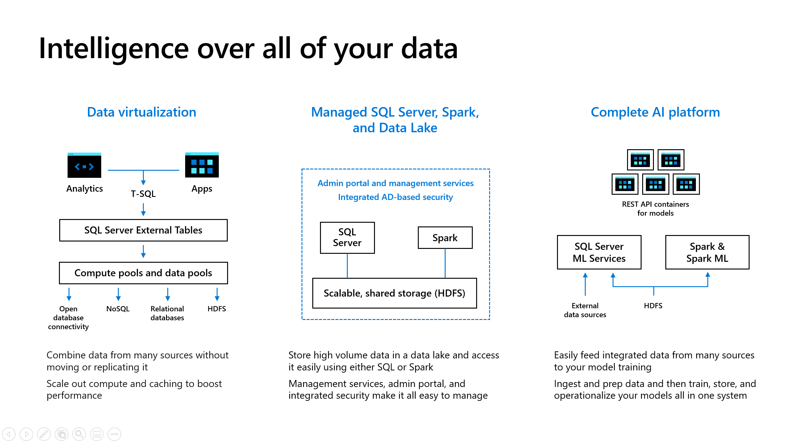

Big Data Clusters are deployed using Kubernetes nodes, pods, and services. Big Data Clusters provides these services to provide solutions for intelligence over all of your data including:

- A **SQL Server Master Instance** with HADR built-in using Always On Availability Groups. This is the core SQL Server engine with all the capabilities of SQL Server 2019.
- A **Compute Pool** of pods to deploy a Polybase scale-out group
- A **Storage Pool** of pods with a deployed HDFS cluster with Spark installed. The SQL Server engine is deployed to provide optimized access to HDFS files.
- A **Data Pool** of pods implementing a data mart to store cached or offline results
- Access to **external data sources** such as Oracle, SQL Server (including Azure), MongoDB (including CosmosDB), and Teradata through Polybase.
- Access to the **language of your choice** including T-SQL, Spark, R, Python, Scala, and Java.
- An **Application Deploy pool** of pods to deploy your Machine Learning application or SSIS package. Even though Application Deploy is not covered in this module you can learn more about how to deploy applications in Big Data Clusters at https://docs.microsoft.com/en-us/sql/big-data-cluster/concept-application-deployment. You can see various examples of Application Deploy at https://github.com/microsoft/sql-server-samples/tree/master/samples/features/sql-big-data-cluster/app-deploy.
- A **controller** and set of services to help manage, monitor, and coordinate services within the cluster.
- **HDFS Tiering** to allow external HDFS file systems to be mounted to the storage pool. You can learn more about HDFS Tiering at https://cloudblogs.microsoft.com/sqlserver/2019/10/31/unify-your-data-lakes-with-hdfs-tiering-in-sql-server-big-data-clusters/.

Balzano is a company using SQL Server 2019 Big Data Clusters to transform and effectively use machine learning.

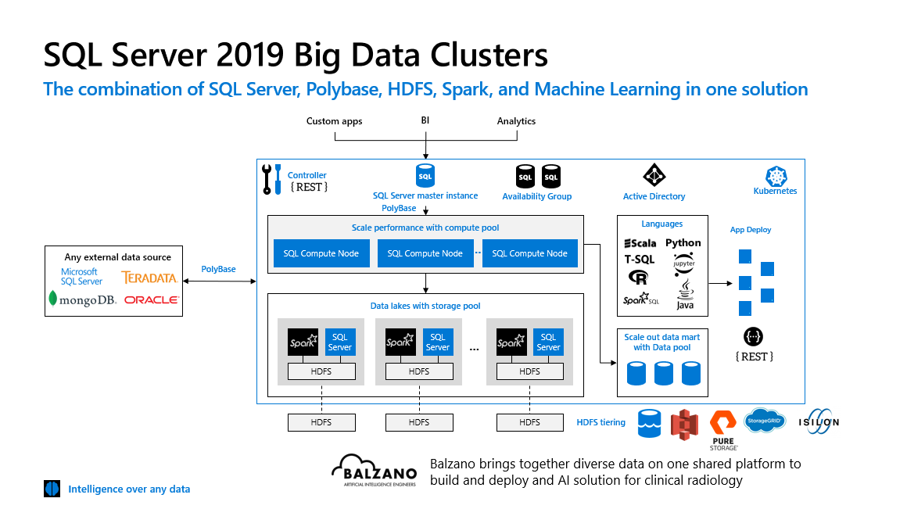

You can read more SQL Server Big Data Clusters at https://docs.microsoft.com/en-us/sql/big-data-cluster/big-data-cluster-overview.

This module provides a fundamental look and usage of SQL Server 2019 Big Data Clusters as part of the overall SQL Server 2019 product. Use the following workshop for a detailed look at SQL Server 2019 Big Data Clusters at https://github.com/Microsoft/sqlworkshops/tree/master/sqlserver2019bigdataclusters.

You will cover the following topics in this Module:

<dl>

  <dt><a href="#9-0">9.0 Deploying Big Data Clusters and Getting Started</a></dt>
  <dt><a href="#9-1">9.1 Data Virtualization and Big Data Clusters</a></dt>
  <dt><a href="#9-2">9.2 Spark and Machine Learning</a></dt>
  <dt><a href="#9-3">9.3 Advanced: Exploring and Monitoring Big Data Clusters</a></dt>
    
</dl>

<p style="border-bottom: 1px solid lightgrey;"></p>

<h2><b><a name="9-0">     9.0 Deploying a Big Data Cluster and Getting Started</a></b></h2>

SQL Server provides simple methods to deploy an entire Big Data Cluster on the Kubernetes deployment of your choice.

<h3><b><a name="challenge">The Challenge</a></b></h3>

Deploying a set of software components on Kubernetes that includes SQL Server, HDFS, Spark, and a suite of services for control, management, and monitoring can be a complex task.

<h3><b><a name="solution">The Solution</a></b></h3>

SQL Server 2019 Big Data Clusters come with tools such as the **azdata** command line interface (CLI) to help simplify the deployment of a Big Data Cluster on Kubernetes.

<h2><b><a name="activity9.0">     Activity: Deploying a Big Data Cluster</a></b></h2>

Azure Kubernetes Service (AKS) provides a managed platform to deploy a Kubernetes cluster. Kubernetes can also be deployed on the platform of your choice using tools like **kubeadm**.

SQL Server 2019 Big Data Clusters provide guidance for deployment on AKS or your Kubernetes cluster at https://docs.microsoft.com/en-us/sql/big-data-cluster/deployment-guidance

<h3><b><a name="actvitysteps9.0">Activity Steps</a></b></h3>

**STEP 1: Deploy a Big Data Cluster**

Follow the instructions at https://docs.microsoft.com/en-us/sql/big-data-cluster/deploy-on-aks to deploy SQL Server 2019 Big Data Clusters on AKS.

>**NOTE**: If you would like to deploy a Big Data Cluster that includes built-in HA for the SQL Server Master Instance with Always-On Availability Groups, consult the documentation at https://docs.microsoft.com/en-us/sql/big-data-cluster/deployment-high-availability.

When using **azdata** for deployment, your results should look something like this from the command line (you will have responded to prompts for passwords)

<pre>
The privacy statement can be viewed at:
https://go.microsoft.com/fwlink/?LinkId=853010

The license terms for SQL Server Big Data Cluster can be viewed at:
https://go.microsoft.com/fwlink/?LinkId=2002534

Cluster deployment documentation can be viewed at:
https://aka.ms/bdc-deploy

Please provide a value for CONTROLLER_USERNAME:admin
Please provide a value for CONTROLLER_PASSWORD:
Please provide a value for MSSQL_SA_PASSWORD:
Please provide a value for KNOX_PASSWORD:

NOTE: Cluster creation can take a significant amount of time depending on
configuration, network speed, and the number of nodes in the cluster.

Starting cluster deployment.
Waiting for cluster controller to start.
Waiting for cluster controller to start.
Waiting for cluster controller to start.
Waiting for cluster controller to start.
Waiting for cluster controller to start.
Waiting for cluster controller to start.
Waiting for cluster controller to start.
Cluster controller endpoint is available at 40.76.88.178:30080.
Cluster control plane is ready.
Compute pool is ready.
Storage pool is ready.
Data pool is ready.
Master pool is ready.
Cluster deployed successfully.</pre>

The statement "Cluster deployed successfully" show mean the BDC cluster is ready to use. An additional step to verify cluster health can be done with **azdata**.

**STEP 2: Verify cluster deployment**

Login to the the cluster using the following command:

`azdata login`

You will be prompted for the controller login and password (which you supplied when creating the cluster) and the name of the cluster (which the default is mssql-cluster). If the login succeeds, you will be returned the value of the controller endpoint (which you can retrieve later in other ways)

<pre>Controller Username: admin
Controller Password:
Cluster Name: mssql-cluster
Logged in successfully to `https://[ip address]:30080`</pre>

You can now do a quick check of BDC health using the following command:

`azdata bdc status show`

The results should look like the following showing a State of Healthy on all *Services* (Services is a term for BDC components not a Kubernetes Service even though BDC does deploy several Kubernetes Services such as Load Balancers):

>***NOTE**: There was an issue in SQL Server 2019 RC1 where the health of some components might not correctly show as Healthy even though the true state is Healthy Most of these issues were with **Control Services**.

<pre>


 Mssql-cluster: ready                                                                    Health Status:  healthy
 ===============================================================================================================
 Services: ready                                                                         Health Status:  healthy
 ---------------------------------------------------------------------------------------------------------------
 Servicename    State    Healthstatus    Details

 sql            ready    healthy         -
 hdfs           ready    healthy         -
 spark          ready    healthy         -
 control        ready    healthy         -
 gateway        ready    healthy         -
 app            ready    healthy         -


 Sql Services: ready                                                                     Health Status:  healthy
 ---------------------------------------------------------------------------------------------------------------
 Resourcename    State    Healthstatus    Details

 master          ready    healthy         StatefulSet master is healthy
 compute-0       ready    healthy         StatefulSet compute-0 is healthy
 data-0          ready    healthy         StatefulSet data-0 is healthy
 storage-0       ready    healthy         StatefulSet storage-0 is healthy

  Hdfs Services: ready                                                                    Health Status:  healthy
 ---------------------------------------------------------------------------------------------------------------
 Resourcename    State    Healthstatus    Details

 nmnode-0        ready    healthy         StatefulSet nmnode-0 is healthy
 storage-0       ready    healthy         StatefulSet storage-0 is healthy
 sparkhead       ready    healthy         StatefulSet sparkhead is healthy

 Spark Services: ready                                                                   Health Status:  healthy
 ---------------------------------------------------------------------------------------------------------------
 Resourcename    State    Healthstatus    Details

 sparkhead       ready    healthy         StatefulSet sparkhead is healthy
 storage-0       ready    healthy         StatefulSet storage-0 is healthy

 Control Services: ready                                                                 Health Status:  healthy
 ---------------------------------------------------------------------------------------------------------------
 Resourcename    State    Healthstatus    Details

 controldb       ready    healthy         -
 control         ready    healthy         -
 metricsdc       ready    healthy         DaemonSet metricsdc is healthy
 metricsui       ready    healthy         ReplicaSet metricsui is healthy
 metricsdb       ready    healthy         StatefulSet metricsdb is healthy
 logsui          ready    healthy         ReplicaSet logsui is healthy
 logsdb          ready    healthy         StatefulSet logsdb is healthy
 mgmtproxy       ready    healthy         ReplicaSet mgmtproxy is healthy


 Gateway Services: ready                                                                 Health Status:  healthy
 ---------------------------------------------------------------------------------------------------------------
 Resourcename    State    Healthstatus    Details

 gateway         ready    healthy         StatefulSet gateway is healthy


 App Services: ready                                                                     Health Status:  healthy
 ---------------------------------------------------------------------------------------------------------------
 Resourcename    State    Healthstatus    Details

 appproxy        ready    healthy         ReplicaSet appproxy is healthy</pre>

**STEP 3: Find the endpoints to use the cluster**

Once you have deployed a Big Data Cluster, you will want to start using it. A Big Data cluster comes with several **endpoints** to connect, run T-SQL queries, submit Spark jobs, and interface with various solutions with in the cluster:

Run the following command to get a list of defined endpoints to connect with the cluster:

`azdata bdc endpoint list -o table`

Your results should look like the following:

<pre>
Description                                             Endpoint                                                  Name                        Protocol
------------------------------------------------------  --------------------------------------------------------  --------------------------  ----------
Gateway to access HDFS files, Spark                     https://[ip address]:30443                               gateway                     https
Spark Jobs Management and Monitoring Dashboard          https://[ip address]:30443/gateway/default/sparkhistory  spark-history               https
Spark Diagnostics and Monitoring Dashboard              https://[ip address]:30443/gateway/default/yarn          yarn-ui                     https
Application Proxy                                       https://[ip address]:30778                               app-proxy                   https
Management Proxy                                        https://[ip address]:30777                                mgmtproxy                   https
Log Search Dashboard                                    https://[ip address]:30777/kibana                         logsui                      https
Metrics Dashboard                                       https://[ip address]:30777/grafana                        metricsui                   https
Cluster Management Service                              https://[ip address]:30080                                controller                  https
SQL Server Master Instance Front-End                    [ip address],31433                                        sql-server-master           tds
SQL Server Master Readable Secondary Replicas           [ip address],31436                                        sql-server-master-readonly  tds
HDFS File System Proxy                                  https://[ip address]:30443/gateway/default/webhdfs/v1    webhdfs                     https
Proxy for running Spark statements, jobs, applications  https://[ip address]:30443/gateway/default/livy/v1       livy                        https
</pre>

>**NOTE**: This list includes a readable secondary replica for SQL Server and will only be viewable in your list if you have deployed a Big Data Cluster with High Availability.

The controller provides the key interface to expose all the endpoints in a Big Data Cluster. You may not use all of these endpoints and some of the names may give you a clue on who and when to use them. Here is a quick guide for the basics of when you would use some of these endpoints to use a Big Data Cluster. Some of these endpoints are related to managing and monitoring the Big Data Cluster which you can learn more about in Module 9.3 Advanced: Exploring and Monitoring Big Data Clusters:

- **SQL Server Master Instance Front-End (sql-server-master)**

Use this IP address and port to connect to the SQL Server Master Instance, which is a TDS interface, with common SQL tools like Azure Data Studio or SQL Server Management Studio (SSMS). The SQL Server Master Instance can use a well-known endpoint for the controller in the cluster to access other resources in the cluster. This means you can connect to SQL Server with a TDS connection and access cluster resources with redirection from the controller.

- **Cluster Management Service (controller)**

This is the connection to the **controller** which is a REST interface. In most cases you don't need to directly connect to the controller. For example the azdata tool can directly connect to the controller using the **azdata login** command (azdata can use the same well-known endpoint as the SQL Server Master Instance). Tools like Azure Data Studio may prompt you for this information to show a dashboard for cluster health. Note that even though this endpoint is an https address it accepts RESTful API requests so is not appropriate to connect with a browser. You will use the CONTROLLER_USERNAME and CONTROLLER_PASSWORD you provided when you deployed a Big Data cluster to access this endpoint.

- **Gateway to access HDFS files, Spark (gateway)**

This endpoint is also known as a **Knox gateway**, using a REST interface, and is used to access the HDFS cluster deployed in a Big Data Cluster. It can also be used to directly execute Spark jobs.

Typically you will use proxy connections to use the Knox gateway which are also listed as endpoints in the list.

**HDFS File System Proxy (webhdfs)**

This proxy endpoint can be used to access the HDFS file system in the cluster directly through WebHDFS. For examples no how to ingest data into HDFS using this proxy see the documentation at https://docs.microsoft.com/en-us/sql/big-data-cluster/data-ingestion-curl?view=sql-server-ver15. Azure Data Studio has a method to display the HDFS file system in an *Explorer view*.

**Proxy for running Spark statements, jobs, applications (livy)**

This proxy is also known as a **Livy** endpoint. Although Spark jobs can be directly run through the Livy endpoint, the SQL Server Master Instance has the intelligence to allow a connection and redirect Spark Jobs within the cluster. The documentation includes an example of how to connect to the SQL Server Master Instance with Azure Data Studio and submit a Spark Job. Read more at https://docs.microsoft.com/en-us/sql/big-data-cluster/tutorial-data-pool-ingest-spark?view=sql-server-ver15.

- **Application Proxy (app-prox)**

This endpoint, using a REST interface, is used to access applications deployed in the Application Pool. You can read more about using this endpoint at https://docs.microsoft.com/en-us/sql/big-data-cluster/big-data-cluster-consume-apps?view=sql-server-ver15.

You will learn in the next Module how to connect to the SQL Server Master Instance and submit queries for data virtualization.

>**TIP**:The azdata tool allows you to execute T-SQL queries against the SQL Server Master instance through a SQL shell (using the mssqlcli tool) or direct queries. Read more at https://docs.microsoft.com/en-us/sql/big-data-cluster/reference-azdata-sql?view=sql-server-ver15.

When you are done proceed to the **Activity Summary** section for the Activity below.

<h3><b><a name="activitysummary">Activity Summary</a></b></h3>

SQL Server 2019 Big Data Clusters can be deployed on managed Kubernetes platforms like Azure Kubernetes Service with a single Command Line Interface (CLI) like **azdata**.

Big Data Clusters provides a series of **endpoints** to connect and run queries and interface with various services in the cluster.

<p style="border-bottom: 1px solid lightgrey;"></p>

<h2><b><a name="9-1">     9.1 Data Virtualization and Big Data Clusters</a></b></h2>

Once you have deployed a SQL Server 2019 Big Data Cluster, one of the first usage scenarios is to access data stored within the cluster both in the Storage Pool with HDFS and the Data Pool through a cached or offline result set.

<h3><b><a name="challenge">The Challenge</a></b></h3>

Some data is naturally stored as unstructured or semi-structured in the form of files. HDFS provides a standard mechanism to stored a distributed set of large files with this type of data. Deploying and managing a Hadoop cluster with HDFS can be an expensive and complex problem.

Accessing data of all types through *ad-hoc* queries or applications to relational, noSQL, or HDFS stores can provide near real-time results but may not yield maximum performance. Some users and applications only need data refreshed at fixed time intervals.

<h3><b><a name="solution">The Solution</a></b></h3>

SQL Server 2019 Big Data Clusters solve challenges of HDFS deployment and maximum performance data access through a **Storage and Data Pool**.

A **Storage Pool** is a pre-deployed HDFS cluster using Kubernetes pods that can be accessed through standard HDFS interfaces (WebHDFS) or through the SQL Server Master Instance with Polybase using a special built-in **connector**. A Storage Pool uses the SQL Server engine for optimized access to HDFS files. You can read more about storage pools at https://docs.microsoft.com/en-us/sql/big-data-cluster/concept-storage-pool.

A **Data Pool** is a pre-deployed set of pods using SQL Server instances to store shards of data optimized with columnstore indexes. Data Pools are accessed with Polybase from the SQL Server Master Instance through a special built-in connector. You can use T-SQL statements like INSERT, SELECT, TRUNCATE, and EXECUTE AS with data pools. You can read more about data pools at https://docs.microsoft.com/en-us/sql/big-data-cluster/concept-data-pool.

<h2><b><a name="activity9.1">     Activity: Analyzing data using the Storage and Data Pool</a></b></h2>

In this activity, ingest data into the Storage Pool in HDFS and access this data through the SQL Server Master Instance through Polybase. 

Then, ingest query results from SQL Server tables joined with HDFS into the Data Pool.

<h3><b><a name="actvitysteps9.1">Activity Steps</a></b></h3>

All scripts for this activity can be found in the **sql2019workshop\sql2019wks\09_BigDataClusters\storage_and_data_pool** folder.

>**NOTE:** Other external data sources such as Oracle, MongoDB, SQL Server (including Azure), and Teradata can be used in a big data cluster using the same techniques you learned in Module 08 Data Virtualization

**STEP 1: Ingest data into HDFS in the Storage Pool**

Follow the instructions to load sample data into HDFS in a Big Data cluster at https://docs.microsoft.com/en-us/sql/big-data-cluster/tutorial-load-sample-data.

**STEP 2: Query data in HDFS through Polybase in a Big Data Cluster**

Use the T-SQL notebook **datavirtualization_storagepool.ipynb** to query HDFS data in the storage pool using the **sqlhdfs** connector based on files loaded in STEP 1.

**STEP 3: Ingest and access data in a Data Pool in a Big Data Cluster**

Use the T-SQL notebook **datavirtualization_datapool.ipynb** to ingest data based on queries from STEP 2 and query the cached results using the **sqldatapool** connector.

When you are done proceed to the **Activity Summary** section for the Activity below.

<h3><b><a name="activitysummary">Activity Summary</a></b></h3>

In this activity, you learned how to ingest data into HDFS in the Storage Pool of a Big Data Cluster. You also learned how to query HDFS data through Polybase deployed and built-in to Big Data Clusters. You then ingested data and queried cached results in the data pool using Polybase.

<p style="border-bottom: 1px solid lightgrey;"></p>

<h2><b><a name="9-2">     9.2 Spark and Machine Learning</a></b></h2>

Spark is a common distributed computing framework for processing large set of data and is often used witH HDFS.

<h3><b><a name="challenge">The Challenge</a></b></h3>

Developers, data professionals, and data scientists need more than just T-SQL when working with *Big Data*. They need other interfaces they are familiar with especially to prepare, train, and deploy machine learning models.

<h3><b><a name="solution">The Solution</a></b></h3>

Spark is a common, well-known, and proven framework for distributed computing and machine learning. SQL Server Big Data Clusters deploys Spark and provides interfaces to allow Spark jobs to be executed for data within and outside of the Big Data Cluster. Spark is deployed as part of the Storage Pool in Big Data Clusters which you can read about at https://docs.microsoft.com/en-us/sql/big-data-cluster/concept-storage-pool. You can also configure a Big Data Cluster to deploy Spark in its own pool called a Spark Pool which you can read more about at https://docs.microsoft.com/en-us/sql/big-data-cluster/deployment-custom-configuration?view=sql-server-ver15#sparkstorage.

Spark can be used for data ingestion and you can read about how to do this with Big Data Clusters at https://docs.microsoft.com/en-us/sql/big-data-cluster/tutorial-data-pool-ingest-spark.

A Big Data cluster deployment includes SparkML for machine learning and you can learn more about how to use SparkML at https://docs.microsoft.com/en-us/sql/big-data-cluster/spark-create-machine-learning-model.

Here are other examples of how to use Spark with Big Data Clusters:

- Learn various methods to use Spark with Big Data Clusters at https://github.com/microsoft/sql-server-samples/tree/master/samples/features/sql-big-data-cluster/spark
- Walk through an example of using Spark for Machine Learning at https://github.com/microsoft/sql-server-samples/tree/master/samples/features/sql-big-data-cluster/machine-learning.


<h2><b><a name="activity9.2">     Activity: Using Spark for Machine Learning</a></b></h2>

In this activity you will use a notebook in Azure Data Studio to run Spark jobs to prepare, train, and persist a machine learning model.

The business scenario is a company delivers good that are temperature sensitive in refrigerated trucks. This company has had problems with the cooling systems they believe are caused by battery failures in the trucks.

Today the company has decided to replace these batteries at fixed time frames but wants a more cost-effective way to replace the batteries before they fail but only when needed.

You will use SQL Server Big Data Clusters, Spark,IoT data, and Machine Learning to help build a prediction model for battery lifetime.

<h3><b><a name="actvitysteps9.2">Activity Steps</a></b></h3>

>**NOTE:** This activity assumes you have deployed a SQL Server 2019 Big Data Cluster per instructions in Activity 9.1.

All scripts for this activity can be found in the **sql2019workshop\sql2019wks\09_BigDataClusters\spark_and_ml** folder.

Use Azure Data Studio connected to a SQL Server Big Data Cluster you have deployed to run through the steps in a PySpark notebook called **truckrefrigpredict.ipynb**. 

When you are done proceed to the **Activity Summary** section for the Activity below.

<h3><b><a name="activitysummary">Activity Summary</a></b></h3>

You have learned how to submit a Spark job with Big Data Clusters to prepare, train, and persist a machine learning model for a real-world application problem.

<p style="border-bottom: 1px solid lightgrey;"></p>

<h2><b><a name="9-3">     9.3 Advanced: Exploring and Monitoring Big Data Clusters</a></b></h2>

Administrators and data professionals need methods and tools to manage a Big Data Cluster.

<h3><b><a name="challenge">The Challenge</a></b></h3>

Big Data Clusters are built on the foundation of Kubernetes using nodes, pods, services, and other Kubernetes concepts. A Kubernetes cluster on its own can be a complex system to manage. Therefore, managing and monitoring Big Data Cluster components is important and requires built-in software and tools.

<h3><b><a name="solution">The Solution</a></b></h3>

For information about how to manage a **Kubernetes cluster** consider using the book Managing Kubernetes which you can find at https://www.oreilly.com/library/view/managing-kubernetes/9781492033905/. In addition, a good source to learn more about Kubernetes can be found at https://azure.microsoft.com/mediahandler/files/resourcefiles/kubernetes-learning-path/Kubernetes%20Learning%20Path%20version%201.0.pdf. To learn more about using and managing an Azure Kubernetes Service (AKS) cluster look at these well-defined training [resources](https://azure.microsoft.com/en-us/services/kubernetes-service/?&ef_id=Cj0KCQjwgNXtBRC6ARIsAIPP7RvoU34L1o1NrmIWxI6Ul8FS6IwiwkU9hlo3avZXzFXRctSC4A6MFhIaAuMhEALw_wcB:G:s&OCID=AID2000586_SEM_UInoS0XO&lnkd=Google_Kubernetes_Brand&MarinID=sUInoS0XO_366906494820_azure%20kubernetes%20service_e_c__78855468680_aud-402620943028:kwd-486572907816_).

**Big Data Clusters** comes deployed with several services and tools to help you monitor and manage the solution including:

- A deployed set of containers in the cluster to **collect metrics and logs** from all the pools and services in the cluster.
- A built-in **controller** which is used for deployment and redirecting key requests within the cluster.
- The **azdata** command line interface (CLI) to interact, manage, and monitor aspects of the cluster
- **Dashboards** to examine cluster health using Azure Data Studio.
- **Troubleshooting Guides** implemented through notebooks built by the engineering team accessed through Azure Data Studio
- Use the **kubectl** tool to copy data, manage, diagnose, and monitor Kubernetes.

<h2><b><a name="activity9.3">     Advanced Activity: Using tools to explore and monitor Big Data Clusters</a></b></h2>

In this activity you will learn how to tools to explore various aspects of management and monitoring with SQL Server Big Data Clusters.

<h3><b><a name="actvitysteps9.3">Activity Steps</a></b></h3>

>**NOTE:** This activity assumes you have deployed a SQL Server 2019 Big Data Cluster per instructions in Activity 9.1.

**STEP 1: Find BDC management endpoints**

One of the first actions you need to do in order to use all the tools to manage and monitor a SQL Server Big Data Cluster is to find the various endpoints to connect for specific management and monitoring activities to manage and monitor the cluster.

Similar to the first Activity in this module, use the following command to get a complete list of endpoints:

`azdata bdc endpoint list -o table`

Your results should look like the following:

<pre>
Description                                             Endpoint                                                  Name                        Protocol
------------------------------------------------------  --------------------------------------------------------  --------------------------  ----------
Gateway to access HDFS files, Spark                     https://[ip address]:30443                               gateway                     https
Spark Jobs Management and Monitoring Dashboard          https://[ip address]:30443/gateway/default/sparkhistory  spark-history               https
Spark Diagnostics and Monitoring Dashboard              https://[ip address]:30443/gateway/default/yarn          yarn-ui                     https
Application Proxy                                       https://[ip address]:30778                               app-proxy                   https
Management Proxy                                        https://[ip address]:30777                                mgmtproxy                   https
Log Search Dashboard                                    https://[ip address]:30777/kibana                         logsui                      https
Metrics Dashboard                                       https://[ip address]:30777/grafana                        metricsui                   https
Cluster Management Service                              https://[ip address]:30080                                controller                  https
SQL Server Master Instance Front-End                    [ip address],31433                                        sql-server-master           tds
SQL Server Master Readable Secondary Replicas           [ip address],31436                                        sql-server-master-readonly  tds
HDFS File System Proxy                                  https://[ip address]:30443/gateway/default/webhdfs/v1    webhdfs                     https
Proxy for running Spark statements, jobs, applications  https://[ip address]:30443/gateway/default/livy/v1       livy                        https
</pre>

>**NOTE**: This list includes a readable secondary replica for SQL Server and will only be viewable in your list if you have deployed a Big Data Cluster with High Availability.

In this list of endpoints are key ones used for management and monitoring:

- **Cluster Management Service (controller)**

This is the connection to the **controller** which is REST interface. In most cases you don't need to directly connect to the controller. For example the azdata tool can directly connect to the controller using the **azdata login** command. Tools like Azure Data Studio may prompt you for this information to show a dashboard for cluster health. Note that even though this endpoint is an https address it accepts RESTful API requests so is not appropriate to connect with a browser. You will use the CONTROLLER_USERNAME and CONTROLLER_PASSWORD you provided when you deployed a Big Data cluster to access this endpoint.

- **Log Search Dashboard (logsui)**

This HTTP interface is used to access log files collected in the cluster and displayed using Kibana and searchable powered by Elasticsearch. You will use the CONTROLLER_USERNAME and CONTROLLER_PASSWORD you provided when you deployed a Big Data cluster to access this endpoint.

- **Metrics Dashboard (metricsui)**

This HTTP interface is used to show metrics for resource usage for pods, nodes, and SQL Server instances across the cluster using an interface called Grafana. You will use the CONTROLLER_USERNAME and CONTROLLER_PASSWORD you provided when you deployed a Big Data cluster to access this endpoint.

- **Spark Jobs Management and Monitoring Dashboard (spark-history)**

This HTTP interface is used to view the history of Spark Jobs. You can access this endpoint directly as it is proxied through the **gateway** endpoint. To access this endpoint, you will need to use the user **root** and the KNOX_PASSWORD you provided when you deployed a Big Data Cluster.

- **Spark Diagnostics and Monitoring Dashboard (yarn-ui)**

This HTTP interface is used to monitor applications managed by YARN in the Big Data Cluster which will be Spark jobs. You can access this endpoint directly as it is proxied through the **gateway** endpoint. To access this endpoint, you will need to use the user **root** and the KNOX_PASSWORD you provided when you deployed a Big Data Cluster.

You can also retrieve a list of endpoints using the **SQL Server Master Instance (sql-server-master)** endpoint. The SQL Server Master Instance knows a  in the cluster to contract the controller endpoint. Using this well-known endpoint SQL Server can use a REST API call to ask the controller for all endpoints in the cluster.

Connect to the SQL Server master instance with a tool like Azure Data Studio or SQL Server Management Studio (SSMS) and run the following T-SQL query:

```sql
SELECT * FROM sys.dm_cluster_endpoints
```
Your results should look the same as when you used the azdata command to list endpoints.

**STEP 2: Use azdata for monitoring and managing**

azdata is the "kubectl" for SQL Server Big Data Clusters. azdata knows how to connect to the controller endpoint in the cluster and can be used to perform a variety of tasks.

In the first activity you ran the following command to get the status of the cluster:

`azdata bdc status show`

The **bdc** subcommand has other interesting option including the abilty to get the status of individual services, create or delete a cluster, configure the cluster, retrieve endpoints, and submit spark jobs.

One interesting aspect of az data bdc is to interact with the HDFS file systems in the cluster

Run the following command to a deployed BDC to get a shell to interact with the HDFS file ssytem

`azdata bdc hdfs shell`

After supplying the KNOX_PASSWORD or CONTROLLER_PASSWORD you will get a prompt like the following:

<pre>

HDFS Interactive Shell.  Type help or ? to list commands.

[hdfs]
</pre>

You can now direclty interact wtih HDFS to perform file and diretory commands. Try out various commands wiht your HDFS file system. Type quit to **exit** this shell.

Review the azdata reference at Read the entire reference for azdata at https://docs.microsoft.com/en-us/sql/big-data-cluster/reference-azdata and try out other various azdta commands with your cluster

>**TIP:** For SQL Server users take a look at the azdata sql commands.

**STEP 3: Use dashboards to examine health**

Azure Data Studio comes built-in with a dashboard to examine the health of a cluster. There are two ways to ring up the dashboard:

- Azure Data Studio can connect directory to the controller
- You can connect to the SQL Server Master Instance.

Follow the instructions in the documentation at https://docs.microsoft.com/en-us/sql/big-data-cluster/manage-with-controller-dashboard and view the dashboard for your cluster.

You will use this dashboard in the next activities to look at metrics and logs.

The following is an example dashboard for a Big Data Cluster

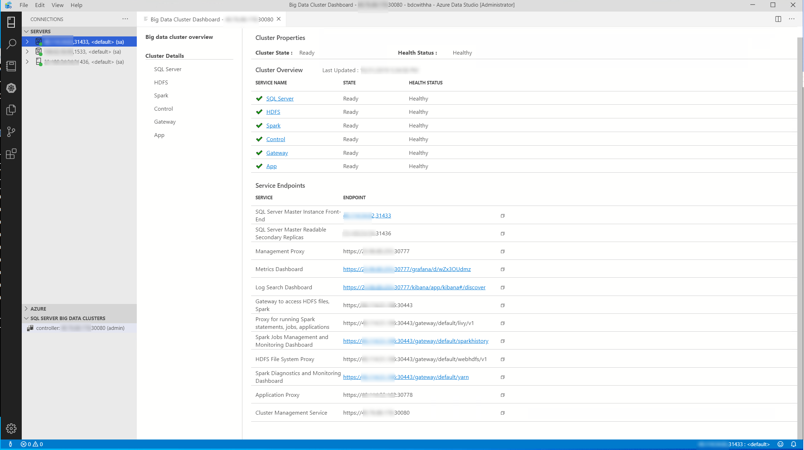

**STEP 4: Look at metrics using Grafana**

SQL Server Big Data Clusters deploys containers throughout the cluster to collect metrics about components of the cluster include node, pod, and SQL Server metrics.

Using the dashboard you displayed in the previous step, click on the SQL Server service under Cluster Overview

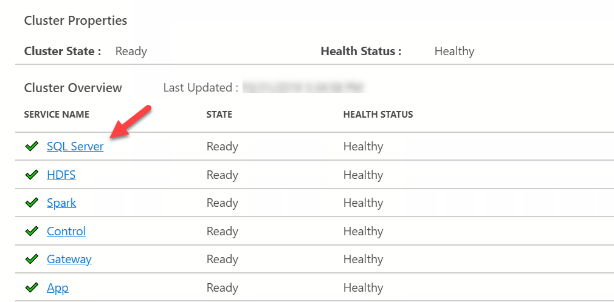

This will bring up a new display of health and links for metrics and logs.

>NOTE: This display is for a cluster where HA has been enabled which is why there are three master instances

Click on the link to View SQL Metrics for master-0

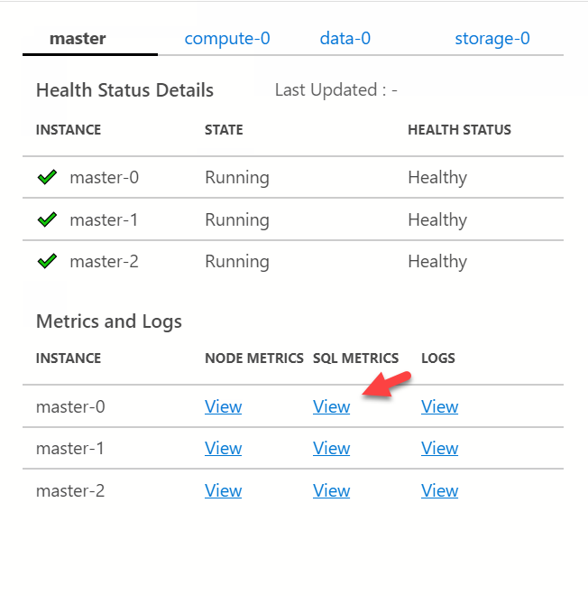

Your default browser will be activated.

>NOTE: At the time of the creation of this workshop there could be problems with the Microsoft Edge browser. It is recommended you use another browser like Chrome or the Microsoft Edge Beta.

You will be prompted for the CONTROLLER_USERNAME and CONTROLLER_PASSWORD. Once this complete your webpage should look like this

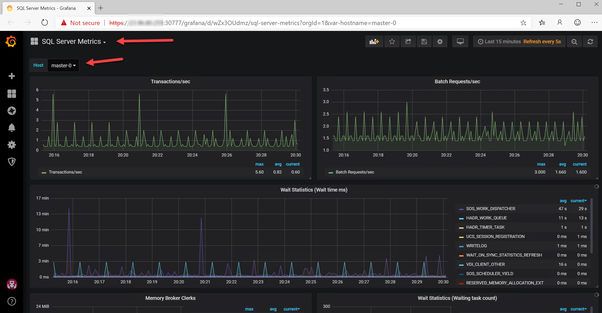

As pointed by the arrows at this point you can change context to see other types of metrics such as Node or Pod metrics. Or you can see SQL metrics from other SQL Server instances deployed in the cluster.

You may close or leave open this browser for further exploration.

**STEP 5: Explore logs using Kibana**

Similar to metrics, containers are deployed in the SQL Server Big Data Cluster to collect logs for various components in the cluster including SQL Server ERRORLOG entries.

Using the same dashboard as you did in the previous step, click on View for master-0 logs

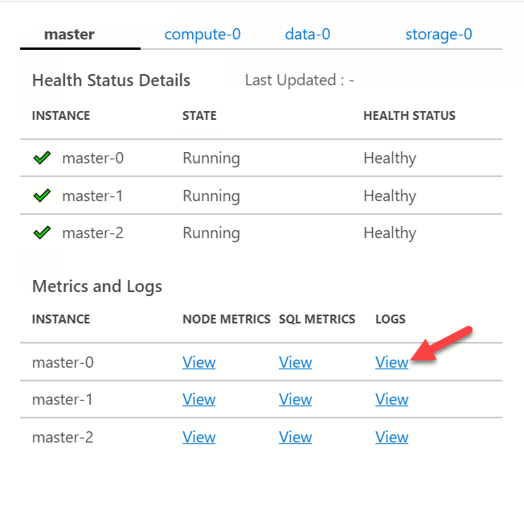

Another browser window or tab will be dislplayed and you will be prompted for the CONTROLLER_USERNAME and CONTROLLER_PASSWORD.

>NOTE: At the time of the creation of this workshop there could be problems with the Microsoft Edge browser. It is recommended you use another browser like Chrome or the Microsoft Edge Beta.

Your browser window should look similar to the following:

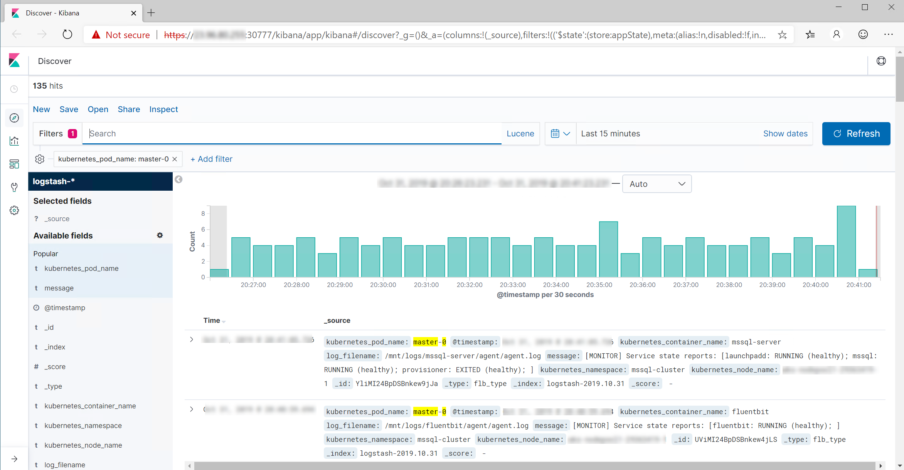

In order to see SQL ERRORLOG files, you will need to add a filter.

By default the last 15 minutes of all logs files are displayed. Choose the date picker to pick a different time frame like "This week".

Now add a filter to only get the entries from ERRORLOG files

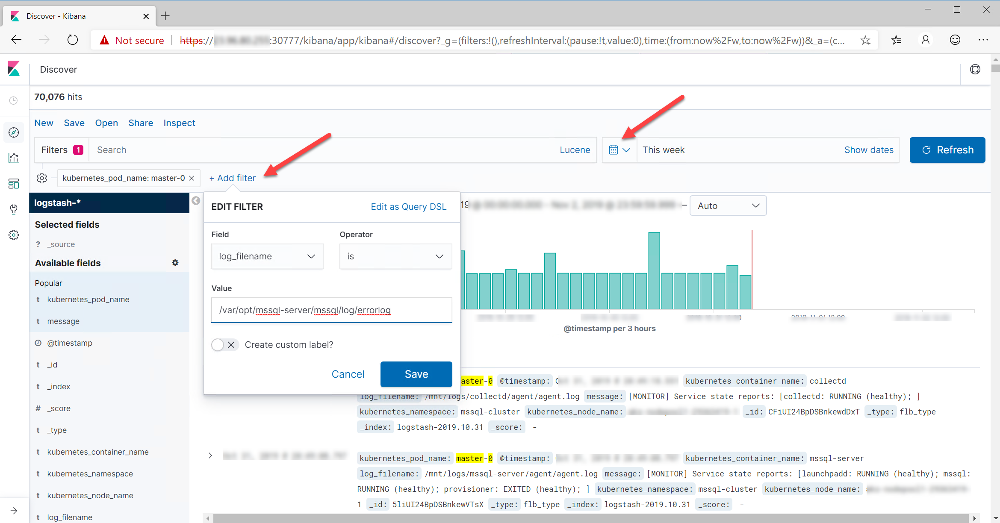

Now to make the output more readable add the kubernetes_pod_name and message fields to the output

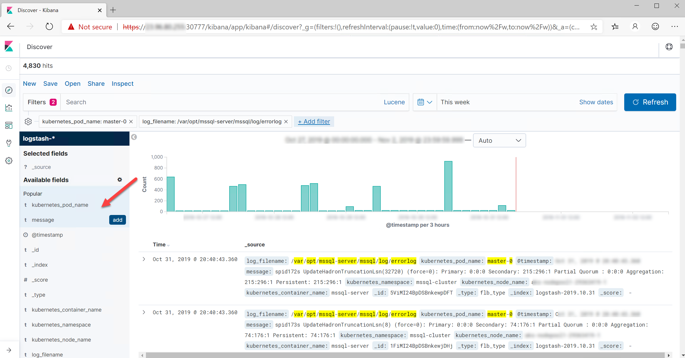

The result should look like SQL ERRORLOG entries. You could remove the filter for the master-0 pod to look at ERRORLOG entries across the cluster.

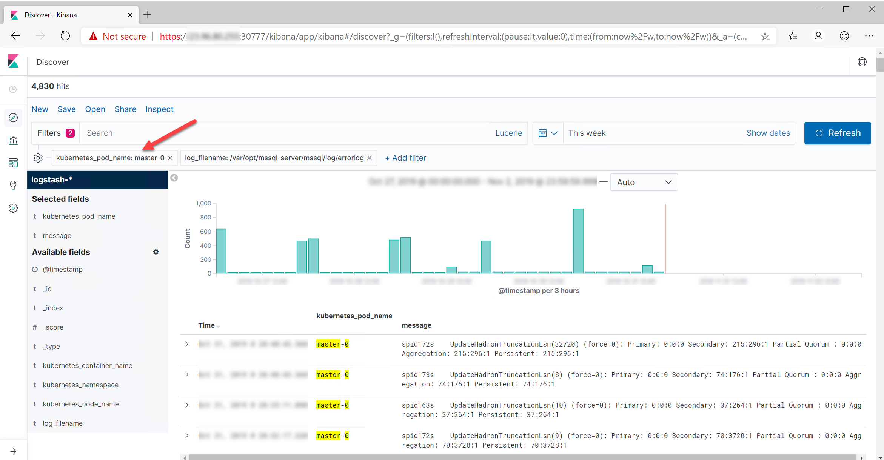

**STEP 6: Exploring Kubernetes**

Since Big Data Clusters is deployed on Kubernetes you can use familar tools to interact with the k8s cluster including the kubectl tool and a Kubernetes dashboard.

Run the following command to see a list of the number of pods and containers deployed in the cluster:

`kubectl get pods -o wide`

Your results should look something like this:

>**NOTE:** The following results include a HA enabled deployment on a 3 node AKS cluster. Notice how pods are distributed across the AKS cluster naturally

<pre>
NAME              READY   STATUS    RESTARTS   AGE    IP            NODE                       NOMINATED NODE   READINESS GATES
appproxy-sqcpg    2/2     Running   0          6d     [ip address]  aks-nodepool1-29363419-0   <none>           <none>
compute-0-0       3/3     Running   0          6d     [ip address]  aks-nodepool1-29363419-0   <none>           <none>
control-8wvjl     3/3     Running   0          6d     [ip address]  aks-nodepool1-29363419-0   <none>           <none>
controldb-0       2/2     Running   0          6d     [ip address]  aks-nodepool1-29363419-1   <none>           <none>
controlwd-z67t6   1/1     Running   0          6d     [ip address]  aks-nodepool1-29363419-2   <none>           <none>
data-0-0          3/3     Running   0          6d     [ip address]  aks-nodepool1-29363419-1   <none>           <none>
data-0-1          3/3     Running   0          6d     [ip address]  aks-nodepool1-29363419-0   <none>           <none>
gateway-0         2/2     Running   0          6d     [ip address]  aks-nodepool1-29363419-0   <none>           <none>
logsdb-0          1/1     Running   0          6d     [ip address]  aks-nodepool1-29363419-2   <none>           <none>
logsui-lfdvw      1/1     Running   0          6d     [ip address]  aks-nodepool1-29363419-0   <none>           <none>
master-0          4/4     Running   0          6d     [ip address]  aks-nodepool1-29363419-1   <none>           <none>
master-1          4/4     Running   0          6d     [ip address]  aks-nodepool1-29363419-0   <none>           <none>
master-2          4/4     Running   0          4h1m   [ip address]  aks-nodepool1-29363419-2   <none>           <none>
metricsdb-0       1/1     Running   0          6d     [ip address]  aks-nodepool1-29363419-1   <none>           <none>
metricsdc-755bd   1/1     Running   0          6d     [ip address]  aks-nodepool1-29363419-2   <none>           <none>
metricsdc-xjdnj   1/1     Running   0          6d     [ip address]  aks-nodepool1-29363419-1   <none>           <none>
metricsdc-xr8wr   1/1     Running   0          6d     [ip address]  aks-nodepool1-29363419-0   <none>           <none>
metricsui-gc925   1/1     Running   0          6d     [ip address]  aks-nodepool1-29363419-1   <none>           <none>
mgmtproxy-7lhlr   2/2     Running   0          6d     [ip address]  aks-nodepool1-29363419-1   <none>           <none>
nmnode-0-0        2/2     Running   0          6d     [ip address]  aks-nodepool1-29363419-1   <none>           <none>
operator-grdlh    1/1     Running   0          6d     [ip address]  aks-nodepool1-29363419-2   <none>           <none>
sparkhead-0       4/4     Running   0          6d     [ip address]  aks-nodepool1-29363419-0   <none>           <none>
storage-0-0       4/4     Running   0          6d     [ip address]  aks-nodepool1-29363419-0   <none>           <none>
storage-0-1       4/4     Running   0          6d     [ip address]  aks-nodepool1-29363419-1   <none>           <none>
</pre>

The values under the READY column indicate how many containers are deployed and are runnig. If you sum up these numbers you will see that Big Data Clusters deploys at minimum (again with HA enabled) some 53 containers!.

Explore the other aspects of using kubectl with Big Data Clusters using examples in the documentation at https://docs.microsoft.com/en-us/sql/big-data-cluster/cluster-troubleshooting-commands. See how to display a Kubernetes dashboard by following the steps in the documentation at https://docs.microsoft.com/en-us/sql/big-data-cluster/cluster-troubleshooting-commands?view=sql-server-ver15#kubernetes-dashboard.

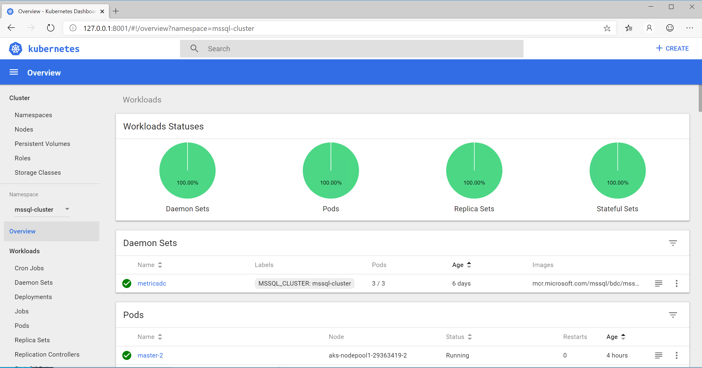

When you are done proceed to the **Activity Summary** section for the Activity below.

<h3><b><a name="activitysummary">Activity Summary</a></b></h3>

In this activity you learned how to use tools like azdata, Azure Data Studio, Kibana, Grafana, and kubectl to manage and monitor a SQL Server Big Data Cluster.

<p style="border-bottom: 1px solid lightgrey;"></p>

<h2><b>     For Further Study</b></h2>

- [What are SQL Server Big Data Clusters?](https://docs.microsoft.com/en-us/sql/big-data-cluster/big-data-cluster-overview)

- [Get Started with SQL Server Big Data Clusters](https://docs.microsoft.com/en-us/sql/big-data-cluster/deploy-get-started)

- [Workshop: SQL Server Big Data Clusters - Architecture](https://github.com/Microsoft/sqlworkshops/tree/master/sqlserver2019bigdataclusters)

- [What is Azure Data Studio?](https://docs.microsoft.com/en-us/sql/azure-data-studio/what-is)

- [How to use Notebooks in Azure Data Studio](https://docs.microsoft.com/en-us/sql/azure-data-studio/sql-notebooks)

<p style="border-bottom: 1px solid lightgrey;"></p>

<h2><b>     Next Steps</b></h2>

Next, Continue to <a href="10_Additional_Migration.md" target="_blank"><i>Additional Capabilities, Migration, and Next Steps</i></a>.
