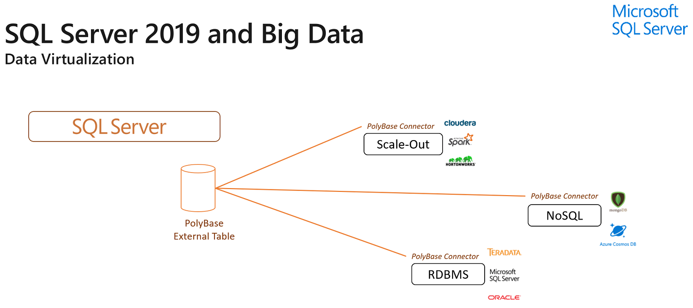
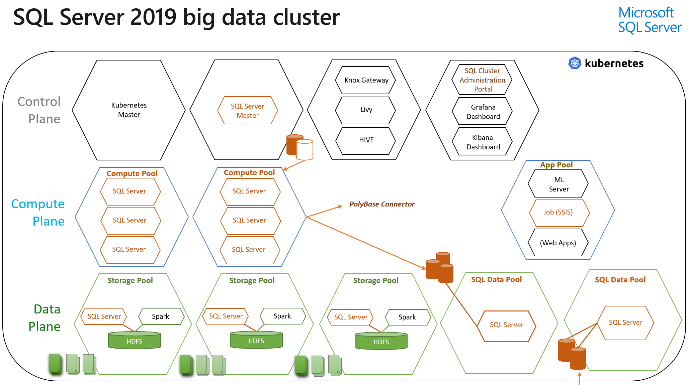

# Workshop: SQL Server Big Data Clusters - Architecture (CTP 3.2)

#### <i>A Microsoft Course from the SQL Server team</i>

 <h1>SQL Server Big Data Clusters Components</h1>

In this workshop you'll cover using a Process and various Platform components to create a SQL Server Big Data Clusters (BDC) solution you can deploy on premises, in the cloud, or in a hybrid architecture. In each module you'll get more references, which you should follow up on to learn more. Also watch for links within the text - click on each one to explore that topic.

(<a href="https://github.com/Microsoft/sqlworkshops/blob/master/sqlserver2019bigdataclusters/SQL2019BDC/00%20-%20Prerequisites.md" target="_blank">Make sure you check out the <b>prerequisites</b> page before you start</a>. You'll need all of the items loaded there before you can proceed with the workshop.)

You'll cover the following topics in this Module:

<dl>

  <dt><a href="#2-0">2.0 BDC Capabilities</a></dt>
  <dt><a href="#2-1">2.1 Data Virtualization</a></dt>
  <dt><a href="#2-2">2.2 BDC Components - Data Virtualization, Distributed Data and Data Lakes</a></dt>

</dl>

<h2><a name="2-0">2.0 BDC Capabilities</a></h2>

SQL Server (starting with version 2019) provides three ways to work with large sets of data:

 - **Data Virtualization**: Query multiple sources of data technologies using the Polybase SQL Server feature <i>(data left at source)</i>
 - **Storage Pools**: Create sets of disparate data sources that can be queried from Distributed Data sets <i>(data ingested into sharded databases using PolyBase)</i>
 - **SQL Server Big Data Clusters**: Create, manage and control clusters of SQL Server Instances that co-exist in a Kubernetes cluster with Apache Spark and other technologies to access and process large sets of data <i>(Data left in place, ingested through PolyBase, and into/through HDFS)</i> 

Each of these functions are available separately based on the requirements of your solution. You'll cover each of these components in the sections that follow, and learn more about how each is used within the BDC.

<h3><a name="2-1">2.1 Data Virtualization</a></h3>

In both a Stand-Alone Instance configuration and within the BDC (BDC) configuration, you can use a series of *Connectors* to query data using the <a href="https://docs.microsoft.com/en-us/sql/relational-databases/polybase/polybase-guide?view=sql-server-ver15" target="_blank"><i>PolyBase</i></a> feature. PolyBase enables your SQL Server instance to process Transact-SQL queries that read data from external data sources. Starting in SQL Server 2019, you can access external data in Hadoop, Azure Blob Storage and also external data in SQL Server, Oracle, Teradata, and MongoDB - as well as Generic ODBC sources. PolyBase pushes as much of the query as possible to the source system, which optimizes the query.

 

 

To leverage PolyBase, you first define the external table using a specific set of statements, then configure the connection and security, and then use standard Transact-SQL statements work with the data as if it were an standard SQL Server table. The components used in this configuration are as Follows:

<b>Components used in Data Virtualization</b>

<table style="tr:nth-child(even) {background-color: #f2f2f2;}; text-align: left; display: table; border-collapse: collapse; border-spacing: 5px; border-color: gray;">

  <tr><td style="background-color: Cornsilk; color: black; padding: 5px 5px;"><b><a href="https://docs.microsoft.com/en-us/sql/relational-databases/polybase/polybase-installation?view=sql-server-ver15" target="_blank">The PolyBase Feature in SQL Server 2019</a></b></td><td style="background-color: Cornsilk; color: black; padding: 5px 5px;">Enables your SQL Server instance to process Transact-SQL queries that read data from external data sources.</td></tr>
  <tr><td><b><a href="https://docs.oracle.com/javase/9/" target="_blank">Java Runtime Environment (JRE)</a></b></td><td>Creates and runs HDFS Java jobs at the external tables</td></tr>

</table>

 

<b>Activity: Review PolyBase Solution</b>

In this section you will review the solution tutorial you will perform in the <i>04 Operationalization</i> Module. You'll see how to create a reference to an HDFS file store and query it within SQL Server as if it were a standard internal table.

 

Open <a href="https://docs.microsoft.com/en-us/sql/big-data-cluster/tutorial-query-hdfs-storage-pool?view=sqlallproducts-allversions" target="_blank">this reference and locate numbers 4-5 of the steps in the tutorial</a>. This explains the two steps required to create and query an External table. 

 

 

<h2><a name="2-2">2.2 BDC Components</a></h2>

The Big Data capabilities for SQL Server can be used in a stand-alone Instance by leveraging the Data Virtualization feature described above. To perform scale-out Big Data, SQL Server implements a big data cluster by leveraging Kubernetes with several other components. 

 

 

The BDC can be deployed to three environments:

 - Locally for Testing (using minikube)
 - In a Cloud Service (Such as the Azure Kubernetes Service or AKS)
 - On premises (using KubeADM)

These architectures are not mutually exclusive - you can install some components on-premises, and others as a service. Your connections can interconnect across these environments. You'll explore more about deploying a BDC in the <i>03 Planning, Installation and Configuration</i> module.

<h3>Control Plane: Kubernetes Components</h3>

As you saw in the <i>Big Data Landscape</i> Module of this workshop, there are multiple components within Kubernetes that work with the BDC. These components are used to manage and monitor the solution:

<table style="tr:nth-child(even) {background-color: #f2f2f2;}; text-align: left; display: table; border-collapse: collapse; border-spacing: 5px; border-color: gray;">

  <tr><td style="background-color: Cornsilk; color: black; padding: 5px 5px;"><b><a href="https://kubernetes.io/docs/concepts/overview/components/" target="_blank">Kubernetes Master Node</a></b></td><td style="background-color: Cornsilk; color: black; padding: 5px 5px;">A dedicated Node within the Kubernetes Cluster that Manages and Controls the Kubernetes Cluster. In addition to the Master Node, controlling services installed on each Node include <i>kublet</i>, <i>kube-proxy</i> and the <i>Docker</i> runtime engine.</td></tr>
  <tr><td><b><a href="https://knox.apache.org/" target="_blank">Apache Knox</a></b></td><td>The Apache Knox Gateway is an Application Gateway for interacting with the REST APIs and UIs of the cluster. The Knox Gateway provides a single access point for all REST interactions in BDC's.</td></tr>
  <tr><td style="background-color: Cornsilk; color: black; padding: 5px 5px;"><b><a href="https://livy.incubator.apache.org/" target="_blank">Apache Livy</a></b></td><td style="background-color: Cornsilk; color: black; padding: 5px 5px0;">Apache Livy is used to submit Jobs to Apache Spark.</td></tr>
  <tr><td><b><a href="https://hive.apache.org/" target="_blank">Apache HIVE</a></b></td><td> A distributed storage database used for Spark meta-data.</td></tr>
  <tr><td style="background-color: Cornsilk; color: black; padding: 5px 5px;"><b><a href="https://grafana.com/" target="_blank">Grafana</a></b></td><td style="background-color: Cornsilk; color: black; padding: 5px 5px;">Visualization and metrics dashboard system.</td></tr>
  <tr><td><b><a href="https://www.elastic.co/products/kibana" target="_blank">Kibana</a></b></td><td>Kibana is an open source log visualization and search plugin.</td></tr>

</table>

<h3>Control Plane: Controller Service</h3>

The <i>Controller</i> in the BDC is a service that is deployed with the <i>azdata</i> utility. It bridges the interactions with SQL Server, Kubernetes, Spark and HDFS. 

The controller service provides the following core functionality:

 - Manage cluster lifecycle: cluster bootstrap & delete, update configurations
 - Manage master SQL Server instances
 - Manage compute, data, and storage pools
 - Expose monitoring tools to observe the state of the cluster
 - Expose troubleshooting tools to detect and repair unexpected issues
 - Manage cluster security: ensure secure cluster endpoints, manage users and roles, configure credentials for intra-cluster communication
 - Manage the workflow of upgrades so that they are implemented safely
 - Manage high availability and DR for statefull services in the cluster

You have two ways of working with the Controller service: the `azdata` utility, and the <i>Azure Data Studio</i> tool. All communication to the controller service is conducted via a REST API over HTTPS. A self-signed certificate will be automatically generated for you at bootstrap time. Authentication to the controller service endpoint is based on username and password.

These components are used in the Controller of the BDC:

<table style="tr:nth-child(even) {background-color: #f2f2f2;}; text-align: left; display: table; border-collapse: collapse; border-spacing: 5px; border-color: gray;">

  <tr><td style="background-color: Cornsilk; color: black; padding: 5px 5px;"><b><a href="https://docs.microsoft.com/en-us/sql/big-data-cluster/concept-controller?view=sqlallproducts-allversions" target="_blank">SQL Server 2019 Controller Service</a></b></td><td style="background-color: Cornsilk; color: black; padding: 5px 5px;">The controller hosts the core logic for deploying and managing a big data cluster.</td></tr>

</table>

<h3>BDC: SQL Server Master Instance</h3>

The SQL Server Master Instance is an installation of SQL Server 2019 in a Pod on a Node in the Kubernetes cluster. You access it the same way as any SQL Server Instance, and use it for high-value, OLTP, OLAP or other types of workloads. It has Machine Learning Services already configured, so you have the full range of R, Python, and Java to work with on the data in the Cluster environment. 

The Master Instance stores meta-data which is outside the scope of the meta-data HIVE is storing. It also contains the PolyBase definition tables, and in addition to the standard SQL Server system databases, the SQL master instance also contains the following:

- A metadata database that holds HDFS-table metadata
- A data plane shard map
- Details of external tables that provide access to the cluster data plane.
- PolyBase external data sources and external tables defined in user databases.

These components are used in the SQL Server Master Instance:

<table style="tr:nth-child(even) {background-color: #f2f2f2;}; text-align: left; display: table; border-collapse: collapse; border-spacing: 5px; border-color: gray;">

  <tr><td style="background-color: Cornsilk; color: black; padding: 5px 5px;"><b><a href="https://docs.microsoft.com/en-us/sql/big-data-cluster/concept-master-instance?view=sqlallproducts-allversions" target="_blank">SQL Server 2019 Master Instance</a></b></td><td style="background-color: Cornsilk; color: black; padding: 5px 5px;">The SQL Server master instance provides an externally accessible TDS endpoint for the cluster.</td></tr>
  <tr><td><b><a href="https://docs.microsoft.com/en-us/sql/advanced-analytics/?view=sql-server-ver15" target="_blank">SQL Server extensibility framework</a></b></td><td>Used for executing Machine Learning and other functionality in Java, R and Python code in SQL Server.</td></tr>

</table>

<h3>BDC: Compute Pool</h3>

The Compute Pool holds one or more SQL Server Pods used for distributed processing under the direction of the SQL Server Master Instance. It makes the calls out to the PolyBase connectors for a distributed Compute layer of the BDC.

These components are used in the Compute Pool of the BDC:

<table style="tr:nth-child(even) {background-color: #f2f2f2;}; text-align: left; display: table; border-collapse: collapse; border-spacing: 5px; border-color: gray;">

  <tr><td style="background-color: Cornsilk; color: black; padding: 5px 5px;"><b><a href="https://docs.microsoft.com/en-us/sql/big-data-cluster/concept-compute-pool?view=sqlallproducts-allversions" target="_blank">SQL Server 2019</a></b></td><td style="background-color: Cornsilk; color: black; padding: 5px 5px;">Provides scale-out computational resources for a big data cluster.</td></tr>

</table>

<h3>BDC: App Pool</h3>

The App Pool is a set of Pods within a Node that hold multiple types of end-points into the system. SQL Server Integration Services lives in the App Pool, and other Job systems are possible. You could instatiate a long-running job (such as IoT streaming) or Machine Learning (ML) endpoints used for scoring a prediction or returning a classification.  

These components are used in the Compute Pool of the BDC:

<table style="tr:nth-child(even) {background-color: #f2f2f2;}; text-align: left; display: table; border-collapse: collapse; border-spacing: 5px; border-color: gray;">

  <tr><td style="background-color: Cornsilk; color: black; padding: 5px 5px;"><b><a href="https://kubernetes.io/docs/concepts/architecture/nodes/" target="_blank">Kubernetes Node</a></b></td><td style="background-color: Cornsilk; color: black; padding: 5px 5px;">Provides computational resources for Operationalizing a big data cluster.</td></tr>

</table>

<h3>BDC: Data Pool</h3>

The Data Pool in a BDC consists of one or more SQL Server data pool instances. SQL data pool instances provide persistent SQL Server storage for the cluster. A data pool is used to ingest data from SQL queries or Spark jobs, or other locations. To provide better performance across large data sets, data in a data pool is distributed into shards across the member SQL data pool instances.

 

 

These components are used in the Data Pool of the BDC:

<table style="tr:nth-child(even) {background-color: #f2f2f2;}; text-align: left; display: table; border-collapse: collapse; border-spacing: 5px; border-color: gray;">

  <tr><td style="background-color: Cornsilk; color: black; padding: 5px 5px;"><b><a href="https://docs.microsoft.com/en-us/sql/big-data-cluster/concept-data-pool?view=sqlallproducts-allversions" target="_blank">SQL Server</a></b></td><td style="background-color: Cornsilk; color: black; padding: 5px 5px;">Provides scaled data storage  a big data cluster.</td></tr>
  <tr><td><b><a href="https://docs.microsoft.com/en-us/sql/relational-databases/polybase/polybase-guide?view=sql-server-ver15" target="_blank">Polybase Feature</a></b></td><td>Used for working with external tables.</td></tr>

</table>

<h3>BDC: Storage Pool</h3>

The storage pool consists of storage nodes comprised of SQL Server on Linux, Spark, and HDFS. All the storage nodes in a SQL big data cluster are members of an HDFS cluster. You can use these as a "Data Lake" construct to work with large sets of data stored on disparate data sources. 

Inside the Storage Pool, the Storage nodes are responsible for data ingestion through Spark, data storage in HDFS (Parquet format). HDFS also provides data persistency, as HDFS data is spread across all the storage nodes in the SQL big data cluster. The Storage Nodes also provide data access through HDFS and SQL Server endpoints.

 

 

These components are used in the Storage Pool of the BDC:

<table style="tr:nth-child(even) {background-color: #f2f2f2;}; text-align: left; display: table; border-collapse: collapse; border-spacing: 5px; border-color: gray;">

  <tr><td style="background-color: Cornsilk; color: black; padding: 5px 5px;"><b><a href="https://www.hdfstutorial.com/hdfs-tutorial-guide/" target="_blank">HDFS</a></b></td><td style="background-color: Cornsilk; color: black; padding: 5px 5px;">The distributed data storage system used by SQL Server and Apache Spark.</td></tr>
  <tr><td><b><a href="https://spark.apache.org/" target="_blank">Apache Spark</a></b></td><td>Apache Spark is an analytics engine for processing large-scale data. It can be used with data stored in HDFS, and has connectors to work with data in SQL Server as well.</td></tr>

</table>

 

<b>Activity: Review Data Pool Solution</b>

In this section you will review the solution tutorial you will perform in the <i>04 Operationalization</i> Module. You'll see how to load data into the Data Pool.

 

Open <a href="https://docs.microsoft.com/en-us/sql/big-data-cluster/tutorial-data-pool-ingest-sql?view=sqlallproducts-allversions" target="_blank">this reference and review the steps in the tutorial</a>. This explains the two steps required to create and load an External table in the Data Pool. You'll perform these steps in the <i>Operationalization</i> Module later.

 

 

<b>For Further Study</b>

<ul>
    <li><a href="https://docs.microsoft.com/en-us/sql/big-data-cluster/big-data-cluster-overview?view=sqlallproducts-allversions" target="_blank">Official Documentation for this section</a></li>
		<li><a href = "https://cloudblogs.microsoft.com/sqlserver/2018/09/26/sql-server-2019-celebrating-25-years-of-sql-server-database-engine-and-the-path-forward/" target="_blank">Update on 2019 Blog</a></li>
		<li><a href = "https://www.youtube.com/watch?v=-XgraEtnrF4" target="_blank">Introduction Webinar on Big Data</a></li>
		<li><a href = "https://info.microsoft.com/ww-landing-SQL-Server-2019-Big-Data-WhitePaper.html" target="_blank">Big Data Whitesheet</a></li> 
		<li><a href = "http://download.microsoft.com/download/8/B/6/8B643729-6224-4ECC-8C50-3292B8156F0E/SQL_Server_2019_Transform-Data_into_Insights_Infographic_EN_US.pdf" target="_blank">Infographic on Big Data</a></li>
		<li><a href = "https://docs.microsoft.com/en-us//sql/big-data-cluster/big-data-cluster-overview?view=sqlallproducts-allversions" target="_blank">Books Online on this topic</a></li>
		<li><a href = "https://www.dataonstorage.com/resource/video/msignite2018/brk4021-deep-dive-on-sql-server-and-big-data/" target="_blank">Session on Big Data at at Ignite</a></li> 
</ul>

<b> Next Steps</b>

Next, Continue to <a href="03%20-%20Planning,%20Installation%20and%20Configuration.md" target="_blank"><i> Planning, Installation and Configuration</i></a>.
