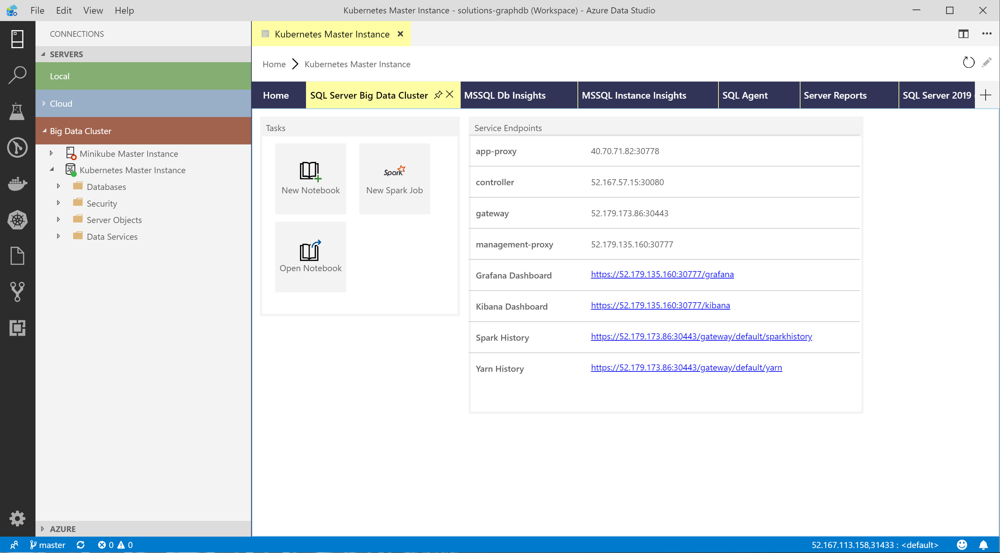
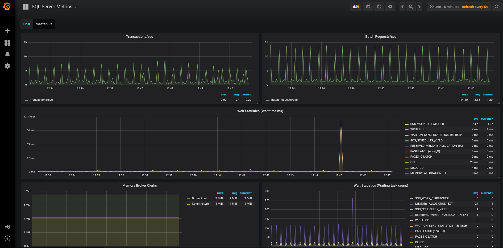
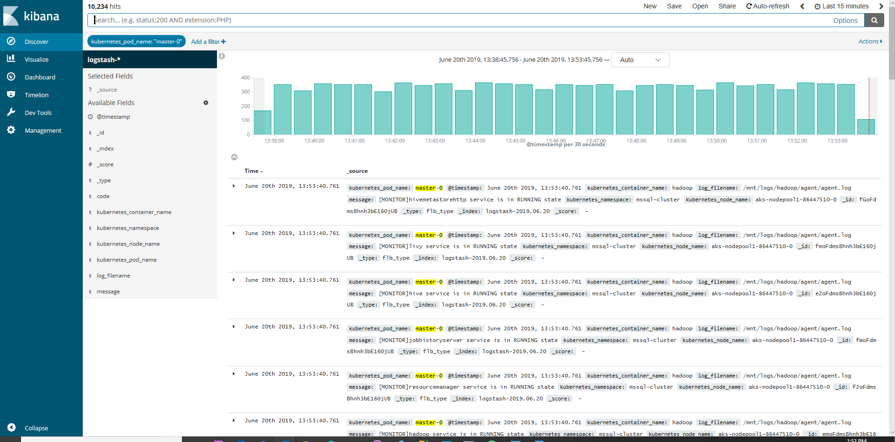

# Workshop: SQL Server Big Data Clusters - Architecture (CTP 3.2)

#### <i>A Microsoft workshop from the SQL Server team</i>

 <h2>Management and Monitoring</h2>

In this workshop you'll cover using a Process and various Platform components to create a SQL Server Big Data Clusters (BDC) solution you can deploy on premises, in the cloud, or in a hybrid architecture. In each module you'll get more references, which you should follow up on to learn more. Also watch for links within the text - click on each one to explore that topic.

(<a href="https://github.com/Microsoft/sqlworkshops/blob/master/sqlserver2019bigdataclusters/SQL2019BDC/00%20-%20Prerequisites.md" target="_blank">Make sure you check out the <b>prerequisites</b> page before you start</a>. You'll need all of the items loaded there before you can proceed with the workshop.)

You'll cover the following topics in this Module:

<dl>

  <dt><a href="#5-0">5.0 Managing and Monitoring Your Solution</a></dt>
  <dt><a href="#5-1">5.1 Using kubectl commands</a></dt>
  <dt><a href="#5-2">5.2 Using azdata commands</a></dt>
  <dt><a href="#5-3">5.3 Using Grafana and Kibana</a></dt>

</dl>

<h2><a name="5-0">5.0 Managing and Monitoring Your Solution</a></h2>

There are two primary areas for monitoring your BDC deployment. The first deals with SQL Server 2019, and the second deals with the set of elements in the Cluster. 

For SQL Server, <a href="https://docs.microsoft.com/en-us/sql/relational-databases/database-lifecycle-management?view=sql-server-ver15" target="_blank">management is much as you would normally perform for any SQL Server system</a>. You have the same type of services, surface points, security areas and other control vectors as in a stand-alone installation of SQL Server. The tools you have avalaible for managing the Master Instance in the BDC are the same as managing a stand-alone installation, including SQL Server Management Studio, command-line interfaces, Azure Data Studio, and third party tools. 

For the cluster components, you have three primary interfaces to use, which you will review next.

<h2><a name="5-1">5.1 Using <b>kubectl</b> commands</a></h2>

Since the BDC lives within a Kubernetes cluster, you'll work with the <b>kubectl</b> command to deal with those specific components. The following list is a short version of some of the commands you can use to manage and monitor the BDC implementation of a Kubernetes cluster:

 <table style="tr:nth-child(even) {background-color: #f2f2f2;}; text-align: left; display: table; border-collapse: collapse; border-spacing: 2px; border-color: gray;">

  <tr><th style="background-color: #1b20a1; color: white;">Command</th> <th style="background-color: #1b20a1; color: white;">Description</th></tr>

  <tr><td><pre>az aks get-credentials --name <aks_cluster_name> --resource-group <azure_resource_group_name></pre></td><td>Download the Kubernetes cluster configuration file and set the cluster context</td></tr>
  <tr><td><pre>kubectl get pods --all-namespaces</pre></td><td>Get the status of pods in the cluster for either all namespaces or the big data cluster namespace</td></tr>
  <tr><td><pre>kubectl describe pod  <pod_name> -n <namespace_name></pre></td><td>Get a detailed description of a specific pod in json format output. It includes details, such as the current Kubernetes node that the pod is placed on, the containers running within the pod, and the image used to bootstrap the containers. It also shows other details, such as labels, status, and persisted volumes claims that are associated with the pod</td></tr>
  <tr><td><pre>kubectl get svc -n <namespace_name></pre></td><td>Get details for the big data cluster services. These details include their type and the IPs associated with respective services and ports. Note that BDC services are created in a new namespace created at cluster bootstrap time based on the cluster name specified in the azdata create cluster <cluster_name> command</td></tr>
  <tr><td><pre>kubectl describe pod  <pod_name> -n <namespace_name></pre></td><td>Get a detailed description of a service in json format output. It will include details like labels, selector, IP, external-IP (if the service is of LoadBalancer type), port, etc.</td></tr>
  <tr><td><pre>kubectl exec -it <pod_name>  -c <container_name> -n <namespace_name> -- /bin/bash <command name></pre></td><td>If existing tools or the infrastructure does not enable you to perform a certain task without actually being in the context of the container, you can log in to the container using kubectl exec command. For example, you might need to check if a specific file exists, or you might need to restart services in the container</td></tr>
  <tr><td>

  <pre>
  kubectl cp pod_name:source_file_path 
  -c container_name 
  -n namespace_name 
  target_local_file_path
  </pre>

  </td><td>Copy files from the container to your local machine. Reverse the source and destination to copy <i>into</i> the container</td></tr>
  <tr><td><pre>kubectl delete pods <pod_name> -n <namespace_name> --grace-period=0 --force</pre></td><td>For testing availability, resiliency, or data persistence, you can delete a pod to simulate a pod failure with the kubectl delete pods command. Not recommended for production, only to simulate failure</td></tr>
  <tr><td><pre>kubectl get pods <pod_name> -o yaml -n <namespace_name> | grep hostIP</pre></td><td>Get the IP of the node a pod is currently running on</td></tr>

</table>

Use this resource<a href="https://docs.microsoft.com/en-us/sql/big-data-cluster/cluster-troubleshooting-commands?view=sqlallproducts-allversions 
" target="_blank">to learn more about these commands for troubleshooting the BDC</a>.

A <a href="https://kubernetes.io/docs/reference/kubectl/cheatsheet/" target="_blank">full list of the **kubectl** commands is here</a>. 

 

<b>Activity: Discover the IP Address of the BDC Master Installation, and Connect to it with Azure Data Studio</b>

 

In this activity, you will Get the IP Address of the Master Instance in your Cluster, and connect with Azure Data Studio.

<b>Steps</b>

<a href="https://docs.microsoft.com/en-us/sql/big-data-cluster/connect-to-big-data-cluster?view=sqlallproducts-allversions" target="_blank">Open this resource</a>, and follow the steps there for the <b>AKS deployments:</b> section.

 

 

<h2><a name="5-2">5.2 Using azdata commands</a></h2>

The **azdata** utility enables cluster administrators to bootstrap and manage big data clusters via the REST APIs exposed by the Controller service. The controller is deployed and hosted in the same Kubernetes namespace where the customer wants to build out a big data cluster. The Controller is responsible for core logic for deploying and managing a big data cluster.

The <a href="https://docs.microsoft.com/en-us/sql/big-data-cluster/concept-controller?view=sqlallproducts-allversions" target="_blank">Controller service is installed by a Kubernetes administrator during cluster bootstrap</a>, using the azdata command-line utility.

You can find a list of the switches and commands by typing:

<pre>
azdata --h
</pre> 

You used the azdata commands to deploy your cluster, and you can use it to get information about your bdc deployment as well. <a href="https://docs.microsoft.com/en-us/sql/big-data-cluster/reference-azdata?view=sqlallproducts-allversions" target="_blank">You should review the documentation for this command here</a>.

 

 

<h2><a name="5-3">5.3 Using Grafana and Kibana</a></h2>

You learned about  Grafana and Kibana systems in Module 01, Microsoft has created various views within each that you can use to interact with both the SQL Server-specific and Kubernetes portions of the BDC. The Azure Data Studio big data clusters management panel shows the TCP/IP addresses for each of these systems. 

 

 	 	
 
 

 	 	
 
 

 	 	
 

<b>Activity: Start dashboard when cluster is running in AKS
</b>

To launch the Kubernetes dashboard run the following commands:

<pre>
az aks browse --resource-group <azure_resource_group> --name <aks_cluster_name>
</pre>

<i>Note:</i>

If you get the following error: 

<pre>Unable to listen on port 8001: All listeners failed to create with the following errors: Unable to create listener: Error listen tcp4 127.0.0.1:8001: >bind: Only one usage of each socket address (protocol/network address/port) is normally permitted. Unable to create listener: Error listen tcp6: address [[::1]]:8001: missing port in >address error: Unable to listen on any of the requested ports: [{8001 9090}]
</pre>

make sure you did not start the dashboard already from another window.

When you launch the dashboard on your browser, you might get permission warnings due to RBAC being enabled by default in AKS clusters, and the service account used by the dashboard does not have enough permissions to access all resources (for example, pods is forbidden: User "system:serviceaccount:kube-system:kubernetes-dasboard" cannot list pods in the namespace "default"). Run the following command to give the necessary permissions to kubernetes-dashboard, and then restart the dashboard:

<pre>
kubectl create clusterrolebinding kubernetes-dashboard -n kube-system --clusterrole=cluster-admin --serviceaccount=kube-system:kubernetes-dashboard
</pre>

<b>For Further Study</b>

<ul>
    <li><a href="https://docs.microsoft.com/en-us/sql/big-data-cluster/cluster-admin-portal?view=sqlallproducts-allversions" target="_blank">Official Documentation for this section</a></li>
    <li><a href="https://docs.microsoft.com/en-us/sql/big-data-cluster/cluster-troubleshooting-commands?view=sqlallproducts-allversions" target="_blank">Kubectl commands for monitoring and troubleshooting SQL Server big data clusters</a></li>
    <li><a href="https://docs.microsoft.com/en-us/sql/big-data-cluster/spark-history-server?view=sqlallproducts-allversions" target="_blank">Debug and Diagnose Spark Applications on SQL Server big data clusters in Spark History Server</a></li>
</ul>

<b>Next Steps</b>

Next, Continue to <a href="06%20-%20Security.md" target="_blank"><i> Security</i></a>.
