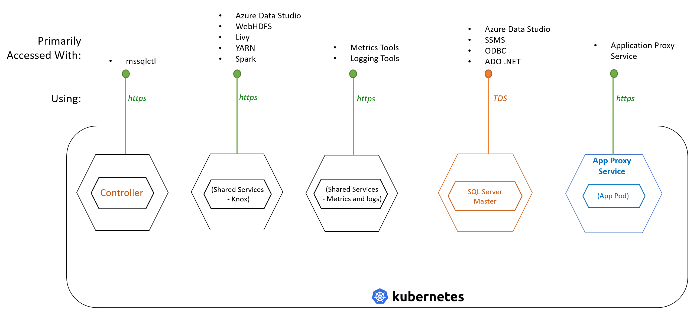

# Workshop: SQL Server Big Data Clusters - Architecture (CTP 3.2)

#### <i>A Microsoft workshop from the SQL Server team</i>

 <h2>Security</h2>

In this workshop you'll cover using a Process and various Platform components to create a SQL Server Big Data Clusters (BDC) solution you can deploy on premises, in the cloud, or in a hybrid architecture. In each module you'll get more references, which you should follow up on to learn more. Also watch for links within the text - click on each one to explore that topic.

(<a href="https://github.com/Microsoft/sqlworkshops/blob/master/sqlserver2019bigdataclusters/SQL2019BDC/00%20-%20Prerequisites.md" target="_blank">Make sure you check out the <b>prerequisites</b> page before you start</a>. You'll need all of the items loaded there before you can proceed with the workshop.)

You'll cover the following topics in this Module:

<dl>

  <dt><a href="#6-0">6.0 Managing BDC Security</a></dt>
  <dt><a href="#6-1">6.1 Access</a></dt>
  <dt><a href="#6-2">6.2 Authentication and Authorization</a></dt>

</dl>

<h2><a name="6-0">6.0 Managing BDC Security</a></h2>

Authentication is the process of verifying the identity of a user or service and ensuring they are who they are claiming to be. Authorization refers to granting or denying of access to specific resources based on the requesting user's identity. This step is performed after a user is identified through authentication.

*NOTE: Security will change prior to the General Availability (GA) Release. Active Directory integration is planned for production implementations.*

<h2><a name="6-1">6.1 Access</a></h2>

There are three endpoints for entry points to the BDC:

<table>

<tr><th style="background-color: #1b20a1; color: white;">Endpoint</th> <th style="background-color: #1b20a1; color: white;">Description</th></tr>

  <tr><td>HDFS/Spark (Knox) gateway</td><td>An HTTPS-based endpoint that proxies other endpoints. The HDFS/Spark gateway is used for accessing services like <i>webHDFS</i> and <i>Livy</i>. Wherever you see references to Knox, this is the endpoint</td></tr>
  <tr><td>Controller endpoint</td><td>The endpoint for the BDC management service that exposes REST APIs for managing the cluster. Some tools, such as Azure Data Studio, access the system using this endpoint</td></tr>
  <tr><td>Master Instance</td><td>Get a detailed description of a specific pod in json format output. It includes details, such as the current Kubernetes node that the pod is placed on, the containers running within the pod, and the image used to bootstrap the containers. It also shows other details, such as labels, status, and persisted volumes claims that are associated with the pod</td></tr>
  
</table>

You can see these endpoints in this diagram:

 

 

 

<h2><a name="6-2">6.2 Authentication and Authorization</a></h2>

When you create the cluster, a number of logins are created. Some of these logins are for services to communicate with each other, and others are for end users to access the cluster.
Non-SQL Server End-user passwords currently are set using environment variables. These are passwords that cluster administrators use to access services:

<table>

<tr><th style="background-color: #1b20a1; color: white;">Use</th> <th style="background-color: #1b20a1; color: white;">Variable</th></tr>

  <tr><td>Controller username</td><td><pre>CONTROLLER_USERNAME=controller_username</pre></td></tr>
  <tr><td>Controller password</td><td><pre>CONTROLLER_PASSWORD=controller_password</pre></td></tr>
  <tr><td>SQL Master SA password</td><td><pre>MSSQL_SA_PASSWORD=controller_sa_password</pre></td></tr>
  <tr><td>Password for accessing the HDFS/Spark endpoint</td><td><pre>KNOX_PASSWORD=knox_password</pre></td></tr>
  
</table>

Intra-cluster authentication
Upon deployment of the cluster, a number of SQL logins are created:

A special SQL login is created in the Controller SQL instance that is system managed, with sysadmin role. The password for this login is captured as a K8s secret. A sysadmin login is created in all SQL instances in the cluster, that Controller owns and manages. It is required for Controller to perform administrative tasks, such as HA setup or upgrade, on these instances. These logins are also used for intra-cluster communication between SQL instances, such as the SQL master instance communicating with a data pool.

<i>Note: In current release, only basic authentication is supported. Fine-grained access control to HDFS objects, the BDC compute and data pools, is not yet available.</i>

For Intra-cluster communication with non-SQL services within the BDC, such as Livy to Spark or Spark to the storage pool, security uses certificates. All SQL Server to SQL Server communication is secured using SQL logins.

 

<b>Activity: Review Security Endpoints</b>

 

In this activity, you will review the endpoints exposed on the cluster.

<b>Steps</b>

<a href="https://docs.microsoft.com/en-us/sql/big-data-cluster/concept-security?view=sqlallproducts-allversions" target="_blank">Open this reference, and read the information you see for the <b>Service Endpoints</b> section</a>. This shows the addresses and ports exposed to the end-users.

 

 

<b>For Further Study</b>

<ul>
    <li><a href="https://docs.microsoft.com/en-us/sql/big-data-cluster/concept-security?view=sqlallproducts-allversions" target="_blank">Security concepts for SQL Server big data clusters</a></li>
</ul>

Congratulations! You have completed this workshop on SQL Server big data clusters Architecture. You now have the tools, assets, and processes you need to extrapolate this information into other applications.
